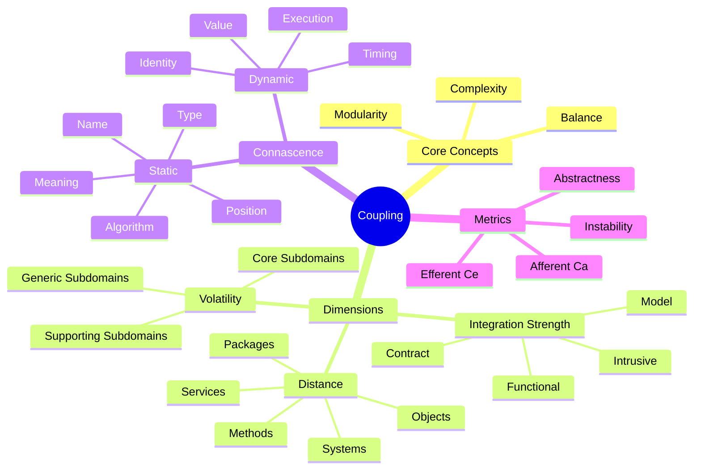
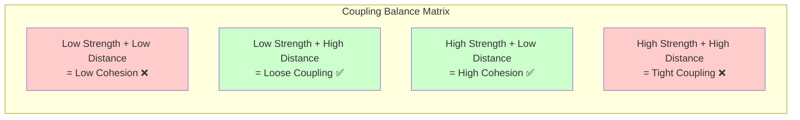
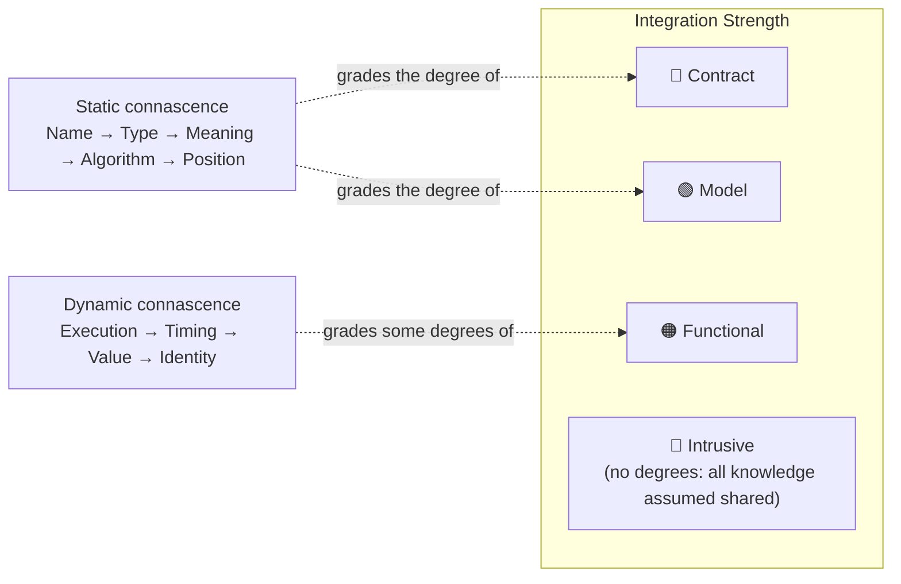
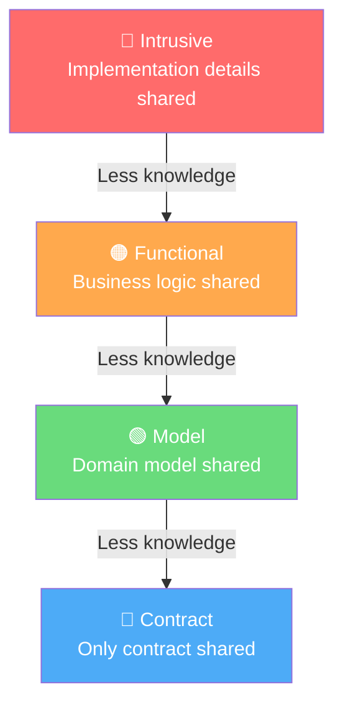
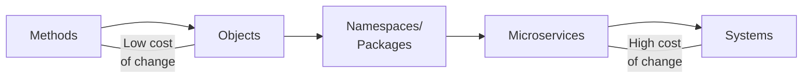
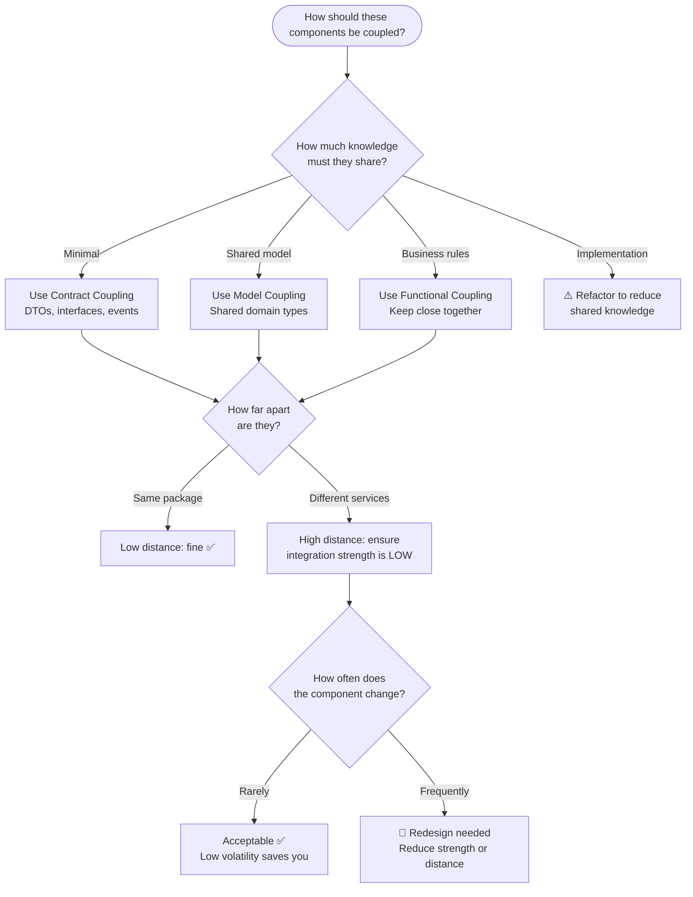

# Coupling: A Practical Guide for Software Teams

> **"Let's decouple everything!" — Software engineers, anywhere, anytime**
>
> Coupling is what connects components and makes a system worth more than the sum of
> its parts. The goal is to **balance** coupling, not eliminate it.

---

## Disclaimer

This project borrows its foundational principles of balancing coupling, managing complexity and negotiating trade-offs from [Vlad Khononov's "Balancing Coupling in Software Design"](https://coupling.dev) and attempts to build upon these by connecting the dots to other books and resources that I have found useful in thinking about the technical, economic and social factors that encompass the art and science of engineering software and architecting solutions; however, this is absolutely no substitute for reading the book(s) and formulating your own ideas and opinions, and please excuse me if I have misinterpreted any of the concepts therein... PR's are much appreciated!

## 🗺️ Map

This guide is split across several focused documents. Start here for the big picture, then dive into each topic.

| Document                                                                          | What You'll Learn                                                                            |
| --------------------------------------------------------------------------------- | -------------------------------------------------------------------------------------------- |
| **[This file](#overview)**                                                        | Big-picture concepts, ELI5 explanations, connascence taxonomy, the coupling mindmap          |
| **[Dimensions of Coupling](coupling-dimensions.md)**                              | Integration Strength, Distance, Volatility — with code examples                              |
| **[Metrics & Refactoring](coupling-metrics-and-refactoring.md)**                  | Efferent/Afferent coupling, Instability, how to use metrics to guide refactoring             |
| **[Coupling in Practice](coupling-in-practice.md)**                               | Full TypeScript, C#, and Java examples — monoliths and distributed systems                   |
| **[FRP & Coupling](functional-reactive-coupling.md)**                             | Observables (RxJS), Actor Model (XState), Highland streams — through the coupling lens       |
| **[Brownfield Strategies](brownfield-strategies.md)**                             | Strangler fig, service-based architecture, serverless extraction, API gateways               |
| **[Three C's of Distributed Transactions](three-cs-distributed-transactions.md)** | Sync vs. async, atomic vs. eventual, orchestrated vs. choreographed — the Eight Saga Species |
| **[Durable Execution & Orchestration](durable-execution-orchestration.md)**       | Temporal, durable workflows, saga tradeoffs, platform coupling — through the coupling lens   |
| **[References & Further Reading](coupling-references.md)**                        | Books, talks, articles, and podcasts                                                         |

---

## Overview

### The Big Picture: What Is Coupling?


```mermaid
mindmap
  root((Coupling))
    Core Concepts
      Complexity
      Modularity
      Balance
    Dimensions
      Integration Strength
        Intrusive
        Functional
        Model
        Contract
      Distance
        Methods
        Objects
        Packages
        Services
        Systems
      Volatility
        Core Subdomains
        Generic Subdomains
        Supporting Subdomains
    Connascence
      Static
        Name
        Type
        Meaning
        Algorithm
        Position
      Dynamic
        Execution
        Timing
        Value
        Identity
    Metrics
      Efferent Ce
      Afferent Ca
      Instability
      Abstractness
```

**Coupling** is the degree of interdependence between software components. Any two components that interact are coupled. The design question is _how_ they are coupled.

### ELI5: Coupling Is Like LEGO

> 🧱 **Imagine you're building with LEGO blocks.**
>
> - **Good coupling** is like LEGO bricks: they snap together with standard connectors. You can rearrange, replace, or add bricks without breaking the whole structure.
> - **Bad coupling** is like gluing LEGO bricks together with superglue: they're stuck forever. If you need to change one piece, you have to rip apart the whole thing.
>
> The goal is to have **connectors** (contracts, interfaces) instead of **glue** (shared implementation details).

---

## Core Concepts

### Complexity

> _"Software design is a constant battle with complexity."_ — Eric Evans

Complexity is when you can't predict the outcome of a change. You make a tweak in one file, and three unrelated things break.

**ELI5:** Complexity is like tweaking one ranking rule in a social feed: creators change what they post, users change what they click, and moderation patterns shift in unexpected ways. You can’t fully predict the outcome in advance. You run a small experiment, observe, then adapt.

Using the **Cynefin framework**:

- **Simple** system: you know exactly what will happen when you change something
- **Complicated** system: an expert can figure out what will happen
- **Complex** system: the only way to know is to try it and see 😱

### Modularity

Modularity is the opposite of complexity. A modular system means:

1. You know **what** part of the system needs to change
2. You know **what will happen** when you make the change

**ELI5:** Modularity is like a well-organized toolbox. Every tool has its place. When you need a screwdriver, you know exactly where it is, and grabbing it doesn't cause all the other tools to fall out.

### Balance: The Key Insight

The real insight from Vlad Khononov's work is that coupling has **three dimensions**, and the secret is **balancing** them:


```mermaid
flowchart LR
    subgraph balance ["Coupling Balance Matrix"]
        direction TB
        A["Low Strength + Low Distance<br/>= Low Cohesion ❌"]
        B["Low Strength + High Distance<br/>= Loose Coupling ✅"]
        C["High Strength + Low Distance<br/>= High Cohesion ✅"]
        D["High Strength + High Distance<br/>= Tight Coupling ❌"]
    end

    style A fill:#ffcccc
    style B fill:#ccffcc
    style C fill:#ccffcc
    style D fill:#ffcccc
```

The balance formula (simplified to binary):

```
MODULARITY = STRENGTH XOR DISTANCE
COMPLEXITY = STRENGTH AND DISTANCE
BALANCE    = (STRENGTH XOR DISTANCE) OR NOT VOLATILITY
```

**Translation:**

- **Modularity** happens when strength and distance are _opposites_ (one high, one low)
- **Complexity** happens when they're _the same_. Both high is a distributed monolith. Both low is unrelated components sitting together, which Khononov's own table labels "low cohesion" and which drifts toward a big ball of mud as their number grows. The binary `AND` above captures only the both-high case; the book's fuller model covers both.
- **Volatility** is the pragmatic tiebreaker. If something never changes, even tight coupling doesn't hurt much

### ELI5: The Balance Analogy

> 🎸 **Think of a band.**
>
> - **High cohesion** (high strength, low distance): The guitarist and bassist practice in the same room and share the same sheet music. They're tightly in sync — that's _good_.
> - **Loose coupling** (low strength, high distance): The band hires a session drummer who only needs to know the tempo and song structure (a _contract_). They don't need to know how each member plays — that's also _good_.
> - **Tight coupling** (high strength, high distance): The guitarist in New York and the drummer in Tokyo try to share the same real-time audio feed and every note placement. Chaos. That's _bad_.
> - **Low cohesion** (low strength, low distance): Random musicians in the same room playing unrelated songs. Waste of space. Also _bad_.

### Connascence: A Complementary Vocabulary

[Connascence](https://connascence.io), from the Latin "born together", is a taxonomy introduced by Meilir Page-Jones that classifies coupling at a finer granularity than traditional module coupling. Two components are _connascent_ if a change in one requires a corresponding change in the other. Where Khononov's integration strength model asks _how much knowledge_ is shared, connascence asks _what kind of knowledge_ and whether the dependency is visible at compile time or only at runtime.

#### Static Connascence (compile-time)

From weakest (easiest to refactor) to strongest:

| Level                        | Description                              | Example                                                                                              |
| ---------------------------- | ---------------------------------------- | ---------------------------------------------------------------------------------------------------- |
| **Name**                     | Components must agree on a name          | Calling a method `calculatePrice()` by that name                                                     |
| **Type**                     | Components must agree on a type          | A function expecting a `string` vs. a `number`                                                       |
| **Meaning** (aka Convention) | A special value carries implicit meaning | `statusId = 7` — what does 7 mean?                                                                   |
| **Algorithm**                | Components must agree on a computation   | Sender and receiver both use the same hashing algorithm                                              |
| **Position**                 | Meaning is determined by ordering        | `new Order(id, customerId, items, address, payment)` — swap two args and the compiler won't save you |

#### Dynamic Connascence (runtime)

Even the weakest dynamic level is stronger than the strongest static level:

| Level         | Description                                    | Example                                                    |
| ------------- | ---------------------------------------------- | ---------------------------------------------------------- |
| **Execution** | Operations must occur in a specific order      | `beginTransaction()` before `commit()`                     |
| **Timing**    | Operations must occur within a time constraint | An API call must complete before a 30-second timeout       |
| **Value**     | Multiple values must change together           | Triangle edges must satisfy the triangle inequality        |
| **Identity**  | Components must reference the same instance    | Two services sharing a database connection or unit of work |

#### The Three Properties of Connascence

Every instance of connascence should be evaluated on three axes:

1. **Strength**: how hard is it to discover and refactor? Connascence of name is trivial to fix; connascence of identity can require architectural changes.
2. **Locality**: are the connascent elements close together or far apart? Same function vs. different services.
3. **Degree**: how many components are involved? Two classes vs. hundreds.

> Strength and locality line up with Khononov's integration strength and distance. Degree has no dimension of its own in his model; the nearest measure is afferent coupling (Ca), which counts dependents rather than participants.

#### How Connascence Relates to Integration Strength

The [integration strength](coupling-dimensions.md#1-integration-strength) model uses connascence as its second axis. The four levels come from structured design's module coupling and say _what kind_ of knowledge is shared. Connascence then grades the _degree_ within a level:


```mermaid
flowchart LR
    Static["Static connascence<br/>Name → Type → Meaning → Algorithm → Position"]
    Dynamic["Dynamic connascence<br/>Execution → Timing → Value → Identity"]

    subgraph strength ["Integration Strength"]
        Contract["🔵 Contract"]
        Model["🟢 Model"]
        Functional["🟠 Functional"]
        Intrusive["🔴 Intrusive<br/>(no degrees: all knowledge assumed shared)"]
    end

    Static -.->|"grades the degree of"| Contract
    Static -.->|"grades the degree of"| Model
    Dynamic -.->|"grades some degrees of"| Functional
```

Two integrations can both be Contract coupling, yet one relies on positional arguments (connascence of position) and the other on named fields (connascence of name). The first is the stronger degree. Intrusive coupling has no degrees: once a component depends on another's private internals, all implementation knowledge is assumed shared.

> ⚠️ Connascence and module coupling cannot be merged into one scale. As [Vlad Khononov notes](https://coupling.dev/posts/related-topics/connascence/), updating a private field through reflection is content coupling, the highest module coupling level, yet it requires only the variable's name and type, the _lowest_ connascence levels. Integration strength combines the two models and also covers a blind spot both share: the same functionality duplicated in several components.

#### Practical Refactoring Rule

> **Weaken connascence where you can, strengthen locality where you must.**
>
> If two components _must_ share knowledge, keep them close together (low distance). If they _must_ be far apart, weaken the connascence: Position → Name (named arguments), Meaning → Type (an enum instead of a magic number), Algorithm → Name (call one shared implementation instead of agreeing on the steps).

👉 Look for connascence annotations (e.g., `// connascence of position →  name`) throughout the code examples in this guide. They mark low-risk refactoring opportunities.

📖 _Further reading: [Connascence on coupling.dev](https://coupling.dev/posts/related-topics/connascence/) · [Meilir Page-Jones, "What Every Programmer Should Know About OOD"](https://amzn.to/4bYH66g) · [connascence.io](https://connascence.io)_

---

## The Three Dimensions at a Glance

### 1. Integration Strength — _How much do components know about each other?_


```mermaid
flowchart TB
    I["🔴 Intrusive<br/>Implementation details shared"]
    F["🟠 Functional<br/>Business logic shared"]
    M["🟢 Model<br/>Domain model shared"]
    C["🔵 Contract<br/>Only contract shared"]

    I -->|"Less knowledge"| F
    F -->|"Less knowledge"| M
    M -->|"Less knowledge"| C

    style I fill:#ff6b6b,color:#fff
    style F fill:#ffa94d,color:#fff
    style M fill:#69db7c,color:#fff
    style C fill:#4dabf7,color:#fff
```

👉 [Deep dive with code examples →](coupling-dimensions.md#1-integration-strength)

### 2. Distance — _How far apart are coupled components?_


```mermaid
flowchart LR
    M[Methods] --> O[Objects] --> N[Namespaces/<br/>Packages] --> S[Microservices] --> Sys[Systems]

    M ---|"Low cost<br/>of change"| O
    S ---|"High cost<br/>of change"| Sys
```

👉 [Deep dive with code examples →](coupling-dimensions.md#2-distance)

### 3. Volatility — _How likely is this component to change?_

| Subdomain Type | Volatility | Why                                         |
| -------------- | ---------- | ------------------------------------------- |
| **Core**       | 🔴 High    | Competitive advantage, constantly evolving     |
| **Supporting** | 🟢 Low     | Boring problems, built in-house, rarely change |
| **Generic**    | 🟢 Low     | Solved problems, bought or adopted             |

👉 [Deep dive with code examples →](coupling-dimensions.md#3-volatility)

---

## Quick Decision Guide

When you're making a design decision about how two components should relate, ask these three questions:


```mermaid
flowchart TD
    Start([How should these components be coupled?]) --> Q1{How much knowledge<br/>must they share?}
    Q1 -->|Minimal| Contract[Use Contract Coupling<br/>DTOs, interfaces, events]
    Q1 -->|Shared model| Model[Use Model Coupling<br/>Shared domain types]
    Q1 -->|Business rules| Func[Use Functional Coupling<br/>Keep close together]
    Q1 -->|Implementation| Intrusive[⚠️ Refactor to reduce<br/>shared knowledge]

    Contract --> Q2{How far apart<br/>are they?}
    Model --> Q2
    Func --> Q2

    Q2 -->|Same package| Close[Low distance: fine ✅]
    Q2 -->|Different services| Far[High distance: ensure<br/>integration strength is LOW]

    Far --> Q3{How often does<br/>the component change?}
    Q3 -->|Rarely| OK[Acceptable ✅<br/>Low volatility saves you]
    Q3 -->|Frequently| Danger[🚨 Redesign needed<br/>Reduce strength or distance]
```

---

## Next Steps

| Step | Action                                                                                                                             |
| ---- | ---------------------------------------------------------------------------------------------------------------------------------- |
| 1️⃣   | Read **[Dimensions of Coupling](coupling-dimensions.md)** to understand the three forces in detail                                 |
| 2️⃣   | Read **[Metrics & Refactoring](coupling-metrics-and-refactoring.md)** to learn how to measure and improve coupling                 |
| 3️⃣   | Study **[Coupling in Practice](coupling-in-practice.md)** for real TypeScript, C#, and Java examples                               |
| 4️⃣   | Explore **[FRP & Coupling](functional-reactive-coupling.md)** to see how reactive streams, actors, and statecharts affect coupling |
| 5️⃣   | Apply **[Brownfield Strategies](brownfield-strategies.md)** to migrate existing monoliths and distributed monoliths                |
| 6️⃣   | Study the **[Three C's of Distributed Transactions](three-cs-distributed-transactions.md)** for saga topology and tradeoffs        |
| 7️⃣   | See **[Durable Execution & Orchestration](durable-execution-orchestration.md)** for how Temporal reshapes coupling tradeoffs       |
| 8️⃣   | Bookmark the **[References](coupling-references.md)** for ongoing learning                                                         |

---
