# Coupling: A Practical Guide for Software Teams

> **"Let's decouple everything!" — Software engineers, anywhere, anytime**
>
> But is coupling necessarily evil? No. Coupling is what connects components, making
> the value of a system greater than the sum of its parts. The goal isn't to eliminate
> coupling — it's to **balance** it.

---

## 🗺️ Tutorial Map

This tutorial is split across several focused documents. Start here for the big picture, then dive into each topic.

| Document | What You'll Learn |
|---|---|
| **[This file](#overview)** | Big-picture concepts, ELI5 explanations, the coupling mindmap |
| **[Dimensions of Coupling](coupling-dimensions.md)** | Integration Strength, Distance, Volatility — with code examples |
| **[Metrics & Refactoring](coupling-metrics-and-refactoring.md)** | Efferent/Afferent coupling, Instability, how to use metrics to guide refactoring |
| **[Coupling in Practice](coupling-in-practice.md)** | Full TypeScript, C#, and Java examples — monoliths and distributed systems |
| **[Brownfield Strategies](brownfield-strategies.md)** | Strangler fig, service-based architecture, serverless extraction, API gateways |
| **[References & Further Reading](coupling-references.md)** | Books, talks, articles, and podcasts |

---

## Overview

### The Big Picture: What Is Coupling?


**Coupling** is the degree of interdependence between software components. Any two components that interact are coupled. The question isn't *whether* they are coupled — it's *how* they are coupled.

### ELI5: Coupling Is Like LEGO

> 🧱 **Imagine you're building with LEGO blocks.**
>
> - **Good coupling** is like LEGO bricks: they snap together with standard connectors. You can rearrange, replace, or add bricks without breaking the whole structure.
> - **Bad coupling** is like gluing LEGO bricks together with superglue: they're stuck forever. If you need to change one piece, you have to rip apart the whole thing.
>
> The goal is to have **connectors** (contracts, interfaces) instead of **glue** (shared implementation details).

---

## Core Concepts

### Complexity

> *"Software design is a constant battle with complexity."* — Eric Evans

Complexity is when you can't predict the outcome of a change. You make a tweak in one file, and three unrelated things break.

**ELI5:** Complexity is like tweaking one ranking rule in a social feed: creators change what they post, users change what they click, and moderation patterns shift in unexpected ways. You can’t fully predict the outcome in advance—you run a small experiment, observe, then adapt.

Using the **Cynefin framework**:
- **Simple** system: you know exactly what will happen when you change something
- **Complicated** system: an expert can figure out what will happen
- **Complex** system: the only way to know is to try it and see 😱

### Modularity

Modularity is the opposite of complexity. A modular system means:

1. You know **what** part of the system needs to change
2. You know **what will happen** when you make the change

**ELI5:** Modularity is like a well-organized toolbox. Every tool has its place. When you need a screwdriver, you know exactly where it is, and grabbing it doesn't cause all the other tools to fall out.

### Balance: The Key Insight

The real insight from Vlad Khononov's work is that coupling has **three dimensions**, and the secret is **balancing** them:

```mermaid
flowchart LR
    subgraph balance ["Coupling Balance Matrix"]
        direction TB
        A["Low Strength + Low Distance<br/>= Low Cohesion ❌"]
        B["Low Strength + High Distance<br/>= Loose Coupling ✅"]
        C["High Strength + Low Distance<br/>= High Cohesion ✅"]
        D["High Strength + High Distance<br/>= Tight Coupling ❌"]
    end

    style A fill:#ffcccc
    style B fill:#ccffcc
    style C fill:#ccffcc
    style D fill:#ffcccc
```



The balance formula (simplified to binary):

```
MODULARITY = STRENGTH XOR DISTANCE
COMPLEXITY = STRENGTH AND DISTANCE
BALANCE    = (STRENGTH XOR DISTANCE) OR NOT VOLATILITY
```

**Translation:**
- **Modularity** happens when strength and distance are *opposites* (one high, one low)
- **Complexity** happens when they're *the same* (both high = distributed monolith; both low = big ball of mud)
- **Volatility** is the pragmatic tiebreaker — if something never changes, even tight coupling doesn't hurt much

### ELI5: The Balance Analogy

> 🎸 **Think of a band.**
>
> - **High cohesion** (high strength, low distance): The guitarist and bassist practice in the same room and share the same sheet music. They're tightly in sync — that's *good*.
> - **Loose coupling** (low strength, high distance): The band hires a session drummer who only needs to know the tempo and song structure (a *contract*). They don't need to know how each member plays — that's also *good*.
> - **Tight coupling** (high strength, high distance): The guitarist in New York and the drummer in Tokyo try to share the same real-time audio feed and every note placement. Chaos. That's *bad*.
> - **Low cohesion** (low strength, low distance): Random musicians in the same room playing unrelated songs. Waste of space. Also *bad*.

---

## The Three Dimensions at a Glance

### 1. Integration Strength — *How much do components know about each other?*



```mermaid
flowchart TB
    I["🔴 Intrusive<br/>Implementation details shared"]
    F["🟠 Functional<br/>Business logic shared"]
    M["🟢 Model<br/>Domain model shared"]
    C["🔵 Contract<br/>Only contract shared"]

    I -->|"Less knowledge"| F
    F -->|"Less knowledge"| M
    M -->|"Less knowledge"| C

    style I fill:#ff6b6b,color:#fff
    style F fill:#ffa94d,color:#fff
    style M fill:#69db7c,color:#fff
    style C fill:#4dabf7,color:#fff
```

👉 [Deep dive with code examples →](coupling-dimensions.md#1-integration-strength)

### 2. Distance — *How far apart are coupled components?*


👉 [Deep dive with code examples →](coupling-dimensions.md#2-distance)

### 3. Volatility — *How likely is this component to change?*

| Subdomain Type | Volatility | Why |
|---|---|---|
| **Core** | 🔴 High | Competitive advantage — constantly evolving |
| **Supporting** | 🟡 Medium | Boring problems — changes occasionally |
| **Generic** | 🟢 Low | Solved problems — rarely changes |

👉 [Deep dive with code examples →](coupling-dimensions.md#3-volatility)

---

## Quick Decision Guide

When you're making a design decision about how two components should relate, ask these three questions:

```mermaid
flowchart TD
    Start([How should these components be coupled?]) --> Q1{How much knowledge<br/>must they share?}
    Q1 -->|Minimal| Contract[Use Contract Coupling<br/>DTOs, interfaces, events]
    Q1 -->|Shared model| Model[Use Model Coupling<br/>Shared domain types]
    Q1 -->|Business rules| Func[Use Functional Coupling<br/>Keep close together]
    Q1 -->|Implementation| Intrusive[⚠️ Refactor to reduce<br/>shared knowledge]
    
    Contract --> Q2{How far apart<br/>are they?}
    Model --> Q2
    Func --> Q2
    
    Q2 -->|Same package| Close[Low distance: fine ✅]
    Q2 -->|Different services| Far[High distance: ensure<br/>integration strength is LOW]
    
    Far --> Q3{How often does<br/>the component change?}
    Q3 -->|Rarely| OK[Acceptable ✅<br/>Low volatility saves you]
    Q3 -->|Frequently| Danger[🚨 Redesign needed<br/>Reduce strength or distance]
```



---

## Next Steps

| Step | Action |
|---|---|
| 1️⃣ | Read **[Dimensions of Coupling](coupling-dimensions.md)** to understand the three forces in detail |
| 2️⃣ | Read **[Metrics & Refactoring](coupling-metrics-and-refactoring.md)** to learn how to measure and improve coupling |
| 3️⃣ | Study **[Coupling in Practice](coupling-in-practice.md)** for real TypeScript, C#, and Java examples |
| 4️⃣ | Apply **[Brownfield Strategies](brownfield-strategies.md)** to migrate existing monoliths and distributed monoliths |
| 5️⃣ | Bookmark the **[References](coupling-references.md)** for ongoing learning |

---

*Based on concepts from [Vlad Khononov's "Balancing Coupling in Software Design"](https://coupling.dev), [Zoran Horvat's coupling metrics guide](https://codinghelmet.com/articles/how-to-use-module-coupling-and-instability-metrics-to-guide-refactoring), and [Oliver Drotbohm's alternative view on instability-abstractness](https://odrotbohm.de/2024/09/the-instability-abstractness-relationsship-an-alternative-view/).*
