# Coupling: A Practical Guide for Software Teams

> **"Let's decouple everything!" — Software engineers, anywhere, anytime**
>
> But is coupling necessarily evil? No. Coupling is what connects components, making
> the value of a system greater than the sum of its parts. The goal isn't to eliminate
> coupling — it's to **balance** it.

---

## 🗺️ Tutorial Map

This tutorial is split across several focused documents. Start here for the big picture, then dive into each topic.

| Document                                                         | What You'll Learn                                                                      |
| ---------------------------------------------------------------- | -------------------------------------------------------------------------------------- |
| **[This file](#overview)**                                       | Big-picture concepts, ELI5 explanations, connascence taxonomy, the coupling mindmap    |
| **[Dimensions of Coupling](coupling-dimensions.md)**             | Integration Strength, Distance, Volatility — with code examples                        |
| **[Metrics & Refactoring](coupling-metrics-and-refactoring.md)** | Efferent/Afferent coupling, Instability, how to use metrics to guide refactoring       |
| **[Coupling in Practice](coupling-in-practice.md)**              | Full TypeScript, C#, and Java examples — monoliths and distributed systems             |
| **[FRP & Coupling](functional-reactive-coupling.md)**            | Observables (RxJS), Actor Model (XState), Highland streams — through the coupling lens |
| **[Brownfield Strategies](brownfield-strategies.md)**            | Strangler fig, service-based architecture, serverless extraction, API gateways         |
| **[Three C's of Distributed Transactions](three-cs-distributed-transactions.md)** | Sync vs. async, atomic vs. eventual, orchestrated vs. choreographed — the Eight Saga Species |
| **[Durable Execution & Orchestration](durable-execution-orchestration.md)** | Temporal, durable workflows, saga tradeoffs, platform coupling — through the coupling lens |
| **[References & Further Reading](coupling-references.md)**       | Books, talks, articles, and podcasts                                                   |

---

## Overview

### The Big Picture: What Is Coupling?


**Coupling** is the degree of interdependence between software components. Any two components that interact are coupled. The question isn't _whether_ they are coupled — it's _how_ they are coupled.

### ELI5: Coupling Is Like LEGO

> 🧱 **Imagine you're building with LEGO blocks.**
>
> - **Good coupling** is like LEGO bricks: they snap together with standard connectors. You can rearrange, replace, or add bricks without breaking the whole structure.
> - **Bad coupling** is like gluing LEGO bricks together with superglue: they're stuck forever. If you need to change one piece, you have to rip apart the whole thing.
>
> The goal is to have **connectors** (contracts, interfaces) instead of **glue** (shared implementation details).

---

## Core Concepts

### Complexity

> _"Software design is a constant battle with complexity."_ — Eric Evans

Complexity is when you can't predict the outcome of a change. You make a tweak in one file, and three unrelated things break.

**ELI5:** Complexity is like tweaking one ranking rule in a social feed: creators change what they post, users change what they click, and moderation patterns shift in unexpected ways. You can’t fully predict the outcome in advance—you run a small experiment, observe, then adapt.

Using the **Cynefin framework**:

- **Simple** system: you know exactly what will happen when you change something
- **Complicated** system: an expert can figure out what will happen
- **Complex** system: the only way to know is to try it and see 😱

### Modularity

Modularity is the opposite of complexity. A modular system means:

1. You know **what** part of the system needs to change
2. You know **what will happen** when you make the change

**ELI5:** Modularity is like a well-organized toolbox. Every tool has its place. When you need a screwdriver, you know exactly where it is, and grabbing it doesn't cause all the other tools to fall out.

### Balance: The Key Insight

The real insight from Vlad Khononov's work is that coupling has **three dimensions**, and the secret is **balancing** them:

```mermaid
flowchart LR
    subgraph balance ["Coupling Balance Matrix"]
        direction TB
        A["Low Strength + Low Distance<br/>= Low Cohesion ❌"]
        B["Low Strength + High Distance<br/>= Loose Coupling ✅"]
        C["High Strength + Low Distance<br/>= High Cohesion ✅"]
        D["High Strength + High Distance<br/>= Tight Coupling ❌"]
    end

    style A fill:#ffcccc
    style B fill:#ccffcc
    style C fill:#ccffcc
    style D fill:#ffcccc
```



The balance formula (simplified to binary):

```
MODULARITY = STRENGTH XOR DISTANCE
COMPLEXITY = STRENGTH AND DISTANCE
BALANCE    = (STRENGTH XOR DISTANCE) OR NOT VOLATILITY
```

**Translation:**

- **Modularity** happens when strength and distance are _opposites_ (one high, one low)
- **Complexity** happens when they're _the same_ (both high = distributed monolith; both low = big ball of mud)
- **Volatility** is the pragmatic tiebreaker — if something never changes, even tight coupling doesn't hurt much

### ELI5: The Balance Analogy

> 🎸 **Think of a band.**
>
> - **High cohesion** (high strength, low distance): The guitarist and bassist practice in the same room and share the same sheet music. They're tightly in sync — that's _good_.
> - **Loose coupling** (low strength, high distance): The band hires a session drummer who only needs to know the tempo and song structure (a _contract_). They don't need to know how each member plays — that's also _good_.
> - **Tight coupling** (high strength, high distance): The guitarist in New York and the drummer in Tokyo try to share the same real-time audio feed and every note placement. Chaos. That's _bad_.
> - **Low cohesion** (low strength, low distance): Random musicians in the same room playing unrelated songs. Waste of space. Also _bad_.

### Connascence: A Complementary Vocabulary

[Connascence](https://connascence.io) — from the Latin "born together" — is a taxonomy introduced by Meilir Page-Jones that classifies coupling at a finer granularity than traditional module coupling. Two components are _connascent_ if a change in one requires a corresponding change in the other. Where Khononov's integration strength model asks _how much knowledge_ is shared, connascence asks _what kind of knowledge_ and whether the dependency is visible at compile time or only at runtime.

#### Static Connascence (compile-time)

From weakest (easiest to refactor) to strongest:

| Level                          | Description                                                 | Example                                                        |
| ------------------------------ | ----------------------------------------------------------- | -------------------------------------------------------------- |
| **Name**                       | Components must agree on a name                             | Calling a method `calculatePrice()` by that name               |
| **Type**                       | Components must agree on a type                             | A function expecting a `string` vs. a `number`                 |
| **Meaning** (aka Convention)   | A special value carries implicit meaning                    | `statusId = 7` — what does 7 mean?                             |
| **Algorithm**                  | Components must agree on a computation                      | Sender and receiver both use the same hashing algorithm        |
| **Position**                   | Meaning is determined by ordering                           | `new Order(id, customerId, items, address, payment)` — swap two args and the compiler won't save you |

#### Dynamic Connascence (runtime)

Even the weakest dynamic level is stronger than the strongest static level:

| Level             | Description                                             | Example                                                |
| ----------------- | ------------------------------------------------------- | ------------------------------------------------------ |
| **Execution**     | Operations must occur in a specific order               | `beginTransaction()` before `commit()`                 |
| **Timing**        | Operations must occur within a time constraint          | An API call must complete before a 30-second timeout   |
| **Value**         | Multiple values must change together                    | Triangle edges must satisfy the triangle inequality    |
| **Identity**      | Components must reference the same instance             | Two services sharing a database connection or unit of work |

#### The Three Properties of Connascence

Every instance of connascence should be evaluated on three axes — analogous to coupling's own dimensions:

1. **Strength** — how hard is it to discover and refactor? (Connascence of name is trivial to fix; connascence of identity can require architectural changes)
2. **Locality** — are the connascent elements close together or far apart? (Same function vs. different services)
3. **Degree** — how many components are involved? (Two classes vs. hundreds)

> These map directly to Khononov's framework: **Strength ≈ Integration Strength**, **Locality ≈ Distance**, **Degree ≈ Afferent Coupling (Ca)**.

#### How Connascence Relates to Integration Strength

Connascence and the [integration strength](coupling-dimensions.md#1-integration-strength) model describe different facets of the same phenomenon. Neither fully subsumes the other:

```mermaid
flowchart LR
    subgraph connascence ["Connascence"]
        CoN["Name / Type"]
        CoM["Meaning"]
        CoA["Algorithm"]
        CoP["Position"]
        CoE["Execution / Timing"]
        CoV["Value / Identity"]
    end

    subgraph strength ["Integration Strength"]
        Contract["🔵 Contract"]
        Model["🟢 Model"]
        Functional["🟠 Functional"]
        Intrusive["🔴 Intrusive"]
    end

    CoN -.->|"often appears in"| Contract
    CoM -.->|"often appears in"| Model
    CoA -.->|"often appears in"| Functional
    CoP -.->|"often appears in"| Contract
    CoE -.->|"often appears in"| Functional
    CoV -.->|"often appears in"| Intrusive
```



> ⚠️ The mapping is **not** a 1:1 correspondence. As [Vlad Khononov notes](https://coupling.dev/posts/related-topics/connascence/), the two models reflect different aspects of cross-component relationships. Content coupling (reaching into private state) maps to the highest module coupling level, but only requires knowledge of a name and type — the _lowest_ connascence levels. The integration strength model resolves these blind spots by combining both perspectives.

#### Practical Refactoring Rule

> **Weaken connascence where you can, strengthen locality where you must.**
>
> If two components _must_ share knowledge, keep them close together (low distance). If they _must_ be far apart, reduce the type of knowledge they share — push from Position → Name, from Meaning → Type, from Algorithm → Contract.

👉 Look for connascence annotations (e.g., `// connascence of position →  name`) throughout the code examples in this guide — they highlight low-risk refactoring opportunities.

📖 _Further reading: [Connascence on coupling.dev](https://coupling.dev/posts/related-topics/connascence/) · [Meilir Page-Jones, "What Every Programmer Should Know About OOD"](https://amzn.to/4bYH66g) · [connascence.io](https://connascence.io)_

---

## The Three Dimensions at a Glance

### 1. Integration Strength — _How much do components know about each other?_

```mermaid
flowchart TB
    I["🔴 Intrusive<br/>Implementation details shared"]
    F["🟠 Functional<br/>Business logic shared"]
    M["🟢 Model<br/>Domain model shared"]
    C["🔵 Contract<br/>Only contract shared"]

    I -->|"Less knowledge"| F
    F -->|"Less knowledge"| M
    M -->|"Less knowledge"| C

    style I fill:#ff6b6b,color:#fff
    style F fill:#ffa94d,color:#fff
    style M fill:#69db7c,color:#fff
    style C fill:#4dabf7,color:#fff
```



👉 [Deep dive with code examples →](coupling-dimensions.md#1-integration-strength)

### 2. Distance — _How far apart are coupled components?_


👉 [Deep dive with code examples →](coupling-dimensions.md#2-distance)

### 3. Volatility — _How likely is this component to change?_

| Subdomain Type | Volatility | Why                                         |
| -------------- | ---------- | ------------------------------------------- |
| **Core**       | 🔴 High    | Competitive advantage — constantly evolving |
| **Supporting** | 🟡 Medium  | Boring problems — changes occasionally      |
| **Generic**    | 🟢 Low     | Solved problems — rarely changes            |

👉 [Deep dive with code examples →](coupling-dimensions.md#3-volatility)

---

## Quick Decision Guide

When you're making a design decision about how two components should relate, ask these three questions:


---

## Next Steps

| Step | Action                                                                                                                             |
| ---- | ---------------------------------------------------------------------------------------------------------------------------------- |
| 1️⃣   | Read **[Dimensions of Coupling](coupling-dimensions.md)** to understand the three forces in detail                                 |
| 2️⃣   | Read **[Metrics & Refactoring](coupling-metrics-and-refactoring.md)** to learn how to measure and improve coupling                 |
| 3️⃣   | Study **[Coupling in Practice](coupling-in-practice.md)** for real TypeScript, C#, and Java examples                               |
| 4️⃣   | Explore **[FRP & Coupling](functional-reactive-coupling.md)** to see how reactive streams, actors, and statecharts affect coupling |
| 5️⃣   | Apply **[Brownfield Strategies](brownfield-strategies.md)** to migrate existing monoliths and distributed monoliths                |
| 6️⃣   | Study the **[Three C's of Distributed Transactions](three-cs-distributed-transactions.md)** for saga topology and tradeoffs        |
| 7️⃣   | See **[Durable Execution & Orchestration](durable-execution-orchestration.md)** for how Temporal reshapes coupling tradeoffs       |
| 8️⃣   | Bookmark the **[References](coupling-references.md)** for ongoing learning                                                         |

---

_Based on concepts from [Vlad Khononov's "Balancing Coupling in Software Design"](https://coupling.dev), [Zoran Horvat's coupling metrics guide](https://codinghelmet.com/articles/how-to-use-module-coupling-and-instability-metrics-to-guide-refactoring), and [Oliver Drotbohm's alternative view on instability-abstractness](https://odrotbohm.de/2024/09/the-instability-abstractness-relationsship-an-alternative-view/)._
