# Brownfield Strategies: Refactoring Monoliths and Distributed Monoliths

[← Back to Main Guide](README.md) | [← Coupling in Practice](coupling-in-practice.md)

> You have a monolith. Or worse — a distributed monolith. You can't rewrite it.
> You can't freeze features for six months. You have real users, limited budget,
> and a team that's still learning. **This guide is for you.**

---

## Table of Contents

- [Phase 1: Identify Your Boundaries](#phase-1-identify-your-boundaries)
- [Phase 2: Choose a Migration Strategy](#phase-2-choose-a-migration-strategy)
  - [Strategy 1: Strangler Fig](#strategy-1-strangler-fig)
  - [Strategy 2: Branch by Abstraction](#strategy-2-branch-by-abstraction)
  - [Comparing the Two Strategies](#comparing-the-two-strategies)
- [Phase 3: Choose a Target Architecture Style](#phase-3-choose-a-target-architecture-style)
  - [Service-Based Architecture](#service-based-architecture)
  - [Microservices](#microservices)
- [Enabling Tactics](#enabling-tactics)
- [Transitional Architecture](#transitional-architecture)
- [Navigating Real-World Constraints](#navigating-real-world-constraints)
- [Data Decomposition: The Hardest Part](#data-decomposition-the-hardest-part)
- [Fitness Functions and Architecture Decision Records](#fitness-functions-and-architecture-decision-records)
- [Putting It All Together: A Brownfield Playbook](#putting-it-all-together-a-brownfield-playbook)
- [Review Checklist](#review-checklist)

---

## Phase 1: Identify Your Boundaries

Before you can migrate anything, you need to know what the pieces are. Ford, Richards, Sadalage, and Dehghani describe two complementary approaches to identifying boundaries in _Software Architecture: The Hard Parts_:

```mermaid
flowchart TD
    Start([Existing System]) --> Q1{Is the codebase<br/>reasonably modular?}
    Q1 -->|"Yes — identifiable<br/>components exist"| CBD[Component-Based<br/>Decomposition]
    Q1 -->|"No — big ball<br/>of mud"| TF[Tactical Forking]

    CBD --> S1["Identify & size components"]
    S1 --> S2["Gather common domain components"]
    S2 --> S3["Flatten to create<br/>component domains"]
    S3 --> Boundaries["Identified domain boundaries"]

    TF --> F1["Copy the entire codebase"]
    F1 --> F2["Each team deletes<br/>code they don't need"]
    F2 --> F3["Result: focused<br/>component services"]
    F3 --> Boundaries

    Boundaries --> Phase2{Phase 2:<br/>Choose a migration strategy}

    style CBD fill:#69db7c,color:#000
    style TF fill:#ffa94d,color:#000
    style Boundaries fill:#e8e8e8,color:#000
```



These are **analysis techniques**, not migration strategies. They answer _"what are the boundaries?"_ — not _"how do we migrate?"_ That question is answered in [Phase 2](#phase-2-choose-a-migration-strategy).

### ELI5: Component Decomposition vs. Tactical Forking

> 🏠 **Imagine you're renovating a house.**
>
> - **Component-based decomposition** is like renovating room by room. The house has clear rooms (components), so you fix the kitchen first, then the bathroom, then the bedroom. This works when the house has walls in the right places.
> - **Tactical forking** is like making a copy of the whole house (blueprints and all), then demolishing the rooms you don't want in each copy. This works when the house is so open-plan that you can't tell where one room ends and another begins.

### Component-Based Decomposition

If the monolith already has identifiable modules, packages, or namespaces that map to business domains, you can decompose it component by component:

1. **Identify and size components** — count statements, measure coupling metrics
2. **Gather common domain components** — group related components into domain clusters
3. **Flatten to create component domains** — merge overly fine-grained components that always change together
4. **Extract incrementally** — using a migration strategy from Phase 2

### Tactical Forking

If the codebase is a "big ball of mud" with no clear boundaries, the _Hard Parts_ authors describe **tactical forking**: copy the entire monolith for each team, then have each team delete the code they don't need. This sounds crude, but it can be the fastest path to separation when no seams exist.

The approach is described in detail by Dehghani: each fork starts as a complete copy. Teams then remove what they don't own, leaving behind focused services that can be cleaned up independently. The key insight is that _deleting code is safer and easier than extracting code_ from a tangled codebase.

### Sizing Your Components

The _Hard Parts_ authors recommend measuring component size by **total number of statements**. Components that are 1–2 standard deviations from the mean are well-sized. Outliers in either direction are candidates for splitting or merging.

**Granularity Disintegrators** (reasons to split):
| Driver | Signal |
|---|---|
| Scope & function | A component does more than one logical thing |
| Code volatility | Part of a component changes far more often than the rest |
| Scalability | Part of a component needs to scale independently |
| Fault tolerance | A crash in one area shouldn't take down another |
| Security | Different parts need different access controls |

**Granularity Integrators** (reasons to keep together):
| Driver | Signal |
|---|---|
| Database transactions | Two pieces need ACID guarantees together |
| Workflow coupling | Services communicate so much they're practically one thing |
| Shared code | Extensive shared library that would need coordinated releases |
| Data relationships | Data belongs to a single bounded context |

---

## Phase 2: Choose a Migration Strategy

Once you've identified your boundaries (Phase 1), you need a strategy for **how** to migrate. The two primary strategies operate at different levels:

- **Strangler Fig** works at the **application boundary** — an external proxy/façade intercepts traffic and redirects routes to new services
- **Branch by Abstraction** works **inside the codebase** — an abstraction layer allows old and new implementations to coexist, swapping incrementally

Both strategies are incremental. Both keep the system live during migration. They can even be used together — strangler fig for external API migration, branch by abstraction for internal component replacement.

### Strategy 1: Strangler Fig

The strangler fig pattern — named by Martin Fowler after a tree that grows around its host until it replaces it — is the most battle-tested approach for incrementally migrating a monolith at the **API/network boundary**. Fowler, Cartwright, Horn, and Lewis describe [four high-level activities](https://martinfowler.com/articles/patterns-legacy-displacement/) for this kind of incremental displacement:

1. **Understand the outcomes** you want to achieve
2. **Decide how to break the problem** into smaller parts (find [seams](https://martinfowler.com/bliki/LegacySeam.html))
3. **Successfully deliver** the parts
4. **Change the organization** to allow this to happen on an ongoing basis

### ELI5

> 🌿 **Imagine a vine growing around an old tree.**
>
> The vine slowly wraps around each branch, providing its own structure. Over time, each branch of the old tree dies and the vine takes its place. The tree is never "cut down" — it's gradually replaced while staying alive the whole time. That's the strangler fig: you build new functionality around the old system, redirecting traffic one route at a time, until the old system has nothing left to do.

### How It Works

The pattern requires a **façade** — an intercepting layer that sits between clients and the monolith and routes traffic. In modern implementations this façade is typically an **API gateway** (e.g., Kong, AWS API Gateway, Azure API Management) or a **reverse proxy** (e.g., YARP, Envoy, nginx, Spring Cloud Gateway). The gateway isn't a separate strategy — it's the _mechanism_ that makes strangler fig work.


### Gateway Capabilities in the Strangler Façade

The API gateway does more than route. In a brownfield migration it can also:

| Capability                           | How It Helps Migration                                                                                    |
| ------------------------------------ | --------------------------------------------------------------------------------------------------------- |
| **Path-based routing**               | Direct migrated endpoints to new services, leave the rest on the monolith                                 |
| **Response transformation**          | Translate between the monolith's legacy API shape and the new contract — clients never see the difference |
| **API versioning**                   | Run `/v1/orders` on the monolith and `/v2/orders` on the new service simultaneously                       |
| **Auth offload**                     | Centralize authentication so new services don't need to replicate the monolith's auth logic               |
| **Rate limiting / circuit breaking** | Protect new services from traffic spikes during gradual rollout                                           |

**Route-Level Migration** — gateway as the strangler façade:

```typescript
// gateway/src/routes.ts — gateway route configuration
export const routes: RouteConfig[] = [
  // ✅ Migrated: orders go to new service
  {
    path: "/api/orders/**",
    upstream: "http://order-service:3001",
    transforms: [stripPrefix("/api")],
  },
  // 🔄 In progress: read from new, write to old (parallel run)
  {
    path: "/api/customers",
    method: "GET",
    upstream: "http://customer-service:3002",
  },
  {
    path: "/api/customers",
    method: "POST",
    upstream: "http://monolith:8080", // writes still go to monolith
  },
  // ⏳ Not yet migrated: falls through to monolith
  {
    path: "/api/**",
    upstream: "http://monolith:8080",
  },
];
```

**Response Transformation** — translate between old and new API shapes at the gateway:

```typescript
// gateway/src/transforms/customer-transform.ts
// Gateway transforms the monolith's response to the new contract
// so clients don't need to know which backend they're talking to

interface MonolithCustomerShape {
  cust_id: number;
  cust_name: string;
  is_active: number; // 0 or 1
}

interface NewCustomerShape {
  id: string;
  name: string;
  status: "active" | "inactive";
}

export function transformCustomerResponse(
  body: MonolithCustomerShape,
): NewCustomerShape {
  return {
    id: String(body.cust_id),
    name: body.cust_name,
    status: body.is_active === 1 ? "active" : "inactive",
  };
}
```

**Backend-for-Frontend (BFF)** — when you have multiple client types (web, mobile), each can get a dedicated gateway that aggregates calls to both the monolith and the new services:


### The Anti-Corruption Layer (ACL)

During migration, the new service often still needs data from the monolith. The ACL prevents the monolith's model from leaking into the new service. See [coupling-in-practice.md — Scenario 3](coupling-in-practice.md#scenario-3-shared-library-hell) for ACL code patterns.

### Coupling Analysis

| Dimension            | Value           | Why                                                                         |
| -------------------- | --------------- | --------------------------------------------------------------------------- |
| Integration Strength | 🟢 Contract     | Proxy routes by contract; ACL translates models                             |
| Distance             | 🟡 Medium       | New service is separate but still talks to monolith during transition       |
| Volatility           | 🟢 Low-per-step | Each step changes one feature boundary at a time                            |
| **Verdict**          | ✅              | **Incremental risk — each step is independently deployable and reversible** |

### TypeScript — Strangler Proxy

```typescript
// strangler-proxy/src/proxy.ts
import express from "express";
import httpProxy from "http-proxy-middleware";

const app = express();

// Route configuration: which features have been migrated
const migratedRoutes: Record<string, string> = {
  "/api/orders": "http://order-service:3001",
  "/api/inventory": "http://inventory-service:3002",
  // Add more as each feature is strangled out
};

// Migrated features go to new services
for (const [path, target] of Object.entries(migratedRoutes)) {
  app.use(
    path,
    httpProxy.createProxyMiddleware({ target, changeOrigin: true }),
  );
}

// Everything else falls through to the monolith
app.use(
  "/",
  httpProxy.createProxyMiddleware({
    target: "http://monolith:8080",
    changeOrigin: true,
  }),
);

app.listen(3000, () => console.log("Strangler proxy on :3000"));
```

```typescript
// order-service/src/acl/monolith-customer.adapter.ts
// Anti-Corruption Layer: translates monolith's customer model to our domain

interface MonolithCustomerResponse {
  cust_id: number;
  cust_name: string;
  cust_email: string;
  credit_lmt: number; // monolith naming conventions
  acct_status: "A" | "I" | "S"; // Active, Inactive, Suspended — legacy codes
}

// Our domain model — clean and intentional
interface Customer {
  id: string;
  name: string;
  email: string;
  creditLimit: number;
  status: "active" | "inactive" | "suspended";
}

const STATUS_MAP: Record<string, Customer["status"]> = {
  A: "active",
  I: "inactive",
  S: "suspended",
};

export class MonolithCustomerAdapter {
  constructor(private monolithBaseUrl: string) {}

  async getCustomer(customerId: string): Promise<Customer> {
    const res = await fetch(
      `${this.monolithBaseUrl}/internal/customers/${customerId}`,
    );
    const raw: MonolithCustomerResponse = await res.json();

    // ✅ Translate at the boundary — monolith model stops here
    return {
      id: String(raw.cust_id),
      name: raw.cust_name,
      email: raw.cust_email,
      creditLimit: raw.credit_lmt,
      status: STATUS_MAP[raw.acct_status] ?? "inactive",
    };
  }
}
```

### C# — Strangler Proxy with YARP

```csharp
// StranglerProxy/Program.cs
using Yarp.ReverseProxy;

var builder = WebApplication.CreateBuilder(args);

builder.Services.AddReverseProxy()
    .LoadFromConfig(builder.Configuration.GetSection("ReverseProxy"));

var app = builder.Build();
app.MapReverseProxy();
app.Run();
```

```json
// StranglerProxy/appsettings.json — route configuration
{
  "ReverseProxy": {
    "Routes": {
      "orders-route": {
        "ClusterId": "order-service",
        "Match": { "Path": "/api/orders/{**catch-all}" }
      },
      "inventory-route": {
        "ClusterId": "inventory-service",
        "Match": { "Path": "/api/inventory/{**catch-all}" }
      },
      "fallback-route": {
        "ClusterId": "monolith",
        "Match": { "Path": "/{**catch-all}" },
        "Order": 9999
      }
    },
    "Clusters": {
      "order-service": {
        "Destinations": { "d1": { "Address": "http://order-service:5001" } }
      },
      "inventory-service": {
        "Destinations": { "d1": { "Address": "http://inventory-service:5002" } }
      },
      "monolith": {
        "Destinations": { "d1": { "Address": "http://monolith:8080" } }
      }
    }
  }
}
```

```csharp
// OrderService/Acl/MonolithCustomerAdapter.cs
namespace OrderService.Acl;

// The monolith's response shape — kept private to the ACL
internal record MonolithCustomerResponse(
    int CustId,
    string CustName,
    string CustEmail,
    decimal CreditLmt,
    string AcctStatus  // "A", "I", "S"
);

// Our clean domain model
public record Customer(
    string Id,
    string Name,
    string Email,
    decimal CreditLimit,
    CustomerStatus Status
);

public enum CustomerStatus { Active, Inactive, Suspended }

public class MonolithCustomerAdapter(HttpClient httpClient)
{
    private static readonly Dictionary<string, CustomerStatus> StatusMap = new()
    {
        ["A"] = CustomerStatus.Active,
        ["I"] = CustomerStatus.Inactive,
        ["S"] = CustomerStatus.Suspended,
    };

    public async Task<Customer> GetCustomerAsync(string customerId)
    {
        var raw = await httpClient.GetFromJsonAsync<MonolithCustomerResponse>(
            $"/internal/customers/{customerId}");

        // ✅ Translation boundary — monolith model stops here
        return new Customer(
            Id: raw!.CustId.ToString(),
            Name: raw.CustName,
            Email: raw.CustEmail,
            CreditLimit: raw.CreditLmt,
            Status: StatusMap.GetValueOrDefault(raw.AcctStatus, CustomerStatus.Inactive)
        );
    }
}
```

### Java — Strangler Proxy with Spring Cloud Gateway

```yaml
# strangler-proxy/src/main/resources/application.yml
# Spring Cloud Gateway route configuration

spring:
  cloud:
    gateway:
      routes:
        - id: orders
        uri: http://order-service:8081
        predicates:
            - Path=/api/orders/**
        - id: inventory
        uri: http://inventory-service:8082
        predicates:
            - Path=/api/inventory/**
        - id: monolith-fallback
        uri: http://monolith:8080
        predicates:
            - Path=/**
        order: 9999
```

```java
// order-service/src/main/java/com/example/acl/MonolithCustomerAdapter.java
package com.example.acl;

import org.springframework.web.client.RestClient;
import java.util.Map;

// Monolith's response shape — package-private to the ACL
record MonolithCustomerResponse(
    int custId,
    String custName,
    String custEmail,
    double creditLmt,
    String acctStatus // "A", "I", "S"
) {}

// Our clean domain model
public record Customer(
    String id,
    String name,
    String email,
    double creditLimit,
    CustomerStatus status
) {}

public enum CustomerStatus { ACTIVE, INACTIVE, SUSPENDED }

public class MonolithCustomerAdapter {

    private static final Map<String, CustomerStatus> STATUS_MAP = Map.of(
        "A", CustomerStatus.ACTIVE,
        "I", CustomerStatus.INACTIVE,
        "S", CustomerStatus.SUSPENDED
    );

    private final RestClient restClient;

    public MonolithCustomerAdapter(RestClient.Builder builder, String monolithBaseUrl) {
        this.restClient = builder.baseUrl(monolithBaseUrl).build();
    }

    public Customer getCustomer(String customerId) {
        var raw = restClient.get()
            .uri("/internal/customers/{id}", customerId)
            .retrieve()
            .body(MonolithCustomerResponse.class);

        // ✅ Translation boundary — monolith model stops here
        return new Customer(
            String.valueOf(raw.custId()),
            raw.custName(),
            raw.custEmail(),
            raw.creditLmt(),
            STATUS_MAP.getOrDefault(raw.acctStatus(), CustomerStatus.INACTIVE)
        );
    }
}
```

### When to Use Strangler Fig

| ✅ Good Fit                                       | ❌ Poor Fit                                                        |
| ------------------------------------------------- | ------------------------------------------------------------------ |
| Monolith has identifiable feature boundaries      | System is a pure big ball of mud with no seams                     |
| You can place a proxy in front of the monolith    | Traffic cannot be intercepted (e.g., batch jobs, embedded systems) |
| Team can own one feature end-to-end               | Features are deeply entangled in shared database logic             |
| You need to keep the system live during migration | The entire system must be replaced at once (rare, but it happens)  |

---

### Strategy 2: Branch by Abstraction

Branch by Abstraction is the internal counterpart to the strangler fig. Instead of intercepting traffic at the network boundary, you introduce an **abstraction layer within the codebase** that allows old and new implementations to coexist. The term was coined by Stacy Curl and popularized by [Paul Hammant](https://paulhammant.com/blog/branch_by_abstraction.html) and [Martin Fowler](https://martinfowler.com/bliki/BranchByAbstraction.html).

### ELI5

> 🔌 **Imagine an electrical adapter.**
>
> You're upgrading all the outlets in your house from two-prong to three-prong. You can't rip them all out at once — you'd have no power. Instead, you install universal adapters that accept _both_ plug types. Then you swap each outlet one by one. When they're all done, you remove the adapters. The adapters are the abstraction layer — they let old and new coexist safely.

### How It Works


The five steps in detail:

1. **Create an abstraction layer** around the component you want to replace (an interface, a wrapper class, or an architectural layer like a repository)
2. **Redirect all callers** to use the abstraction instead of the old implementation directly
3. **Build the new implementation** behind the same abstraction — use feature flags or a toggle to control which implementation is active
4. **Incrementally switch** callers (or features) from old to new — optionally run both in parallel to compare results (see GitHub's [Scientist](https://github.com/github/scientist) library)
5. **Remove** the old implementation, then (optionally) remove the abstraction layer itself

### Real-World Example: GitHub's Merge System

GitHub needed to rewrite a critical part of their platform (the merge system) without downtime, while deploying ~60 times per day. They used Branch by Abstraction with the [Scientist](https://github.com/github/scientist) library:

- The abstraction layer ran **both** old and new implementations on every request
- It always returned the **old** result to users (safety net)
- It compared old and new results, logging any discrepancies
- Once discrepancies dropped to zero, they switched the primary to the new implementation

### TypeScript — Branch by Abstraction

```typescript
// Step 1 & 2: Create abstraction and redirect callers

// abstractions/pricing.ts — the abstraction layer
export interface PricingEngine {
  calculatePrice(
    productId: string,
    quantity: number,
    customerId: string,
  ): Promise<number>;
  calculateDiscount(customerId: string, orderTotal: number): Promise<number>;
}

// implementations/legacy-pricing.ts — wraps the old implementation
export class LegacyPricingEngine implements PricingEngine {
  async calculatePrice(productId: string, quantity: number): Promise<number> {
    // Delegates to the original monolith pricing logic
    return this.legacyPricingModule.getPrice(productId) * quantity;
  }

  async calculateDiscount(
    customerId: string,
    orderTotal: number,
  ): Promise<number> {
    return this.legacyDiscountTable.lookup(customerId, orderTotal);
  }
}

// implementations/new-pricing.ts — the new implementation
export class NewPricingEngine implements PricingEngine {
  constructor(private pricingRules: PricingRuleRepository) {}

  async calculatePrice(productId: string, quantity: number): Promise<number> {
    const rules = await this.pricingRules.getForProduct(productId);
    return rules.apply(quantity);
  }

  async calculateDiscount(
    customerId: string,
    orderTotal: number,
  ): Promise<number> {
    const tier = await this.pricingRules.getCustomerTier(customerId);
    return tier.calculateDiscount(orderTotal);
  }
}

// Step 3: Toggle between implementations
// pricing-factory.ts
export function createPricingEngine(featureFlags: FeatureFlags): PricingEngine {
  if (featureFlags.isEnabled("new-pricing-engine")) {
    return new NewPricingEngine(new PricingRuleRepository());
  }
  return new LegacyPricingEngine();
}
```

### C# — Branch by Abstraction

```csharp
// Abstractions/IPricingEngine.cs — the abstraction layer
namespace OrderService.Abstractions;

public interface IPricingEngine
{
    Task<decimal> CalculatePriceAsync(string productId, int quantity, string customerId);
    Task<decimal> CalculateDiscountAsync(string customerId, decimal orderTotal);
}

// Implementations/LegacyPricingEngine.cs — wraps the old implementation
public class LegacyPricingEngine(ILegacyPricingModule legacyModule) : IPricingEngine
{
    public async Task<decimal> CalculatePriceAsync(
        string productId, int quantity, string customerId)
    {
        var unitPrice = await legacyModule.GetPriceAsync(productId);
        return unitPrice * quantity;
    }

    public async Task<decimal> CalculateDiscountAsync(string customerId, decimal orderTotal)
        => await legacyModule.LookupDiscountAsync(customerId, orderTotal);
}

// Implementations/NewPricingEngine.cs — the new implementation
public class NewPricingEngine(IPricingRuleRepository pricingRules) : IPricingEngine
{
    public async Task<decimal> CalculatePriceAsync(
        string productId, int quantity, string customerId)
    {
        var rules = await pricingRules.GetForProductAsync(productId);
        return rules.Apply(quantity);
    }

    public async Task<decimal> CalculateDiscountAsync(string customerId, decimal orderTotal)
    {
        var tier = await pricingRules.GetCustomerTierAsync(customerId);
        return tier.CalculateDiscount(orderTotal);
    }
}

// DI Registration — toggle via feature flag
// Program.cs
builder.Services.AddScoped<IPricingEngine>(sp =>
{
    var flags = sp.GetRequiredService<IFeatureFlags>();
    return flags.IsEnabled("new-pricing-engine")
        ? sp.GetRequiredService<NewPricingEngine>()
        : sp.GetRequiredService<LegacyPricingEngine>();
});
```

### Java — Branch by Abstraction

```java
// abstractions/PricingEngine.java — the abstraction layer
package com.example.pricing;

public interface PricingEngine {
    double calculatePrice(String productId, int quantity, String customerId);
    double calculateDiscount(String customerId, double orderTotal);
}

// implementations/LegacyPricingEngine.java — wraps the old implementation
package com.example.pricing;

public class LegacyPricingEngine implements PricingEngine {

    private final LegacyPricingModule legacyModule;

    public LegacyPricingEngine(LegacyPricingModule legacyModule) {
        this.legacyModule = legacyModule;
    }

    @Override
    public double calculatePrice(String productId, int quantity, String customerId) {
        return legacyModule.getPrice(productId) * quantity;
    }

    @Override
    public double calculateDiscount(String customerId, double orderTotal) {
        return legacyModule.lookupDiscount(customerId, orderTotal);
    }
}

// implementations/NewPricingEngine.java — the new implementation
package com.example.pricing;

public class NewPricingEngine implements PricingEngine {

    private final PricingRuleRepository pricingRules;

    public NewPricingEngine(PricingRuleRepository pricingRules) {
        this.pricingRules = pricingRules;
    }

    @Override
    public double calculatePrice(String productId, int quantity, String customerId) {
        var rules = pricingRules.getForProduct(productId);
        return rules.apply(quantity);
    }

    @Override
    public double calculateDiscount(String customerId, double orderTotal) {
        var tier = pricingRules.getCustomerTier(customerId);
        return tier.calculateDiscount(orderTotal);
    }
}

// Configuration — toggle via feature flag
// PricingConfig.java
@Configuration
public class PricingConfig {

    @Bean
    public PricingEngine pricingEngine(
            FeatureFlags featureFlags,
            LegacyPricingModule legacyModule,
            PricingRuleRepository pricingRules) {
        if (featureFlags.isEnabled("new-pricing-engine")) {
            return new NewPricingEngine(pricingRules);
        }
        return new LegacyPricingEngine(legacyModule);
    }
}
```

### Coupling Analysis

| Dimension            | Value           | Why                                                                                  |
| -------------------- | --------------- | ------------------------------------------------------------------------------------ |
| Integration Strength | 🟢 Contract     | Callers depend on the abstraction (interface), not the implementation                |
| Distance             | 🟢 Low          | Both implementations live within the same codebase / deployable                      |
| Volatility           | 🟢 Low-per-step | Each swap is a small, reversible change behind a feature flag                        |
| **Verdict**          | ✅              | **Lowest-risk migration — no network boundary, no proxy, just swap implementations** |

### When to Use Branch by Abstraction

| ✅ Good Fit                                                      | ❌ Poor Fit                                              |
| ---------------------------------------------------------------- | -------------------------------------------------------- |
| Replacing an internal component (ORM, framework, pricing engine) | Splitting a monolith into separately deployed services   |
| Changes need to be spread across many commits                    | Quick replacement of a small utility                     |
| Team practices trunk-based development                           | Component has no clear API or interface boundary         |
| Traffic cannot be intercepted externally (batch jobs, libraries) | You're migrating to a different language or runtime      |
| You want to run old and new in parallel to compare results       | The old and new components are in different repositories |

---

### Comparing the Two Strategies

|                       | Strangler Fig                                              | Branch by Abstraction                                     |
| --------------------- | ---------------------------------------------------------- | --------------------------------------------------------- |
| **Where it operates** | External — API/network boundary                            | Internal — within the codebase                            |
| **Mechanism**         | Proxy/façade redirects traffic                             | Abstraction layer swaps implementations                   |
| **Best for**          | Extracting features to separate services                   | Replacing internal components in-place                    |
| **Requires**          | Network proxy or API gateway                               | Feature flags and interface/abstraction design            |
| **Result**            | New services alongside the monolith                        | New implementation inside the same deployable (initially) |
| **Can be combined?**  | Yes — use both on the same monolith for different concerns |

> 💡 **These strategies are not mutually exclusive.** You might use **strangler fig** to extract high-traffic API routes to new services while using **branch by abstraction** to replace the ORM or pricing engine internally. The choice depends on whether the boundary you're changing is _external_ (API routes, service boundaries) or _internal_ (libraries, frameworks, domain logic).

---

## Phase 3: Choose a Target Architecture Style

Strategies (Phase 2) tell you _how_ to migrate. Architecture styles tell you _where you're going_. From Mark Richards' Architecture Styles Worksheet, key styles for brownfield teams include:


You can reach either target using either migration strategy. The target is orthogonal to the migration approach:

|                                  | Strangler Fig                                                      | Branch by Abstraction                                              |
| -------------------------------- | ------------------------------------------------------------------ | ------------------------------------------------------------------ |
| **→ Service-Based Architecture** | Extract routes to coarse-grained domain services behind a gateway  | Introduce service abstractions internally, then extract when ready |
| **→ Microservices**              | Extract routes to fine-grained services with independent databases | Swap components internally first, then break apart the deployable  |

> **Key insight from Richards:** Service-based architecture is not a compromise or a failure to achieve microservices. For many organizations, it _is_ the right target architecture. Don't pursue microservices unless the tradeoffs justify it. Every additional service is a tax on your team's cognitive load.

### Service-Based Architecture

Mark Richards describes **service-based architecture** as a pragmatic middle ground between a monolith and microservices. Instead of extracting dozens of fine-grained microservices, you extract a handful of **coarse-grained domain services** — typically 4 to 12 — that share a database (or a small number of databases).

#### ELI5

> 🏢 **Imagine a company that works out of one office building.**
>
> A monolith is like everyone in one giant open-plan room — accounting, engineering, sales, support, all shouting over each other.
>
> Microservices is like giving every person their own office building in different cities — great isolation, but now you need phones, mail systems, and travel budgets just to have a conversation.
>
> **Service-based architecture** is the sensible middle: you put each department on its own floor of the same building. They have their own space (separate deployments), share the building (infrastructure), and can take the elevator when they need to talk face-to-face (shared database or direct calls). It's the architecture for teams that need autonomy but can't afford the operational overhead of microservices.

#### Architecture


#### Coupling Analysis

| Dimension            | Value         | Why                                                                                   |
| -------------------- | ------------- | ------------------------------------------------------------------------------------- |
| Integration Strength | 🟡 Model      | Services share the database schema (model coupling), but each owns its tables         |
| Distance             | 🟢 Low-Medium | Separate deployments but same infrastructure                                          |
| Volatility           | 🟡 Medium     | Core domains change independently but share data model                                |
| **Verdict**          | ✅            | **Pragmatic balance — less coupling than monolith, less overhead than microservices** |

#### Key Design Rules (from Richards)

1. **Each service owns a clear domain.** Don't slice by technical layer (API, business logic, data). Slice by business capability.
2. **Database coupling is the tradeoff you accept.** Services share a database but each service should own its tables (or schema). Cross-service joins are allowed but tracked.
3. **Internal APIs are simple.** Services call each other directly — no event bus, no message broker. Keep ceremonial overhead low.
4. **Deploy independently.** Each service is a separate deployable unit, even though they share a database.

#### TypeScript — Service-Based Architecture

```typescript
// order-service/src/order.service.ts
// Coarse-grained domain service — owns order logic, calls other services via API

export class OrderService {
  constructor(
    private orderRepo: OrderRepository, // own tables in shared DB
    private customerApi: CustomerServiceClient, // internal HTTP call
    private inventoryApi: InventoryServiceClient,
  ) {}

  async placeOrder(request: PlaceOrderRequest): Promise<Order> {
    // ✅ Service boundary — call customer service's API, not its tables
    const customer = await this.customerApi.getCustomer(request.customerId);
    if (customer.status !== "active") {
      throw new Error(`Customer ${request.customerId} is not active`);
    }

    // ✅ Service boundary — call inventory service's API
    const available = await this.inventoryApi.checkAvailability(
      request.productId,
      request.quantity,
    );
    if (!available) {
      throw new Error(
        `Insufficient inventory for product ${request.productId}`,
      );
    }

    // Own domain logic stays local
    const order = await this.orderRepo.create({
      customerId: request.customerId,
      productId: request.productId,
      quantity: request.quantity,
      total: request.quantity * request.unitPrice,
      status: "confirmed",
    });

    // ✅ Reserve inventory via API (not by writing to inventory tables)
    await this.inventoryApi.reserve(
      request.productId,
      request.quantity,
      order.id,
    );

    return order;
  }
}
```

#### C# — Service-Based Architecture

```csharp
// OrderService/OrderDomainService.cs
namespace OrderService;

public class OrderDomainService(
    IOrderRepository orderRepo,
    ICustomerServiceClient customerApi,
    IInventoryServiceClient inventoryApi)
{
    public async Task<Order> PlaceOrderAsync(PlaceOrderRequest request)
    {
        // ✅ Service boundary — call customer service's API, not its tables
        var customer = await customerApi.GetCustomerAsync(request.CustomerId);
        if (customer.Status != CustomerStatus.Active)
            throw new InvalidOperationException($"Customer {request.CustomerId} is not active");

        // ✅ Service boundary — call inventory service's API
        var available = await inventoryApi.CheckAvailabilityAsync(
            request.ProductId, request.Quantity);
        if (!available)
            throw new InvalidOperationException($"Insufficient inventory for {request.ProductId}");

        var order = await orderRepo.CreateAsync(new Order
        {
            CustomerId = request.CustomerId,
            ProductId = request.ProductId,
            Quantity = request.Quantity,
            Total = request.Quantity * request.UnitPrice,
            Status = OrderStatus.Confirmed,
        });

        // ✅ Reserve inventory via API (not by writing to inventory tables)
        await inventoryApi.ReserveAsync(request.ProductId, request.Quantity, order.Id);

        return order;
    }
}
```

#### Java — Service-Based Architecture

```java
// order-service/src/main/java/com/example/order/OrderDomainService.java
package com.example.order;

import com.example.order.client.CustomerServiceClient;
import com.example.order.client.InventoryServiceClient;

public class OrderDomainService {

    private final OrderRepository orderRepo;
    private final CustomerServiceClient customerApi;
    private final InventoryServiceClient inventoryApi;

    public OrderDomainService(
            OrderRepository orderRepo,
            CustomerServiceClient customerApi,
            InventoryServiceClient inventoryApi) {
        this.orderRepo = orderRepo;
        this.customerApi = customerApi;
        this.inventoryApi = inventoryApi;
    }

    public Order placeOrder(PlaceOrderRequest request) {
        // ✅ Service boundary — call customer service's API, not its tables
        var customer = customerApi.getCustomer(request.customerId());
        if (customer.status() != CustomerStatus.ACTIVE) {
            throw new IllegalStateException(
                "Customer %s is not active".formatted(request.customerId()));
        }

        // ✅ Service boundary — call inventory service's API
        boolean available = inventoryApi.checkAvailability(
            request.productId(), request.quantity());
        if (!available) {
            throw new IllegalStateException(
                "Insufficient inventory for %s".formatted(request.productId()));
        }

        var order = orderRepo.create(new Order(
            request.customerId(),
            request.productId(),
            request.quantity(),
            request.quantity() * request.unitPrice(),
            OrderStatus.CONFIRMED
        ));

        // ✅ Reserve inventory via API (not by writing to inventory tables)
        inventoryApi.reserve(request.productId(), request.quantity(), order.id());

        return order;
    }
}
```

#### When to Choose Service-Based Architecture

| ✅ Good Fit                                                        | ❌ Poor Fit                                                           |
| ------------------------------------------------------------------ | --------------------------------------------------------------------- |
| Team of 5–25 engineers                                             | Team of 100+ requiring independent deployment cadences                |
| Limited DevOps maturity or infrastructure budget                   | Mature platform team with full CI/CD, observability, and service mesh |
| You need faster deploys but can't afford per-service databases yet | You need elastic scaling of individual features                       |
| Your monolith has identifiable domain boundaries                   | Your system has no domain cohesion — it's a big ball of mud           |
| You want an evolutionary stepping stone toward microservices       | You're building a greenfield system with clear bounded contexts       |

### Microservices

Microservices — fine-grained, independently deployable services each owning their own data — is a well-known target architecture. We don't cover microservices in depth here because the entire coupling tutorial suite already addresses the coupling challenges they introduce (see [coupling-dimensions.md](coupling-dimensions.md) and [coupling-in-practice.md](coupling-in-practice.md)).

The key question for brownfield teams is: **do your business drivers actually require microservices?** Per the Architecture Styles Worksheet, microservices score highest on scalability, elasticity, fault tolerance, and evolvability — but also score highest on cost ($$$$$) and lowest on simplicity.

#### When Microservices Are Worth the Cost

| Business Driver                        | Why Microservices Help                                                     |
| -------------------------------------- | -------------------------------------------------------------------------- |
| Independent team deployment cadences   | Each team ships on its own schedule without coordinating                   |
| Elastic scaling of individual features | High-traffic features scale independently of low-traffic ones              |
| Polyglot technology requirements       | Different services can use different languages, frameworks, or data stores |
| Regulatory isolation                   | Sensitive data can be physically isolated in a single service              |

> ⚠️ **If you don't have these drivers, service-based architecture is almost certainly the better target.** Microservices are not the default — they are the option you earn when the tradeoffs justify the complexity.

---

## Enabling Tactics

Strangler Fig and Branch by Abstraction are _migration strategies_. Service-Based Architecture and Microservices are _target styles_. The following are _tactics_ — reusable mechanisms you deploy _within_ any strategy to reach any target. They compose freely.


### API Gateways and Reverse Proxies

As covered in [Strategy 1: Strangler Fig](#strategy-1-strangler-fig), the API gateway is the _façade_ that the strangler fig pattern requires. It is equally useful in any target architecture — as a single entry point that routes to domain services and provides centralized auth, rate limiting, and observability.

The gateway's fundamental role: **it decouples clients from the internal structure of the backend.** When you later split a service, move a feature, or swap a deployment topology, clients are unaffected.

### Feature Flags

Feature flags are essential to [Branch by Abstraction](#strategy-2-branch-by-abstraction). They let you toggle between old and new implementations at runtime — per-user, per-environment, or globally. Combined with the abstraction layer, they enable:

- **Dark launching** — run the new implementation in production without exposing it to users
- **Parallel verification** — run both implementations and compare results (like GitHub's Scientist)
- **Gradual rollout** — switch a percentage of traffic to the new implementation
- **Instant rollback** — flip the flag back if something goes wrong

### Serverless as a Deployment Target

Serverless (AWS Lambda, Azure Functions, Google Cloud Functions) is not a migration strategy. It is a **deployment topology** — a way to run code that you have already decided to extract. You still need a strategy (strangler fig or branch by abstraction) to decide _what_ to extract and _when_.

### ELI5

> 🍕 **Imagine a pizza restaurant that gets random rushes.**
>
> Most of the day it's quiet, but Friday nights are chaos. Instead of hiring full-time staff for the peak (monolith), or building a second restaurant (microservice), you hire an on-demand catering service that appears when needed and disappears when it's done (serverless). Great for the Friday rush. Terrible for the continuous kitchen prep that happens all day.

### When Serverless Fits: The Semantic Complexity Test

Ford et al. in _Software Architecture: The Hard Parts_ describe **architectural quantum** as "an independently deployable artifact with high functional cohesion, high static coupling, and synchronous dynamic coupling." A serverless function is the smallest possible quantum.

Serverless is a good extraction target when the workload has **low semantic complexity** — meaning the logic is straightforward, event-driven, and stateless:


### Good Serverless Extraction Candidates

| Workload                   | Why It Fits                                             |
| -------------------------- | ------------------------------------------------------- |
| Image/file processing      | Event-driven (upload trigger), stateless, CPU-burst     |
| Webhook handlers           | Inbound events, simple routing/transformation           |
| Notification dispatch      | Event-driven, fire-and-forget, independent scaling      |
| Scheduled reports/ETL      | Periodic trigger, batch processing, no persistent state |
| Data validation/enrichment | Stateless transformation in a pipeline                  |

### Poor Serverless Candidates

| Workload                                 | Why It Doesn't Fit                                           |
| ---------------------------------------- | ------------------------------------------------------------ |
| Complex transactional workflows          | Need ACID or saga coordination across multiple steps         |
| Long-running processes                   | Cold starts and execution time limits                        |
| High-throughput, steady-state processing | Per-invocation cost exceeds always-on compute                |
| Stateful domain logic                    | Managing state across invocations adds accidental complexity |

### Example: Extracting Side-Effects to Serverless within a Strangler Fig

A common strangler fig move: extract synchronous side-effects from the monolith into independent functions triggered by events.

```typescript
// BEFORE: This was inside the monolith's OrderController
// monolith/src/controllers/order.controller.ts
class OrderController {
  async afterOrderPlaced(order: Order): Promise<void> {
    // ❌ All of this runs synchronously in the order request
    await this.emailService.sendConfirmation(order);
    await this.pdfService.generateInvoice(order);
    await this.analyticsService.trackOrder(order);
    await this.inventoryService.updateStock(order);
  }
}
```

```typescript
// AFTER: Extracted as independent serverless functions
// The order service publishes an event; each function triggers independently

// functions/send-order-confirmation/handler.ts
import { SQSEvent } from "aws-lambda";

interface OrderPlacedEvent {
  orderId: string;
  customerEmail: string;
  items: Array<{ name: string; quantity: number; price: number }>;
  total: number;
}

export async function handler(event: SQSEvent): Promise<void> {
  for (const record of event.Records) {
    const orderEvent: OrderPlacedEvent = JSON.parse(record.body);

    await sendEmail({
      to: orderEvent.customerEmail,
      subject: `Order ${orderEvent.orderId} confirmed`,
      template: "order-confirmation",
      data: orderEvent,
    });
  }
}

// functions/generate-invoice/handler.ts
export async function handler(event: SQSEvent): Promise<void> {
  for (const record of event.Records) {
    const orderEvent: OrderPlacedEvent = JSON.parse(record.body);

    const pdf = await generateInvoicePdf(orderEvent);
    await uploadToS3(`invoices/${orderEvent.orderId}.pdf`, pdf);
  }
}
```

```csharp
// Functions/SendOrderConfirmation.cs — Azure Functions (C#)
using Azure.Messaging.ServiceBus;
using Microsoft.Azure.Functions.Worker;

public class SendOrderConfirmation
{
    private readonly IEmailService _emailService;

    public SendOrderConfirmation(IEmailService emailService)
        => _emailService = emailService;

    [Function(nameof(SendOrderConfirmation))]
    public async Task RunAsync(
        [ServiceBusTrigger("order-events", "email-confirmation")] OrderPlacedEvent evt)
    {
        await _emailService.SendConfirmationAsync(new EmailRequest
        {
            To = evt.CustomerEmail,
            Subject = $"Order {evt.OrderId} confirmed",
            TemplateName = "order-confirmation",
            Data = evt,
        });
    }
}
```

```java
// functions/src/main/java/com/example/functions/SendOrderConfirmation.java — AWS Lambda (Java)
package com.example.functions;

import com.amazonaws.services.lambda.runtime.Context;
import com.amazonaws.services.lambda.runtime.events.SQSEvent;
import com.fasterxml.jackson.databind.ObjectMapper;

public class SendOrderConfirmation {

    private final EmailService emailService;
    private final ObjectMapper mapper = new ObjectMapper();

    public SendOrderConfirmation() {
        this.emailService = new EmailService();
    }

    public void handleRequest(SQSEvent event, Context context) {
        for (var record : event.getRecords()) {
            try {
                var orderEvent = mapper.readValue(
                    record.getBody(), OrderPlacedEvent.class);

                emailService.sendConfirmation(new EmailRequest(
                    orderEvent.customerEmail(),
                    "Order %s confirmed".formatted(orderEvent.orderId()),
                    "order-confirmation",
                    orderEvent
                ));
            } catch (Exception e) {
                context.getLogger().log("Failed to process: " + e.getMessage());
                throw new RuntimeException(e); // let SQS retry
            }
        }
    }
}
```

> ⚠️ **Watch out for function sprawl.** Hundreds of tiny functions with tangled event dependencies is a **distributed monolith in disguise**. Each function must have a clear, bounded responsibility. The _Hard Parts_ authors use the term **granularity integrators** for this: if two functions always change together, they should probably be one service.

### Event Interception

Cartwright, Horn, and Lewis describe [event interception](https://martinfowler.com/articles/patterns-legacy-displacement/event-interception.html) as a key legacy displacement tactic: intercept events (messages, database changes, API calls) flowing through the legacy system, and route some of them to new components. This is particularly useful when the monolith communicates via message queues or database triggers.

### Code Reuse Patterns (from _The Hard Parts_)

When extracting services you'll encounter shared code — utilities, domain models, DTOs — that multiple services need. The _Hard Parts_ authors describe four patterns, each with different coupling tradeoffs:

| Pattern                    | When to Use                                                       | Coupling Tradeoff                                                      |
| -------------------------- | ----------------------------------------------------------------- | ---------------------------------------------------------------------- |
| **Code replication**       | Simple static code (annotations, constants, value objects)        | No coupling, but no consistency — copies can drift                     |
| **Shared library**         | Low- to moderate-change shared concerns; version each library     | Compile-time coupling; coordinated releases if not versioned carefully |
| **Shared service**         | Frequently changing shared functionality in polyglot environments | Runtime coupling; the shared service must be available                 |
| **Sidecar / service mesh** | Cross-cutting operational concerns (logging, auth, resilience)    | Infrastructure coupling; operational overhead                          |

**Rule of thumb:** Start with code replication for trivial things, shared libraries (versioned, fine-grained) for domain contracts, and sidecars only for cross-cutting infrastructure.

---

## Transitional Architecture

Cartwright, Horn, and Lewis define [transitional architecture](https://martinfowler.com/articles/patterns-legacy-displacement/transitional-architecture.html) as **"software elements installed to ease the displacement of a legacy system that we intend to remove when the displacement is complete."**

This is a crucial concept for brownfield teams: during migration you will build code that exists solely to allow the old and new systems to coexist. This code has a planned end-of-life.

### ELI5

> 🚧 **Imagine temporary scaffolding on a building.**
>
> You put scaffolding up so workers can safely renovate the building. Nobody thinks the scaffolding is part of the building. It's ugly, it's in the way, and everyone wants it gone — but without it the renovation is impossible. Transitional architecture is your scaffolding. Name it, budget for it, and plan to tear it down.

### Examples of Transitional Architecture

| Element                                  | Purpose                                                                            | When It Goes Away                            |
| ---------------------------------------- | ---------------------------------------------------------------------------------- | -------------------------------------------- |
| **Strangler façade** (API gateway/proxy) | Intercepts requests and routes to new or old                                       | When the monolith is fully decommissioned    |
| **Anti-Corruption Layers**               | Translates between monolith and new service models                                 | When the monolith's data is fully migrated   |
| **Legacy Mimics**                        | New service updates the legacy database so legacy reports/UIs still work           | When consumers move to new data sources      |
| **Event routers / bridges**              | Route messages between old (e.g., SwiftMQ) and new (e.g., Kafka) messaging systems | When the old messaging system is retired     |
| **Dual-write adapters**                  | Write to both old and new data stores during migration                             | When data migration is complete and verified |

### The Cost of Transitional Architecture

> _"A question to consider is: What value does the business place on this risk mitigation?"_
> — Cartwright, Horn, Lewis

Transitional architecture costs real effort to build and maintain. It _looks_ like throwaway work, which makes it politically difficult. Be explicit about the tradeoff:

- **Without it:** Big-bang cutover, high risk, long feature freeze
- **With it:** Incremental migration, lower risk per step, but ongoing maintenance of transition code

Track transitional elements in your architecture documentation. Each should have:

1. **What** it does
2. **Why** it exists (what risk does it mitigate?)
3. **When** it can be removed (what's the exit condition?)
4. **Who** owns it

---

## Navigating Real-World Constraints

Every strategy above assumes you have the freedom to choose. In practice, constraints shape—and sometimes dictate—your architecture.

### The Constraint Matrix


### Matching Strategy and Target to Constraints

| Constraint                                   | Recommended Approach                                                | Why                                                                                |
| -------------------------------------------- | ------------------------------------------------------------------- | ---------------------------------------------------------------------------------- |
| **Low budget** (< 3 infra engineers)         | Strangler Fig or Branch by Abstraction → Service-Based Architecture | Shared DB, fewer services to operate, minimal infrastructure overhead              |
| **Small team** (< 10 engineers)              | Strangler Fig → Service-Based Architecture                          | Extract incrementally; keep the number of deployables manageable                   |
| **Low DevOps maturity**                      | Branch by Abstraction → Service-Based Architecture                  | No proxy infrastructure needed initially; target keeps things simple               |
| **High feature velocity needed**             | Strangler Fig with API Gateway → Service-Based or Microservices     | Decouple delivery of new features from legacy; ship new service independently      |
| **Internal component swap** (ORM, framework) | Branch by Abstraction with Feature Flags                            | Swap implementations within the codebase without affecting the deployment topology |
| **Spiky workloads**                          | Serverless as deployment target (enabling tactic)                   | Extract burst-traffic features to auto-scaling functions                           |
| **Regulatory / compliance**                  | API Gateway + ACL                                                   | Centralize auth, audit logging, and data transformation at the boundary            |

### The Cognitive Load Test

Ford et al. emphasize that **architectural quantum** isn't just a technical concept — it has a human dimension. Each independently deployable unit requires someone to:

- Build and maintain the CI/CD pipeline
- Monitor, alert, and respond to incidents
- Understand the service's domain, API, and failure modes
- Coordinate deployments with dependent services

**Rule of thumb:** If your team can't draw the architecture from memory, you have too many services. The _Hard Parts_ book frames this as balancing **granularity disintegrators** (reasons to split) against **granularity integrators** (reasons to keep together).


> **Key principle:** When in doubt, don't split. Merging services back together is harder than splitting them later. Start coarse-grained and refine based on evidence, not speculation.

---

## Data Decomposition: The Hardest Part

The title of the book isn't accidental. The hardest part of breaking up a monolith isn't the code — it's the data. Shared databases create **model coupling** across service boundaries. The _Hard Parts_ authors describe several data access patterns for teams at different stages:

### Data Decomposition Decision Guide

```mermaid
flowchart TD
    Start([Data Access Need]) --> Q1{Does the other service<br/>own this data?}
    Q1 -->|Yes| Q2{How fresh does<br/>the data need to be?}
    Q1 -->|"No — we own it"| LOCAL[Read from local DB ✅]

    Q2 -->|"Real-time"| ISC[Inter-Service Call<br/>Ask the owner]
    Q2 -->|"Near real-time"| CDC[Column Schema Replication<br/>via CDC or events]
    Q2 -->|"Eventually consistent"| CACHE[Replicated Cache<br/>or materialized view]

    ISC --> WARN1["⚠️ Adds runtime coupling<br/>Owner must be available"]
    CDC --> WARN2["⚠️ Adds eventual consistency<br/>Handle staleness"]
    CACHE --> WARN3["⚠️ Cache invalidation<br/>is hard"]
```



### Data Access Patterns (from _The Hard Parts_)

| Pattern                       | How It Works                                                                                | Tradeoff                                                  |
| ----------------------------- | ------------------------------------------------------------------------------------------- | --------------------------------------------------------- |
| **Inter-Service Call**        | Service A calls Service B's API for data                                                    | Simple but creates runtime coupling — B must be available |
| **Column Schema Replication** | Keep a local copy of selected columns from another service's data, synced via events or CDC | Good performance, but eventual consistency                |
| **Replicated Cache**          | Cache another service's data in memory                                                      | Fast reads, but cache invalidation complexity             |
| **Data Domain Pattern**       | Shared database with joint ownership between specific services                              | Good performance, but blurred ownership boundaries        |

### TypeScript — Column Schema Replication via Events

```typescript
// order-service/src/projections/customer-projection.ts
// We maintain a LOCAL read-only copy of customer data we need
// Updated via domain events from the customer service

interface CustomerProjection {
  customerId: string;
  name: string;
  creditLimit: number;
  // We only replicate the fields we need — not the whole customer model
}

export class CustomerProjectionHandler {
  constructor(private projectionRepo: CustomerProjectionRepository) {}

  async handle(event: CustomerUpdatedEvent): Promise<void> {
    await this.projectionRepo.upsert({
      customerId: event.customerId,
      name: event.name,
      creditLimit: event.creditLimit,
    });
  }
}

// order-service/src/order.service.ts
export class OrderService {
  constructor(
    private orderRepo: OrderRepository,
    private customerProjection: CustomerProjectionRepository, // local read model
  ) {}

  async placeOrder(request: PlaceOrderRequest): Promise<Order> {
    // ✅ Read from local projection — no runtime call to customer service
    const customer = await this.customerProjection.get(request.customerId);
    if (!customer) {
      throw new Error(`Unknown customer: ${request.customerId}`);
    }

    if (request.total > customer.creditLimit) {
      throw new Error("Exceeds credit limit");
    }

    return this.orderRepo.create({
      /* ... */
    });
  }
}
```

### C# — Column Schema Replication via Events

```csharp
// OrderService/Projections/CustomerProjectionHandler.cs
namespace OrderService.Projections;

public record CustomerProjection(
    string CustomerId,
    string Name,
    decimal CreditLimit
);

public class CustomerProjectionHandler(ICustomerProjectionRepository repo)
{
    public async Task HandleAsync(CustomerUpdatedEvent evt)
    {
        await repo.UpsertAsync(new CustomerProjection(
            evt.CustomerId,
            evt.Name,
            evt.CreditLimit));
    }
}

// OrderService/OrderDomainService.cs
public class OrderDomainService(
    IOrderRepository orderRepo,
    ICustomerProjectionRepository customerProjection)
{
    public async Task<Order> PlaceOrderAsync(PlaceOrderRequest request)
    {
        // ✅ Read from local projection — no runtime call to customer service
        var customer = await customerProjection.GetAsync(request.CustomerId)
            ?? throw new InvalidOperationException($"Unknown customer: {request.CustomerId}");

        if (request.Total > customer.CreditLimit)
            throw new InvalidOperationException("Exceeds credit limit");

        return await orderRepo.CreateAsync(new Order { /* ... */ });
    }
}
```

### Java — Column Schema Replication via Events

```java
// order-service/src/main/java/com/example/order/projection/CustomerProjectionHandler.java
package com.example.order.projection;

public record CustomerProjection(
    String customerId,
    String name,
    double creditLimit
) {}

public class CustomerProjectionHandler {

    private final CustomerProjectionRepository repo;

    public CustomerProjectionHandler(CustomerProjectionRepository repo) {
        this.repo = repo;
    }

    public void handle(CustomerUpdatedEvent event) {
        repo.upsert(new CustomerProjection(
            event.customerId(),
            event.name(),
            event.creditLimit()));
    }
}

// order-service/src/main/java/com/example/order/OrderDomainService.java
public class OrderDomainService {

    private final OrderRepository orderRepo;
    private final CustomerProjectionRepository customerProjection;

    public OrderDomainService(
            OrderRepository orderRepo,
            CustomerProjectionRepository customerProjection) {
        this.orderRepo = orderRepo;
        this.customerProjection = customerProjection;
    }

    public Order placeOrder(PlaceOrderRequest request) {
        // ✅ Read from local projection — no runtime call to customer service
        var customer = customerProjection.get(request.customerId())
            .orElseThrow(() -> new IllegalStateException(
                "Unknown customer: " + request.customerId()));

        if (request.total() > customer.creditLimit()) {
            throw new IllegalStateException("Exceeds credit limit");
        }

        return orderRepo.create(new Order(/* ... */));
    }
}
```

---

## Fitness Functions and Architecture Decision Records

Decomposition produces dozens of decisions — "Should we split this service?" "Is a shared library acceptable here?" "Do we allow cross-service database access?" Without systematic tracking, these decisions get made informally, forgotten, and contradicted later.

### Architectural Fitness Functions

Ford, Richards, Sadalage, and Dehghani define **fitness functions** as automated checks that validate architecture characteristics continuously. They convert architectural _intentions_ into measurable _constraints_.


**Examples of fitness functions for brownfield migration:**

| Fitness Function                            | What It Checks                                    | Tool Examples                                 |
| ------------------------------------------- | ------------------------------------------------- | --------------------------------------------- |
| **No cyclic dependencies between services** | Service A does not depend on B which depends on A | ArchUnit, Dependency-Check, custom CI script  |
| **No cross-service table access**           | Service A does not read from Service B's tables   | SQL query analysis, schema ownership metadata |
| **Contract compatibility**                  | API changes are backward-compatible               | OpenAPI diff tools, Pact contract tests       |
| **Max afferent coupling threshold**         | No service has > N incoming dependencies          | Custom metrics from dependency graphs         |
| **Deployment independence**                 | Service A can be deployed without redeploying B   | CI pipeline topology checks                   |

```java
// Example: ArchUnit fitness function (Java)
// Enforces that the order-service module does not depend on customer-service internals
@AnalyzeClasses(packages = "com.example.orderservice")
class ArchitectureFitnessTest {

    @ArchTest
    static final ArchRule orderServiceDoesNotDependOnCustomerInternals =
        noClasses()
            .that().resideInAPackage("com.example.orderservice..")
            .should().dependOnClassesThat()
            .resideInAPackage("com.example.customerservice.internal..");

    @ArchTest
    static final ArchRule noCyclicDependencies =
        slices().matching("com.example.(*)..")
            .should().beFreeOfCycles();
}
```

### Architecture Decision Records (ADRs)

An ADR is a short document capturing a single architecture decision with its context, rationale, and consequences. Michael Nygard's [original format](https://cogniturity.com/ADR/) is simple:

1. **Title** — A noun phrase: "Use shared library for domain events"
2. **Status** — Proposed, Accepted, Deprecated, Superseded
3. **Context** — What forces are at play? What constraints exist?
4. **Decision** — What are we doing?
5. **Consequences** — What are the tradeoffs? What do we accept?

> 💡 **During brownfield migration, ADRs are essential.** Every extraction step involves tradeoffs. ADRs prevent future teams from re-debating resolved questions or unknowingly violating intentional constraints.

**Example migration ADR:**

```markdown
# ADR-007: Use shared database for Order and Inventory services during Phase 1

## Status

Accepted (transitional — review in Q3)

## Context

We are extracting Order and Inventory as separate services. Both currently
read and write the `orders` and `inventory` tables in the monolith database.
Splitting the data immediately would require distributed transactions or a
saga, which the team is not yet equipped to implement.

## Decision

Both services will share the existing monolith database during Phase 1.
Cross-service table access is accepted but tracked.
A fitness function flags any NEW cross-service table dependencies.

## Consequences

- ✅ Unblocks service extraction without data migration risk
- ❌ Retains schema-level coupling (integration strength = model)
- ❌ Cannot deploy schema changes independently
- 📅 Phase 2 must address data decomposition (see ADR-009)
```

---

## Putting It All Together: A Brownfield Playbook

This is not a prescriptive roadmap. It's a menu of tactics based on the literature. Choose what fits your situation.


### The Brownfield Principles

1. **Identify boundaries before choosing a strategy.** Use [component-based decomposition or tactical forking](#phase-1-identify-your-boundaries) to find the seams in your system before deciding how to migrate.

2. **Match the strategy to the boundary type.** Use [strangler fig](#strategy-1-strangler-fig) for external API/network boundaries. Use [branch by abstraction](#strategy-2-branch-by-abstraction) for internal component replacement. Use both when your migration spans both boundary types.

3. **Extract the most volatile, highest-pain domain first.** Don't start with authentication or user management — start with the feature that's blocking your team the most. This aligns with Khononov's volatility dimension: [high volatility + high distance = high coupling cost](coupling-dimensions.md#3-volatility).

4. **Prefer coarse-grained services initially.** A [service-based architecture](#service-based-architecture) with 6 domain services is better than 60 poorly-bounded microservices. You can always split later; merging is painful.

5. **Use ACLs at every boundary.** The monolith's model will try to leak into your new services. Put a translation layer at the border. See the [ACL patterns in coupling-in-practice.md](coupling-in-practice.md#scenario-3-shared-library-hell).

6. **Accept shared database as a transitional state.** The _Hard Parts_ authors note that shared database is an _acceptable, temporary_ coupling when the alternative is delayed migration. Track cross-service table access and schedule splits when the pain justifies it.

7. **Name your transitional architecture.** Every adapter, mimic, and dual-write layer you build during migration is [transitional architecture](#transitional-architecture). Document it, budget for it, and plan its removal.

8. **Validate with fitness functions.** Convert architectural constraints into [automated checks](#fitness-functions-and-architecture-decision-records) that run in CI. Measure efferent/afferent coupling and instability before and after each extraction. See [coupling-metrics-and-refactoring.md](coupling-metrics-and-refactoring.md) for how to compute and interpret these numbers.

9. **Record decisions in ADRs.** Every extraction step involves tradeoffs. [ADRs](#architecture-decision-records-adrs) prevent future teams from re-debating resolved questions.

10. **Architecture is a means, not a goal.** If service-based architecture solves your problems, stop there. Don't pursue [microservices](#microservices) because "that's what modern teams do." Every additional service is a tax on your team's cognitive load.

---

## Review Checklist

Use this before and after each extraction step.

| #   | Question                                                                                                                                                | Healthy Answer                                                          |
| --- | ------------------------------------------------------------------------------------------------------------------------------------------------------- | ----------------------------------------------------------------------- |
| 1   | Can we deploy this service independently without coordinating with other teams?                                                                         | Yes                                                                     |
| 2   | Does this service own its data, or are we reading from another service's tables?                                                                        | Owns its data (or has an explicit plan to migrate)                      |
| 3   | Is the integration with the monolith behind an ACL/contract?                                                                                            | Yes — no monolith types in our domain model                             |
| 4   | Can we describe this service's responsibility in one sentence?                                                                                          | Yes                                                                     |
| 5   | Does extracting this service reduce our deployment risk, or just add operational overhead?                                                              | Reduces risk                                                            |
| 6   | Are we splitting because of evidence (metrics, pain) or because of fashion?                                                                             | Evidence                                                                |
| 7   | Does our team have the capacity to operate this as an independent service (CI/CD, monitoring, on-call)?                                                 | Yes, or we have a plan to build that capacity                           |
| 8   | Have we accounted for [data decomposition](#data-decomposition-the-hardest-part) tradeoffs?                                                             | Yes — chosen pattern documented with known tradeoffs                    |
| 9   | Have we identified and documented all [transitional architecture](#transitional-architecture) elements created by this extraction?                      | Yes — each has a documented exit condition                              |
| 10  | Do we have [fitness functions](#fitness-functions-and-architecture-decision-records) in CI that guard the architectural constraints of this extraction? | Yes — dependency direction, coupling thresholds, contract compatibility |
| 11  | Have we recorded the key decisions and tradeoffs in [ADRs](#architecture-decision-records-adrs)?                                                        | Yes                                                                     |

---

## Further Reading

These resources informed this guide. For the full reference list, see [coupling-references.md](coupling-references.md).

| Resource                                                                                                                                                               | Author                             | Focus                                                                                               |
| ---------------------------------------------------------------------------------------------------------------------------------------------------------------------- | ---------------------------------- | --------------------------------------------------------------------------------------------------- |
| [**Software Architecture: The Hard Parts**](https://www.amazon.com/dp/1492086894)                                                                                      | Ford, Richards, Sadalage, Dehghani | Decomposition patterns, granularity, data architecture, distributed transactions, fitness functions |
| [**Building Microservices** (2nd ed.)](https://www.amazon.com/dp/1492034029)                                                                                           | Sam Newman                         | Strangler fig, service decomposition, integration patterns                                          |
| [**Monolith to Microservices**](https://www.amazon.com/dp/1492047848)                                                                                                  | Sam Newman                         | Practical migration patterns for brownfield teams                                                   |
| [**Balancing Coupling in Software Design**](https://amzn.to/4irApMt)                                                                                                   | Vlad Khononov                      | The three-dimensional coupling model that underpins our coupling analysis                           |
| [**Patterns of Legacy Displacement**](https://martinfowler.com/articles/patterns-legacy-displacement/)                                                                 | Cartwright, Horn, Lewis            | Transitional architecture, event interception, legacy mimic, seams                                  |
| [**Strangler Fig Application**](https://martinfowler.com/bliki/StranglerFigApplication.html)                                                                           | Martin Fowler                      | The original description of the strangler fig pattern                                               |
| [Strangler Fig pattern](https://docs.aws.amazon.com/prescriptive-guidance/latest/modernization-decomposing-monoliths/strangler-fig.html)                               | AWS Docs                           | AWS Prescriptive Guidance using well-architected principles                                         |
| [**Branch by Abstraction**](https://martinfowler.com/bliki/BranchByAbstraction.html)                                                                                   | Martin Fowler                      | The technique for making large-scale changes incrementally within a codebase                        |
| [Branch by Abstraction and Application Strangulation](https://learning-notes.mistermicheels.com/processes-techniques/branch-by-abstraction-application-strangulation/) | mistermicheels                     | Clear comparison of the two strategies with real-world examples                                     |
| [Branch by Abstraction pattern](https://docs.aws.amazon.com/prescriptive-guidance/latest/modernization-decomposing-monoliths/branch-by-abstraction.html)               | AWS Docs                           | AWS Prescriptive Guidance using well-architected principles                                         |
| [Service-Based Architecture (Lesson 163)](https://developertoarchitect.com/lessons/lesson163.html)                                                                     | Mark Richards                      | Why service-based architecture is an underappreciated style                                         |
| [What I Learned from Software Architecture: The Hard Parts](https://newsletter.techworld-with-milan.com/p/what-i-learned-from-the-software)                            | Dr. Milan Milanović                | Concise book review with key takeaways                                                              |

---

[← Back to Main Guide](README.md) | [← Coupling in Practice](coupling-in-practice.md) | [→ References](coupling-references.md)
