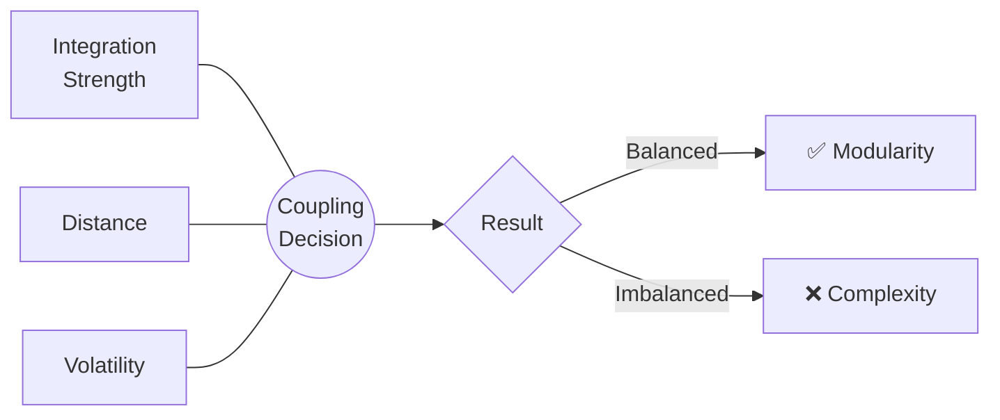
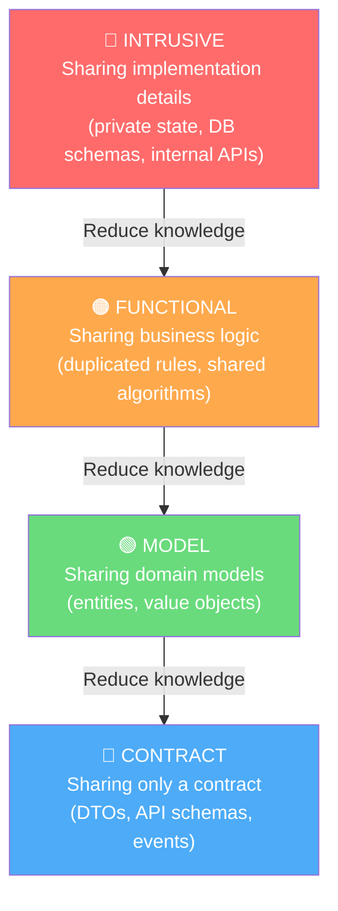
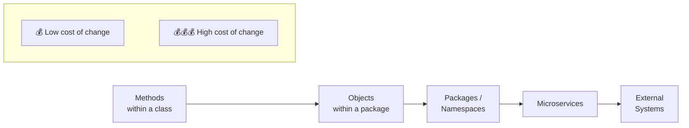
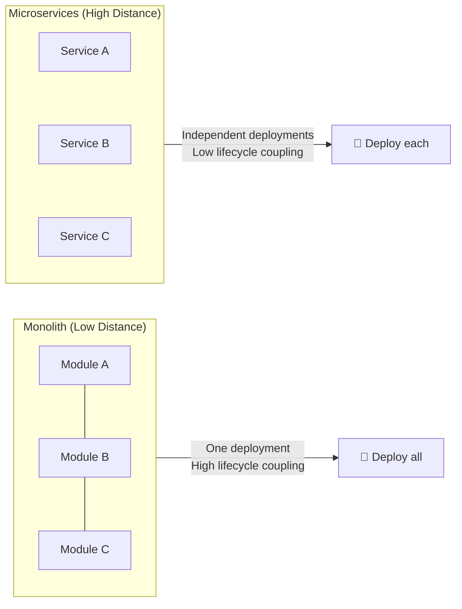
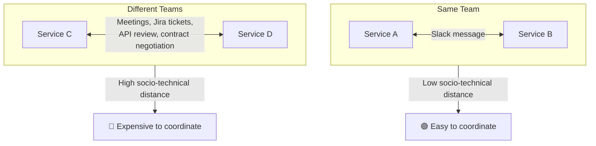
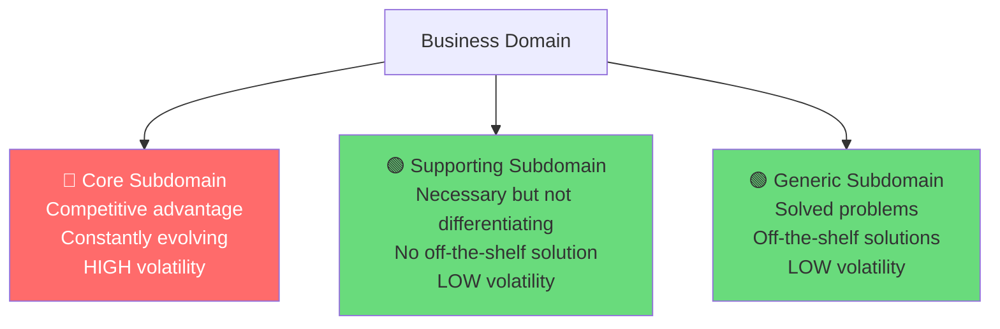
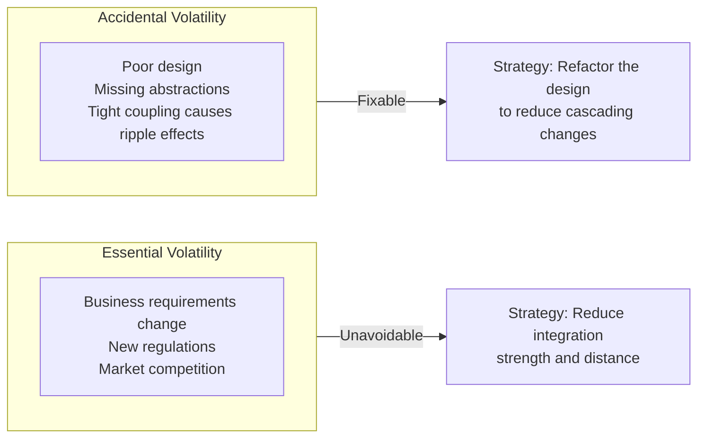
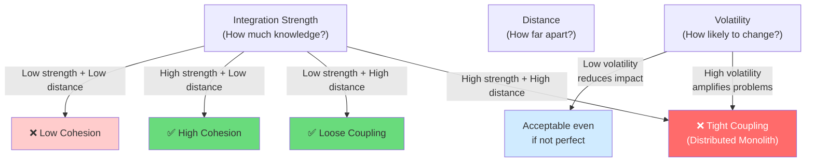

# Dimensions of Coupling

[← Back to Main Guide](README.md) | [Next: Metrics & Refactoring →](coupling-metrics-and-refactoring.md)

> _"These dimensions don't act in isolation — instead, their interplay determines_
> _whether a design leads to modularity or complexity."_
> — Vlad Khononov

The three dimensions of coupling are **Integration Strength**, **Distance**, and **Volatility**. Each is a separate force, and you need to consider all three together when making design decisions.


```mermaid
flowchart LR
    IS[Integration<br/>Strength] --- C((Coupling<br/>Decision))
    D[Distance] --- C
    V[Volatility] --- C
    C --> R{Result}
    R -->|Balanced| Mod[✅ Modularity]
    R -->|Imbalanced| Com[❌ Complexity]
```

---

## 1. Integration Strength

**Integration Strength** categorizes _how much knowledge_ is shared between coupled components. The more knowledge is shared, the more likely a change in one component cascades into the other.

The four levels also differ in how _explicit_ the shared knowledge is. A contract is an explicit, documented integration interface. Intrusive coupling is implicit: the intruded component's authors may not know the integration exists. Functional coupling can be implicit too, because two components that duplicate a business rule need not reference each other at all.

### The Four Levels


```mermaid
flowchart TB
    I["🔴 INTRUSIVE<br/>Sharing implementation details<br/>(private state, DB schemas, internal APIs)"]
    F["🟠 FUNCTIONAL<br/>Sharing business logic<br/>(duplicated rules, shared algorithms)"]
    M["🟢 MODEL<br/>Sharing domain models<br/>(entities, value objects)"]
    C["🔵 CONTRACT<br/>Sharing only a contract<br/>(DTOs, API schemas, events)"]

    I -->|"Reduce knowledge"| F
    F -->|"Reduce knowledge"| M
    M -->|"Reduce knowledge"| C

    style I fill:#ff6b6b,color:#fff
    style F fill:#ffa94d,color:#fff
    style M fill:#69db7c,color:#fff
    style C fill:#4dabf7,color:#fff
```

### ELI5: Integration Strength

> 🏠 **Imagine you share a house with roommates.**
>
> - **Intrusive coupling**: You go through your roommate's drawers to find a fork. If they rearrange their stuff, you can't find anything. Worst case.
> - **Functional coupling**: You both cook dinner at the same time using the same recipe. If the recipe changes, both of you need to know.
> - **Model coupling**: You share a grocery list. When the list format changes, both of you need to adapt.
> - **Contract coupling**: You leave a note on the fridge that says "need milk." Your roommate gets milk. Neither of you needs to know how the other shops. Best case.

---

### Level 1: Intrusive Coupling (🔴 Highest Risk)

One component reaches into another's _implementation details_: private objects, internal databases, undocumented APIs.

#### TypeScript — Bad: Reading another service's database directly

```typescript
// ❌ OrderService directly queries UserService's database table
import { Pool } from "pg";

class OrderService {
  private userDb: Pool; // Directly connected to User service's DB!

  async createOrder(userId: string, items: OrderItem[]) {
    // Reaching into User service's internal schema
    const result = await this.userDb.query(
      "SELECT credit_limit, is_verified FROM users WHERE id = $1",
      [userId],
    );

    const user = result.rows[0];
    if (!user.is_verified || user.credit_limit < this.calculateTotal(items)) {
      throw new Error("Cannot create order");
    }
    // ... create the order
  }
}
```

**Why is this terrible?** If the User team renames `credit_limit` to `spending_limit` or restructures their database, the Order service silently breaks. The User team may not even _know_ the Order service depends on their schema.

#### C# — Bad: Accessing internal implementation

```csharp
// ❌ Accessing internal implementation details via reflection
public class ReportGenerator
{
    public Report GenerateUserReport(UserService userService)
    {
        // Using reflection to access private field — intrusive coupling!
        var field = typeof(UserService)
            .GetField("_userCache", BindingFlags.NonPublic | BindingFlags.Instance);

        var cache = (Dictionary<string, User>)field!.GetValue(userService)!;

        return new Report
        {
            TotalUsers = cache.Count,
            ActiveUsers = cache.Values.Count(u => u.IsActive)
        };
    }
}
```

#### Python — Bad: Reaching into another module's private state

```python
# ❌ Accessing internal cache by reaching into private attributes
class ReportGenerator:
    def generate_user_report(self, user_service: "UserService") -> dict:
        # Intrusive! Accessing a name-mangled private attribute
        cache = user_service._UserService__user_cache  # type: ignore[attr-defined]
        return {
            "total_users": len(cache),
            "active_users": sum(1 for u in cache.values() if u.is_active),
        }
```

#### Java — Bad: Coupling to internal framework details

```java
// ❌ Reaching into Hibernate's internal session to bypass the repository
public class AuditService {

    @PersistenceContext
    private EntityManager em;

    public List<ChangeRecord> getRecentChanges(String entityName) {
        // Coupling to Hibernate's internal implementation
        Session session = em.unwrap(Session.class);
        SessionImplementor impl = (SessionImplementor) session;

        // Reading from internal dirty-tracking mechanism
        PersistenceContext pc = impl.getPersistenceContext();
        // ... extract changes from internal state
    }
}
```

---

### Level 2: Functional Coupling (🟠 High Risk)

Multiple components share knowledge of _business rules_. If a rule changes, all components implementing it must change simultaneously.

#### TypeScript — Bad: Duplicated business rule

```typescript
// ❌ The same discount rule is implemented in two places

// Frontend — calculates preview for the user
function calculateDiscount(cart: CartItem[]): number {
  const total = cart.reduce((sum, item) => sum + item.price * item.quantity, 0);
  if (total > 100) return total * 0.1; // 10% over $100
  if (total > 50) return total * 0.05; // 5% over $50
  return 0;
}

// Backend — calculates the actual charge
class PricingService {
  calculateDiscount(order: Order): number {
    const total = order.lineItems.reduce(
      (s, li) => s + li.unitPrice * li.qty,
      0,
    );
    if (total > 100) return total * 0.1; // 10% over $100
    if (total > 50) return total * 0.05; // 5% over $50
    return 0;
  }
}
// If the threshold changes to $75, BOTH must be updated. Miss one → inconsistency.
```

#### C# — Better: Single source of truth

```csharp
// ✅ Discount rule lives in ONE place — the domain
public static class DiscountPolicy
{
    // Named constants eliminate connascence of meaning (magic numbers)
    private const decimal Tier1Threshold = 100m;
    private const decimal Tier1Rate = 0.10m;
    private const decimal Tier2Threshold = 50m;
    private const decimal Tier2Rate = 0.05m;

    public static decimal Calculate(decimal orderTotal)
    {
        if (orderTotal > Tier1Threshold) return orderTotal * Tier1Rate;
        if (orderTotal > Tier2Threshold) return orderTotal * Tier2Rate;
        return 0m;
    }
}

// Both frontend BFF and backend use the same policy
public class PricingService
{
    public decimal GetDiscount(Order order)
        => DiscountPolicy.Calculate(order.Total);
}

public class CartPreviewController : ControllerBase
{
    [HttpGet("preview")]
    public ActionResult<decimal> GetDiscountPreview([FromQuery] decimal total)
        => Ok(DiscountPolicy.Calculate(total));
}
```

#### Python — Better: Single source of truth

```python
# ✅ Discount rule lives in ONE place — a pure function in the domain layer
from decimal import Decimal

# Named constants eliminate connascence of meaning
_TIER_1_THRESHOLD = Decimal("100")
_TIER_1_RATE = Decimal("0.10")
_TIER_2_THRESHOLD = Decimal("50")
_TIER_2_RATE = Decimal("0.05")


def calculate_discount(order_total: Decimal) -> Decimal:
    if order_total > _TIER_1_THRESHOLD:
        return order_total * _TIER_1_RATE
    if order_total > _TIER_2_THRESHOLD:
        return order_total * _TIER_2_RATE
    return Decimal(0)


# Both the API and internal services import the same function
class PricingService:
    def get_discount(self, order: "Order") -> Decimal:
        return calculate_discount(order.total)
```

---

### Level 3: Model Coupling (🟢 Moderate Risk)

Components share a _domain model_. If the model changes (e.g., new fields, restructured entities), all consumers must adapt.

#### Java — Shared domain model

```java
// Shared model — both OrderService and ShippingService know about Order
public record Order(
    String orderId,
    String customerId,
    List<LineItem> items,
    Address shippingAddress,   // If this changes...
    PaymentInfo payment        // ...or this changes...
) {}

// OrderService uses Order
public class OrderService {
    public Order createOrder(CreateOrderRequest req) {
        // ⚠️ Connascence of position — swap two args and the compiler won't help.
        // Java records lack named parameters; see the Python example below
        // for connascence of name via keyword arguments.
        return new Order(UUID.randomUUID().toString(), req.customerId(),
                        req.items(), req.address(), req.payment());
    }
}

// ShippingService also uses Order — coupled at the model level
public class ShippingService {
    public ShipmentLabel createLabel(Order order) {
        // Only needs shippingAddress, but is coupled to the entire Order model
        return new ShipmentLabel(order.shippingAddress(), calculateWeight(order.items()));
    }
}
```

#### TypeScript — Better: Tailored models per context

```typescript
// ✅ Each service gets its own tailored model

// Order context — full model
interface Order {
  orderId: string;
  customerId: string;
  items: LineItem[];
  shippingAddress: Address;
  payment: PaymentInfo;
}

// Shipping context — only what shipping needs
interface ShipmentRequest {
  shipmentId: string;
  destination: Address;
  totalWeightKg: number;
}

// Mapper at the boundary — an Anti-Corruption Layer
function toShipmentRequest(order: Order): ShipmentRequest {
  return {
    shipmentId: crypto.randomUUID(),
    destination: order.shippingAddress,
    totalWeightKg: order.items.reduce((sum, i) => sum + i.weightKg * i.qty, 0),
  };
}
```

#### Python — Better: Tailored models per context

```python
from dataclasses import dataclass
from uuid import uuid4


# Order context — full model
@dataclass(frozen=True)
class Order:
    order_id: str
    customer_id: str
    items: list["LineItem"]
    shipping_address: "Address"
    payment: "PaymentInfo"


# Shipping context — only what shipping needs (connascence of name only)
@dataclass(frozen=True)
class ShipmentRequest:
    shipment_id: str
    destination: "Address"
    total_weight_kg: float


# Anti-Corruption Layer — maps between bounded contexts
def to_shipment_request(order: Order) -> ShipmentRequest:
    return ShipmentRequest(
        shipment_id=str(uuid4()),
        destination=order.shipping_address,
        total_weight_kg=sum(i.weight_kg * i.qty for i in order.items),
    )
```

---

### Level 4: Contract Coupling (🔵 Lowest Risk)

Components only share a _contract_: a DTO, API schema, event definition, or interface. The contract encapsulates the implementation details, the functional requirements, and the business model behind it. Façades, DDD's open-host service and published language, anti-corruption layers, and DTOs are all ways of introducing one.

#### C# — Contract-based integration

```csharp
// ✅ Services communicate via explicit contracts (DTOs)

// Contract — shared as a NuGet package or schema definition
public record OrderPlacedEvent(
    string OrderId,
    string CustomerId,
    decimal TotalAmount,
    DateTime PlacedAt
);

// Publisher — Order service
public class OrderService
{
    private readonly IEventBus _eventBus;

    public async Task PlaceOrder(CreateOrderCommand cmd)
    {
        var order = Order.Create(cmd);  // internal domain model
        await _repository.Save(order);

        // Publish contract — not the internal model
        await _eventBus.Publish(new OrderPlacedEvent(
            OrderId: order.Id,        // ✅ C# named arguments weaken
            CustomerId: order.CustomerId,  //    connascence of position
            TotalAmount: order.Total,      //    → connascence of name
            PlacedAt: DateTime.UtcNow
        ));
    }
}

// Consumer — Notification service only knows the contract
public class OrderNotificationHandler : IHandleEvent<OrderPlacedEvent>
{
    public async Task Handle(OrderPlacedEvent evt)
    {
        await _emailService.Send(
            to: await _customerRepo.GetEmail(evt.CustomerId),
            subject: $"Order {evt.OrderId} confirmed",
            body: $"Thank you! Total: {evt.TotalAmount:C}"
        );
    }
}
```

#### Java — Contract via interface

```java
// ✅ Contract coupling via a clean interface
public interface PaymentGateway {
    PaymentResult charge(PaymentRequest request);
    PaymentResult refund(String transactionId, BigDecimal amount);
}

// The implementation is hidden — consumers only know the interface
public class StripePaymentGateway implements PaymentGateway {
    private final StripeClient stripeClient; // internal detail

    @Override
    public PaymentResult charge(PaymentRequest request) {
        // Maps from our contract to Stripe's API — internal detail
        // Builder pattern → connascence of name (not position) ✅
        ChargeCreateParams params = ChargeCreateParams.builder()
            .setAmount(request.amountInCents())
            .setCurrency(request.currency())
            .setSource(request.tokenId())
            .build();

        Charge charge = stripeClient.charges().create(params);
        return new PaymentResult(charge.getId(), charge.getStatus());
    }
}
```

#### Python — Contract via Protocol (structural typing)

```python
from dataclasses import dataclass
from decimal import Decimal
from typing import Protocol


# ✅ Contract — consumers depend only on this protocol
class PaymentGateway(Protocol):
    def charge(self, request: "PaymentRequest") -> "PaymentResult": ...
    def refund(self, transaction_id: str, amount: Decimal) -> "PaymentResult": ...


@dataclass(frozen=True)
class PaymentRequest:
    amount_in_cents: int
    currency: str
    token_id: str


@dataclass(frozen=True)
class PaymentResult:
    transaction_id: str
    status: str


# Implementation is hidden — consumers only know the Protocol
class StripePaymentGateway:  # no explicit inheritance needed with Protocol
    def __init__(self, api_key: str) -> None:
        self._api_key = api_key  # internal detail

    def charge(self, request: PaymentRequest) -> PaymentResult:
        # Maps from our contract to Stripe's SDK — internal detail
        intent = stripe.PaymentIntent.create(
            amount=request.amount_in_cents,  # connascence of name only ✅
            currency=request.currency,
            api_key=self._api_key,
        )
        return PaymentResult(
            transaction_id=intent.id,
            status=intent.status,
        )

    def refund(self, transaction_id: str, amount: Decimal) -> PaymentResult:
        refund = stripe.Refund.create(
            payment_intent=transaction_id,
            amount=int(amount * 100),
            api_key=self._api_key,
        )
        return PaymentResult(transaction_id=refund.id, status=refund.status)
```

---

### Which Level Is It?

The level is set by _what knowledge_ crosses the boundary, not by the mechanism (HTTP, SDK, database, method call). The analysis tables in the rest of this guide use these rules:

| You depend on...                                                                             | Level      | Why                                                                                            |
| -------------------------------------------------------------------------------------------- | ---------- | ---------------------------------------------------------------------------------------------- |
| Tables, files, caches, or private members another component owns                             | Intrusive  | A private interface. The owner can change it without knowing you exist                         |
| A business rule that another component also implements, or that you re-implement             | Functional | The rule lives in two places and both must change when the requirement changes                 |
| Another component's domain entities, value objects, or ORM types (shared types, shared JARs)  | Model      | New domain insight changes the model, and every consumer of the model                          |
| A documented API, SDK, DTO, published event, or interface                                     | Contract   | The contract hides implementation, requirements, and model                                     |

Three cases come up repeatedly in the later documents:

- **A method call** is not Functional by itself. Its strength is set by what the signature exposes: DTOs only is Contract; domain entities is Model.
- **A public SDK or HTTP API** (Stripe, a vendor REST endpoint) is Contract, even though it crosses a network. It becomes Intrusive only when you rely on undocumented behavior or response shapes the vendor does not promise.
- **A shared database** is Intrusive when one service reads or writes tables another service owns. When each service owns its tables and the others go through its API, the strength between services is Contract. The shared instance still raises lifecycle coupling (schema migrations and deployments are coordinated), which is a distance concern, not a strength concern.

---

## 2. Distance

**Distance** is the physical and logical separation between coupled components. Greater distance = higher cost of making coordinated changes.


```mermaid
flowchart LR
    M["Methods<br/>within a class"] --> O["Objects<br/>within a package"] --> N["Packages /<br/>Namespaces"] --> S["Microservices"] --> Sys["External<br/>Systems"]

    subgraph cost [" "]
        direction LR
        Low["💰 Low cost of change"]
        High["💰💰💰 High cost of change"]
        Low ~~~ High
    end
```

### ELI5: Distance

> 📞 **Imagine you need to coordinate with someone.**
>
> - **Same method** = talking to yourself (free)
> - **Same class** = talking to your desk neighbor (tap on shoulder)
> - **Same package** = walking to another room (easy, but takes a moment)
> - **Different service** = calling someone in another building (phone tag, meetings, email chains)
> - **Different system** = calling a company in another country (time zones, language barriers, contracts)
>
> The further away your collaborator is, the _more expensive_ it is to coordinate changes.

### Distance Affects Two Things

#### Cost of Change (goes UP with distance)

When two coupled components must change together, how hard is it?

| Distance          | Example           | Change Cost                   |
| ----------------- | ----------------- | ----------------------------- |
| Same method       | Two lines of code | Trivial — one edit            |
| Same class        | Two methods       | Easy — same file              |
| Same package      | Two classes       | Low — same PR                 |
| Different service | Two deployments   | Medium — coordinated releases |
| Different system  | Two companies     | High — contract negotiation   |

#### Lifecycle Coupling (goes DOWN with distance)

Components that are close together must be tested and deployed together (high lifecycle coupling). Distant components can be deployed independently.


```mermaid
flowchart LR
    subgraph mono ["Monolith (Low Distance)"]
        A1[Module A] --- B1[Module B] --- C1[Module C]
    end
    subgraph micro ["Microservices (High Distance)"]
        A2[Service A] ~~~ B2[Service B] ~~~ C2[Service C]
    end

    mono -->|"One deployment<br/>High lifecycle coupling"| Deploy1[🚀 Deploy all]
    micro -->|"Independent deployments<br/>Low lifecycle coupling"| Deploy2[🚀 Deploy each]
```

> ⚠️ Many "monolith to microservices" migrations start here. Teams want to reduce lifecycle coupling so they can deploy independently. If integration strength stays high, they get a _distributed monolith_: the coordination cost of high distance with none of the independence.

### Socio-Technical Distance

Distance is socio-technical. The organizational structure counts as much as the code layout.


```mermaid
flowchart TD
    subgraph same ["Same Team"]
        S1[Service A] <-->|"Slack message"| S2[Service B]
    end
    subgraph diff ["Different Teams"]
        D1[Service C] <-->|"Meetings, Jira tickets,<br/>API review, contract negotiation"| D2[Service D]
    end

    same -->|Low socio-technical distance| E1[🟢 Easy to coordinate]
    diff -->|High socio-technical distance| E2[🔴 Expensive to coordinate]
```

**TypeScript/Node.js example — same team, reasonable coupling:**

```typescript
// These two services are owned by the same team
// Shared types in a local package are fine (low distance)

// packages/shared-types/src/user.ts
export interface UserProfile {
  id: string;
  name: string;
  email: string;
  tier: "free" | "pro" | "enterprise";
}

// services/billing/src/billing.service.ts
import { UserProfile } from "@myorg/shared-types"; // same monorepo = low distance

export class BillingService {
  calculatePrice(user: UserProfile, plan: Plan): number {
    return plan.basePrice * (user.tier === "enterprise" ? 0.8 : 1.0);
  }
}
```

**Python example — same team, shared model in a monorepo:**

```python
# Same team, same monorepo — shared types are fine (low distance)

# packages/shared_types/user.py
from dataclasses import dataclass
from typing import Literal

Tier = Literal["free", "pro", "enterprise"]


@dataclass(frozen=True)
class UserProfile:
    id: str
    name: str
    email: str
    tier: Tier


# services/billing/billing_service.py
from shared_types.user import UserProfile


class BillingService:
    def calculate_price(self, user: UserProfile, plan: "Plan") -> float:
        multiplier = 0.8 if user.tier == "enterprise" else 1.0
        return plan.base_price * multiplier
```

**C# example — different teams, needs contract coupling:**

```csharp
// Different teams → high distance → use contracts

// Team A publishes a NuGet package with only DTOs/events
// Package: Acme.Orders.Contracts
namespace Acme.Orders.Contracts;

public record OrderSummary(string OrderId, decimal Total, string Status);

// Team B consumes ONLY the contract package
// They never reference Team A's internal project
using Acme.Orders.Contracts;

public class DashboardService
{
    private readonly HttpClient _httpClient;

    public async Task<OrderSummary> GetOrder(string orderId)
    {
        return await _httpClient.GetFromJsonAsync<OrderSummary>(
            $"https://orders-api.internal/api/orders/{orderId}"
        );
    }
}
```

### Runtime, Temporal, and Lifecycle Coupling

Three related terms appear throughout the later documents. They describe different things, and none of them is a fourth dimension:

| Term                   | Meaning                                                                                   | Where it lives in the model                                                                   |
| ---------------------- | ----------------------------------------------------------------------------------------- | -------------------------------------------------------------------------------------------- |
| **Lifecycle coupling** | Components must be built, tested, and deployed together                                   | Falls as distance rises. The opposing force to cost of change                                |
| **Temporal coupling**  | Components must be available at the same time for an interaction to succeed (a sync call) | A runtime dependency. Async integration removes it                                           |
| **Runtime coupling**   | Any dependency between components while the system runs: availability, ordering, latency  | Affects distance. Asynchronous integration reduces lifecycle coupling between the components |

Khononov's distance page lists runtime dependencies alongside source layout, abstraction level, and team structure as inputs to distance. So switching a synchronous call to an event does not lower integration strength by itself. It removes temporal coupling and reduces lifecycle coupling; the strength is still set by what the event carries (a DTO is Contract, a serialized domain entity is Model).

---

## 3. Volatility

**Volatility** is how likely a component is to change, driven by its business domain. It is a property of the component, not of its integration. Putting a contract in front of a volatile component contains the cascade; it does not make the component less volatile. High volatility with tight coupling is constant pain. Low volatility with tight coupling is manageable.

### ELI5: Volatility

> 🌤️ **Think of coupling like hanging a picture.**
>
> - Coupling to a **volatile** component is like hanging a picture on a door. The door swings open and shut all day. Your picture keeps falling off. Frustrating.
> - Coupling to a **stable** component is like hanging a picture on a load-bearing wall. The wall never moves. Your picture stays put forever. No worries.
>
> The key question is: **is this thing going to change?**

### Using DDD Subdomains to Predict Volatility


```mermaid
flowchart TD
    BD[Business Domain] --> Core
    BD --> Supporting
    BD --> Generic

    Core["🔴 Core Subdomain<br/>Competitive advantage<br/>Constantly evolving<br/>HIGH volatility"]
    Supporting["🟢 Supporting Subdomain<br/>Necessary but not differentiating<br/>No off-the-shelf solution<br/>LOW volatility"]
    Generic["🟢 Generic Subdomain<br/>Solved problems<br/>Off-the-shelf solutions<br/>LOW volatility"]

    style Core fill:#ff6b6b,color:#fff
    style Supporting fill:#69db7c,color:#333
    style Generic fill:#69db7c,color:#333
```

| Subdomain      | Example                     | Volatility | Coupling Strategy                                                         |
| -------------- | --------------------------- | ---------- | ------------------------------------------------------------------------- |
| **Core**       | Real-time pricing algorithm | 🔴 High    | Minimize integration strength, isolate behind contracts                   |
| **Supporting** | User registration flow      | 🟢 Low     | Built in-house but rarely changes. Model coupling OK within the service   |
| **Generic**    | Email sending, logging      | 🟢 Low     | Solved problem. Even tight coupling is acceptable                         |

Only core subdomains provide a competitive advantage, so only they are continuously optimized. Khononov rates supporting and generic subdomains as "much less volatile" with no middle tier. Beyond DDD subdomains, the commoditization axis of a Wardley map is another predictor: components drifting toward commodity change less.

### TypeScript — Volatility-aware architecture

```typescript
// Our e-commerce platform has three subdomains:

// 🔴 CORE: Pricing Engine — changes weekly as we experiment
// Keep this ISOLATED. Contract coupling only.
interface PricingContract {
  calculatePrice(productId: string, context: PricingContext): Promise<Price>;
}

// 🟢 SUPPORTING: Inventory Management — built in-house, changes rarely
// Model coupling is fine within the bounded context
class InventoryService {
  constructor(private repo: InventoryRepository) {}

  async reserveStock(
    orderId: string,
    items: StockReservation[],
  ): Promise<void> {
    // Uses shared domain model — acceptable at low volatility
    for (const item of items) {
      const stock = await this.repo.findByProductId(item.productId);
      stock.reserve(item.quantity, orderId);
      await this.repo.save(stock);
    }
  }
}

// 🟢 GENERIC: Email Sending — hasn't changed in years
// Even model coupling to the email library is fine
import { SES } from "@aws-sdk/client-ses";

class EmailService {
  constructor(private ses: SES) {}

  async send(to: string, subject: string, body: string): Promise<void> {
    await this.ses.sendEmail({
      Source: "noreply@shop.com",
      Destination: { ToAddresses: [to] },
      Message: {
        Subject: { Data: subject },
        Body: { Html: { Data: body } },
      },
    });
  }
}
```

### Python — Volatility-aware architecture

```python
from typing import Protocol
from dataclasses import dataclass
import boto3


# 🔴 CORE: Pricing Engine — changes weekly as we experiment
# Keep this ISOLATED. Contract coupling only (Protocol = structural typing).
class PricingPort(Protocol):
    def calculate_price(self, product_id: str, context: "PricingContext") -> "Price": ...


# 🟢 SUPPORTING: Inventory Management — built in-house, changes rarely
# Model coupling is fine within the bounded context
@dataclass
class StockReservation:
    product_id: str
    quantity: int


class InventoryService:
    def __init__(self, repo: "InventoryRepository") -> None:
        self._repo = repo

    def reserve_stock(self, order_id: str, items: list[StockReservation]) -> None:
        for item in items:
            stock = self._repo.find_by_product_id(item.product_id)
            stock.reserve(quantity=item.quantity, order_id=order_id)
            self._repo.save(stock)


# 🟢 GENERIC: Email Sending — hasn't changed in years
# Even model coupling to the boto3 library is fine
class EmailService:
    def __init__(self) -> None:
        self._ses = boto3.client("ses")

    def send(self, *, to: str, subject: str, body: str) -> None:
        self._ses.send_email(
            Source="noreply@shop.com",
            Destination={"ToAddresses": [to]},
            Message={
                "Subject": {"Data": subject},
                "Body": {"Html": {"Data": body}},
            },
        )
```

### Essential vs. Accidental Volatility

> ⚠️ **Warning:** Don't confuse _commit frequency_ with _volatility_.
>
> A component might change often because it's **poorly designed** (accidental volatility), not because the business domain is evolving (essential volatility). Conversely, a component might _appear_ stable, but that's only because the team is afraid to touch it.


```mermaid
flowchart LR
    subgraph essential ["Essential Volatility"]
        E1["Business requirements change<br/>New regulations<br/>Market competition"]
    end

    subgraph accidental ["Accidental Volatility"]
        A1["Poor design<br/>Missing abstractions<br/>Tight coupling causes ripple effects"]
    end

    essential -->|"Unavoidable"| Strat["Strategy: Reduce integration<br/>strength and distance"]
    accidental -->|"Fixable"| Fix["Strategy: Refactor the design<br/>to reduce cascading changes"]
```

### Java — Reducing coupling to volatile component

```java
// 🔴 The pricing engine changes weekly — it's our core subdomain

// ❌ BAD: Directly coupling to the volatile implementation
public class OrderService {
    private final PricingEngine pricingEngine; // concrete, volatile class

    public Order createOrder(CreateOrderRequest req) {
        // If PricingEngine's API changes (which it does weekly), this breaks
        BigDecimal price = pricingEngine.calculateDynamicPrice(
            req.productId(), req.quantity(), req.customerSegment(),
            req.abTestGroup(), req.geolocation() // API keeps growing!
        );
        return new Order(req, price);
    }
}

// ✅ GOOD: Shield with an anti-corruption layer
public interface PricingPort {
    Price calculate(String productId, int quantity, String customerId);
}

public class PricingAdapter implements PricingPort {
    private final PricingEngine engine; // volatile implementation hidden here

    @Override
    public Price calculate(String productId, int quantity, String customerId) {
        // Translate between our stable contract and the volatile engine
        var segment = customerService.getSegment(customerId);
        var abGroup = abTestService.getGroup(customerId);
        var geo = geoService.locate(customerId);

        return Price.of(engine.calculateDynamicPrice(
            productId, quantity, segment, abGroup, geo
        ));
    }
}

// OrderService depends on the STABLE port, not the VOLATILE engine
public class OrderService {
    private final PricingPort pricing; // stable interface

    public Order createOrder(CreateOrderRequest req) {
        Price price = pricing.calculate(req.productId(), req.quantity(), req.customerId());
        return new Order(req, price);
    }
}
```

### Python — Reducing coupling to volatile component

```python
from typing import Protocol
from dataclasses import dataclass
from decimal import Decimal


# 🔴 The pricing engine changes weekly — it's our core subdomain

# ❌ BAD: Directly coupling to the volatile implementation
class BadOrderService:
    def __init__(self, pricing_engine: "PricingEngine") -> None:
        self._engine = pricing_engine  # concrete, volatile class

    def create_order(self, req: "CreateOrderRequest") -> "Order":
        # If PricingEngine's API changes (which it does weekly), this breaks
        # Also: connascence of position — 5 positional args!
        price = self._engine.calculate_dynamic_price(
            req.product_id, req.quantity, req.customer_segment,
            req.ab_test_group, req.geolocation,  # API keeps growing!
        )
        return Order(req=req, price=price)


# ✅ GOOD: Shield with a Protocol (anti-corruption layer)
@dataclass(frozen=True)
class Price:
    amount: Decimal
    currency: str = "USD"


class PricingPort(Protocol):
    def calculate(self, *, product_id: str, quantity: int, customer_id: str) -> Price:
        # keyword-only args → connascence of name, not position
        ...


class PricingAdapter:
    """Translates our stable contract to the volatile engine's API."""

    def __init__(self, engine: "PricingEngine", customer_svc: "CustomerService") -> None:
        self._engine = engine
        self._customer_svc = customer_svc

    def calculate(self, *, product_id: str, quantity: int, customer_id: str) -> Price:
        segment = self._customer_svc.get_segment(customer_id)
        ab_group = self._customer_svc.get_ab_group(customer_id)
        geo = self._customer_svc.locate(customer_id)
        raw = self._engine.calculate_dynamic_price(
            product_id, quantity, segment, ab_group, geo,
        )
        return Price(amount=raw)


# OrderService depends on the STABLE port, not the VOLATILE engine
class OrderService:
    def __init__(self, pricing: PricingPort) -> None:
        self._pricing = pricing

    def create_order(self, req: "CreateOrderRequest") -> "Order":
        price = self._pricing.calculate(
            product_id=req.product_id,
            quantity=req.quantity,
            customer_id=req.customer_id,
        )
        return Order(req=req, price=price)
```

---

## Putting It All Together

The three dimensions interact as a system:


```mermaid
flowchart TD
    IS["Integration Strength<br/>(How much knowledge?)"]
    D["Distance<br/>(How far apart?)"]
    V["Volatility<br/>(How likely to change?)"]

    IS -->|"High strength + High distance"| TC["❌ Tight Coupling<br/>(Distributed Monolith)"]
    IS -->|"Low strength + High distance"| LC["✅ Loose Coupling"]
    IS -->|"High strength + Low distance"| HC["✅ High Cohesion"]
    IS -->|"Low strength + Low distance"| LoCo["❌ Low Cohesion"]

    V -->|"High volatility<br/>amplifies problems"| TC
    V -->|"Low volatility<br/>reduces impact"| OK["Acceptable even<br/>if not perfect"]

    style TC fill:#ff6b6b,color:#fff
    style LoCo fill:#ffcccc
    style LC fill:#69db7c,color:#333
    style HC fill:#69db7c,color:#333
    style OK fill:#d0ebff
```

### The Decision Heuristic

1. **Classify** the subdomain (Core / Supporting / Generic) → determines volatility
2. **Assess** integration strength → how much knowledge must be shared? (see [Which Level Is It?](#which-level-is-it))
3. **Measure** distance → same class, same package, different service, different system?
4. **Balance**:
   - High strength unavoidable? → Minimize distance (keep components close)
   - High distance unavoidable? → Minimize strength (use contracts)
   - Low strength and low distance? → Unrelated components sitting together. Fine in small doses; a big ball of mud at scale
   - Low volatility? → Relax. Even imperfect coupling is OK

### Reading the Analysis Tables

Every coupling-analysis table in this guide ends with a verdict row. The verdict applies the binary balance formula from the [main guide](README.md#balance-the-key-insight): `BALANCE = (STRENGTH XOR DISTANCE) OR NOT VOLATILITY`. This guide's convention for the binary form: Intrusive and Functional count as high strength, Model and Contract as low; anything across a process boundary counts as high distance. A ✅ verdict means the formula holds, and the row says which term made it hold.

---

[← Back to Main Guide](README.md) | [Next: Metrics & Refactoring →](coupling-metrics-and-refactoring.md)
