# Dimensions of Coupling

[← Back to Main Guide](COUPLING.md)

> *"These dimensions don't act in isolation — instead, their interplay determines*
> *whether a design leads to modularity or complexity."*
> — Vlad Khononov

The three dimensions of coupling are **Integration Strength**, **Distance**, and **Volatility**. Each is a separate force, and you need to consider all three together when making design decisions.

```mermaid
flowchart LR
    IS[Integration<br/>Strength] --- C((Coupling<br/>Decision))
    D[Distance] --- C
    V[Volatility] --- C
    C --> R{Result}
    R -->|Balanced| Mod[✅ Modularity]
    R -->|Imbalanced| Com[❌ Complexity]
```



---

## 1. Integration Strength

**Integration Strength** categorizes *how much knowledge* is shared between coupled components. More shared knowledge = higher risk that a change in one component cascading into changes in the other.

### The Four Levels


### ELI5: Integration Strength

> 🏠 **Imagine you share a house with roommates.**
>
> - **Intrusive coupling**: You go through your roommate's drawers to find a fork. If they rearrange their stuff, you can't find anything. Worst case.
> - **Functional coupling**: You both cook dinner at the same time using the same recipe. If the recipe changes, both of you need to know. 
> - **Model coupling**: You share a grocery list. When the list format changes, both of you need to adapt.
> - **Contract coupling**: You leave a note on the fridge that says "need milk." Your roommate gets milk. Neither of you needs to know how the other shops. Best case.

---

### Level 1: Intrusive Coupling (🔴 Highest Risk)

One component reaches into another's *implementation details* — private objects, internal databases, undocumented APIs.

#### TypeScript — Bad: Reading another service's database directly

```typescript
// ❌ OrderService directly queries UserService's database table
import { Pool } from 'pg';

class OrderService {
  private userDb: Pool; // Directly connected to User service's DB!

  async createOrder(userId: string, items: OrderItem[]) {
    // Reaching into User service's internal schema
    const result = await this.userDb.query(
      'SELECT credit_limit, is_verified FROM users WHERE id = $1',
      [userId]
    );
    
    const user = result.rows[0];
    if (!user.is_verified || user.credit_limit < this.calculateTotal(items)) {
      throw new Error('Cannot create order');
    }
    // ... create the order
  }
}
```

**Why is this terrible?** If the User team renames `credit_limit` to `spending_limit` or restructures their database, the Order service silently breaks. The User team may not even *know* the Order service depends on their schema.

#### C# — Bad: Accessing internal implementation

```csharp
// ❌ Accessing internal implementation details via reflection
public class ReportGenerator
{
    public Report GenerateUserReport(UserService userService)
    {
        // Using reflection to access private field — intrusive coupling!
        var field = typeof(UserService)
            .GetField("_userCache", BindingFlags.NonPublic | BindingFlags.Instance);
        
        var cache = (Dictionary<string, User>)field!.GetValue(userService)!;
        
        return new Report
        {
            TotalUsers = cache.Count,
            ActiveUsers = cache.Values.Count(u => u.IsActive)
        };
    }
}
```

#### Java — Bad: Coupling to internal framework details

```java
// ❌ Reaching into Hibernate's internal session to bypass the repository
public class AuditService {
    
    @PersistenceContext
    private EntityManager em;

    public List<ChangeRecord> getRecentChanges(String entityName) {
        // Coupling to Hibernate's internal implementation
        Session session = em.unwrap(Session.class);
        SessionImplementor impl = (SessionImplementor) session;
        
        // Reading from internal dirty-tracking mechanism
        PersistenceContext pc = impl.getPersistenceContext();
        // ... extract changes from internal state
    }
}
```

---

### Level 2: Functional Coupling (🟠 High Risk)

Multiple components share knowledge of *business rules*. If a rule changes, all components implementing it must change simultaneously.

#### TypeScript — Bad: Duplicated business rule

```typescript
// ❌ The same discount rule is implemented in two places

// Frontend — calculates preview for the user
function calculateDiscount(cart: CartItem[]): number {
  const total = cart.reduce((sum, item) => sum + item.price * item.quantity, 0);
  if (total > 100) return total * 0.10;  // 10% over $100
  if (total > 50) return total * 0.05;   // 5% over $50
  return 0;
}

// Backend — calculates the actual charge
class PricingService {
  calculateDiscount(order: Order): number {
    const total = order.lineItems.reduce((s, li) => s + li.unitPrice * li.qty, 0);
    if (total > 100) return total * 0.10;  // 10% over $100
    if (total > 50) return total * 0.05;   // 5% over $50
    return 0;
  }
}
// If the threshold changes to $75, BOTH must be updated. Miss one → inconsistency.
```

#### C# — Better: Single source of truth

```csharp
// ✅ Discount rule lives in ONE place — the domain
public static class DiscountPolicy
{
    public static decimal Calculate(decimal orderTotal)
    {
        if (orderTotal > 100m) return orderTotal * 0.10m;
        if (orderTotal > 50m)  return orderTotal * 0.05m;
        return 0m;
    }
}

// Both frontend BFF and backend use the same policy
public class PricingService
{
    public decimal GetDiscount(Order order) 
        => DiscountPolicy.Calculate(order.Total);
}

public class CartPreviewController : ControllerBase
{
    [HttpGet("preview")]
    public ActionResult<decimal> GetDiscountPreview([FromQuery] decimal total)
        => Ok(DiscountPolicy.Calculate(total));
}
```

---

### Level 3: Model Coupling (🟢 Moderate Risk)

Components share a *domain model*. If the model changes (e.g., new fields, restructured entities), all consumers must adapt.

#### Java — Shared domain model

```java
// Shared model — both OrderService and ShippingService know about Order
public record Order(
    String orderId,
    String customerId,
    List<LineItem> items,
    Address shippingAddress,   // If this changes...
    PaymentInfo payment        // ...or this changes...
) {}

// OrderService uses Order
public class OrderService {
    public Order createOrder(CreateOrderRequest req) {
        return new Order(UUID.randomUUID().toString(), req.customerId(),
                        req.items(), req.address(), req.payment());
    }
}

// ShippingService also uses Order — coupled at the model level
public class ShippingService {
    public ShipmentLabel createLabel(Order order) {
        // Only needs shippingAddress, but is coupled to the entire Order model
        return new ShipmentLabel(order.shippingAddress(), calculateWeight(order.items()));
    }
}
```

#### TypeScript — Better: Tailored models per context

```typescript
// ✅ Each service gets its own tailored model

// Order context — full model
interface Order {
  orderId: string;
  customerId: string;
  items: LineItem[];
  shippingAddress: Address;
  payment: PaymentInfo;
}

// Shipping context — only what shipping needs
interface ShipmentRequest {
  shipmentId: string;
  destination: Address;
  totalWeightKg: number;
}

// Mapper at the boundary — an Anti-Corruption Layer
function toShipmentRequest(order: Order): ShipmentRequest {
  return {
    shipmentId: crypto.randomUUID(),
    destination: order.shippingAddress,
    totalWeightKg: order.items.reduce((sum, i) => sum + i.weightKg * i.qty, 0),
  };
}
```

---

### Level 4: Contract Coupling (🔵 Lowest Risk)

Components only share a *contract* — a DTO, API schema, event definition, or interface. The contract encapsulates all internal details.

#### C# — Contract-based integration

```csharp
// ✅ Services communicate via explicit contracts (DTOs)

// Contract — shared as a NuGet package or schema definition
public record OrderPlacedEvent(
    string OrderId,
    string CustomerId,
    decimal TotalAmount,
    DateTime PlacedAt
);

// Publisher — Order service
public class OrderService
{
    private readonly IEventBus _eventBus;

    public async Task PlaceOrder(CreateOrderCommand cmd)
    {
        var order = Order.Create(cmd);  // internal domain model
        await _repository.Save(order);
        
        // Publish contract — not the internal model
        await _eventBus.Publish(new OrderPlacedEvent(
            order.Id, order.CustomerId, order.Total, DateTime.UtcNow
        ));
    }
}

// Consumer — Notification service only knows the contract
public class OrderNotificationHandler : IHandleEvent<OrderPlacedEvent>
{
    public async Task Handle(OrderPlacedEvent evt)
    {
        await _emailService.Send(
            to: await _customerRepo.GetEmail(evt.CustomerId),
            subject: $"Order {evt.OrderId} confirmed",
            body: $"Thank you! Total: {evt.TotalAmount:C}"
        );
    }
}
```

#### Java — Contract via interface

```java
// ✅ Contract coupling via a clean interface
public interface PaymentGateway {
    PaymentResult charge(PaymentRequest request);
    PaymentResult refund(String transactionId, BigDecimal amount);
}

// The implementation is hidden — consumers only know the interface
public class StripePaymentGateway implements PaymentGateway {
    private final StripeClient stripeClient; // internal detail

    @Override
    public PaymentResult charge(PaymentRequest request) {
        // Maps from our contract to Stripe's API — internal detail
        ChargeCreateParams params = ChargeCreateParams.builder()
            .setAmount(request.amountInCents())
            .setCurrency(request.currency())
            .setSource(request.tokenId())
            .build();
        
        Charge charge = stripeClient.charges().create(params);
        return new PaymentResult(charge.getId(), charge.getStatus());
    }
}
```

---

## 2. Distance

**Distance** is the physical and logical separation between coupled components. Greater distance = higher cost of making coordinated changes.

```mermaid
flowchart LR
    M["Methods<br/>within a class"] --> O["Objects<br/>within a package"] --> N["Packages /<br/>Namespaces"] --> S["Microservices"] --> Sys["External<br/>Systems"]
    
    subgraph cost [" "]
        direction LR
        Low["💰 Low cost of change"]
        High["💰💰💰 High cost of change"]
        Low ~~~ High
    end
```



### ELI5: Distance

> 📞 **Imagine you need to coordinate with someone.**
>
> - **Same method** = talking to yourself (free)
> - **Same class** = talking to your desk neighbor (tap on shoulder)
> - **Same package** = walking to another room (easy, but takes a moment)
> - **Different service** = calling someone in another building (phone tag, meetings, email chains)
> - **Different system** = calling a company in another country (time zones, language barriers, contracts)
>
> The further away your collaborator is, the *more expensive* it is to coordinate changes.

### Distance Affects Two Things

#### Cost of Change (goes UP with distance)

When two coupled components must change together, how hard is it?

| Distance | Example | Change Cost |
|---|---|---|
| Same method | Two lines of code | Trivial — one edit |
| Same class | Two methods | Easy — same file |
| Same package | Two classes | Low — same PR |
| Different service | Two deployments | Medium — coordinated releases |
| Different system | Two companies | High — contract negotiation |

#### Lifecycle Coupling (goes DOWN with distance)

Components that are close together must be tested and deployed together (high lifecycle coupling). Distant components can be deployed independently.

```mermaid
flowchart LR
    subgraph mono ["Monolith (Low Distance)"]
        A1[Module A] --- B1[Module B] --- C1[Module C]
    end
    subgraph micro ["Microservices (High Distance)"]
        A2[Service A] ~~~ B2[Service B] ~~~ C2[Service C]
    end
    
    mono -->|"One deployment<br/>High lifecycle coupling"| Deploy1[🚀 Deploy all]
    micro -->|"Independent deployments<br/>Low lifecycle coupling"| Deploy2[🚀 Deploy each]
```



> ⚠️ **This is why many "monolith to microservices" migrations start!** Teams want to reduce lifecycle coupling — they want to deploy independently. But if integration strength is high, they end up with a *distributed monolith* — the worst of both worlds.

### Socio-Technical Distance

Distance isn't just about code — it's also about **teams**.

```mermaid
flowchart TD
    subgraph same ["Same Team"]
        S1[Service A] <-->|"Slack message"| S2[Service B]
    end
    subgraph diff ["Different Teams"]
        D1[Service C] <-->|"Meetings, Jira tickets,<br/>API review, contract negotiation"| D2[Service D]
    end
    
    same -->|Low socio-technical distance| E1[🟢 Easy to coordinate]
    diff -->|High socio-technical distance| E2[🔴 Expensive to coordinate]
```



**TypeScript/Node.js example — same team, reasonable coupling:**

```typescript
// These two services are owned by the same team
// Shared types in a local package are fine (low distance)

// packages/shared-types/src/user.ts
export interface UserProfile {
  id: string;
  name: string;
  email: string;
  tier: 'free' | 'pro' | 'enterprise';
}

// services/billing/src/billing.service.ts
import { UserProfile } from '@myorg/shared-types';  // same monorepo = low distance

export class BillingService {
  calculatePrice(user: UserProfile, plan: Plan): number {
    return plan.basePrice * (user.tier === 'enterprise' ? 0.8 : 1.0);
  }
}
```

**C# example — different teams, needs contract coupling:**

```csharp
// Different teams → high distance → use contracts

// Team A publishes a NuGet package with only DTOs/events
// Package: Acme.Orders.Contracts
namespace Acme.Orders.Contracts;

public record OrderSummary(string OrderId, decimal Total, string Status);

// Team B consumes ONLY the contract package
// They never reference Team A's internal project
using Acme.Orders.Contracts;

public class DashboardService
{
    private readonly HttpClient _httpClient;
    
    public async Task<OrderSummary> GetOrder(string orderId)
    {
        return await _httpClient.GetFromJsonAsync<OrderSummary>(
            $"https://orders-api.internal/api/orders/{orderId}"
        );
    }
}
```

---

## 3. Volatility

**Volatility** captures how likely a component is to change. High volatility + tight coupling = constant pain. Low volatility + tight coupling = manageable.

### ELI5: Volatility

> 🌤️ **Think of coupling like hanging a picture.**
>
> - Coupling to a **volatile** component is like hanging a picture on a door. The door swings open and shut all day. Your picture keeps falling off. Frustrating.
> - Coupling to a **stable** component is like hanging a picture on a load-bearing wall. The wall never moves. Your picture stays put forever. No worries.
>
> The key question is: **is this thing going to change?**

### Using DDD Subdomains to Predict Volatility

```mermaid
flowchart TD
    BD[Business Domain] --> Core
    BD --> Supporting
    BD --> Generic
    
    Core["🔴 Core Subdomain<br/>Competitive advantage<br/>Constantly evolving<br/>HIGH volatility"]
    Supporting["🟡 Supporting Subdomain<br/>Necessary but not differentiating<br/>Changes occasionally<br/>MEDIUM volatility"]
    Generic["🟢 Generic Subdomain<br/>Solved problems<br/>Off-the-shelf solutions<br/>LOW volatility"]
    
    style Core fill:#ff6b6b,color:#fff
    style Supporting fill:#ffd43b,color:#333
    style Generic fill:#69db7c,color:#333
```



| Subdomain | Example | Volatility | Coupling Strategy |
|---|---|---|---|
| **Core** | Real-time pricing algorithm | 🔴 High | Minimize integration strength, isolate behind contracts |
| **Supporting** | User registration flow | 🟡 Medium | Model coupling OK if within same service |
| **Generic** | Email sending, logging | 🟢 Low | Even tight coupling is acceptable |

### TypeScript — Volatility-aware architecture

```typescript
// Our e-commerce platform has three subdomains:

// 🔴 CORE: Pricing Engine — changes weekly as we experiment
// Keep this ISOLATED. Contract coupling only.
interface PricingContract {
  calculatePrice(productId: string, context: PricingContext): Promise<Price>;
}

// 🟡 SUPPORTING: Inventory Management — changes quarterly
// Model coupling is fine within the bounded context
class InventoryService {
  constructor(private repo: InventoryRepository) {}

  async reserveStock(orderId: string, items: StockReservation[]): Promise<void> {
    // Uses shared domain model — acceptable at medium volatility
    for (const item of items) {
      const stock = await this.repo.findByProductId(item.productId);
      stock.reserve(item.quantity, orderId);
      await this.repo.save(stock);
    }
  }
}

// 🟢 GENERIC: Email Sending — hasn't changed in years
// Even model coupling to the email library is fine
import { SES } from '@aws-sdk/client-ses';

class EmailService {
  constructor(private ses: SES) {}

  async send(to: string, subject: string, body: string): Promise<void> {
    await this.ses.sendEmail({
      Source: 'noreply@shop.com',
      Destination: { ToAddresses: [to] },
      Message: {
        Subject: { Data: subject },
        Body: { Html: { Data: body } },
      },
    });
  }
}
```

### Essential vs. Accidental Volatility

> ⚠️ **Warning:** Don't confuse *commit frequency* with *volatility*.
>
> A component might change often because it's **poorly designed** (accidental volatility), not because the business domain is evolving (essential volatility). Conversely, a component might *appear* stable, but that's only because the team is afraid to touch it.


### Java — Reducing coupling to volatile component

```java
// 🔴 The pricing engine changes weekly — it's our core subdomain

// ❌ BAD: Directly coupling to the volatile implementation
public class OrderService {
    private final PricingEngine pricingEngine; // concrete, volatile class
    
    public Order createOrder(CreateOrderRequest req) {
        // If PricingEngine's API changes (which it does weekly), this breaks
        BigDecimal price = pricingEngine.calculateDynamicPrice(
            req.productId(), req.quantity(), req.customerSegment(),
            req.abTestGroup(), req.geolocation() // API keeps growing!
        );
        return new Order(req, price);
    }
}

// ✅ GOOD: Shield with an anti-corruption layer
public interface PricingPort {
    Price calculate(String productId, int quantity, String customerId);
}

public class PricingAdapter implements PricingPort {
    private final PricingEngine engine; // volatile implementation hidden here
    
    @Override
    public Price calculate(String productId, int quantity, String customerId) {
        // Translate between our stable contract and the volatile engine
        var segment = customerService.getSegment(customerId);
        var abGroup = abTestService.getGroup(customerId);
        var geo = geoService.locate(customerId);
        
        return Price.of(engine.calculateDynamicPrice(
            productId, quantity, segment, abGroup, geo
        ));
    }
}

// OrderService depends on the STABLE port, not the VOLATILE engine
public class OrderService {
    private final PricingPort pricing; // stable interface
    
    public Order createOrder(CreateOrderRequest req) {
        Price price = pricing.calculate(req.productId(), req.quantity(), req.customerId());
        return new Order(req, price);
    }
}
```

---

## Putting It All Together

The three dimensions interact as a system:

```mermaid
flowchart TD
    IS["Integration Strength<br/>(How much knowledge?)"]
    D["Distance<br/>(How far apart?)"]
    V["Volatility<br/>(How likely to change?)"]
    
    IS -->|"High strength + High distance"| TC["❌ Tight Coupling<br/>(Distributed Monolith)"]
    IS -->|"Low strength + High distance"| LC["✅ Loose Coupling"]
    IS -->|"High strength + Low distance"| HC["✅ High Cohesion"]
    IS -->|"Low strength + Low distance"| LoCo["❌ Low Cohesion"]
    
    V -->|"High volatility<br/>amplifies problems"| TC
    V -->|"Low volatility<br/>reduces impact"| OK["Acceptable even<br/>if not perfect"]
    
    style TC fill:#ff6b6b,color:#fff
    style LoCo fill:#ffcccc
    style LC fill:#69db7c,color:#333
    style HC fill:#69db7c,color:#333
    style OK fill:#d0ebff
```



### The Decision Heuristic

1. **Classify** the subdomain (Core / Supporting / Generic) → determines volatility
2. **Assess** integration strength → how much knowledge must be shared?
3. **Measure** distance → same class, same package, different service, different system?
4. **Balance**:
   - High volatility? → Minimize strength AND distance
   - High strength unavoidable? → Minimize distance (keep components close)
   - High distance unavoidable? → Minimize strength (use contracts)
   - Low volatility? → Relax — even imperfect coupling is OK

---

[← Back to Main Guide](COUPLING.md) | [Next: Metrics & Refactoring →](coupling-metrics-and-refactoring.md)
