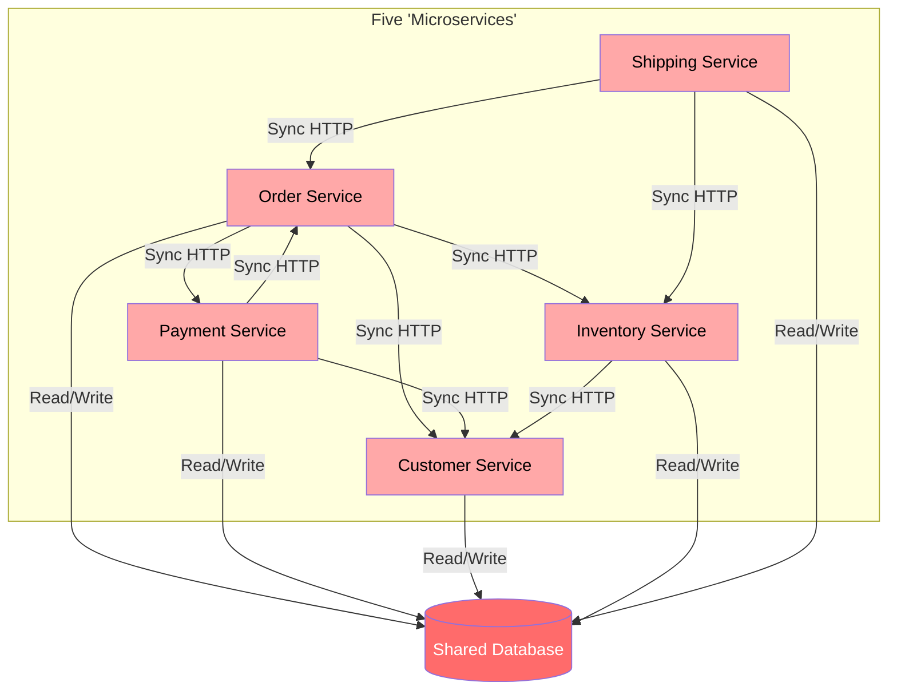
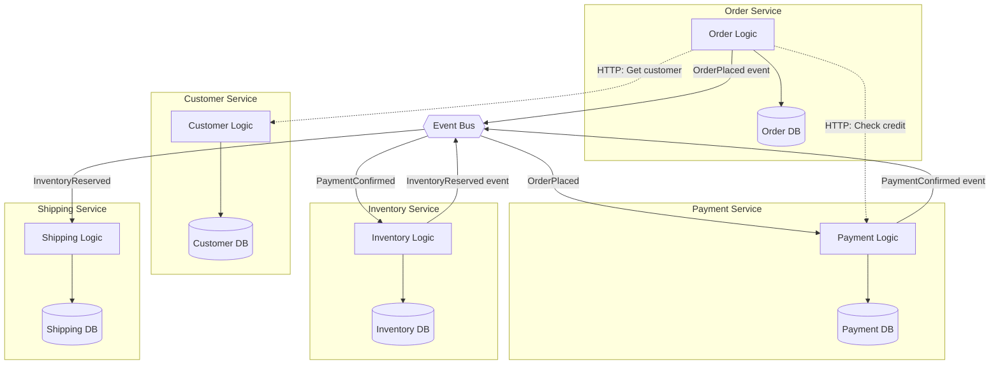
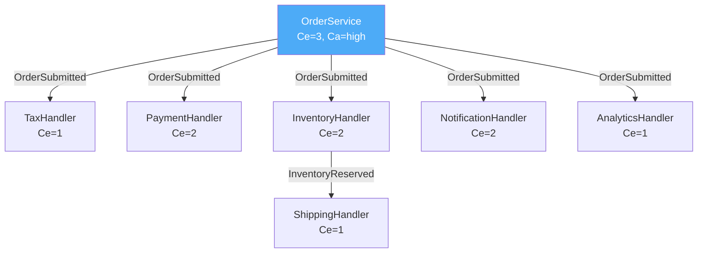
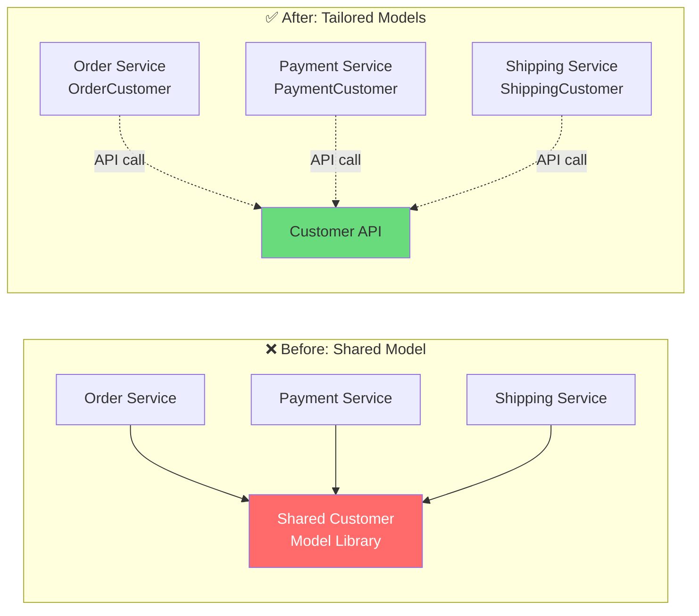
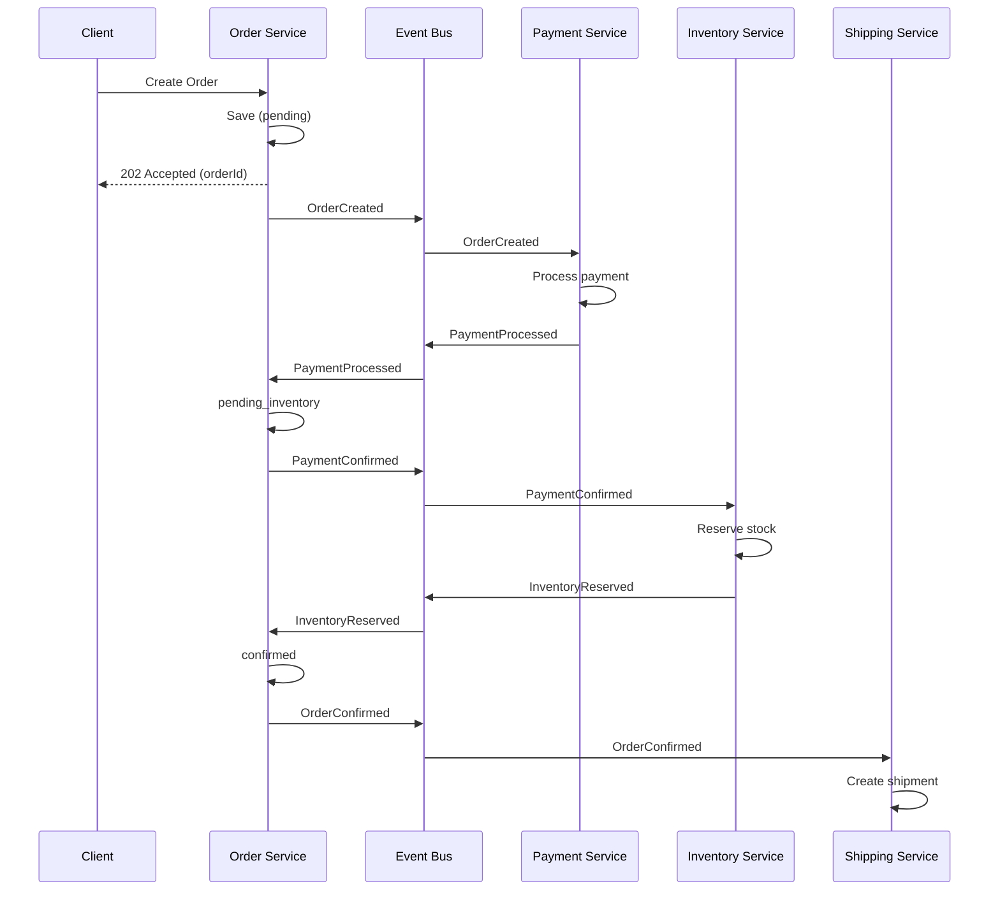
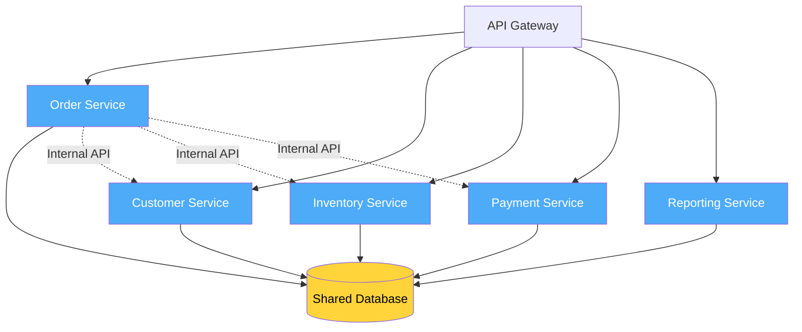
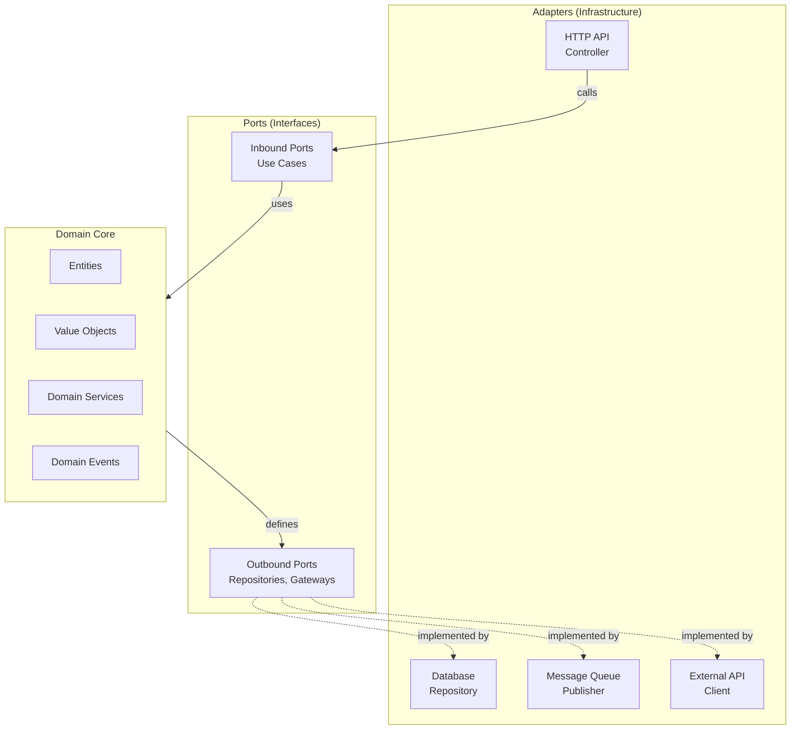
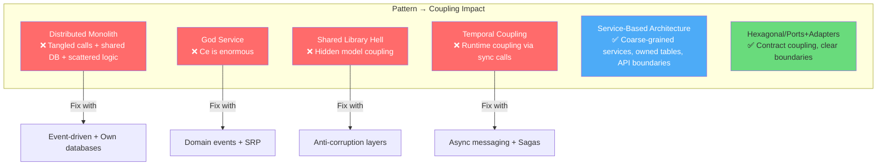

# Coupling in Practice: Real-World Patterns

[← Back to Main Guide](README.md) | [← Metrics & Refactoring](coupling-metrics-and-refactoring.md) | [Next: FRP & Coupling →](functional-reactive-coupling.md)

> This guide applies coupling concepts to real TypeScript, C#, and Java codebases
> and distributed architectures. Each scenario shows a **before** (problematic) and
> **after** (improved) design with coupling analysis.

---

## Scenario 1: The Distributed Monolith

A distributed monolith is the result of splitting a monolith into multiple services that are **heavily dependent on each other** without adopting the patterns needed for distributed systems. You lose the simplicity of a monolith but gain none of the benefits of independent microservices. The hallmarks: services call each other synchronously in tangled webs, most share the same database, business logic and domain knowledge are spread across service boundaries, and changes to one service routinely break or require redeployment of others.

### ELI5

> 🏘️ **Imagine five houses that share the same plumbing, electrical, and heating systems.**
>
> They look like separate houses (separate deployments), but if you flush a toilet in House A, the water pressure drops in House C. If House B's heater breaks, Houses D and E go cold too. Every renovation requires a plumber to visit all five houses because the pipes don't stop at the walls. You have five mortgages but none of the independence of actually living separately.

### Architecture — Before


```mermaid
flowchart TD
    subgraph services ["Five 'Microservices'"]
        OS[Order Service]
        PS[Payment Service]
        CS[Customer Service]
        IS[Inventory Service]
        SS[Shipping Service]
    end

    OS -->|"Sync HTTP"| PS
    OS -->|"Sync HTTP"| CS
    OS -->|"Sync HTTP"| IS
    PS -->|"Sync HTTP"| CS
    PS -->|"Sync HTTP"| OS
    SS -->|"Sync HTTP"| OS
    SS -->|"Sync HTTP"| IS
    IS -->|"Sync HTTP"| CS

    OS -->|"Read/Write"| DB[(Shared Database)]
    PS -->|"Read/Write"| DB
    CS -->|"Read/Write"| DB
    IS -->|"Read/Write"| DB
    SS -->|"Read/Write"| DB

    style DB fill:#ff6b6b,color:#fff
    style OS fill:#ffa8a8,color:#000
    style PS fill:#ffa8a8,color:#000
    style CS fill:#ffa8a8,color:#000
    style IS fill:#ffa8a8,color:#000
    style SS fill:#ffa8a8,color:#000
```

Every service knows about and directly calls several other services. That web of synchronous calls is the signature of a distributed monolith: the coupling topology of a monolith with the operational complexity of a distributed system.

**What makes this a distributed monolith, beyond the shared database:**

| Symptom                              | How it manifests                                                                                                           |
| ------------------------------------ | -------------------------------------------------------------------------------------------------------------------------- |
| **Tangled service-to-service calls** | Services call each other directly and synchronously in both directions, forming circular dependency chains                 |
| **Shared database**                  | All five services read from and write to the same tables — no data ownership boundaries                                    |
| **Scattered business logic**         | Order validation logic lives partly in Order Service, partly in Payment Service, and partly in Inventory Service           |
| **Coordinated deployments**          | A schema change or API change in Customer Service forces redeployment of all five services                                 |
| **Shared domain knowledge**          | Every service knows the internal structure of Customer, Order, and Payment models                                          |
| **Distributed transactions**         | Business operations span multiple services synchronously — if any one fails, manual rollback logic is scattered everywhere |

**Coupling Analysis:**
| Dimension | Value | Why |
|---|---|---|
| Integration Strength | 🔴 Intrusive | Services share database internals, read/write each other's tables, and depend on internal models |
| Distance | 🔴 High | Five separate deployable services with network boundaries |
| Volatility | 🔴 High | Core business domain: order, payment, customer, inventory, shipping |
| **Verdict** | ❌ | **Distributed Monolith.** Intrusive strength at high distance: `STRENGTH XOR DISTANCE` is false, and high volatility means it hurts often |

### TypeScript — Before: Tangled services with shared database

```typescript
// ❌ order-service/src/order.service.ts
import { Pool } from "pg";

export class OrderService {
  constructor(private db: Pool) {} // same database connection as every other service

  async createOrder(req: CreateOrderRequest): Promise<Order> {
    // ❌ Directly reads from CUSTOMER service's tables
    const customer = await this.db.query(
      `SELECT id, name, credit_limit, loyalty_tier, email
       FROM customers WHERE id = $1`,
      [req.customerId],
    );

    // ❌ Directly reads from INVENTORY service's tables
    const stock = await this.db.query(
      `SELECT available_qty, warehouse_id FROM inventory WHERE product_id = $1`,
      [req.productId],
    );

    // ❌ Business logic that belongs in Inventory Service
    if (stock.rows[0].available_qty < req.quantity) {
      throw new Error("Out of stock");
    }

    // ❌ Business logic that belongs in Customer/Payment Service
    if (customer.rows[0].credit_limit < req.total) {
      throw new Error("Credit limit exceeded");
    }

    // ❌ Synchronous call to Payment Service — if it's down, orders break
    const paymentResult = await fetch("http://payment-service:3002/charge", {
      method: "POST",
      headers: { "Content-Type": "application/json" },
      body: JSON.stringify({
        customerId: req.customerId,
        amount: req.total,
        // ❌ Passing internal payment details we shouldn't know about
        paymentMethod: customer.rows[0].payment_method_id,
      }),
    });
    if (!paymentResult.ok) throw new Error("Payment failed");

    // ❌ Writes directly to shared tables
    const result = await this.db.query(
      `INSERT INTO orders (customer_id, product_id, qty, total, status)
       VALUES ($1, $2, $3, $4, 'pending') RETURNING *`,
      [req.customerId, req.productId, req.quantity, req.total],
    );

    // ❌ Directly updates INVENTORY tables — not our data!
    await this.db.query(
      `UPDATE inventory SET available_qty = available_qty - $1 WHERE product_id = $2`,
      [req.quantity, req.productId],
    );

    // ❌ Synchronous call to Shipping — if it's down, the order is half-created
    await fetch("http://shipping-service:3004/shipments", {
      method: "POST",
      headers: { "Content-Type": "application/json" },
      body: JSON.stringify({
        orderId: result.rows[0].id,
        warehouseId: stock.rows[0].warehouse_id,
        address: customer.rows[0].shipping_address,
      }),
    });

    return result.rows[0];
  }
}

// ❌ payment-service/src/payment.service.ts
// Payment service ALSO reaches into other services' data and logic
export class PaymentService {
  constructor(private db: Pool) {}

  async chargeCustomer(req: ChargeRequest): Promise<PaymentResult> {
    // ❌ Reads customer data directly — duplicates customer service's logic
    const customer = await this.db.query(
      `SELECT credit_limit, loyalty_tier FROM customers WHERE id = $1`,
      [req.customerId],
    );

    // ❌ Discount logic that belongs in Order Service
    const discount = customer.rows[0].loyalty_tier === "gold" ? 0.1 : 0;
    const finalAmount = req.amount * (1 - discount);

    // ❌ Synchronous callback to Order Service to update status
    await fetch("http://order-service:3001/orders/" + req.orderId + "/status", {
      method: "PATCH",
      headers: { "Content-Type": "application/json" },
      body: JSON.stringify({ status: "payment_confirmed" }),
    });

    return { transactionId: "txn_123", amount: finalAmount };
  }
}
```

### Architecture — After


```mermaid
flowchart TD
    subgraph Order ["Order Service"]
        OS[Order Logic]
        ODB[(Order DB)]
        OS --> ODB
    end

    subgraph Payment ["Payment Service"]
        PS[Payment Logic]
        PDB[(Payment DB)]
        PS --> PDB
    end

    subgraph Customer ["Customer Service"]
        CSvc[Customer Logic]
        CDB[(Customer DB)]
        CSvc --> CDB
    end

    subgraph Inventory ["Inventory Service"]
        ISvc[Inventory Logic]
        IDB[(Inventory DB)]
        ISvc --> IDB
    end

    subgraph Shipping ["Shipping Service"]
        SS[Shipping Logic]
        SDB[(Shipping DB)]
        SS --> SDB
    end

    OS -->|"OrderPlaced event"| EB{{Event Bus}}
    EB -->|"OrderPlaced"| PS
    EB -->|"PaymentConfirmed"| ISvc
    EB -->|"InventoryReserved"| SS
    PS -->|"PaymentConfirmed event"| EB
    ISvc -->|"InventoryReserved event"| EB
    OS -.->|"HTTP: Check credit"| PS
    OS -.->|"HTTP: Get customer"| CSvc
```

> **Three C's lens:** The event flow is an **Anthology (AEC)** saga: asynchronous communication over the Event Bus, eventual consistency with no compensation, and choreographed coordination with no central orchestrator. The two dotted HTTP calls (customer lookup and credit check) are request-response reads made before the saga starts; they keep temporal coupling to those two services and nothing else. Observability needs distributed tracing. See [The Eight Saga Species](three-cs-distributed-transactions.md#the-eight-saga-species).

**Coupling Analysis After:**
| Dimension | Value | Why |
|---|---|---|
| Integration Strength | 🔵 Contract | Services share only event contracts and API contracts |
| Distance | 🔴 High | Still separate services |
| Volatility | 🔴 High | Still core domain; the redesign does not change how often it changes |
| **Verdict** | ✅ | **Loose Coupling.** Contract strength at high distance: the XOR holds |

### TypeScript — After: Event-driven with contracts

```typescript
// shared-contracts/src/events.ts — the ONLY shared package
export interface OrderPlacedEvent {
  type: "OrderPlaced";
  orderId: string;
  customerId: string;
  totalAmount: number;
  placedAt: string; // ISO 8601
}

export interface PaymentConfirmedEvent {
  type: "PaymentConfirmed";
  orderId: string;
  transactionId: string;
  confirmedAt: string;
}

export interface InventoryReservedEvent {
  type: "InventoryReserved";
  orderId: string;
  warehouseId: string;
  reservedAt: string;
}

// order-service/src/order.service.ts
import { OrderPlacedEvent } from "@myorg/shared-contracts";

export class OrderService {
  constructor(
    private orderRepo: OrderRepository, // own database — only order tables
    private eventBus: EventBus, // publish events
    private customerClient: CustomerClient, // contract-based API call
    private paymentClient: PaymentClient, // contract-based API call
  ) {}

  async createOrder(req: CreateOrderRequest): Promise<Order> {
    // ✅ Ask the customer service through its API (contract coupling)
    const customer = await this.customerClient.getCustomer(req.customerId);
    if (customer.status !== "active") {
      throw new Error("Customer is not active");
    }

    // ✅ Ask the payment service through its API (contract coupling)
    const creditCheck = await this.paymentClient.checkCredit(
      req.customerId,
      req.total,
    );
    if (!creditCheck.approved) {
      throw new Error("Credit check failed");
    }

    // ✅ Only writes to OUR tables
    const order = await this.orderRepo.save({
      customerId: req.customerId,
      productId: req.productId,
      quantity: req.quantity,
      total: req.total,
      status: "pending",
    });

    // ✅ Publish event — payment, inventory, shipping subscribe independently
    await this.eventBus.publish<OrderPlacedEvent>({
      type: "OrderPlaced",
      orderId: order.id,
      customerId: order.customerId,
      totalAmount: order.total,
      placedAt: new Date().toISOString(),
    });

    return order;
  }
}

// payment-service/src/handlers/order-placed.handler.ts
import {
  OrderPlacedEvent,
  PaymentConfirmedEvent,
} from "@myorg/shared-contracts";

export class OrderPlacedHandler {
  constructor(
    private paymentProcessor: PaymentProcessor,
    private eventBus: EventBus,
  ) {}

  async handle(event: OrderPlacedEvent): Promise<void> {
    // ✅ Payment logic stays in the payment service
    const result = await this.paymentProcessor.charge(
      event.customerId,
      event.totalAmount,
    );

    // ✅ Publish result — Order Service reacts to this event
    await this.eventBus.publish<PaymentConfirmedEvent>({
      type: "PaymentConfirmed",
      orderId: event.orderId,
      transactionId: result.transactionId,
      confirmedAt: new Date().toISOString(),
    });
  }
}

// inventory-service/src/handlers/payment-confirmed.handler.ts
import {
  PaymentConfirmedEvent,
  InventoryReservedEvent,
} from "@myorg/shared-contracts";

export class PaymentConfirmedHandler {
  constructor(
    private inventoryRepo: InventoryRepository, // own database — only inventory tables
    private eventBus: EventBus,
  ) {}

  async handle(event: PaymentConfirmedEvent): Promise<void> {
    // ✅ Inventory logic stays in the inventory service
    const reservation = await this.inventoryRepo.reserve(event.orderId);

    await this.eventBus.publish<InventoryReservedEvent>({
      type: "InventoryReserved",
      orderId: event.orderId,
      warehouseId: reservation.warehouseId,
      reservedAt: new Date().toISOString(),
    });
  }
}
```

**When a step fails.** If the payment service cannot charge the customer, it publishes a `PaymentFailed` event and the order service marks the order failed. Nothing else has happened yet, so there is nothing to compensate. If inventory fails _after_ payment, an Anthology saga has no rollback: the order is marked failed and the refund is a separate business process. That is the eventual-consistency tradeoff. When you need the refund to be part of the same transaction, you need a compensation step, which is the [Fantasy (AAO)](three-cs-distributed-transactions.md#the-eight-saga-species) saga that [durable execution](durable-execution-orchestration.md#the-saga-pattern-before-and-after-temporal) makes tractable.

---

## Scenario 2: The God Service (Monolith)

A single class or service that knows about everything.

### ELI5

> 🐙 **Imagine an octopus answering phones at a call center.**
>
> One octopus handles sales, support, billing, HR, and janitorial requests. Each arm is busy doing a different thing. Every call could involve any department. If the octopus gets sick, the entire company shuts down.

### C# — Before: The God Service

```csharp
// ❌ One service that does EVERYTHING
public class CustomerManagementService
{
    private readonly DbContext _db;
    private readonly IEmailSender _email;
    private readonly IPaymentProcessor _payments;
    private readonly IShippingProvider _shipping;
    private readonly IAnalyticsTracker _analytics;
    private readonly IInventorySystem _inventory;
    private readonly ITaxCalculator _tax;
    private readonly INotificationHub _notifications;

    // Ce = 8 — depends on EVERYTHING
    // Ca = probably high too — everything depends on this

    public async Task<OrderResult> ProcessOrder(OrderRequest request)
    {
        // Validates customer
        var customer = await _db.Customers.FindAsync(request.CustomerId);
        if (customer == null) throw new Exception("Customer not found");

        // Checks inventory
        var stock = await _inventory.CheckAvailability(request.ProductId, request.Quantity);
        if (!stock.Available) throw new Exception("Out of stock");

        // Calculates tax
        var tax = await _tax.Calculate(request.Total, customer.State);

        // Processes payment
        var payment = await _payments.Charge(customer.PaymentMethod, request.Total + tax);

        // Creates order
        var order = new Order { /* ... */ };
        _db.Orders.Add(order);
        await _db.SaveChangesAsync();

        // Reserves inventory
        await _inventory.Reserve(request.ProductId, request.Quantity);

        // Sends confirmation email
        await _email.Send(customer.Email, "Order Confirmed", $"Order {order.Id}");

        // Creates shipment
        await _shipping.CreateShipment(order.Id, customer.Address);

        // Tracks analytics
        await _analytics.Track("OrderPlaced", new { order.Id, order.Total });

        // Sends push notification
        await _notifications.Send(customer.Id, "Your order is confirmed!");

        return new OrderResult(order.Id);
    }
}
```

**Coupling Analysis:**

- Ce = 8 (depends on 8 external concerns)
- Ca = high (many parts of the app call this service)
- Instability cannot be computed without a Ca count, but Ce = 8 alone means this class changes whenever any of eight dependencies does

### C# — After: Separated by domain concern

```csharp
// ✅ Each step is its own focused handler
// Coordinated via domain events: choreography. The publisher does not know
// who handles OrderSubmitted; each handler reacts on its own.

// Domain Events (MediatR notifications must implement INotification)
public record OrderSubmitted(
    string OrderId, string CustomerId, string ProductId, int Quantity,
    decimal Total, string State) : INotification;
public record PaymentProcessed(string OrderId, string TransactionId) : INotification;
public record InventoryReserved(string OrderId, string ProductId, int Quantity) : INotification;

// Publisher: owns the order and the credit check, nothing else
public class OrderService
{
    private readonly IOrderRepository _orders;
    private readonly ICreditChecker _creditChecker;
    private readonly IMediator _mediator;

    public async Task<OrderResult> SubmitOrder(OrderRequest request)
    {
        var creditOk = await _creditChecker.Check(request.CustomerId, request.Total);
        if (!creditOk) throw new InsufficientCreditException();

        var order = Order.Create(request);
        await _orders.Save(order);

        // Publish event — other services react independently
        // ✅ Named arguments weaken connascence of position → connascence of name
        await _mediator.Publish(new OrderSubmitted(
            OrderId: order.Id,
            CustomerId: request.CustomerId,
            ProductId: request.ProductId,
            Quantity: request.Quantity,
            Total: request.Total,
            State: request.State
        ));

        return new OrderResult(order.Id);
    }
}

// Each handler is focused and independently testable
public class TaxHandler : INotificationHandler<OrderSubmitted>
{
    private readonly ITaxCalculator _tax;
    public async Task Handle(OrderSubmitted evt, CancellationToken ct)
    {
        await _tax.RecordTax(evt.OrderId, evt.Total, evt.State);
    }
}

public class PaymentHandler : INotificationHandler<OrderSubmitted>
{
    private readonly IPaymentProcessor _payments;
    private readonly IMediator _mediator;
    public async Task Handle(OrderSubmitted evt, CancellationToken ct)
    {
        var txn = await _payments.Charge(evt.CustomerId, evt.Total);
        await _mediator.Publish(new PaymentProcessed(evt.OrderId, txn.Id), ct);
    }
}

public class InventoryHandler : INotificationHandler<OrderSubmitted>
{
    private readonly IInventoryService _inventory;
    private readonly IMediator _mediator;
    public async Task Handle(OrderSubmitted evt, CancellationToken ct)
    {
        await _inventory.Reserve(evt.ProductId, evt.Quantity, evt.OrderId);
        await _mediator.Publish(
            new InventoryReserved(evt.OrderId, evt.ProductId, evt.Quantity), ct);
    }
}

public class ShippingHandler : INotificationHandler<InventoryReserved>
{
    private readonly IShippingProvider _shipping;
    public async Task Handle(InventoryReserved evt, CancellationToken ct)
    {
        await _shipping.CreateShipment(evt.OrderId);
    }
}

public class NotificationHandler : INotificationHandler<OrderSubmitted>
{
    private readonly IEmailSender _email;
    private readonly INotificationHub _push;
    public async Task Handle(OrderSubmitted evt, CancellationToken ct)
    {
        await _email.SendOrderConfirmation(evt.CustomerId, evt.OrderId);
        await _push.Send(evt.CustomerId, "Your order is confirmed!");
    }
}

public class AnalyticsHandler : INotificationHandler<OrderSubmitted>
{
    private readonly IAnalyticsTracker _analytics;
    public async Task Handle(OrderSubmitted evt, CancellationToken ct)
    {
        await _analytics.Track("OrderPlaced", new { evt.OrderId, evt.Total });
    }
}
```


```mermaid
flowchart TD
    OS[OrderService<br/>Ce=3, Ca=high]

    OS -->|"OrderSubmitted"| TH[TaxHandler<br/>Ce=1]
    OS -->|"OrderSubmitted"| PH[PaymentHandler<br/>Ce=2]
    OS -->|"OrderSubmitted"| IH[InventoryHandler<br/>Ce=2]
    OS -->|"OrderSubmitted"| NH[NotificationHandler<br/>Ce=2]
    OS -->|"OrderSubmitted"| AH[AnalyticsHandler<br/>Ce=1]
    IH -->|"InventoryReserved"| SH[ShippingHandler<br/>Ce=1]

    style OS fill:#4dabf7,color:#fff
```

The god service's Ce of 8 is now spread across seven classes, none above 3. The arrows are event subscriptions, not references: `OrderService` depends on `IMediator` and the event type, never on the handlers. In coupling terms the handlers are Contract-coupled to the event shape at low distance (same process). The balance formula calls low strength at low distance "low cohesion"; that is a fair warning here. If the handlers never move to separate deployables, the events are indirection you pay for in traceability, and a direct call from a smaller `OrderService` would do.

---

## Scenario 3: Shared Library Hell

Sharing a library across services turns Model coupling into a deployment dependency.

### ELI5

> 📚 **Imagine a shared textbook that three classes use.**
>
> When the textbook gets a new edition, ALL three classes must switch at the same time, even if only one class needed the update. The other two classes are forced to update even though nothing relevant changed for them.

### Java — Before: Shared domain library

```java
// ❌ shared-models library — used by Order, Payment, and Shipping services
// Any change here forces every consumer to rebuild. Versioning the library
// defers the upgrade; it does not remove it.

package com.example.shared.models;

public record Customer(
    String id,
    String name,
    String email,
    Address billingAddress,
    Address shippingAddress,
    String creditCardToken,      // Payment needs this
    String loyaltyTier,          // Order needs this
    double totalOrdersWeight,    // Shipping needs this
    List<String> preferences,    // Marketing needs this
    CreditScore creditScore      // Payment needs this
) {}

// Order Service uses Customer but only needs: id, name, loyaltyTier
// Payment Service uses Customer but only needs: id, creditCardToken, creditScore
// Shipping Service uses Customer but only needs: id, shippingAddress, totalOrdersWeight
// Adding a field for ONE service forces ALL services to recompile and redeploy
```

### Java — After: Tailored models per service

```java
// ✅ Each service defines its own model of what it needs

// --- Order Service ---
package com.example.order.models;

public record OrderCustomer(
    String customerId,
    String name,
    String loyaltyTier
) {}

// Anti-corruption layer translates from the API response
public class CustomerAdapter {
    private final CustomerApiClient client;

    public OrderCustomer getCustomer(String customerId) {
        var response = client.getCustomer(customerId);  // generic API call
        return new OrderCustomer(
            response.id(),
            response.name(),
            response.loyaltyTier()
        );
    }
}

// --- Payment Service ---
package com.example.payment.models;

public record PaymentCustomer(
    String customerId,
    String creditCardToken,
    CreditScore creditScore
) {}

// --- Shipping Service ---
package com.example.shipping.models;

public record ShippingCustomer(
    String customerId,
    Address shippingAddress,
    double estimatedWeight
) {}
```


```mermaid
flowchart LR
    subgraph before ["❌ Before: Shared Model"]
        SM[Shared Customer<br/>Model Library]
        O1[Order Service] --> SM
        P1[Payment Service] --> SM
        S1[Shipping Service] --> SM
    end

    subgraph after ["✅ After: Tailored Models"]
        CA[Customer API]
        O2[Order Service<br/>OrderCustomer] -.->|"API call"| CA
        P2[Payment Service<br/>PaymentCustomer] -.->|"API call"| CA
        S2[Shipping Service<br/>ShippingCustomer] -.->|"API call"| CA
    end

    style SM fill:#ff6b6b,color:#fff
    style CA fill:#69db7c,color:#333
```

The transition is from **Model** to **Contract** coupling. Before, three services depended on one `Customer` type, so a field added for marketing recompiled shipping. After, each service depends on the Customer API's contract and maps it into a model of its own. The distance is unchanged; the strength dropped one level, and that is what makes the XOR hold.

**Coupling Analysis:**

| Dimension            | Before                                                   | After                                                     |
| -------------------- | -------------------------------------------------------- | --------------------------------------------------------- |
| Integration Strength | 🟢 Model — one shared `Customer` record                  | 🔵 Contract — each service knows only the Customer API    |
| Distance             | 🔴 High — separately deployed services                   | 🔴 High — unchanged                                       |
| Volatility           | 🔴 High — the customer model is core and grows a field per new need | 🔴 High — unchanged                            |
| **Verdict**          | ❌ Model strength at high distance                       | ✅ Contract strength at high distance                     |

---

## Scenario 4: Temporal Coupling in Synchronous Calls

When services call each other synchronously, they create [temporal coupling](coupling-dimensions.md#runtime-temporal-and-lifecycle-coupling): both must be running at the same time. The "Before" example below is an **Epic (SAO)** saga, the most tightly coupled of the [Eight Saga Species](three-cs-distributed-transactions.md#the-eight-saga-species). The "After" is a **Parallel (AEO)** saga: asynchronous events, eventual consistency, and an order saga that decides each next step. See [The Three C's of Distributed Transactions](three-cs-distributed-transactions.md) for the framework.

### ELI5

> ☎️ **Phone call vs. text message.**
>
> - **Synchronous** = a phone call. Both people must be available at the exact same time. If one is in a meeting, the other waits.
> - **Asynchronous** = a text message. You send it when you're ready. They respond when they're ready. Neither blocks the other.

### TypeScript — Before: Synchronous chain

```typescript
// ❌ Order → Payment → Inventory → Shipping (all synchronous)
// If ANY service is down, the ENTIRE chain fails

class OrderService {
  async createOrder(req: CreateOrderRequest): Promise<Order> {
    // Step 1: Check payment (blocks)
    const paymentResult = await fetch("http://payment-service/charge", {
      method: "POST",
      headers: { "Content-Type": "application/json" },
      body: JSON.stringify({ amount: req.total, customerId: req.customerId }),
    });
    if (!paymentResult.ok) throw new Error("Payment failed");

    // Step 2: Reserve inventory (blocks)
    const inventoryResult = await fetch("http://inventory-service/reserve", {
      method: "POST",
      headers: { "Content-Type": "application/json" },
      body: JSON.stringify({ productId: req.productId, qty: req.quantity }),
    });
    if (!inventoryResult.ok) {
      // Have to roll back payment!
      await fetch("http://payment-service/refund", {
        /* ... */
      });
      throw new Error("Out of stock");
    }

    // Step 3: Create shipment (blocks)
    const shipResult = await fetch("http://shipping-service/ship", {
      method: "POST",
      headers: { "Content-Type": "application/json" },
      body: JSON.stringify({ orderId: "new", address: req.address }),
    });
    // If this fails, inventory AND payment need rolling back, and the
    // rollback calls can fail too.

    return { id: "new", status: "confirmed" };
  }
}
```

### TypeScript — After: Saga pattern with async events

```typescript
// ✅ Each step communicates via events
// Services don't need to be online at the same time

// The saga orchestrator manages the workflow
class OrderSaga {
  constructor(
    private eventBus: EventBus,
    private orderRepo: OrderRepository,
  ) {}

  async start(req: CreateOrderRequest): Promise<string> {
    const orderId = crypto.randomUUID();

    // Save order in "pending" state
    await this.orderRepo.save({
      id: orderId,
      status: "pending_payment",
      ...req,
    });

    // Emit event — payment service will pick it up when ready
    await this.eventBus.publish({
      type: "OrderCreated",
      orderId,
      customerId: req.customerId,
      total: req.total,
    });

    return orderId; // Return immediately — don't wait!
  }

  // React to payment result
  async onPaymentProcessed(event: PaymentProcessedEvent): Promise<void> {
    await this.orderRepo.updateStatus(event.orderId, "pending_inventory");
    await this.eventBus.publish({
      type: "PaymentConfirmed",
      orderId: event.orderId,
      transactionId: event.transactionId,
    });
  }

  // React to payment failure
  async onPaymentFailed(event: PaymentFailedEvent): Promise<void> {
    await this.orderRepo.updateStatus(event.orderId, "payment_failed");
    // No rollback needed: nothing else happened yet
  }

  // React to inventory reserved
  async onInventoryReserved(event: InventoryReservedEvent): Promise<void> {
    await this.orderRepo.updateStatus(event.orderId, "confirmed");
    await this.eventBus.publish({
      type: "OrderConfirmed",
      orderId: event.orderId,
    });
  }

  // React to inventory failure. Payment already happened, and this saga has
  // no compensation step (eventual consistency), so the refund is a separate
  // business process triggered by the status change.
  async onInventoryFailed(event: InventoryFailedEvent): Promise<void> {
    await this.orderRepo.updateStatus(event.orderId, "failed_after_payment");
  }
}
```

The saga answers the "Before" example's question honestly rather than by adding rollback code. If inventory fails after payment, the order carries a status that says so and a refund is issued by a separate process. If that is unacceptable, you need a compensation step, which is the Fantasy (AAO) species. The [durable execution guide](durable-execution-orchestration.md#the-saga-pattern-before-and-after-temporal) shows what that costs to hand-roll and what a platform removes.


```mermaid
sequenceDiagram
    participant Client
    participant OrderSvc as Order Service
    participant Bus as Event Bus
    participant PaySvc as Payment Service
    participant InvSvc as Inventory Service
    participant ShipSvc as Shipping Service

    Client->>OrderSvc: Create Order
    OrderSvc->>OrderSvc: Save (pending)
    OrderSvc-->>Client: 202 Accepted (orderId)
    OrderSvc->>Bus: OrderCreated

    Bus->>PaySvc: OrderCreated
    PaySvc->>PaySvc: Process payment
    PaySvc->>Bus: PaymentProcessed

    Bus->>OrderSvc: PaymentProcessed
    OrderSvc->>OrderSvc: pending_inventory
    OrderSvc->>Bus: PaymentConfirmed

    Bus->>InvSvc: PaymentConfirmed
    InvSvc->>InvSvc: Reserve stock
    InvSvc->>Bus: InventoryReserved

    Bus->>OrderSvc: InventoryReserved
    OrderSvc->>OrderSvc: confirmed
    OrderSvc->>Bus: OrderConfirmed

    Bus->>ShipSvc: OrderConfirmed
    ShipSvc->>ShipSvc: Create shipment
```

The order service decides every next step, which is what makes this orchestrated rather than choreographed: payment and inventory react only to events the saga publishes, never to each other.

**Coupling Analysis:**

| Dimension            | Before (Epic)                                              | After (Parallel)                                                  |
| -------------------- | ---------------------------------------------------------- | ----------------------------------------------------------------- |
| Integration Strength | 🔵 Contract — HTTP request and response shapes             | 🔵 Contract — event shapes                                        |
| Distance             | 🔴 High — separately deployed services                     | 🔴 High — unchanged                                               |
| Volatility           | 🔴 High — core order flow                                  | 🔴 High — unchanged                                               |
| Temporal coupling    | 🔴 Every service must be up for any order to complete      | 🟢 None. A down service delays its step; it does not fail the order |
| **Verdict**          | ✅ by the formula, yet fragile: the XOR holds, and the failure is availability, which the three dimensions do not measure | ✅ The same strength and distance, with the availability dependency removed |

The Before column is the reason the [dimensions doc](coupling-dimensions.md#runtime-temporal-and-lifecycle-coupling) lists temporal coupling separately. A synchronous chain of clean contracts is loosely coupled by the formula and still goes down as one unit.

---

## Scenario 5: Service-Based Architecture

A pragmatic middle ground between monolith and microservices. Mark Richards describes this as extracting a handful of **coarse-grained domain services** that share a database (or a small number of databases), with each service owning its domain logic and its own tables. See [brownfield-strategies.md: Service-Based Architecture](brownfield-strategies.md#service-based-architecture) for migration strategies.

### ELI5

> 🏢 **Imagine a company in one office building.**
>
> A monolith is everyone in one giant open-plan room: accounting, engineering, sales, support, all shouting over each other. Microservices is giving every person their own building in different cities. **Service-based architecture** puts each department on its own floor. They have their own space (separate deployments), share the building (shared database), and take the elevator when they need to talk (internal API calls). Nobody reaches into another department's filing cabinets.

### Architecture


```mermaid
flowchart TD
    GW[API Gateway]

    GW --> OS[Order Service]
    GW --> CS[Customer Service]
    GW --> IS[Inventory Service]
    GW --> PS[Payment Service]
    GW --> RS[Reporting Service]

    OS --> DB[(Shared Database)]
    CS --> DB
    IS --> DB
    PS --> DB
    RS --> DB

    OS -.->|"Internal API"| CS
    OS -.->|"Internal API"| IS
    OS -.->|"Internal API"| PS

    style OS fill:#4dabf7,color:#fff
    style CS fill:#4dabf7,color:#fff
    style IS fill:#4dabf7,color:#fff
    style PS fill:#4dabf7,color:#fff
    style RS fill:#4dabf7,color:#fff
    style DB fill:#ffd43b,color:#000
```

**How this differs from a distributed monolith:**

|                      | Distributed Monolith (Scenario 1)                     | Service-Based Architecture                                               |
| -------------------- | ----------------------------------------------------- | ------------------------------------------------------------------------ |
| **Database**         | All services read/write all tables                    | Each service owns its tables; cross-service access goes through APIs     |
| **Service calls**    | Tangled web of synchronous calls in every direction   | Controlled, one-directional API calls between service boundaries         |
| **Business logic**   | Scattered across multiple services                    | Each service owns all logic for its domain                               |
| **Deployability**    | Change one service → redeploy many                    | Each service deploys independently (schema changes require coordination) |
| **Domain knowledge** | Every service knows internal models of other services | Services know only the API contracts of other services                   |

### Coupling Analysis

| Dimension            | Value       | Why                                                                                                                                          |
| -------------------- | ----------- | -------------------------------------------------------------------------------------------------------------------------------------------- |
| Integration Strength | 🔵 Contract | Services reach each other only through APIs. The shared database instance is not shared knowledge as long as each service owns its tables      |
| Distance             | 🔴 High     | Separate deployables. The shared database raises lifecycle coupling: schema migrations and some deployments are coordinated                  |
| Volatility           | 🔴 High     | Core domains                                                                                                                                 |
| **Verdict**          | ✅          | Contract strength at high distance. The shared database is a lifecycle cost, not a strength cost. It becomes ❌ Intrusive the moment one service reads another's tables |

### TypeScript — Service-Based Architecture

```typescript
// order-service/src/order.service.ts
// Coarse-grained domain service — owns order logic and ORDER tables only

export class OrderService {
  constructor(
    private orderRepo: OrderRepository, // own tables in shared DB
    private customerApi: CustomerServiceClient, // internal HTTP call
    private inventoryApi: InventoryServiceClient,
    private paymentApi: PaymentServiceClient,
  ) {}

  async placeOrder(request: PlaceOrderRequest): Promise<Order> {
    // ✅ Service boundary — call customer service's API, not its tables
    const customer = await this.customerApi.getCustomer(request.customerId);
    if (customer.status !== "active") {
      throw new Error(`Customer ${request.customerId} is not active`);
    }

    // ✅ Service boundary — call inventory service's API
    const available = await this.inventoryApi.checkAvailability(
      request.productId,
      request.quantity,
    );
    if (!available) {
      throw new Error(
        `Insufficient inventory for product ${request.productId}`,
      );
    }

    // ✅ Service boundary — call payment service's API
    const creditCheck = await this.paymentApi.checkCredit(
      request.customerId,
      request.quantity * request.unitPrice,
    );
    if (!creditCheck.approved) {
      throw new Error("Credit check failed");
    }

    // ✅ Own domain logic stays local — only writes to ORDER tables
    const order = await this.orderRepo.create({
      customerId: request.customerId,
      productId: request.productId,
      quantity: request.quantity,
      total: request.quantity * request.unitPrice,
      status: "confirmed",
    });

    // ✅ Reserve inventory via API (not by writing to inventory tables)
    await this.inventoryApi.reserve(
      request.productId,
      request.quantity,
      order.id,
    );

    return order;
  }
}
```

### C# — Service-Based Architecture

```csharp
// OrderService/OrderDomainService.cs
namespace OrderService;

public class OrderDomainService(
    IOrderRepository orderRepo,         // own tables in shared DB
    ICustomerServiceClient customerApi,
    IInventoryServiceClient inventoryApi,
    IPaymentServiceClient paymentApi)
{
    public async Task<Order> PlaceOrderAsync(PlaceOrderRequest request)
    {
        // ✅ Service boundary — call customer service's API, not its tables
        var customer = await customerApi.GetCustomerAsync(request.CustomerId);
        if (customer.Status != CustomerStatus.Active)
            throw new InvalidOperationException($"Customer {request.CustomerId} is not active");

        // ✅ Service boundary — call inventory service's API
        var available = await inventoryApi.CheckAvailabilityAsync(
            request.ProductId, request.Quantity);
        if (!available)
            throw new InvalidOperationException($"Insufficient inventory for {request.ProductId}");

        // ✅ Service boundary — call payment service's API
        var creditCheck = await paymentApi.CheckCreditAsync(
            request.CustomerId, request.Quantity * request.UnitPrice);
        if (!creditCheck.Approved)
            throw new InvalidOperationException("Credit check failed");

        // ✅ Own domain logic — only writes to ORDER tables
        var order = await orderRepo.CreateAsync(new Order
        {
            CustomerId = request.CustomerId,
            ProductId = request.ProductId,
            Quantity = request.Quantity,
            Total = request.Quantity * request.UnitPrice,
            Status = OrderStatus.Confirmed,
        });  // ✅ Object initializer → connascence of name, not position

        // ✅ Reserve inventory via API
        await inventoryApi.ReserveAsync(request.ProductId, request.Quantity, order.Id);

        return order;
    }
}
```

### Java — Service-Based Architecture

```java
// order-service/src/main/java/com/example/order/OrderDomainService.java
package com.example.order;

public class OrderDomainService {

    private final OrderRepository orderRepo;          // own tables in shared DB
    private final CustomerServiceClient customerApi;
    private final InventoryServiceClient inventoryApi;
    private final PaymentServiceClient paymentApi;

    public OrderDomainService(
            OrderRepository orderRepo,
            CustomerServiceClient customerApi,
            InventoryServiceClient inventoryApi,
            PaymentServiceClient paymentApi) {
        this.orderRepo = orderRepo;
        this.customerApi = customerApi;
        this.inventoryApi = inventoryApi;
        this.paymentApi = paymentApi;
    }

    public Order placeOrder(PlaceOrderRequest request) {
        // ✅ Service boundary — call customer service's API, not its tables
        var customer = customerApi.getCustomer(request.customerId());
        if (customer.status() != CustomerStatus.ACTIVE) {
            throw new IllegalStateException(
                "Customer %s is not active".formatted(request.customerId()));
        }

        // ✅ Service boundary — call inventory service's API
        boolean available = inventoryApi.checkAvailability(
            request.productId(), request.quantity());
        if (!available) {
            throw new IllegalStateException(
                "Insufficient inventory for %s".formatted(request.productId()));
        }

        // ✅ Service boundary — call payment service's API
        var creditCheck = paymentApi.checkCredit(
            request.customerId(), request.quantity() * request.unitPrice());
        if (!creditCheck.approved()) {
            throw new IllegalStateException("Credit check failed");
        }

        // ✅ Own domain logic — only writes to ORDER tables
        // ⚠️ Connascence of position: Java records require positional construction.
        //    A Builder or static factory with named params would weaken this
        //    to connascence of name (see Hexagonal Architecture → Order.create).
        var order = orderRepo.create(new Order(
            request.customerId(),
            request.productId(),
            request.quantity(),
            request.quantity() * request.unitPrice(),
            OrderStatus.CONFIRMED
        ));

        // ✅ Reserve inventory via API
        inventoryApi.reserve(request.productId(), request.quantity(), order.id());

        return order;
    }
}
```

### When to Choose Service-Based Architecture

| ✅ Good Fit                                                        | ❌ Poor Fit                                                     |
| ------------------------------------------------------------------ | --------------------------------------------------------------- |
| A few teams that can coordinate schema changes                     | Many teams that need fully independent deployment cadences      |
| Limited DevOps maturity or infrastructure budget                   | Mature platform team with full observability and service mesh   |
| You need faster deploys but can't afford per-service databases yet | You need elastic scaling of individual features                 |
| Your monolith has identifiable domain boundaries                   | Your system has no domain cohesion: a big ball of mud           |
| Evolutionary stepping stone → microservices if needed              | Greenfield with clear bounded contexts and strong platform team |

---

## Scenario 6: Hexagonal Architecture (Ports & Adapters)

The standard way to manage coupling inside a single service or module.


```mermaid
flowchart TD
    subgraph Adapters ["Adapters (Infrastructure)"]
        HA[HTTP API<br/>Controller]
        DB[Database<br/>Repository]
        MQ[Message Queue<br/>Publisher]
        EXT[External API<br/>Client]
    end

    subgraph Ports ["Ports (Interfaces)"]
        IP[Inbound Ports<br/>Use Cases]
        OP[Outbound Ports<br/>Repositories, Gateways]
    end

    subgraph Core ["Domain Core"]
        E[Entities]
        VS[Value Objects]
        DS[Domain Services]
        DE[Domain Events]
    end

    HA -->|calls| IP
    IP -->|uses| Core
    Core -->|defines| OP
    OP -.->|implemented by| DB
    OP -.->|implemented by| MQ
    OP -.->|implemented by| EXT
```

### TypeScript — Hexagonal Architecture

```typescript
// ======= DOMAIN CORE (no external dependencies) =======

// domain/entities/order.ts
export class Order {
  private constructor(
    public readonly id: string,
    public readonly customerId: string,
    private items: OrderItem[],
    private _status: OrderStatus,
  ) {}

  static create(customerId: string, items: OrderItem[]): Order {
    if (items.length === 0) throw new DomainError("Order must have items");
    return new Order(crypto.randomUUID(), customerId, items, "draft");
  }

  // For repositories: rebuild an existing order without re-running creation rules
  static rehydrate(
    id: string,
    customerId: string,
    items: OrderItem[],
    status: OrderStatus,
  ): Order {
    return new Order(id, customerId, items, status);
  }

  get total(): number {
    return this.items.reduce((sum, i) => sum + i.price * i.quantity, 0);
  }

  confirm(): void {
    if (this._status !== "draft")
      throw new DomainError("Can only confirm draft orders");
    this._status = "confirmed";
  }

  get status(): OrderStatus {
    return this._status;
  }
}

// domain/ports/outbound.ts — Domain defines what it needs
export interface OrderRepository {
  save(order: Order): Promise<void>;
  findById(id: string): Promise<Order | null>;
}

export interface PaymentResult {
  success: boolean;
  transactionId?: string;
  reason?: string;
}

export interface PaymentGateway {
  charge(customerId: string, amount: number): Promise<PaymentResult>;
}

export interface EventPublisher {
  publish(event: DomainEvent): Promise<void>;
}

// domain/ports/inbound.ts — Use cases
export interface CreateOrderUseCase {
  execute(cmd: CreateOrderCommand): Promise<string>;
}

// ======= APPLICATION (orchestration) =======

// application/create-order.ts
import { CreateOrderUseCase } from "../domain/ports/inbound";
import {
  OrderRepository,
  PaymentGateway,
  EventPublisher,
} from "../domain/ports/outbound";
import { Order } from "../domain/entities/order";

export class CreateOrderHandler implements CreateOrderUseCase {
  constructor(
    private orders: OrderRepository, // injected
    private payments: PaymentGateway, // injected
    private events: EventPublisher, // injected
  ) {}

  async execute(cmd: CreateOrderCommand): Promise<string> {
    const order = Order.create(cmd.customerId, cmd.items);

    const payment = await this.payments.charge(cmd.customerId, order.total);
    if (!payment.success) throw new PaymentFailedError(payment.reason);

    order.confirm();
    await this.orders.save(order);

    await this.events.publish({
      type: "OrderConfirmed",
      orderId: order.id,
      total: order.total,
    });

    return order.id;
  }
}

// ======= ADAPTERS (infrastructure) =======

// adapters/postgres-order-repository.ts
import { OrderRepository } from "../domain/ports/outbound";
import { Order } from "../domain/entities/order";
import { Pool } from "pg";

type OrderRow = {
  id: string;
  customer_id: string;
  status: OrderStatus;
  items?: OrderItem[];
};

export class PostgresOrderRepository implements OrderRepository {
  constructor(private pool: Pool) {}

  async save(order: Order): Promise<void> {
    await this.pool.query(
      "INSERT INTO orders (id, customer_id, total, status) VALUES ($1, $2, $3, $4)",
      [order.id, order.customerId, order.total, order.status],
    );
  }

  async findById(id: string): Promise<Order | null> {
    const result = await this.pool.query("SELECT * FROM orders WHERE id = $1", [
      id,
    ]);
    return result.rows[0] ? this.toDomain(result.rows[0]) : null;
  }

  private toDomain(row: OrderRow): Order {
    // items come from an order_items join in a real mapper
    return Order.rehydrate(row.id, row.customer_id, row.items ?? [], row.status);
  }
}

// adapters/stripe-payment-gateway.ts
import Stripe from "stripe";
import { PaymentGateway, PaymentResult } from "../domain/ports/outbound";

export class StripePaymentGateway implements PaymentGateway {
  constructor(private stripe: Stripe) {}

  async charge(customerId: string, amount: number): Promise<PaymentResult> {
    // Stripe-specific implementation hidden here. Without confirm the intent
    // stays in requires_payment_method; confirm + off_session charges the
    // customer's saved payment method in one call.
    const intent = await this.stripe.paymentIntents.create({
      amount: Math.round(amount * 100),
      currency: "usd",
      customer: customerId,
      confirm: true,
      off_session: true,
    });
    return {
      success: intent.status === "succeeded",
      transactionId: intent.id,
      reason: intent.last_payment_error?.message,
    };
  }
}

// adapters/http/order-controller.ts
import { CreateOrderUseCase } from "../../domain/ports/inbound";
import express from "express";

export function orderRoutes(createOrder: CreateOrderUseCase): express.Router {
  const router = express.Router();

  router.post("/orders", async (req, res) => {
    try {
      const orderId = await createOrder.execute(req.body);
      res.status(201).json({ orderId });
    } catch (err) {
      res.status(400).json({ error: (err as Error).message });
    }
  });

  return router;
}
```

### C# — Hexagonal Architecture

```csharp
// ======= DOMAIN CORE =======
namespace Domain.Entities;

public class Order
{
    public string Id { get; private set; }
    public string CustomerId { get; private set; }
    public List<OrderItem> Items { get; private set; }
    public OrderStatus Status { get; private set; }
    public decimal Total => Items.Sum(i => i.Price * i.Quantity);

    public static Order Create(string customerId, List<OrderItem> items)
    {
        if (!items.Any()) throw new DomainException("Order must have items");
        return new Order
        {
            Id = Guid.NewGuid().ToString(),
            CustomerId = customerId,
            Items = items,
            Status = OrderStatus.Draft
        };
    }

    public void Confirm()
    {
        if (Status != OrderStatus.Draft)
            throw new DomainException("Can only confirm draft orders");
        Status = OrderStatus.Confirmed;
    }
}

// Domain defines its ports
namespace Domain.Ports;

public interface IOrderRepository
{
    Task Save(Order order);
    Task<Order?> FindById(string id);
}

public record PaymentResult(bool Success, string? TransactionId, string? Reason = null);

public interface IPaymentGateway
{
    Task<PaymentResult> Charge(string customerId, decimal amount);
}

public interface IEventPublisher
{
    Task Publish<T>(T domainEvent) where T : IDomainEvent;
}

// ======= APPLICATION =======
namespace Application.UseCases;

public class CreateOrderHandler
{
    private readonly IOrderRepository _orders;
    private readonly IPaymentGateway _payments;
    private readonly IEventPublisher _events;

    public CreateOrderHandler(
        IOrderRepository orders,
        IPaymentGateway payments,
        IEventPublisher events)
    {
        _orders = orders;
        _payments = payments;
        _events = events;
    }

    public async Task<string> Handle(CreateOrderCommand cmd)
    {
        var order = Order.Create(cmd.CustomerId, cmd.Items);

        var payment = await _payments.Charge(cmd.CustomerId, order.Total);
        if (!payment.Success) throw new PaymentFailedException(payment.Reason);

        order.Confirm();
        await _orders.Save(order);
        // ✅ Named arguments weaken connascence of position → connascence of name
        await _events.Publish(new OrderConfirmedEvent(
            OrderId: order.Id,
            Total: order.Total
        ));

        return order.Id;
    }
}

// ======= ADAPTERS =======
namespace Infrastructure.Persistence;

public class EfOrderRepository : IOrderRepository
{
    private readonly AppDbContext _db;
    public EfOrderRepository(AppDbContext db) => _db = db;

    public async Task Save(Order order)
    {
        _db.Orders.Add(order);
        await _db.SaveChangesAsync();
    }

    public async Task<Order?> FindById(string id)
        => await _db.Orders.Include(o => o.Items).FirstOrDefaultAsync(o => o.Id == id);
}

namespace Infrastructure.Payments;

public class StripeGateway : IPaymentGateway
{
    public async Task<PaymentResult> Charge(string customerId, decimal amount)
    {
        // Stripe-specific code hidden behind the port
        var service = new PaymentIntentService();
        var intent = await service.CreateAsync(new PaymentIntentCreateOptions
        {
            Amount = (long)(amount * 100),
            Currency = "usd",
            Customer = customerId,
            Confirm = true,       // otherwise the intent waits for a payment method
            OffSession = true,
        });
        return new PaymentResult(
            intent.Status == "succeeded",  // ⚠️ connascence of meaning: magic string
            intent.Id,
            intent.LastPaymentError?.Message
        );
    }
}
```

**Coupling Analysis (all three languages):**

| Dimension            | Value       | Why                                                                                                   |
| -------------------- | ----------- | ----------------------------------------------------------------------------------------------------- |
| Integration Strength | 🔵 Contract | Core and adapters share only the port interfaces                                                      |
| Distance             | 🟢 Low      | Same deployable, same codebase                                                                        |
| Volatility           | Mixed       | The core is the volatile business logic; the adapters change when a vendor or a database does         |
| **Verdict**          | ⚠️          | Low strength at low distance is the formula's low-cohesion cell. It is worth paying for when adapters get swapped (test doubles, vendor changes) and there are few of them. A port with one implementation that never changes is indirection, which the [metrics doc](coupling-metrics-and-refactoring.md#when-are-interfaces-actually-useful) covers |

### Java — Hexagonal Architecture

```java
// ======= DOMAIN CORE =======
package com.example.domain;

public class Order {
    private final String id;
    private final String customerId;
    private final List<OrderItem> items;
    private OrderStatus status;

    private Order(String id, String customerId, List<OrderItem> items, OrderStatus status) {
        this.id = id;
        this.customerId = customerId;
        this.items = items;
        this.status = status;
    }

    public static Order create(String customerId, List<OrderItem> items) {
        if (items.isEmpty()) throw new DomainException("Order must have items");
        // Connascence of position in the private constructor is acceptable:
        // it is encapsulated within the aggregate (low distance).
        return new Order(UUID.randomUUID().toString(), customerId, items, OrderStatus.DRAFT);
    }

    public BigDecimal getTotal() {
        return items.stream()
            .map(i -> i.price().multiply(BigDecimal.valueOf(i.quantity())))
            .reduce(BigDecimal.ZERO, BigDecimal::add);
    }

    public void confirm() {
        if (status != OrderStatus.DRAFT)
            throw new DomainException("Can only confirm draft orders");
        this.status = OrderStatus.CONFIRMED;
    }
}

// Domain ports
package com.example.domain.ports;

public interface OrderRepository {
    void save(Order order);
    Optional<Order> findById(String id);
}

public record PaymentResult(boolean success, String transactionId, String reason) {}

public interface PaymentGateway {
    PaymentResult charge(String customerId, BigDecimal amount);
}

public interface EventPublisher {
    void publish(DomainEvent event);
}

// ======= APPLICATION =======
package com.example.application;

@Service
public class CreateOrderHandler {
    private final OrderRepository orders;
    private final PaymentGateway payments;
    private final EventPublisher events;

    public CreateOrderHandler(OrderRepository orders, PaymentGateway payments,
                              EventPublisher events) {
        this.orders = orders;
        this.payments = payments;
        this.events = events;
    }

    @Transactional
    public String handle(CreateOrderCommand cmd) {
        var order = Order.create(cmd.customerId(), cmd.items());

        var payment = payments.charge(cmd.customerId(), order.getTotal());
        if (!payment.success()) throw new PaymentFailedException(payment.reason());

        order.confirm();
        orders.save(order);
        // ⚠️ Connascence of position — Java records require positional construction.
        //    A builder or event factory would weaken to connascence of name.
        events.publish(new OrderConfirmedEvent(order.getId(), order.getTotal()));

        return order.getId();
    }
}

// ======= ADAPTERS =======
package com.example.infrastructure;

@Repository
public class JpaOrderRepository implements OrderRepository {
    private final JpaOrderEntityRepository jpaRepo;

    public JpaOrderRepository(JpaOrderEntityRepository jpaRepo) {
        this.jpaRepo = jpaRepo;
    }

    @Override
    public void save(Order order) {
        jpaRepo.save(OrderEntity.fromDomain(order));
    }

    @Override
    public Optional<Order> findById(String id) {
        return jpaRepo.findById(id).map(OrderEntity::toDomain);
    }
}

@Component
public class StripePaymentGateway implements PaymentGateway {

    @Override
    public PaymentResult charge(String customerId, BigDecimal amount) {
        // ✅ Builder pattern → connascence of name (not position)
        PaymentIntentCreateParams params = PaymentIntentCreateParams.builder()
            .setAmount(amount.multiply(new BigDecimal(100)).longValue())
            .setCurrency("usd")
            .setCustomer(customerId)
            .setConfirm(true)       // otherwise the intent waits for a payment method
            .setOffSession(true)
            .build();

        PaymentIntent intent = PaymentIntent.create(params);
        // ⚠️ connascence of meaning: "succeeded" is a magic string
        var error = intent.getLastPaymentError();
        return new PaymentResult(
            "succeeded".equals(intent.getStatus()),
            intent.getId(),
            error == null ? null : error.getMessage());
    }
}
```

---

## Coupling Analysis Summary


```mermaid
flowchart TD
    subgraph patterns ["Pattern → Coupling Impact"]
        DM["Distributed Monolith<br/>❌ Tangled calls + shared DB + scattered logic"]
        GS["God Service<br/>❌ Ce is enormous"]
        SL["Shared Library Hell<br/>❌ Hidden model coupling"]
        TC["Temporal Coupling<br/>❌ Runtime coupling via sync calls"]
        SBA["Service-Based Architecture<br/>✅ Coarse-grained services, owned tables, API boundaries"]
        HEX["Hexagonal/Ports+Adapters<br/>✅ Contract coupling, clear boundaries"]
    end

    DM -->|"Fix with"| EV[Event-driven + Own databases]
    GS -->|"Fix with"| CQRS[Domain events + SRP]
    SL -->|"Fix with"| ACL[Anti-corruption layers]
    TC -->|"Fix with"| ASYNC[Async messaging + Sagas]

    style DM fill:#ff6b6b,color:#fff
    style GS fill:#ff6b6b,color:#fff
    style SL fill:#ff6b6b,color:#fff
    style TC fill:#ff6b6b,color:#fff
    style SBA fill:#4dabf7,color:#fff
    style HEX fill:#69db7c,color:#333
```

---

## Checklist: Reviewing Coupling in Your Codebase

Use this checklist during code reviews and architecture reviews:

- [ ] **Integration Strength**: Are components sharing more knowledge than necessary? Can you reduce from Intrusive → Contract?
- [ ] **Distance**: Does the coupling strength match the distance? High distance = need low strength.
- [ ] **Volatility**: Are highly volatile (core) components properly isolated behind contracts?
- [ ] **Circular Dependencies**: Run `madge --circular` (TS), NDepend (C#), or JDepend (Java) to detect them.
- [ ] **God Services**: Does any class have Ce > 5? Consider splitting by domain concern.
- [ ] **Shared Libraries**: Is a shared library forcing coordinated deployments? Consider Anti-Corruption Layers.
- [ ] **Temporal Coupling**: Are synchronous call chains creating runtime coupling? Consider async events or [durable execution](durable-execution-orchestration.md).
- [ ] **Architecture Tests**: Do you have ArchUnit / ArchUnitNET / dependency-cruiser rules enforcing boundaries?
- [ ] **Connascence**: Can you weaken connascence? Positional args → named args, magic strings → enums/constants, two copies of an algorithm → one shared implementation.

---

[← Back to Main Guide](README.md) | [← Metrics & Refactoring](coupling-metrics-and-refactoring.md) | [Next: FRP & Coupling →](functional-reactive-coupling.md)
