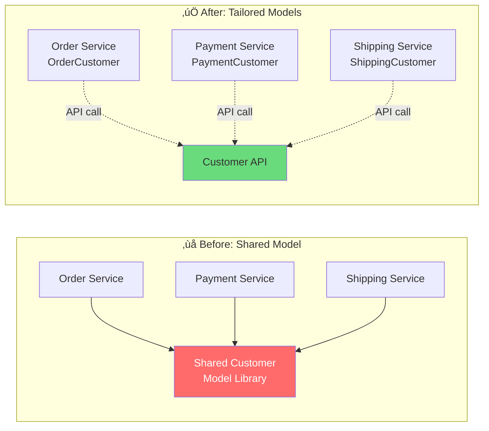

# Coupling in Practice: Real-World Patterns

[← Back to Main Guide](COUPLING.md) | [← Metrics & Refactoring](coupling-metrics-and-refactoring.md)

> This guide applies coupling concepts to real TypeScript, C#, and Java codebases 
> and distributed architectures. Each scenario shows a **before** (problematic) and 
> **after** (improved) design with coupling analysis.

---

## Scenario 1: The Distributed Monolith

The most common anti-pattern in microservices: high integration strength + high distance = tight coupling.

### ELI5

> 🍕 **Imagine three pizza shops that share the same oven.**
>
> They're separate restaurants (high distance), but they all depend on the same oven schedule (high integration strength). If the oven breaks or the schedule changes, ALL three shops stop working. You've got three shops but none of the benefits of being separate.

### Architecture — Before


**Coupling Analysis:**
| Dimension | Value | Why |
|---|---|---|
| Integration Strength | 🔴 Intrusive | All services share database internals |
| Distance | 🔴 High | Separate deployable services |
| Volatility | 🔴 High | Core business domain |
| **Verdict** | ❌ | **Distributed Monolith** |

### TypeScript — Before: Shared database

```typescript
// ❌ order-service/src/order.service.ts
import { Pool } from 'pg';

export class OrderService {
  constructor(private db: Pool) {} // shared database connection

  async createOrder(req: CreateOrderRequest): Promise<Order> {
    // Directly reads from payment service's tables!
    const customer = await this.db.query(
      `SELECT credit_limit, payment_method FROM customers WHERE id = $1`,
      [req.customerId]
    );

    // Directly reads from shipping service's tables!
    const warehouse = await this.db.query(
      `SELECT available_qty FROM inventory WHERE product_id = $1`,
      [req.productId]
    );

    if (customer.rows[0].credit_limit < req.total) {
      throw new Error('Credit limit exceeded');
    }

    const result = await this.db.query(
      `INSERT INTO orders (customer_id, product_id, qty, total, status)
       VALUES ($1, $2, $3, $4, 'pending') RETURNING *`,
      [req.customerId, req.productId, req.quantity, req.total]
    );

    return result.rows[0];
  }
}
```

### Architecture — After


**Coupling Analysis After:**
| Dimension | Value | Why |
|---|---|---|
| Integration Strength | 🟢 Contract | Services share only event contracts and API contracts |
| Distance | 🟡 High | Still separate services, but now appropriately decoupled |
| Volatility | 🔴 High | Still core domain, but now changes are isolated |
| **Verdict** | ✅ | **Loose Coupling** — strength reduced to match the distance |

### TypeScript — After: Event-driven with contracts

```typescript
// shared-contracts/src/events.ts — the ONLY shared package
export interface OrderPlacedEvent {
  type: 'OrderPlaced';
  orderId: string;
  customerId: string;
  totalAmount: number;
  placedAt: string; // ISO 8601
}

export interface PaymentConfirmedEvent {
  type: 'PaymentConfirmed';
  orderId: string;
  transactionId: string;
  confirmedAt: string;
}

// order-service/src/order.service.ts
import { OrderPlacedEvent } from '@myorg/shared-contracts';

export class OrderService {
  constructor(
    private orderRepo: OrderRepository,    // own database
    private eventBus: EventBus,            // publish events
    private paymentClient: PaymentClient   // contract-based API call
  ) {}

  async createOrder(req: CreateOrderRequest): Promise<Order> {
    // ✅ Ask the payment service through its API (contract coupling)
    const creditCheck = await this.paymentClient.checkCredit(req.customerId, req.total);
    if (!creditCheck.approved) {
      throw new Error('Credit check failed');
    }

    const order = await this.orderRepo.save({
      customerId: req.customerId,
      productId: req.productId,
      quantity: req.quantity,
      total: req.total,
      status: 'pending',
    });

    // ✅ Publish event — payment & shipping subscribe independently
    await this.eventBus.publish<OrderPlacedEvent>({
      type: 'OrderPlaced',
      orderId: order.id,
      customerId: order.customerId,
      totalAmount: order.total,
      placedAt: new Date().toISOString(),
    });

    return order;
  }
}

// payment-service/src/handlers/order-placed.handler.ts
import { OrderPlacedEvent, PaymentConfirmedEvent } from '@myorg/shared-contracts';

export class OrderPlacedHandler {
  constructor(
    private paymentProcessor: PaymentProcessor,
    private eventBus: EventBus
  ) {}

  async handle(event: OrderPlacedEvent): Promise<void> {
    const result = await this.paymentProcessor.charge(
      event.customerId,
      event.totalAmount
    );

    await this.eventBus.publish<PaymentConfirmedEvent>({
      type: 'PaymentConfirmed',
      orderId: event.orderId,
      transactionId: result.transactionId,
      confirmedAt: new Date().toISOString(),
    });
  }
}
```

---

## Scenario 2: The God Service (Monolith)

A single class or service that knows about everything.

### ELI5

> 🐙 **Imagine an octopus answering phones at a call center.**
>
> One octopus handles sales, support, billing, HR, and janitorial requests. Each arm is busy doing a different thing. Every call could involve any department. If the octopus gets sick, the entire company shuts down.

### C# — Before: The God Service

```csharp
// ❌ One service that does EVERYTHING
public class CustomerManagementService
{
    private readonly DbContext _db;
    private readonly IEmailSender _email;
    private readonly IPaymentProcessor _payments;
    private readonly IShippingProvider _shipping;
    private readonly IAnalyticsTracker _analytics;
    private readonly IInventorySystem _inventory;
    private readonly ITaxCalculator _tax;
    private readonly INotificationHub _notifications;

    // Ce = 8 — depends on EVERYTHING
    // Ca = probably high too — everything depends on this

    public async Task<OrderResult> ProcessOrder(OrderRequest request)
    {
        // Validates customer
        var customer = await _db.Customers.FindAsync(request.CustomerId);
        if (customer == null) throw new Exception("Customer not found");

        // Checks inventory
        var stock = await _inventory.CheckAvailability(request.ProductId, request.Quantity);
        if (!stock.Available) throw new Exception("Out of stock");

        // Calculates tax
        var tax = await _tax.Calculate(request.Total, customer.State);

        // Processes payment
        var payment = await _payments.Charge(customer.PaymentMethod, request.Total + tax);

        // Creates order
        var order = new Order { /* ... */ };
        _db.Orders.Add(order);
        await _db.SaveChangesAsync();

        // Reserves inventory
        await _inventory.Reserve(request.ProductId, request.Quantity);

        // Sends confirmation email
        await _email.Send(customer.Email, "Order Confirmed", $"Order {order.Id}");

        // Creates shipment
        await _shipping.CreateShipment(order.Id, customer.Address);

        // Tracks analytics
        await _analytics.Track("OrderPlaced", new { order.Id, order.Total });

        // Sends push notification
        await _notifications.Send(customer.Id, "Your order is confirmed!");

        return new OrderResult(order.Id);
    }
}
```

**Coupling Analysis:**
- Ce = 8 (depends on 8 external concerns)
- Ca = high (many parts of the app call this service)
- Instability = moderate, but the class is doing too much

### C# — After: Separated by domain concern

```csharp
// ✅ Each step is its own focused service
// Orchestrated via domain events

// Domain Events
public record OrderSubmitted(string OrderId, string CustomerId, decimal Total, string State);
public record PaymentProcessed(string OrderId, string TransactionId);
public record InventoryReserved(string OrderId, string ProductId, int Quantity);

// Lean orchestrator — only coordinates the happy path
public class OrderService
{
    private readonly IOrderRepository _orders;
    private readonly ICreditChecker _creditChecker;
    private readonly IMediator _mediator;

    public async Task<OrderResult> SubmitOrder(OrderRequest request)
    {
        var creditOk = await _creditChecker.Check(request.CustomerId, request.Total);
        if (!creditOk) throw new InsufficientCreditException();

        var order = Order.Create(request);
        await _orders.Save(order);

        // Publish event — other services react independently
        await _mediator.Publish(new OrderSubmitted(
            order.Id, request.CustomerId, request.Total, request.State
        ));

        return new OrderResult(order.Id);
    }
}

// Each handler is focused and independently testable
public class TaxHandler : INotificationHandler<OrderSubmitted>
{
    private readonly ITaxCalculator _tax;
    public async Task Handle(OrderSubmitted evt, CancellationToken ct)
    {
        await _tax.RecordTax(evt.OrderId, evt.Total, evt.State);
    }
}

public class InventoryHandler : INotificationHandler<OrderSubmitted>
{
    private readonly IInventoryService _inventory;
    public async Task Handle(OrderSubmitted evt, CancellationToken ct)
    {
        await _inventory.Reserve(evt.OrderId);
    }
}

public class NotificationHandler : INotificationHandler<OrderSubmitted>
{
    private readonly IEmailSender _email;
    private readonly INotificationHub _push;
    public async Task Handle(OrderSubmitted evt, CancellationToken ct)
    {
        await _email.SendOrderConfirmation(evt.CustomerId, evt.OrderId);
        await _push.Send(evt.CustomerId, "Your order is confirmed!");
    }
}

public class AnalyticsHandler : INotificationHandler<OrderSubmitted>
{
    private readonly IAnalyticsTracker _analytics;
    public async Task Handle(OrderSubmitted evt, CancellationToken ct)
    {
        await _analytics.Track("OrderPlaced", new { evt.OrderId, evt.Total });
    }
}
```


---

## Scenario 3: Shared Library Hell

Sharing a library across services can introduce hidden coupling.

### ELI5

> 📚 **Imagine a shared textbook that three classes use.**
>
> When the textbook gets a new edition, ALL three classes must switch at the same time, even if only one class needed the update. The other two classes are forced to update even though nothing relevant changed for them.

### Java — Before: Shared domain library

```java
// ❌ shared-models library — used by Order, Payment, and Shipping services
// ANY change here forces ALL services to update

package com.example.shared.models;

public record Customer(
    String id,
    String name,
    String email,
    Address billingAddress,
    Address shippingAddress,
    String creditCardToken,      // Payment needs this
    String loyaltyTier,          // Order needs this
    double totalOrdersWeight,    // Shipping needs this
    List<String> preferences,    // Marketing needs this
    CreditScore creditScore      // Payment needs this
) {}

// Order Service uses Customer but only needs: id, name, loyaltyTier
// Payment Service uses Customer but only needs: id, creditCardToken, creditScore
// Shipping Service uses Customer but only needs: id, shippingAddress, totalOrdersWeight
// Adding a field for ONE service forces ALL services to recompile and redeploy
```

### Java — After: Tailored models per service

```java
// ✅ Each service defines its own model of what it needs

// --- Order Service ---
package com.example.order.models;

public record OrderCustomer(
    String customerId,
    String name,
    String loyaltyTier
) {}

// Anti-corruption layer translates from the API response
public class CustomerAdapter {
    private final CustomerApiClient client;

    public OrderCustomer getCustomer(String customerId) {
        var response = client.getCustomer(customerId);  // generic API call
        return new OrderCustomer(
            response.id(),
            response.name(),
            response.loyaltyTier()
        );
    }
}

// --- Payment Service ---
package com.example.payment.models;

public record PaymentCustomer(
    String customerId,
    String creditCardToken,
    CreditScore creditScore
) {}

// --- Shipping Service ---
package com.example.shipping.models;

public record ShippingCustomer(
    String customerId,
    Address shippingAddress,
    double estimatedWeight
) {}
```



---

## Scenario 4: Temporal Coupling in Synchronous Calls

When services call each other synchronously, they create temporal coupling — both must be running at the same time.

### ELI5

> ☎️ **Phone call vs. text message.**
>
> - **Synchronous** = a phone call. Both people must be available at the exact same time. If one is in a meeting, the other waits.
> - **Asynchronous** = a text message. You send it when you're ready. They respond when they're ready. Neither blocks the other.

### TypeScript — Before: Synchronous chain

```typescript
// ❌ Order → Payment → Inventory → Shipping (all synchronous)
// If ANY service is down, the ENTIRE chain fails

class OrderService {
  async createOrder(req: CreateOrderRequest): Promise<Order> {
    // Step 1: Check payment (blocks)
    const paymentResult = await fetch('http://payment-service/charge', {
      method: 'POST',
      body: JSON.stringify({ amount: req.total, customerId: req.customerId }),
    });
    if (!paymentResult.ok) throw new Error('Payment failed');

    // Step 2: Reserve inventory (blocks)
    const inventoryResult = await fetch('http://inventory-service/reserve', {
      method: 'POST',
      body: JSON.stringify({ productId: req.productId, qty: req.quantity }),
    });
    if (!inventoryResult.ok) {
      // Have to roll back payment!
      await fetch('http://payment-service/refund', { /* ... */ });
      throw new Error('Out of stock');
    }

    // Step 3: Create shipment (blocks)
    const shipResult = await fetch('http://shipping-service/ship', {
      method: 'POST',
      body: JSON.stringify({ orderId: 'new', address: req.address }),
    });
    // What if THIS fails? Roll back inventory AND payment?
    // This is getting really complicated...

    return { id: 'new', status: 'confirmed' };
  }
}
```

### TypeScript — After: Saga pattern with async events

```typescript
// ✅ Each step communicates via events
// Services don't need to be online at the same time

// The saga orchestrator manages the workflow
class OrderSaga {
  constructor(private eventBus: EventBus, private orderRepo: OrderRepository) {}

  async start(req: CreateOrderRequest): Promise<string> {
    const orderId = crypto.randomUUID();
    
    // Save order in "pending" state
    await this.orderRepo.save({
      id: orderId,
      status: 'pending_payment',
      ...req,
    });

    // Emit event — payment service will pick it up when ready
    await this.eventBus.publish({
      type: 'OrderCreated',
      orderId,
      customerId: req.customerId,
      total: req.total,
    });

    return orderId; // Return immediately — don't wait!
  }

  // React to payment result
  async onPaymentProcessed(event: PaymentProcessedEvent): Promise<void> {
    await this.orderRepo.updateStatus(event.orderId, 'pending_inventory');
    await this.eventBus.publish({
      type: 'PaymentConfirmed',
      orderId: event.orderId,
      transactionId: event.transactionId,
    });
  }

  // React to payment failure
  async onPaymentFailed(event: PaymentFailedEvent): Promise<void> {
    await this.orderRepo.updateStatus(event.orderId, 'payment_failed');
    // No rollback needed — nothing else happened yet
  }

  // React to inventory reserved
  async onInventoryReserved(event: InventoryReservedEvent): Promise<void> {
    await this.orderRepo.updateStatus(event.orderId, 'confirmed');
    await this.eventBus.publish({
      type: 'OrderConfirmed',
      orderId: event.orderId,
    });
  }
}
```


---

## Scenario 5: Hexagonal Architecture (Ports & Adapters)

The gold standard for managing coupling in a single service or module.


### TypeScript — Hexagonal Architecture

```typescript
// ======= DOMAIN CORE (no external dependencies) =======

// domain/entities/order.ts
export class Order {
  private constructor(
    public readonly id: string,
    public readonly customerId: string,
    private items: OrderItem[],
    private _status: OrderStatus
  ) {}

  static create(customerId: string, items: OrderItem[]): Order {
    if (items.length === 0) throw new DomainError('Order must have items');
    return new Order(crypto.randomUUID(), customerId, items, 'draft');
  }

  get total(): number {
    return this.items.reduce((sum, i) => sum + i.price * i.quantity, 0);
  }

  confirm(): void {
    if (this._status !== 'draft') throw new DomainError('Can only confirm draft orders');
    this._status = 'confirmed';
  }

  get status(): OrderStatus { return this._status; }
}

// domain/ports/outbound.ts — Domain defines what it needs
export interface OrderRepository {
  save(order: Order): Promise<void>;
  findById(id: string): Promise<Order | null>;
}

export interface PaymentGateway {
  charge(customerId: string, amount: number): Promise<PaymentResult>;
}

export interface EventPublisher {
  publish(event: DomainEvent): Promise<void>;
}

// domain/ports/inbound.ts — Use cases
export interface CreateOrderUseCase {
  execute(cmd: CreateOrderCommand): Promise<string>;
}

// ======= APPLICATION (orchestration) =======

// application/create-order.ts
import { CreateOrderUseCase } from '../domain/ports/inbound';
import { OrderRepository, PaymentGateway, EventPublisher } from '../domain/ports/outbound';
import { Order } from '../domain/entities/order';

export class CreateOrderHandler implements CreateOrderUseCase {
  constructor(
    private orders: OrderRepository,      // injected
    private payments: PaymentGateway,      // injected
    private events: EventPublisher         // injected
  ) {}

  async execute(cmd: CreateOrderCommand): Promise<string> {
    const order = Order.create(cmd.customerId, cmd.items);
    
    const payment = await this.payments.charge(cmd.customerId, order.total);
    if (!payment.success) throw new PaymentFailedError(payment.reason);
    
    order.confirm();
    await this.orders.save(order);
    
    await this.events.publish({
      type: 'OrderConfirmed',
      orderId: order.id,
      total: order.total,
    });
    
    return order.id;
  }
}

// ======= ADAPTERS (infrastructure) =======

// adapters/postgres-order-repository.ts
import { OrderRepository } from '../domain/ports/outbound';
import { Order } from '../domain/entities/order';
import { Pool } from 'pg';

export class PostgresOrderRepository implements OrderRepository {
  constructor(private pool: Pool) {}

  async save(order: Order): Promise<void> {
    await this.pool.query(
      'INSERT INTO orders (id, customer_id, total, status) VALUES ($1, $2, $3, $4)',
      [order.id, order.customerId, order.total, order.status]
    );
  }

  async findById(id: string): Promise<Order | null> {
    const result = await this.pool.query('SELECT * FROM orders WHERE id = $1', [id]);
    return result.rows[0] ? this.toDomain(result.rows[0]) : null;
  }

  private toDomain(row: any): Order { /* mapping logic */ }
}

// adapters/stripe-payment-gateway.ts
import { PaymentGateway, PaymentResult } from '../domain/ports/outbound';

export class StripePaymentGateway implements PaymentGateway {
  constructor(private stripeKey: string) {}

  async charge(customerId: string, amount: number): Promise<PaymentResult> {
    // Stripe-specific implementation hidden here
    const stripe = new Stripe(this.stripeKey);
    const intent = await stripe.paymentIntents.create({
      amount: Math.round(amount * 100),
      currency: 'usd',
      customer: customerId,
    });
    return { success: intent.status === 'succeeded', transactionId: intent.id };
  }
}

// adapters/http/order-controller.ts
import { CreateOrderUseCase } from '../../domain/ports/inbound';
import express from 'express';

export function orderRoutes(createOrder: CreateOrderUseCase): express.Router {
  const router = express.Router();

  router.post('/orders', async (req, res) => {
    try {
      const orderId = await createOrder.execute(req.body);
      res.status(201).json({ orderId });
    } catch (err) {
      res.status(400).json({ error: (err as Error).message });
    }
  });

  return router;
}
```

### C# — Hexagonal Architecture

```csharp
// ======= DOMAIN CORE =======
namespace Domain.Entities;

public class Order
{
    public string Id { get; private set; }
    public string CustomerId { get; private set; }
    public List<OrderItem> Items { get; private set; }
    public OrderStatus Status { get; private set; }
    public decimal Total => Items.Sum(i => i.Price * i.Quantity);

    public static Order Create(string customerId, List<OrderItem> items)
    {
        if (!items.Any()) throw new DomainException("Order must have items");
        return new Order
        {
            Id = Guid.NewGuid().ToString(),
            CustomerId = customerId,
            Items = items,
            Status = OrderStatus.Draft
        };
    }

    public void Confirm()
    {
        if (Status != OrderStatus.Draft)
            throw new DomainException("Can only confirm draft orders");
        Status = OrderStatus.Confirmed;
    }
}

// Domain defines its ports
namespace Domain.Ports;

public interface IOrderRepository
{
    Task Save(Order order);
    Task<Order?> FindById(string id);
}

public interface IPaymentGateway
{
    Task<PaymentResult> Charge(string customerId, decimal amount);
}

public interface IEventPublisher
{
    Task Publish<T>(T domainEvent) where T : IDomainEvent;
}

// ======= APPLICATION =======
namespace Application.UseCases;

public class CreateOrderHandler
{
    private readonly IOrderRepository _orders;
    private readonly IPaymentGateway _payments;
    private readonly IEventPublisher _events;

    public CreateOrderHandler(
        IOrderRepository orders,
        IPaymentGateway payments,
        IEventPublisher events)
    {
        _orders = orders;
        _payments = payments;
        _events = events;
    }

    public async Task<string> Handle(CreateOrderCommand cmd)
    {
        var order = Order.Create(cmd.CustomerId, cmd.Items);
        
        var payment = await _payments.Charge(cmd.CustomerId, order.Total);
        if (!payment.Success) throw new PaymentFailedException(payment.Reason);
        
        order.Confirm();
        await _orders.Save(order);
        await _events.Publish(new OrderConfirmedEvent(order.Id, order.Total));
        
        return order.Id;
    }
}

// ======= ADAPTERS =======
namespace Infrastructure.Persistence;

public class EfOrderRepository : IOrderRepository
{
    private readonly AppDbContext _db;
    public EfOrderRepository(AppDbContext db) => _db = db;

    public async Task Save(Order order)
    {
        _db.Orders.Add(order);
        await _db.SaveChangesAsync();
    }

    public async Task<Order?> FindById(string id)
        => await _db.Orders.Include(o => o.Items).FirstOrDefaultAsync(o => o.Id == id);
}

namespace Infrastructure.Payments;

public class StripeGateway : IPaymentGateway
{
    public async Task<PaymentResult> Charge(string customerId, decimal amount)
    {
        // Stripe-specific code hidden behind the port
        var service = new PaymentIntentService();
        var intent = await service.CreateAsync(new PaymentIntentCreateOptions
        {
            Amount = (long)(amount * 100),
            Currency = "usd",
            Customer = customerId,
        });
        return new PaymentResult(intent.Status == "succeeded", intent.Id);
    }
}
```

### Java — Hexagonal Architecture

```java
// ======= DOMAIN CORE =======
package com.example.domain;

public class Order {
    private final String id;
    private final String customerId;
    private final List<OrderItem> items;
    private OrderStatus status;

    public static Order create(String customerId, List<OrderItem> items) {
        if (items.isEmpty()) throw new DomainException("Order must have items");
        return new Order(UUID.randomUUID().toString(), customerId, items, OrderStatus.DRAFT);
    }

    public BigDecimal getTotal() {
        return items.stream()
            .map(i -> i.price().multiply(BigDecimal.valueOf(i.quantity())))
            .reduce(BigDecimal.ZERO, BigDecimal::add);
    }

    public void confirm() {
        if (status != OrderStatus.DRAFT)
            throw new DomainException("Can only confirm draft orders");
        this.status = OrderStatus.CONFIRMED;
    }
}

// Domain ports
package com.example.domain.ports;

public interface OrderRepository {
    void save(Order order);
    Optional<Order> findById(String id);
}

public interface PaymentGateway {
    PaymentResult charge(String customerId, BigDecimal amount);
}

public interface EventPublisher {
    void publish(DomainEvent event);
}

// ======= APPLICATION =======
package com.example.application;

@Service
public class CreateOrderHandler {
    private final OrderRepository orders;
    private final PaymentGateway payments;
    private final EventPublisher events;

    public CreateOrderHandler(OrderRepository orders, PaymentGateway payments,
                              EventPublisher events) {
        this.orders = orders;
        this.payments = payments;
        this.events = events;
    }

    @Transactional
    public String handle(CreateOrderCommand cmd) {
        var order = Order.create(cmd.customerId(), cmd.items());
        
        var payment = payments.charge(cmd.customerId(), order.getTotal());
        if (!payment.success()) throw new PaymentFailedException(payment.reason());
        
        order.confirm();
        orders.save(order);
        events.publish(new OrderConfirmedEvent(order.getId(), order.getTotal()));
        
        return order.getId();
    }
}

// ======= ADAPTERS =======
package com.example.infrastructure;

@Repository
public class JpaOrderRepository implements OrderRepository {
    private final JpaOrderEntityRepository jpaRepo;

    @Override
    public void save(Order order) {
        jpaRepo.save(OrderEntity.fromDomain(order));
    }

    @Override
    public Optional<Order> findById(String id) {
        return jpaRepo.findById(id).map(OrderEntity::toDomain);
    }
}

@Component
public class StripePaymentGateway implements PaymentGateway {
    private final Stripe stripe;

    @Override
    public PaymentResult charge(String customerId, BigDecimal amount) {
        PaymentIntentCreateParams params = PaymentIntentCreateParams.builder()
            .setAmount(amount.multiply(new BigDecimal(100)).longValue())
            .setCurrency("usd")
            .setCustomer(customerId)
            .build();
        
        PaymentIntent intent = PaymentIntent.create(params);
        return new PaymentResult("succeeded".equals(intent.getStatus()), intent.getId());
    }
}
```

---

## Coupling Analysis Summary


---

## Checklist: Reviewing Coupling in Your Codebase

Use this checklist during code reviews and architecture reviews:

- [ ] **Integration Strength**: Are components sharing more knowledge than necessary? Can you reduce from Intrusive → Contract?
- [ ] **Distance**: Does the coupling strength match the distance? High distance = need low strength.
- [ ] **Volatility**: Are highly volatile (core) components properly isolated behind contracts?
- [ ] **Circular Dependencies**: Run `madge --circular` (TS), NDepend (C#), or JDepend (Java) to detect them.
- [ ] **God Services**: Does any class have Ce > 5? Consider splitting by domain concern.
- [ ] **Shared Libraries**: Is a shared library forcing coordinated deployments? Consider Anti-Corruption Layers.
- [ ] **Temporal Coupling**: Are synchronous call chains creating runtime coupling? Consider async events.
- [ ] **Architecture Tests**: Do you have ArchUnit / ArchUnitNET / dependency-cruiser rules enforcing boundaries?

---

[← Back to Main Guide](COUPLING.md) | [Next: References & Further Reading →](coupling-references.md)
