# Coupling Metrics & Refactoring Guide

[← Back to Main Guide](README.md) | [← Dimensions](coupling-dimensions.md)

> *"Not only could we see the positive change in the class diagram, but we could*
> *also confirm that refactoring goals have been accomplished by looking at*
> *coupling and instability metrics."*
> — Zoran Horvat

This guide covers the classical coupling metrics (efferent, afferent, instability, abstractness), shows how to use them to guide refactoring, and includes an important critical perspective on when these metrics can mislead you.

---

## The Classical Metrics

### Efferent Coupling (Ce) — *"Who do I depend on?"*

**Efferent coupling** counts how many *external* types a component refers to. It measures outgoing dependencies.


**ELI5:** Efferent coupling is like counting how many different stores you need to visit to cook dinner. The more stores, the more your dinner plan is affected by store closures and price changes.

### Afferent Coupling (Ca) — *"Who depends on me?"*

**Afferent coupling** counts how many *external* types refer to this component. It measures incoming dependencies.


**ELI5:** Afferent coupling is like counting how many people have your phone number. Change your number, and that's how many people you need to notify.

### Instability (I) — *"How free am I to change?"*

$$I = \frac{C_e}{C_a + C_e}$$

| I value | Meaning | Implication |
|---|---|---|
| **0.0** | Absolutely stable | Everyone depends on you. Changes here break everything. Design it carefully! |
| **0.5** | Neutral | Risky — changes might cascade in either direction |
| **1.0** | Absolutely unstable | You depend on others, but nobody depends on you. Change freely! |

**ELI5:** Instability is like asking *"Who has more power — the celebrity or the fan?"*
- A celebrity (I=0, stable) can't change their phone number without a PR disaster — millions depend on them.
- A fan (I=1, unstable) can change their number anytime — nobody's affected, but they have to keep up with the celebrity's schedule.

### Abstractness (A)

$$A = \frac{N_a}{N_c}$$

Where $N_a$ = number of abstract types (interfaces, abstract classes) and $N_c$ = total number of types.

### Distance from the Main Line (D)

$$D = \frac{|A + I - 1|}{\sqrt{2}}$$

This combines instability and abstractness into a single quality indicator. The "main line" is where $A + I = 1$.


| Zone | What it means | Example |
|---|---|---|
| **Zone of Pain** | Stable but concrete — hard to extend, everyone depends on it | A concrete utility class used everywhere with no interface |
| **Zone of Uselessness** | Unstable but abstract — lots of interfaces nobody uses | An interface layer that wraps every single class "just in case" |
| **Main Line** | Good balance — stable things are abstract, unstable things are concrete | Interfaces in core, implementations in infrastructure |

---

## Walkthrough: Using Metrics to Find and Fix Problems

Let's walk through the complete example from Zoran Horvat's guide, adapted with code.

### Step 1: The Problematic Design


#### C# — The problematic code

```csharp
// PRESENTATION LAYER
namespace Presentation
{
    public class UserViewModel
    {
        public string Name { get; set; }
        public string Email { get; set; }
    }

    public class UserView
    {
        public void Draw(UserViewModel model) { /* render UI */ }
        
        public void ShowUser(string name)
        {
            // ❌ Presentation directly references Domain's concrete class
            var service = new Domain.UserServices();
            UserViewModel vm = service.GetUser(name);
            Draw(vm);
        }
    }
}

// DOMAIN LAYER
namespace Domain
{
    public class User
    {
        public string Name { get; set; }
        public string Email { get; set; }
    }

    public class UserServices
    {
        // ❌ Domain references Presentation's UserViewModel — circular dependency!
        public Presentation.UserViewModel GetUser(string name)
        {
            var repo = new Infrastructure.Repository<User>(); // ❌ Domain references Infrastructure
            var user = repo.GetById(name);
            return new Presentation.UserViewModel 
            { 
                Name = user.Name, 
                Email = user.Email 
            };
        }
    }
}

// INFRASTRUCTURE LAYER
namespace Infrastructure
{
    public class Repository<T>
    {
        public T GetById(string id) { /* database access */ return default!; }
    }
}
```

#### Measuring the metrics

| Module | Classes Referenced Outside (Ce) | Classes Referenced By Outside (Ca) | Instability I = Ce/(Ce+Ca) |
|---|---|---|---|
| **Presentation** | 1 (UserServices) | 1 (UserViewModel used by Domain) | 0.50 |
| **Domain** | 2 (UserViewModel + Repository) | 1 (UserServices used by Presentation) | 0.67 |
| **Infrastructure** | 0 | 1 (Repository used by Domain) | **0.00** |

#### What's wrong?

```mermaid
flowchart TB
    subgraph problems ["❌ Problems Identified"]
        P1["Presentation I=0.50<br/>Should be MORE stable (I→0)<br/>Users see this layer — it should drive design"]
        P2["Domain I=0.67<br/>Has circular dependency with Presentation"]
        P3["Infrastructure I=0.00<br/>Should be LESS stable (I→1)<br/>Infrastructure should adapt to the app, not vice versa"]
    end
    
    style P1 fill:#ffcccc
    style P2 fill:#ffcccc
    style P3 fill:#ffcccc
```



**Problems:**
1. **Presentation** has I=0.50 — it's not stable enough. If Domain changes, Presentation might break. But Presentation is what users see!
2. **Infrastructure** has I=0.00 — it's *too* stable. Everyone adapts to infrastructure instead of infrastructure adapting to the application.
3. **Domain** references *both* directions — circular dependency with Presentation.

### Step 2: Apply Dependency Inversion Principle (DIP)


#### C# — The refactored code

```csharp
// PRESENTATION LAYER — now owns the interfaces it needs
namespace Presentation
{
    public class UserViewModel
    {
        public string Name { get; set; }
        public string Email { get; set; }
    }

    // ✅ Interface lives in Presentation — it defines what IT needs
    public interface IUserServices
    {
        UserViewModel GetUser(string name);
    }

    public class UserView
    {
        private readonly IUserServices _userServices; // ✅ depends on interface

        public UserView(IUserServices userServices)
        {
            _userServices = userServices;
        }

        public void ShowUser(string name)
        {
            var vm = _userServices.GetUser(name);
            Draw(vm);
        }

        public void Draw(UserViewModel model) { /* render UI */ }
    }
}

// DOMAIN LAYER — owns its own repository interface
namespace Domain
{
    public class User
    {
        public string Name { get; set; }
        public string Email { get; set; }
    }

    // ✅ Repository interface lives in Domain — Domain defines what it needs
    public interface IRepository<T>
    {
        T GetById(string id);
    }

    // ✅ Domain implements Presentation's interface — depends "upward"
    public class UserServices : Presentation.IUserServices
    {
        private readonly IRepository<User> _repository;

        public UserServices(IRepository<User> repository)
        {
            _repository = repository;
        }

        public Presentation.UserViewModel GetUser(string name)
        {
            var user = _repository.GetById(name);
            return new Presentation.UserViewModel
            {
                Name = user.Name,
                Email = user.Email
            };
        }
    }
}

// INFRASTRUCTURE LAYER — implements Domain's interface — depends "upward"
namespace Infrastructure
{
    public class Repository<T> : Domain.IRepository<T>
    {
        public T GetById(string id) 
        { 
            // Database access implementation
            return default!; 
        }
    }
}
```

#### TypeScript — Same pattern

```typescript
// presentation/types.ts
export interface UserViewModel {
  name: string;
  email: string;
}

// presentation/ports.ts — Presentation defines what it needs
export interface IUserServices {
  getUser(name: string): Promise<UserViewModel>;
}

// presentation/user-view.ts
import { IUserServices } from './ports';
import { UserViewModel } from './types';

export class UserView {
  constructor(private userServices: IUserServices) {} // ✅ interface

  async showUser(name: string): Promise<void> {
    const vm = await this.userServices.getUser(name);
    this.draw(vm);
  }

  draw(model: UserViewModel): void { /* render */ }
}

// domain/user.ts
export interface User {
  name: string;
  email: string;
}

// domain/ports.ts — Domain defines what it needs
export interface IRepository<T> {
  getById(id: string): Promise<T>;
}

// domain/user-services.ts — implements Presentation's port
import { IUserServices, UserViewModel } from '../presentation/ports';
import { User } from './user';
import { IRepository } from './ports';

export class UserServices implements IUserServices {
  constructor(private repo: IRepository<User>) {}

  async getUser(name: string): Promise<UserViewModel> {
    const user = await this.repo.getById(name);
    return { name: user.name, email: user.email };
  }
}

// infrastructure/user-repository.ts — implements Domain's port
import { IRepository } from '../domain/ports';
import { User } from '../domain/user';

export class UserRepository implements IRepository<User> {
  async getById(id: string): Promise<User> {
    // Database access here
    return { name: id, email: `${id}@example.com` };
  }
}
```

#### Java — Same pattern

```java
// --- PRESENTATION LAYER ---
package com.example.presentation;

public record UserViewModel(String name, String email) {}

// Presentation defines its own port
public interface IUserServices {
    UserViewModel getUser(String name);
}

public class UserView {
    private final IUserServices userServices;

    public UserView(IUserServices userServices) {
        this.userServices = userServices;
    }

    public void showUser(String name) {
        UserViewModel vm = userServices.getUser(name);
        draw(vm);
    }

    private void draw(UserViewModel model) { /* render */ }
}

// --- DOMAIN LAYER ---
package com.example.domain;

public record User(String name, String email) {}

public interface IRepository<T> {
    T getById(String id);
}

// Domain implements Presentation's port
public class UserServices implements com.example.presentation.IUserServices {
    private final IRepository<User> repository;

    public UserServices(IRepository<User> repository) {
        this.repository = repository;
    }

    @Override
    public com.example.presentation.UserViewModel getUser(String name) {
        User user = repository.getById(name);
        return new com.example.presentation.UserViewModel(user.name(), user.email());
    }
}

// --- INFRASTRUCTURE LAYER ---
package com.example.infrastructure;

public class UserRepository implements com.example.domain.IRepository<com.example.domain.User> {
    @Override
    public com.example.domain.User getById(String id) {
        // Database access
        return new com.example.domain.User(id, id + "@example.com");
    }
}
```

### Step 3: Measure Again

| Module | Ce | Ca | I = Ce/(Ce+Ca) | Change |
|---|---|---|---|---|
| **Presentation** | 0 | 1 | **0.00** | 0.50 → 0.00 ✅ |
| **Domain** | 2 | 1 | **0.67** | same |
| **Infrastructure** | 1 | 0 | **1.00** | 0.00 → 1.00 ✅ |

```mermaid
flowchart TB
    subgraph results ["✅ After Refactoring"]
        R1["Presentation I=0.00<br/>Absolutely stable ✅<br/>Everything adapts to it"]
        R2["Domain I=0.67<br/>Balanced — depends on Presentation<br/>contracts, depended on by Infrastructure"]
        R3["Infrastructure I=1.00<br/>Absolutely unstable ✅<br/>Adapts to the application's needs"]
    end
    
    style R1 fill:#d3f9d8
    style R2 fill:#fff3bf
    style R3 fill:#d3f9d8
```



**What changed:**
- **Presentation** is now absolutely stable (I=0.00) — nobody depends on anything outside Presentation. ✅
- **Infrastructure** is now absolutely unstable (I=1.00) — it adapts to Domain's contracts. ✅
- **Dependencies flow upward** — lower layers depend on upper layers through interfaces. ✅

---

## ⚠️ The Alternative View: When Metrics Mislead

Oliver Drotbohm raises a critical counterpoint that every team should understand.

### The Problem with Abstractness-as-a-Metric

The instability-abstractness relationship assumes:
- **Stable packages should be abstract** (lots of interfaces)
- **Unstable packages should be concrete** (implementations)

Drotbohm argues this confuses **abstractness** (counting interfaces vs. classes) with **abstraction** (genuinely hiding details at a higher conceptual level).

```mermaid
flowchart LR
    subgraph wrong ["❌ Blindly Adding Interfaces"]
        C1[Concrete Class] -->|"Extract interface"| I1[IConcreteClass]
        I1 -.->|"Same level<br/>of abstraction"| C1
    end
    
    subgraph right ["✅ Meaningful Abstraction"]
        C2[StripePaymentProcessor] -->|"Abstracts to"| I2[PaymentGateway]
        I2 -.->|"Higher level<br/>of abstraction"| C2
    end
    
    wrong -->|"Metric improves<br/>Design does NOT"| Bad["Metric gaming 🎮"]
    right -->|"Both improve"| Good["Real improvement ✅"]
```



### The Key Insight

> **Just because you extract an interface from a class doesn't make the package more abstract in any meaningful way.**
>
> The interface `IUserRepository` has the same *semantic level* as `UserRepository`. If `UserRepository`'s contract changes, `IUserRepository` must change too. You haven't reduced coupling — you've just added a level of indirection.

### When Are Interfaces Actually Useful?

Interfaces are genuinely useful when they enable:

1. **Multiple implementations** (now or realistically in the future)
2. **Testing** (mock/stub for unit tests)
3. **Dependency inversion** (changing direction of dependency flow)
4. **Actual abstraction** (hiding a lower-level concept behind a higher-level one)

#### TypeScript — Interface for the wrong reason

```typescript
// ❌ Interface extracted "because metrics" — no second implementation will ever exist
interface IUserRepository {
  findById(id: string): Promise<User>;
  save(user: User): Promise<void>;
  delete(id: string): Promise<void>;
}

class UserRepository implements IUserRepository {
  // This is the only implementation. Ever.
  async findById(id: string): Promise<User> { /* ... */ }
  async save(user: User): Promise<void> { /* ... */ }
  async delete(id: string): Promise<void> { /* ... */ }
}
```

```typescript
// ✅ Interface because it genuinely represents a different level of abstraction
interface MessageBroker {
  publish(topic: string, message: unknown): Promise<void>;
  subscribe(topic: string, handler: (msg: unknown) => void): void;
}

// Multiple real implementations
class KafkaMessageBroker implements MessageBroker { /* ... */ }
class SQSMessageBroker implements MessageBroker { /* ... */ }
class InMemoryMessageBroker implements MessageBroker { /* ... */ } // for testing
```

### Change Patterns in Real Applications

Drotbohm observes that in typical business applications, changes usually involve:
- **Introducing entirely new abstractions** (new features, new domain concepts)
- **Modifying existing types** (adding new methods, fields)

In both cases, it largely doesn't matter whether you're modifying an interface or a class. The metric doesn't capture the *kind* of changes that actually happen.

### Practical Takeaway

```mermaid
flowchart TD
    Q1{Do you need to<br/>add an interface?}
    Q1 -->|"Will there be multiple<br/>implementations?"| Yes1["✅ Yes — add it"]
    Q1 -->|"Do you need it<br/>for testing?"| Yes2["✅ Yes — add it"]
    Q1 -->|"Does it invert a<br/>dependency direction?"| Yes3["✅ Yes — add it<br/>(like our DIP example)"]
    Q1 -->|"Does it raise the<br/>level of abstraction?"| Yes4["✅ Yes — add it"]
    Q1 -->|"Just to improve<br/>the abstractness metric?"| No["❌ Don't bother.<br/>It's metric gaming."]
```



---

## Measuring Coupling in Your Repositories

### TypeScript / JavaScript

Tools for measuring coupling:
- **[dependency-cruiser](https://github.com/sverweij/dependency-cruiser)** — visualizes and validates module dependencies
- **[madge](https://github.com/pahen/madge)** — generates dependency graphs, finds circular dependencies
- **[eslint-plugin-import](https://github.com/import-js/eslint-plugin-import)** — lint rules for import/export coupling

```bash
# Find circular dependencies in a TypeScript project
npx madge --circular --extensions ts src/

# Generate a dependency graph
npx madge --image graph.svg --extensions ts src/

# Validate dependency rules with dependency-cruiser
npx depcruise --config .dependency-cruiser.cjs src
```

Example dependency-cruiser rule:

```javascript
// .dependency-cruiser.cjs
module.exports = {
  forbidden: [
    {
      name: 'no-circular',
      severity: 'error',
      from: {},
      to: { circular: true }
    },
    {
      name: 'domain-cannot-depend-on-infrastructure',
      severity: 'error',
      from: { path: '^src/domain' },
      to: { path: '^src/infrastructure' }
    },
    {
      name: 'presentation-cannot-depend-on-infrastructure',
      severity: 'error',
      from: { path: '^src/presentation' },
      to: { path: '^src/infrastructure' }
    }
  ]
};
```

### C# / .NET

Tools:
- **[NDepend](https://www.ndepend.com/)** — comprehensive code analysis with coupling metrics
- **[Microsoft.DependencyAnalysis](https://learn.microsoft.com/en-us/dotnet/architecture/)** — built-in architecture analysis
- **[ArchUnitNET](https://github.com/TNG/ArchUnitNET)** — architecture tests in code

```csharp
// ArchUnitNET — enforce coupling rules as unit tests
using ArchUnitNET.Fluent;
using static ArchUnitNET.Fluent.ArchRuleDefinition;

[TestClass]
public class ArchitectureTests
{
    private static readonly Architecture Architecture =
        new ArchLoader().LoadAssembly(typeof(Domain.User).Assembly).Build();

    [TestMethod]
    public void Domain_Should_Not_Depend_On_Infrastructure()
    {
        IArchRule rule = Types()
            .That().ResideInNamespace("Domain")
            .Should().NotDependOnAnyTypesThat()
            .ResideInNamespace("Infrastructure");

        rule.Check(Architecture);
    }

    [TestMethod]
    public void Infrastructure_Should_Only_Depend_On_Domain_Interfaces()
    {
        IArchRule rule = Types()
            .That().ResideInNamespace("Infrastructure")
            .Should().OnlyDependOnTypesThat()
            .ResideInNamespace("Domain")
            .OrShould().BeInterfaces();

        rule.Check(Architecture);
    }
}
```

### Java

Tools:
- **[ArchUnit](https://www.archunit.org/)** — architecture tests
- **[JDepend](https://github.com/clarkware/jdepend)** — calculates coupling metrics (Ce, Ca, I, A, D)
- **[Structure101](https://structure101.com/)** — visualizes coupling and dependencies

```java
// ArchUnit — enforce coupling rules as unit tests
import com.tngtech.archunit.core.importer.ClassFileImporter;
import com.tngtech.archunit.lang.ArchRule;
import static com.tngtech.archunit.lang.syntax.ArchRuleDefinition.*;
import static com.tngtech.archunit.library.Architectures.layeredArchitecture;

public class ArchitectureTest {

    @Test
    void layers_should_respect_dependency_rules() {
        layeredArchitecture()
            .consideringAllDependencies()
            .layer("Presentation").definedBy("com.example.presentation..")
            .layer("Domain").definedBy("com.example.domain..")
            .layer("Infrastructure").definedBy("com.example.infrastructure..")
            
            .whereLayer("Presentation").mayNotBeAccessedByAnyLayer()
            .whereLayer("Domain").mayOnlyBeAccessedByLayers("Presentation", "Infrastructure")
            .whereLayer("Infrastructure").mayNotBeAccessedByAnyLayer()
            
            .check(new ClassFileImporter().importPackages("com.example"));
    }

    @Test
    void domain_should_not_depend_on_infrastructure() {
        noClasses()
            .that().resideInAPackage("com.example.domain..")
            .should().dependOnClassesThat()
            .resideInAPackage("com.example.infrastructure..")
            .check(new ClassFileImporter().importPackages("com.example"));
    }
}
```

---

## Summary: Metrics Cheat Sheet

| Metric | Formula | What it tells you | Goal |
|---|---|---|---|
| **Efferent Coupling (Ce)** | Count of outgoing dependencies | How much you depend on others | Lower for stable components |
| **Afferent Coupling (Ca)** | Count of incoming dependencies | How much others depend on you | Higher for core components |
| **Instability (I)** | Ce / (Ce + Ca) | How free you are to change | 0.0 for core, 1.0 for infra |
| **Abstractness (A)** | Abstract types / Total types | Ratio of interfaces to classes | Use thoughtfully — don't game it |
| **Distance (D)** | \|A + I - 1\| / √2 | Distance from the ideal line | Close to 0 is good, but read the fine print |

### Key takeaways:

1. **Metrics are a compass, not a GPS.** They point you in the right direction, but don't blindly follow them.
2. **Use DIP to invert dependency directions** — make lower layers depend on upper layers through interfaces.
3. **Don't add interfaces just to improve the abstractness metric.** Add them when they provide genuine abstraction.
4. **Enforce coupling rules as automated tests** using ArchUnit (Java), ArchUnitNET (C#), or dependency-cruiser (TypeScript).
5. **Measure, refactor, measure again** — use the before/after comparison to validate that your refactoring actually improved things.

---

[← Back to Main Guide](README.md) | [Next: Coupling in Practice →](coupling-in-practice.md)
