# Durable Execution & Orchestration: Coupling Through the Temporal Lens

[← Back to Main Guide](README.md) | [← Three C's of Distributed Transactions](three-cs-distributed-transactions.md) | [Next: References →](coupling-references.md)

Durable execution platforms like [Temporal](https://docs.temporal.io/evaluate/understanding-temporal) change where coupling shows up in a distributed system. The platform takes over failure handling, state persistence, and retries, which removes several kinds of accidental coupling. It adds platform coupling of its own, and that has to be balanced too.

This guide analyzes durable execution and orchestration **through the lens of the three coupling dimensions** (Integration Strength, Distance, Volatility), shows how Temporal's primitives create coupling boundaries, and examines the tradeoffs teams must negotiate when adopting workflow orchestration.

---

## Table of Contents

- [Overview: The Coupling Problem Temporal Solves](#overview-the-coupling-problem-temporal-solves)
- [Temporal Building Blocks as Coupling Boundaries](#temporal-building-blocks-as-coupling-boundaries)
  - [Workflows: The Orchestration Boundary](#workflows-the-orchestration-boundary)
  - [Activities: The Side-Effect Boundary](#activities-the-side-effect-boundary)
  - [Signals, Queries, and Updates: The Message Boundary](#signals-queries-and-updates-the-message-boundary)
  - [Child Workflows and Distance](#child-workflows-and-distance)
- [Coupling Analysis: Hand-Rolled vs. Durable Orchestration](#coupling-analysis-hand-rolled-vs-durable-orchestration)
- [The Saga Pattern: Before and After Temporal](#the-saga-pattern-before-and-after-temporal)
- [Where Temporal Sits in the Three C's](#where-temporal-sits-in-the-three-cs)
- [Coupling Tradeoffs Temporal Introduces](#coupling-tradeoffs-temporal-introduces)
  - [Platform Coupling](#platform-coupling)
  - [Deterministic Constraints](#deterministic-constraints)
  - [Event History Limits and Versioning](#event-history-limits-and-versioning)
  - [Worker Architecture and Deployment Coupling](#worker-architecture-and-deployment-coupling)
- [Use Case Decision Framework Through a Coupling Lens](#use-case-decision-framework-through-a-coupling-lens)
  - [When Temporal Reduces Net Coupling](#when-temporal-reduces-net-coupling)
  - [When Temporal Increases Net Coupling](#when-temporal-increases-net-coupling)
- [Temporal and the Three Dimensions: A Summary](#temporal-and-the-three-dimensions-a-summary)
- [References](#references)

---

## Overview: The Coupling Problem Temporal Solves

In [Scenario 4 of Coupling in Practice](coupling-in-practice.md#scenario-4-temporal-coupling-in-synchronous-calls), synchronous service-to-service calls create [**temporal coupling**](coupling-dimensions.md#runtime-temporal-and-lifecycle-coupling): both services must be available at the same time. The hand-rolled solution was a saga orchestrator with an event bus. It works, but it forces developers to manage:

1. **State persistence**: tracking where the process is and what has completed
2. **Retry logic**: deciding when, how often, and with what backoff to retry
3. **Compensation**: rolling back completed steps when a later step fails
4. **Timeout management**: detecting hung operations and acting on them
5. **Idempotency**: ensuring retried operations don't cause duplicate effects
6. **Visibility**: understanding what's happening in a running process

Each of these concerns creates its own coupling surface. State persistence couples you to a database schema. Retry logic duplicates across services. Compensation logic must mirror the forward logic. Timeout values are scattered across configuration files.

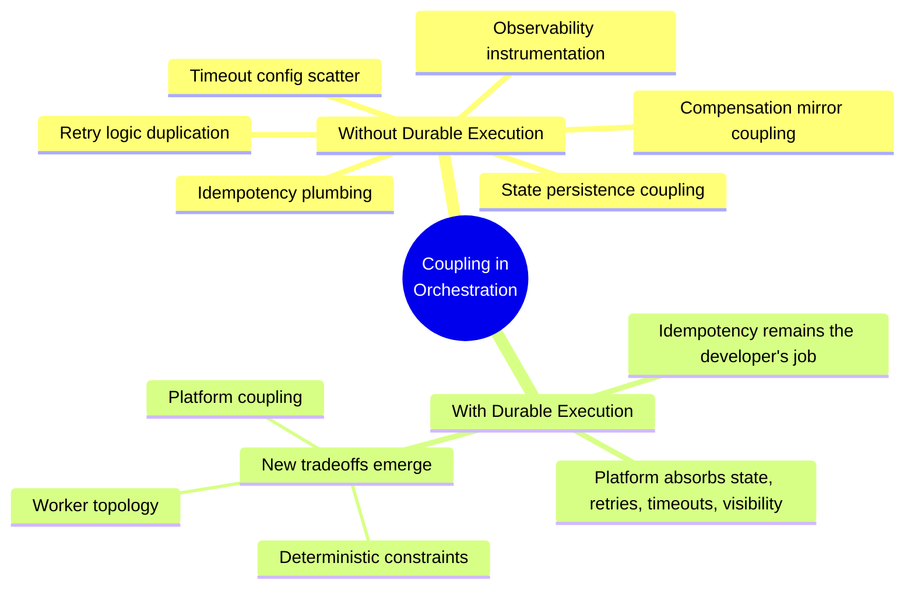
```mermaid
mindmap
  root((Coupling in<br/>Orchestration))
    Without Durable Execution
      State persistence coupling
      Retry logic duplication
      Compensation mirror coupling
      Timeout config scatter
      Idempotency plumbing
      Observability instrumentation
    With Durable Execution
      Platform absorbs state, retries, timeouts, visibility
      Idempotency remains the developer's job
      New tradeoffs emerge
        Platform coupling
        Deterministic constraints
        Worker topology
```

**Temporal absorbs concerns 1 to 4 and 6.** The Temporal Service maintains a durable [Event History](https://docs.temporal.io/encyclopedia/event-history), a complete log of every step in a Workflow Execution. If a Worker crashes, a Worker replays the Event History and resumes from the point of failure. Retries, timeouts, and heartbeats are configuration, not code.

**Idempotency stays with you.** Retries are the reason: an Activity attempt that fails after its side effect landed will run again. Temporal's [Activity docs](https://docs.temporal.io/activities) recommend that Activities be idempotent "so retries can be processed without duplicate side effects". The platform gives you the retry; you supply the idempotency key.

### ELI5: Durable Execution

> 💾 **Think of a video game with autosave.**
>
> - **Without durable execution**: You're playing a game with no save feature. If the power goes out, you start from the beginning. So you write down your progress on a notepad (state persistence), memorize which levels you've cleared (idempotency), and keep a list of items to return if you need to undo something (compensation). You spend more time managing your notes than playing the game.
> - **With durable execution**: The game autosaves after every meaningful action. Power goes out? You resume exactly where you left off. You focus on playing the game (business logic), not managing save files.

---

## Temporal Building Blocks as Coupling Boundaries

Temporal's primitives map cleanly to coupling boundaries. Each primitive controls _what knowledge is shared_ and _at what distance_.

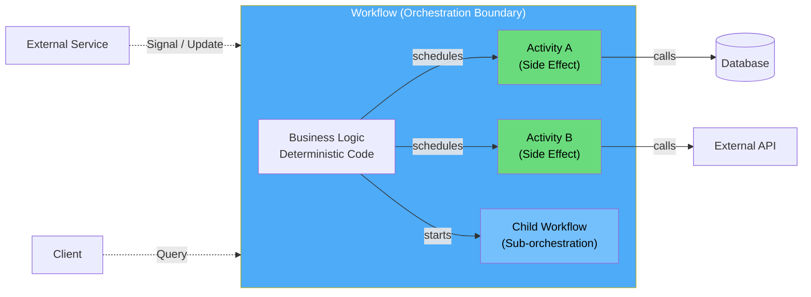
```mermaid
flowchart LR
    subgraph WF ["Workflow (Orchestration Boundary)"]
        direction TB
        Logic["Business Logic<br/>Deterministic Code"]
        Logic -->|"schedules"| A1["Activity A<br/>(Side Effect)"]
        Logic -->|"schedules"| A2["Activity B<br/>(Side Effect)"]
        Logic -->|"starts"| CW["Child Workflow<br/>(Sub-orchestration)"]
    end

    Ext1[External Service] -.->|"Signal / Update"| WF
    Ext2[Client] -.->|"Query"| WF
    A1 -->|"calls"| DB[(Database)]
    A2 -->|"calls"| API[External API]

    style WF fill:#4dabf7,color:#fff
    style A1 fill:#69db7c,color:#000
    style A2 fill:#69db7c,color:#000
    style CW fill:#74c0fc,color:#000
```

### Workflows: The Orchestration Boundary

A [Temporal Workflow](https://docs.temporal.io/evaluate/understanding-temporal#workflow) is your business logic defined in code: a deterministic function that orchestrates the sequence of steps in a process. The Workflow is the **coupling boundary** between your orchestration logic and the outside world.

| Coupling Property        | How Workflows Manage It                                                                                                                                    |
| ------------------------ | ---------------------------------------------------------------------------------------------------------------------------------------------------------- |
| **Integration Strength** | 🔵 Contract — Workflows communicate with the outside world only through Activities, Signals, Queries, and Updates. Each is a defined contract.             |
| **Encapsulation**        | Workflow state is private. External code cannot read or mutate it directly — only through defined message handlers.                                        |
| **Determinism**          | Workflows must be deterministic (no direct I/O, no random, no system clock). This constraint _enforces_ separation between orchestration and side effects. |

#### TypeScript — Workflow as a coupling boundary

```typescript
// ✅ The Workflow is pure orchestration — it knows WHAT to do, not HOW
import { proxyActivities, defineSignal, setHandler } from "@temporalio/workflow";
import type { OrderActivities } from "./activities";
import type { OrderRequest, OrderResult } from "./types";

const {
  validatePayment,
  reserveInventory,
  createShipment,
  refundPayment,
  releaseInventory,
} = proxyActivities<OrderActivities>({
  startToCloseTimeout: "30s",
  retry: { maximumAttempts: 3 },
});

// Contract: the Signal shape is the only shared knowledge
export const cancelOrderSignal = defineSignal<[string]>("cancelOrder");

export async function orderWorkflow(order: OrderRequest): Promise<OrderResult> {
  let cancelled = false;
  setHandler(cancelOrderSignal, () => {
    cancelled = true;
  });

  // Step 1: Payment. The order id is the idempotency key for the charge.
  const paymentId = await validatePayment(
    order.id,
    order.customerId,
    order.paymentMethodId,
    order.total,
  );

  if (cancelled) {
    await refundPayment(paymentId);
    return { status: "cancelled" };
  }

  // Step 2: Inventory. The order id is also the reservation id.
  const reservationId = await reserveInventory(order.id, order.productId, order.quantity);

  if (cancelled) {
    await releaseInventory(reservationId);
    await refundPayment(paymentId);
    return { status: "cancelled" };
  }

  // Step 3: Shipment. Once the shipment exists the order can no longer be
  // cancelled, so a Signal arriving after this point is deliberately ignored.
  const shipmentId = await createShipment(order.address, reservationId);

  return { status: "confirmed", paymentId, reservationId, shipmentId };
}
```

**What's notable from a coupling perspective:**

- The Workflow knows _what_ to do (validate payment → reserve inventory → create shipment) but not _how_ those things happen.
- Activities are accessed through `proxyActivities`, a contract-based proxy. The Workflow never imports the Activity _implementations_, only their _type signatures_.
- Compensation (refund, release) is co-located with the business logic, not scattered across event handlers.
- The Signal handler shows contract coupling: external callers know only the signal name and shape, not the Workflow's internal state.
- This example compensates only on cancellation. If `reserveInventory` or `createShipment` exhausts its retries, the Workflow fails with the payment still taken. The [saga section](#the-saga-pattern-before-and-after-temporal) adds the compensation stack that covers ordinary failures.

### Activities: The Side-Effect Boundary

[Activities](https://docs.temporal.io/evaluate/understanding-temporal#activities) are the units of work that interact with the outside world: API calls, database writes, file operations. They are the **I/O boundary** that separates deterministic orchestration from non-deterministic side effects.

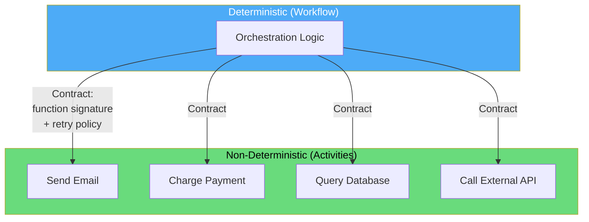
```mermaid
flowchart TB
    subgraph deterministic ["Deterministic (Workflow)"]
        W["Orchestration Logic"]
    end

    subgraph nondeterministic ["Non-Deterministic (Activities)"]
        A1["Send Email"]
        A2["Charge Payment"]
        A3["Query Database"]
        A4["Call External API"]
    end

    W -->|"Contract:<br/>function signature<br/>+ retry policy"| A1
    W -->|"Contract"| A2
    W -->|"Contract"| A3
    W -->|"Contract"| A4

    style deterministic fill:#4dabf7,color:#fff
    style nondeterministic fill:#69db7c,color:#000
```

This boundary serves the same purpose as the **Ports & Adapters** (hexagonal architecture) pattern: the Workflow is the application core, Activities are the adapters. See [aws-lambda-stream's hexagonal analysis](functional-reactive-coupling.md#hexagonal-architecture-at-nano-micro-and-macro-levels) for how this same principle manifests in event-driven serverless architectures.

#### TypeScript — Activities as side-effect contracts

```typescript
// activities.ts — the implementation details live here
// The Workflow only sees the TYPE of this interface, never the implementation

import { Stripe } from "stripe";
import { Pool } from "pg";
import type { Address, ShippingClient } from "./types";

export interface OrderActivities {
  validatePayment(
    orderId: string,
    customerId: string,
    paymentMethodId: string,
    amount: number,
  ): Promise<string>;
  reserveInventory(orderId: string, productId: string, qty: number): Promise<string>;
  createShipment(address: Address, reservationId: string): Promise<string>;
  refundPayment(paymentId: string): Promise<void>;
  releaseInventory(reservationId: string): Promise<void>;
}

export function createOrderActivities(
  stripe: Stripe,
  db: Pool,
  shippingApi: ShippingClient,
): OrderActivities {
  return {
    async validatePayment(orderId, customerId, paymentMethodId, amount) {
      // 🔵 Knowledge of Stripe's public API lives HERE, not in the Workflow.
      // Temporal retries this Activity, so the charge must be idempotent:
      // Stripe replays the first result for a repeated idempotency key for
      // at least 24 hours. A retry later than that must look the intent up
      // by order id before creating another.
      const intent = await stripe.paymentIntents.create(
        {
          amount: Math.round(amount * 100),
          currency: "usd",
          customer: customerId,
          payment_method: paymentMethodId, // the saved method to charge
          confirm: true, // otherwise the intent waits for confirmation
          off_session: true,
        },
        { idempotencyKey: `pay-${orderId}` },
      );
      if (intent.status !== "succeeded") {
        throw new Error(`Payment ${intent.status}: ${intent.last_payment_error?.message}`);
      }
      return intent.id;
    },

    async reserveInventory(orderId, productId, qty) {
      // Schema knowledge lives HERE, not in the Workflow.
      // Idempotent: the reservation id is the order id. A retried attempt
      // finds the existing row and does not touch stock again.
      const client = await db.connect();
      try {
        await client.query("BEGIN");
        const existing = await client.query(
          `SELECT 1 FROM reservations WHERE reservation_id = $1`,
          [orderId],
        );
        if (existing.rowCount) {
          await client.query("COMMIT");
          return orderId;
        }
        const updated = await client.query(
          `UPDATE inventory SET reserved = reserved + $1
           WHERE product_id = $2 AND available - reserved >= $1`,
          [qty, productId],
        );
        if (updated.rowCount === 0) throw new Error("Insufficient inventory");
        await client.query(
          `INSERT INTO reservations (reservation_id, product_id, qty, status)
           VALUES ($1, $2, $3, 'held')`,
          [orderId, productId, qty],
        );
        await client.query("COMMIT");
        return orderId;
      } catch (err) {
        await client.query("ROLLBACK");
        throw err;
      } finally {
        client.release();
      }
    },

    async createShipment(address, reservationId) {
      // The reservation id doubles as the shipment's idempotency key, so a
      // retried attempt gets the shipment already created, not a second one
      return shippingApi.create(
        { address, reservationId },
        { idempotencyKey: `ship-${reservationId}` },
      );
    },

    async refundPayment(paymentId) {
      await stripe.refunds.create(
        { payment_intent: paymentId },
        { idempotencyKey: `refund-${paymentId}` },
      );
    },

    async releaseInventory(reservationId) {
      // One-time transition: a second attempt matches no 'held' row and
      // changes nothing.
      await db.query(
        `WITH released AS (
           UPDATE reservations SET status = 'released'
           WHERE reservation_id = $1 AND status = 'held'
           RETURNING product_id, qty)
         UPDATE inventory i SET reserved = i.reserved - r.qty
         FROM released r
         WHERE i.product_id = r.product_id`,
        [reservationId],
      );
    },
  };
}
```

**Coupling analysis of the Activity boundary:**

| Component                   | Integration Strength                                   | Distance                                             | Volatility of the target               |
| --------------------------- | ------------------------------------------------------ | ---------------------------------------------------- | -------------------------------------- |
| Workflow → Activity         | 🔵 Contract (function signature only)                  | 🟡 Medium (same Worker process or different Workers) | 🟢 Low (the signature rarely changes)  |
| Activity → Stripe API       | 🔵 Contract (public, versioned API)                    | 🔴 High (external vendor)                            | 🟡 Medium (the vendor evolves its API) |
| Activity → inventory tables | Not cross-component: the tables belong to this service | 🟡 Medium (network)                                  | 🔴 High (core inventory rules change)  |

Every external dependency is Contract coupling at high distance, which the [balance formula](coupling-dimensions.md#reading-the-analysis-tables) accepts. The Activity boundary keeps that knowledge in one place, and it is also where idempotency lives: Temporal will run an Activity twice, so each one above is written to tolerate that, within the limits of its dependency (Stripe keeps an idempotency key for at least 24 hours; the database rows are permanent). The Workflow depends only on the Activity signature, so a Stripe API change or a schema migration is absorbed inside one Activity and never reaches the orchestration logic. Reading another service's tables from an Activity would be Intrusive coupling; the boundary does not change that, it only contains it.

### Signals, Queries, and Updates: The Message Boundary

Temporal Workflows support three types of [messages](https://docs.temporal.io/encyclopedia/workflow-message-passing), each with different coupling characteristics:

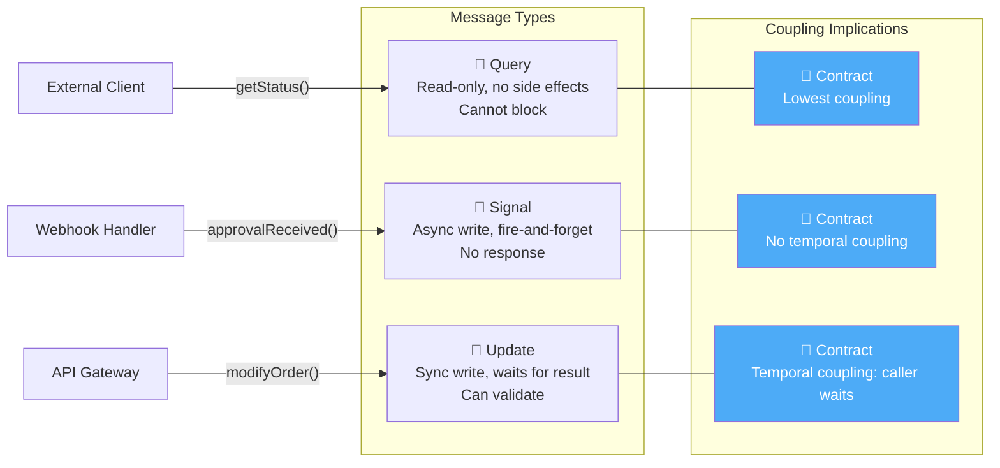
```mermaid
flowchart LR
    subgraph messages ["Message Types"]
        direction TB
        Q["📖 Query<br/>Read-only, no side effects<br/>Cannot block"]
        S["📨 Signal<br/>Async write, fire-and-forget<br/>No response"]
        U["🔄 Update<br/>Sync write, waits for result<br/>Can validate"]
    end

    Client[External Client] -->|"getStatus()"| Q
    Webhook[Webhook Handler] -->|"approvalReceived()"| S
    API[API Gateway] -->|"modifyOrder()"| U

    subgraph coupling ["Coupling Implications"]
        direction TB
        QC["🔵 Contract<br/>Lowest coupling"]
        SC["🔵 Contract<br/>No temporal coupling"]
        UC["🔵 Contract<br/>Temporal coupling: caller waits"]
    end

    Q --- QC
    S --- SC
    U --- UC

    style QC fill:#4dabf7,color:#fff
    style SC fill:#4dabf7,color:#fff
    style UC fill:#4dabf7,color:#fff
```

| Message Type | Coupling Strength                                                   | Temporal Coupling                                  | Best For                                          |
| ------------ | ------------------------------------------------------------------- | -------------------------------------------------- | ------------------------------------------------- |
| **Query**    | 🔵 Contract — caller knows only the query name and return type      | None — queries don't block the Workflow            | Read-only status checks, progress reporting       |
| **Signal**   | 🔵 Contract — caller knows only the signal name and payload shape   | None — fire and forget, caller doesn't wait        | External events, approval webhooks, cancellations |
| **Update**   | 🔵 Contract — caller knows the update name, arguments, and return type | Present — caller blocks until the Update completes | Operations that need validation or a response     |

All three are Contract coupling; the caller shares only a name and a payload shape. They differ in temporal coupling. Signals are to Updates what text messages are to phone calls (see the [ELI5 in Coupling in Practice](coupling-in-practice.md#eli5-3)). Prefer Signals for writes where the caller does not need an immediate response.

### Child Workflows and Distance

[Child Workflows](https://docs.temporal.io/develop/typescript/child-workflows) manage the **distance** dimension. When a Workflow orchestrates a sub-process, a Child Workflow creates a clean boundary:

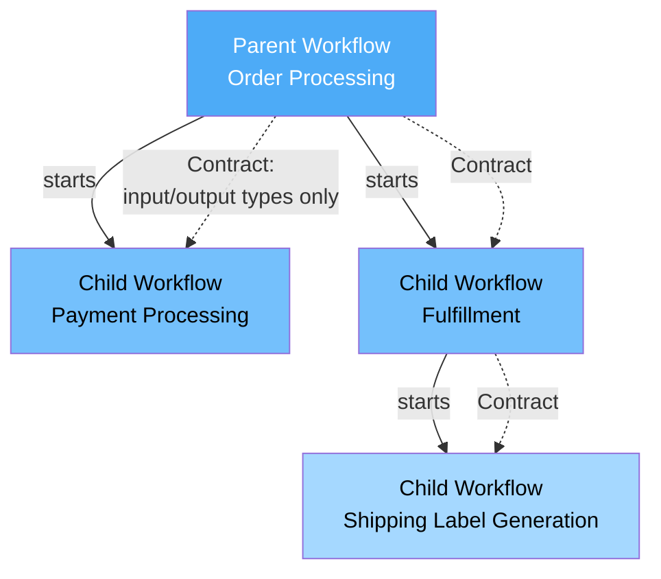
```mermaid
flowchart TD
    PW["Parent Workflow<br/>Order Processing"] -->|"starts"| CW1["Child Workflow<br/>Payment Processing"]
    PW -->|"starts"| CW2["Child Workflow<br/>Fulfillment"]
    CW2 -->|"starts"| CW3["Child Workflow<br/>Shipping Label Generation"]

    PW -.->|"Contract:<br/>input/output types only"| CW1
    PW -.->|"Contract"| CW2
    CW2 -.->|"Contract"| CW3

    style PW fill:#4dabf7,color:#fff
    style CW1 fill:#74c0fc,color:#000
    style CW2 fill:#74c0fc,color:#000
    style CW3 fill:#a5d8ff,color:#000
```

| Aspect                 | Same Workflow                                              | Child Workflow                                                           |
| ---------------------- | ---------------------------------------------------------- | ------------------------------------------------------------------------ |
| **Distance**           | 🟢 Low — same execution context                            | 🟡 Medium — separate execution, separate Event History                   |
| **Failure isolation**  | No isolation — one failure affects entire Workflow         | Isolated — parent can handle child failure independently                 |
| **Lifecycle coupling** | Coupled — everything deploys and scales together           | Decoupled — child can run on different Workers, different Task Queues    |
| **When to use**        | Steps that are tightly cohesive and always change together | Sub-processes owned by different teams, or that need independent scaling |

This maps directly to the [granularity disintegrators and integrators](brownfield-strategies.md#sizing-your-components) from the Brownfield Strategies guide. Use Child Workflows when you see disintegrators (different volatility, different scaling needs, different ownership). Keep steps in a single Workflow when integrators dominate (shared transactions, tight data relationships, same rate of change).

---

## Coupling Analysis: Hand-Rolled vs. Durable Orchestration

Let's compare the same order processing workflow implemented three ways: synchronous chain, hand-rolled saga, and Temporal Workflow.

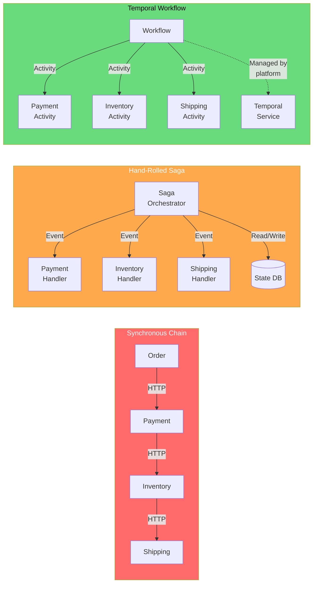
```mermaid
flowchart LR
    subgraph sync ["Synchronous Chain"]
        S1[Order] -->|"HTTP"| S2[Payment]
        S2 -->|"HTTP"| S3[Inventory]
        S3 -->|"HTTP"| S4[Shipping]
    end

    subgraph saga ["Hand-Rolled Saga"]
        SA1[Saga<br/>Orchestrator] -->|"Event"| SA2[Payment<br/>Handler]
        SA1 -->|"Event"| SA3[Inventory<br/>Handler]
        SA1 -->|"Event"| SA4[Shipping<br/>Handler]
        SA1 -->|"Read/Write"| DB1[(State DB)]
    end

    subgraph temporal ["Temporal Workflow"]
        T1["Workflow"] -->|"Activity"| T2[Payment<br/>Activity]
        T1 -->|"Activity"| T3[Inventory<br/>Activity]
        T1 -->|"Activity"| T4[Shipping<br/>Activity]
        T1 -.->|"Managed by<br/>platform"| TS[Temporal<br/>Service]
    end

    style sync fill:#ff6b6b,color:#fff
    style saga fill:#ffa94d,color:#fff
    style temporal fill:#69db7c,color:#000
```

| Dimension                 | Synchronous Chain                                                                                      | Hand-Rolled Saga                                                                             | Temporal Workflow                                                                                  |
| ------------------------- | ------------------------------------------------------------------------------------------------------ | -------------------------------------------------------------------------------------------- | -------------------------------------------------------------------------------------------------- |
| **Integration Strength**  | 🟢 Model — services pass each other's domain models and error shapes over HTTP                          | 🟠 Functional — each compensation handler re-implements the inverse of a forward step; the two must co-evolve | 🔵 Contract — Workflow knows only Activity function signatures                                       |
| **Distance**              | 🔴 High — separately deployed services                                                                   | 🔴 High — separately deployed handlers behind an event bus                                                    | 🟡 Medium — Activities may run on other Workers, but often in the same deployable                    |
| **Volatility**            | 🔴 High — the order process is core domain in all three columns                                          | 🔴 High — same process                                                                                        | 🔴 High — same process                                                                               |
| **Change propagation**    | A new step changes every service in the chain                                                            | A new step means a new handler, an orchestrator change, and a state-schema migration                          | A new step is one more Activity call in the Workflow                                                 |
| **Temporal Coupling**     | 🔴 All services must be running simultaneously                                                           | 🟢 None — async events decouple availability                                                                  | 🟢 None — Activity Tasks wait in the Task Queue until a Worker polls them                            |
| **Accidental Complexity** | 🔴 Manual rollback, no state tracking, no retry logic                                                    | 🟠 Custom state machine, custom retry, custom dead letter handling                                             | 🟢 Platform provides state, retries, timeouts, visibility                                            |
| **Verdict**               | ❌ Model strength at high distance: `STRENGTH XOR DISTANCE` is false                                    | ❌ Functional strength at high distance. Async removed temporal coupling, not the shared knowledge             | ✅ Contract strength: the XOR holds whatever the distance                                            |

### ELI5: Three Approaches

> 🍕 **Ordering pizza.**
>
> - **Synchronous chain**: You call the pizza shop, they put you on hold while they call the cheese supplier, who puts them on hold while they call the dairy farm. If the dairy farmer is on lunch break, nobody gets pizza. 🔴
> - **Hand-rolled saga**: You text the pizza shop. They text the cheese supplier. Everyone communicates by text (async), but you built the texting app yourself, and you're also responsible for keeping track of who's been texted and what to do if someone doesn't reply. 🟡
> - **Temporal Workflow**: You write down the steps ("order cheese, make dough, bake pizza, deliver") and hand them to a reliable assistant (Temporal). The assistant tracks progress, retries if a step fails, and tells you when it's done. You focus on the recipe, not the logistics. 🟢

---

## The Saga Pattern: Before and After Temporal

The [Saga pattern](coupling-references.md#glossary), a sequence of local transactions with compensating actions on failure, is the standard answer to distributed transactions. Implementing it from scratch brings its own coupling.

### TypeScript — Before: Hand-rolled saga with scattered compensation

```typescript
// ❌ Hand-rolled saga — compensation logic is scattered and error-prone
class OrderSagaOrchestrator {
  private state: SagaState;

  constructor(
    private stateDb: Pool, // Coupled to state DB schema
    private eventBus: EventBus, // Coupled to event bus implementation
    private retryConfig: RetryConfig, // Custom retry configuration
    private deadLetterQueue: DeadLetterQ, // Custom DLQ for unprocessable events
  ) {}

  async execute(order: OrderRequest): Promise<void> {
    const sagaId = crypto.randomUUID();

    // ❌ Manual state persistence — coupled to DB schema
    await this.stateDb.query(
      `INSERT INTO saga_state (id, step, status, data, created_at)
       VALUES ($1, 'payment', 'pending', $2, NOW())`,
      [sagaId, JSON.stringify(order)],
    );

    try {
      // ❌ Manual retry logic — duplicated across all steps
      const paymentId = await this.withRetry(
        () => this.chargePayment(order),
        this.retryConfig.payment,
      );

      // ❌ Must manually track completed steps for compensation
      await this.stateDb.query(
        `UPDATE saga_state SET step = 'inventory', status = 'in_progress',
         completed_steps = completed_steps || $1
         WHERE id = $2`,
        [JSON.stringify({ payment: paymentId }), sagaId],
      );

      const reservationId = await this.withRetry(
        () => this.reserveInventory(order),
        this.retryConfig.inventory,
      );

      await this.stateDb.query(
        `UPDATE saga_state SET step = 'shipping', status = 'in_progress',
         completed_steps = completed_steps || $1
         WHERE id = $2`,
        [JSON.stringify({ inventory: reservationId }), sagaId],
      );

      await this.withRetry(
        () => this.createShipment(order, reservationId),
        this.retryConfig.shipping,
      );

      await this.stateDb.query(
        `UPDATE saga_state SET status = 'completed' WHERE id = $1`,
        [sagaId],
      );
    } catch (error) {
      // ❌ Compensation logic must mirror forward logic in reverse
      // ❌ What if compensation ALSO fails? Need compensation for compensation...
      await this.compensate(sagaId);
    }
  }

  // ❌ Custom retry implementation — this is infrastructure, not business logic
  private async withRetry<T>(
    fn: () => Promise<T>,
    config: { maxAttempts: number; backoff: number },
  ): Promise<T> {
    let lastError: Error;
    for (let i = 0; i < config.maxAttempts; i++) {
      try {
        return await fn();
      } catch (e) {
        lastError = e as Error;
        await new Promise((r) =>
          setTimeout(r, config.backoff * Math.pow(2, i)),
        );
      }
    }
    throw lastError!;
  }

  // ❌ Compensation must be manually maintained in sync with forward path
  private async compensate(sagaId: string): Promise<void> {
    const state = await this.stateDb.query(
      `SELECT completed_steps FROM saga_state WHERE id = $1`,
      [sagaId],
    );
    const steps = state.rows[0].completed_steps;

    // ❌ Reverse-order compensation — fragile and must mirror forward path
    if (steps.inventory) {
      await this.releaseInventory(steps.inventory).catch((e) => {
        // ❌ If compensation fails, send to dead letter queue
        this.deadLetterQueue.push({
          type: "release_inventory",
          data: steps.inventory,
          error: e,
        });
      });
    }
    if (steps.payment) {
      await this.refundPayment(steps.payment).catch((e) => {
        this.deadLetterQueue.push({
          type: "refund_payment",
          data: steps.payment,
          error: e,
        });
      });
    }
  }
}
```

**Coupling audit of the hand-rolled saga:**

| Accidental Coupling      | What It Costs                                                                              |
| ------------------------ | ------------------------------------------------------------------------------------------ |
| State DB schema          | Every new saga step = schema migration                                                     |
| Custom retry logic       | Duplicated across services, tested independently                                           |
| Event bus implementation | Locked into specific messaging infrastructure                                              |
| Dead letter queue        | Custom error handling that must be monitored                                               |
| Compensation mirroring   | Forward and reverse paths must stay in sync — if you add a step, you must add compensation |

### TypeScript — After: Temporal Workflow with built-in saga support

```typescript
// ✅ Temporal Workflow — compensation is co-located, retries are configuration
import { proxyActivities, ApplicationFailure } from "@temporalio/workflow";
import type { OrderActivities } from "./activities";
import type { OrderRequest, OrderResult } from "./types";

const activities = proxyActivities<OrderActivities>({
  startToCloseTimeout: "30s",
  retry: {
    maximumAttempts: 3,
    initialInterval: "1s",
    backoffCoefficient: 2,
  },
});

export async function orderWorkflow(order: OrderRequest): Promise<OrderResult> {
  // Compensation stack — clean, co-located, readable
  const compensations: Array<[name: string, run: () => Promise<void>]> = [];

  try {
    // Step 1: Payment
    const paymentId = await activities.validatePayment(
      order.id,
      order.customerId,
      order.paymentMethodId,
      order.total,
    );
    compensations.push(["refundPayment", () => activities.refundPayment(paymentId)]);

    // Step 2: Inventory
    const reservationId = await activities.reserveInventory(
      order.id,
      order.productId,
      order.quantity,
    );
    compensations.push(["releaseInventory", () => activities.releaseInventory(reservationId)]);

    // Step 3: Shipment
    const shipmentId = await activities.createShipment(
      order.address,
      reservationId,
    );

    return { status: "confirmed", paymentId, reservationId, shipmentId };
  } catch (err) {
    // Compensate in reverse order. Each compensation is an Activity with its
    // own retry policy. One that exhausts its retries must not stop the rest,
    // and must not be forgotten: it is named in the Workflow failure so an
    // operator or a follow-up Workflow can finish it.
    const unfinished: string[] = [];
    for (const [name, compensate] of compensations.reverse()) {
      try {
        await compensate();
      } catch {
        unfinished.push(name);
      }
    }
    throw ApplicationFailure.nonRetryable(
      `Order failed: ${err instanceof Error ? err.message : "unknown"}`,
      "OrderFailed",
      { unfinishedCompensations: unfinished },
    );
  }
}
```

A refund that still fails after its retries is a money problem, not a logging problem. The `unfinishedCompensations` detail is the durable record; what acts on it (an alert, a Signal to an operator Workflow, a scheduled retry) is a design decision this example leaves to you.

**What disappeared:**

| Eliminated Coupling                 | Why                                                               |
| ----------------------------------- | ----------------------------------------------------------------- |
| State DB schema and queries         | Temporal's Event History replaces your state store                |
| Custom retry logic                  | `retry` policy in `proxyActivities` config                        |
| Event bus and handlers              | Direct Activity calls — Temporal handles the dispatch             |
| Dead letter queue                   | A failed Workflow carries its history and the names of unfinished compensations. Something still has to act on them |
| Separate compensation orchestration | Compensation stack lives in the same function as the forward path |

**What remains:**

| Remaining Coupling           | Why It's Necessary                                                       |
| ---------------------------- | ------------------------------------------------------------------------ |
| Activity function signatures | This is **contract coupling** — the minimum shared knowledge             |
| Temporal SDK                 | Platform coupling (analyzed in [Coupling Tradeoffs](#platform-coupling)) |
| Business logic sequence      | This is the _actual domain logic_ — irreducible                          |

---

## Where Temporal Sits in the Three C's

The [Three C's](three-cs-distributed-transactions.md) split sagas into eight topologies along Communication, Consistency, and Coordination. Temporal fixes two of the three and leaves one to you:

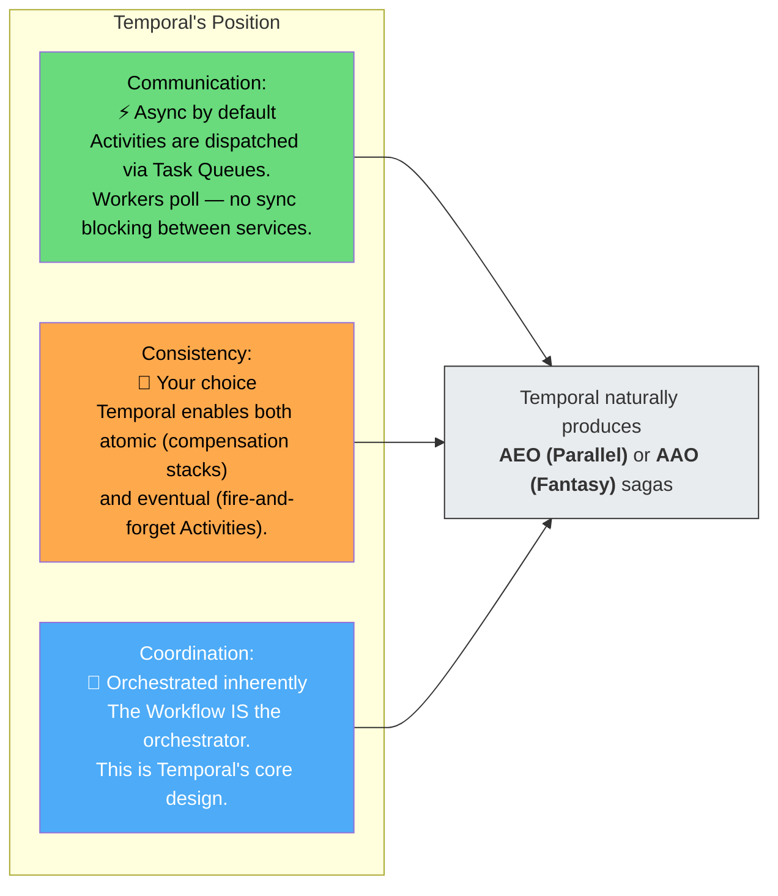
```mermaid
flowchart LR
    subgraph temporal_3c ["Temporal's Position"]
        direction TB
        COMM["Communication:<br/>⚡ Async by default<br/>Activities are dispatched via Task Queues.<br/>Workers poll — no sync blocking between services."]
        CONS["Consistency:<br/>🔀 Your choice<br/>Temporal enables both atomic (compensation stacks)<br/>and eventual (fire-and-forget Activities)."]
        COORD["Coordination:<br/>🎯 Orchestrated inherently<br/>The Workflow IS the orchestrator.<br/>This is Temporal's core design."]
    end

    COMM --> Position["Temporal naturally produces<br/><strong>AEO (Parallel)</strong> or <strong>AAO (Fantasy)</strong> sagas"]
    CONS --> Position
    COORD --> Position

    style COMM fill:#69db7c,color:#000
    style CONS fill:#ffa94d,color:#000
    style COORD fill:#4dabf7,color:#fff
    style Position fill:#e9ecef,stroke:#333
```

| C                 | Temporal's Default                                                           | Why                                                                                                                                                                                                                                                                 | Flexibility                                                                                                                                                                                                                            |
| ----------------- | ---------------------------------------------------------------------------- | ------------------------------------------------------------------------------------------------------------------------------------------------------------------------------------------------------------------------------------------------------------------- | -------------------------------------------------------------------------------------------------------------------------------------------------------------------------------------------------------------------------------------- |
| **Communication** | **Async** — Activities are dispatched to Task Queues and executed by Workers | Workers poll the Temporal Service for tasks. The Workflow never makes a synchronous call to another service.                                                                                                                                                        | Activities _can_ make sync calls internally (e.g., HTTP to a payment API), but Workflow ↔ Activity communication is always async.                                                                                                      |
| **Consistency**   | **Your choice** — Temporal supports both atomic and eventual patterns        | The compensation stack pattern shown in the [Durable Execution guide](durable-execution-orchestration.md#typescript--after-temporal-workflow-with-built-in-saga-support) provides atomic semantics. Dropping the compensation stack gives you eventual consistency. | You decide per-Workflow. Some Workflows need rollback; others just fire-and-forget Activities and accept eventual convergence.                                                                                                         |
| **Coordination**  | **Orchestrated** — the Workflow _is_ the orchestrator by definition          | Temporal's core primitive is the Workflow: a central, deterministic function that coordinates Activities, Timers, Signals, and Child Workflows.                                                                                                              | If you want choreography, Temporal isn't the right tool — use an event bus (SNS, EventBridge, Kafka). You _can_ combine both: a Temporal Workflow orchestrates one bounded context while communicating with other contexts via events. |

**With compensation:** Temporal produces **AAO (Fantasy)** sagas: async communication, atomic consistency through the compensation stack, orchestrated coordination. The platform handles the retries, state, and timeouts that make this pattern painful to hand-roll.

**Without compensation:** Temporal produces **AEO (Parallel)** sagas: async communication, eventual consistency, orchestrated coordination. Centralized visibility with no rollback logic.

**What Temporal rules out:** a **Horror (AAC)** saga cannot be built inside a Temporal Workflow, because the Workflow _is_ the orchestrator. The platform steers you away from the topology with the most entangled compensation logic.

👉 **[Read the full Three C's guide →](three-cs-distributed-transactions.md)** for the eight species and the recommendations.

---

## Coupling Tradeoffs Temporal Introduces

Temporal trades accidental coupling for deliberate, bounded platform coupling. These are the terms of the trade.

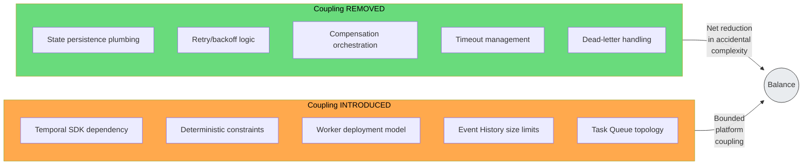
```mermaid
flowchart LR
    subgraph removed ["Coupling REMOVED"]
        R1["State persistence plumbing"]
        R2["Retry/backoff logic"]
        R3["Compensation orchestration"]
        R4["Timeout management"]
        R5["Dead-letter handling"]
    end

    subgraph introduced ["Coupling INTRODUCED"]
        I1["Temporal SDK dependency"]
        I2["Deterministic constraints"]
        I3["Worker deployment model"]
        I4["Event History size limits"]
        I5["Task Queue topology"]
    end

    removed -->|"Net reduction<br/>in accidental<br/>complexity"| Balance((Balance))
    introduced -->|"Bounded<br/>platform<br/>coupling"| Balance

    style removed fill:#69db7c,color:#000
    style introduced fill:#ffa94d,color:#000
    style Balance fill:#e9ecef,stroke:#333
```

### Platform Coupling

Adopting Temporal means coupling your orchestration layer to the Temporal SDK and Service. Through the coupling dimensions:

| Dimension                | Assessment | Rationale                                                                                                                                                                           |
| ------------------------ | ---------- | ----------------------------------------------------------------------------------------------------------------------------------------------------------------------------------- |
| **Integration Strength** | 🔵 Contract | Your Workflows call the SDK's public API (`proxyActivities`, `defineSignal`, and so on). The SDK does not reach into your domain.                                                   |
| **Distance**             | 🟡 Medium   | The Temporal Service is a separate infrastructure component (self-hosted or Cloud), but Workers run in your infrastructure with your code.                                         |
| **Volatility**           | 🟢 Low      | The Workflow, Activity, and Signal primitives are versioned public API.                                                                                                             |

**Verdict:** ✅ Contract coupling at medium distance with low volatility: the XOR holds and low volatility backs it up. This is the same position as coupling to a database driver or HTTP framework.

#### When platform coupling becomes a concern

Platform coupling _does_ become dangerous when:

- **Temporal concepts leak into your domain model.** If your entities carry `WorkflowId` fields or your APIs expose Temporal types, the platform has become part of your domain model, and every consumer of that model now inherits Model coupling to Temporal.
- **You build infrastructure abstractions on top of Temporal.** Wrapping Temporal in a generic "workflow engine" interface adds a layer without reducing coupling. You are now coupled to both your abstraction _and_ Temporal.

**Mitigation:** Keep Temporal primitives at the orchestration layer. Your domain model, Activities, and external API contracts should be Temporal-unaware. This follows the same principle as keeping ORM types out of your API responses.

### Deterministic Constraints

Temporal Workflows must be [deterministic](https://docs.temporal.io/develop/): no direct calls to external services, no random numbers, no system clock. A Worker recovers a Workflow's state by replaying its code against the Event History, so the code has to produce the same commands every time.

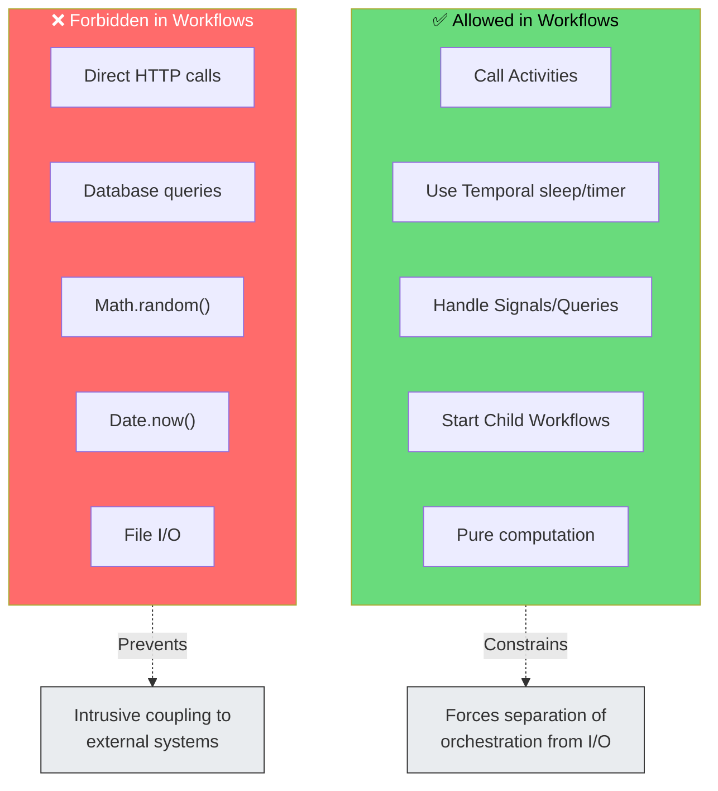
```mermaid
flowchart TB
    subgraph allowed ["✅ Allowed in Workflows"]
        A1["Call Activities"]
        A2["Use Temporal sleep/timer"]
        A3["Handle Signals/Queries"]
        A4["Start Child Workflows"]
        A5["Pure computation"]
    end

    subgraph forbidden ["❌ Forbidden in Workflows"]
        F1["Direct HTTP calls"]
        F2["Database queries"]
        F3["Math.random()"]
        F4["Date.now()"]
        F5["File I/O"]
    end

    allowed -.->|"Constrains"| Quality["Forces separation of<br/>orchestration from I/O"]
    forbidden -.->|"Prevents"| BadCoupling["Intrusive coupling to<br/>external systems"]

    style allowed fill:#69db7c,color:#000
    style forbidden fill:#ff6b6b,color:#fff
    style Quality fill:#e9ecef,stroke:#333
    style BadCoupling fill:#e9ecef,stroke:#333
```

Determinism is a forcing function. Every I/O has to go through an Activity, so the Workflow cannot reach into another service's database the way the [intrusive examples](coupling-dimensions.md#level-1-intrusive-coupling--highest-risk) do. It does not stop an Activity from doing so; it moves the decision to one visible place.

This is the same move pure functional programming makes by pushing side effects to the edges. The cost is that developers have to learn what belongs in a Workflow and what belongs in an Activity.

### Event History Limits and Versioning

Two more constraints follow from replay. First, the Event History is finite: the Temporal Service [warns after 10,240 Events and terminates the Workflow Execution past 51,200 Events, 2,000 Updates, or 10,000 Signals](https://docs.temporal.io/workflow-execution/event). A Workflow that loops forever over Activities has to hand off to a fresh execution with [Continue-As-New](https://docs.temporal.io/develop/typescript/continue-as-new). Second, changing Workflow code while executions are in flight breaks replay unless the change is gated with the SDK's [versioning API](https://docs.temporal.io/develop/typescript/versioning) (`patched()` in TypeScript). Both are lifecycle coupling between your code and the platform's persisted state: the history is the shared knowledge, and it outlives any single deploy.

### Worker Architecture and Deployment Coupling

Temporal [Workers](https://docs.temporal.io/evaluate/understanding-temporal#workers) are the processes that execute your Workflows and Activities. The Worker architecture introduces a coupling dimension that doesn't exist in simple request-response services:

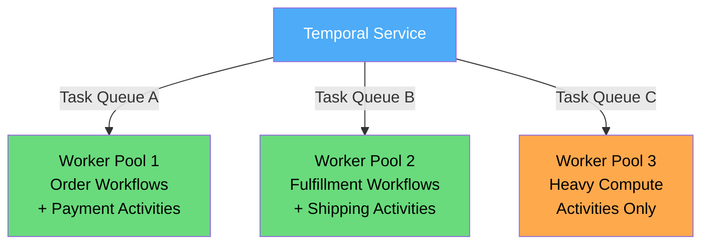
```mermaid
flowchart TD
    TS[Temporal Service] -->|"Task Queue A"| W1[Worker Pool 1<br/>Order Workflows<br/>+ Payment Activities]
    TS -->|"Task Queue B"| W2[Worker Pool 2<br/>Fulfillment Workflows<br/>+ Shipping Activities]
    TS -->|"Task Queue C"| W3[Worker Pool 3<br/>Heavy Compute<br/>Activities Only]

    style TS fill:#4dabf7,color:#fff
    style W1 fill:#69db7c,color:#000
    style W2 fill:#69db7c,color:#000
    style W3 fill:#ffa94d,color:#000
```

| Design Decision                                  | Coupling Impact                                                 | Guidance                                                                                        |
| ------------------------------------------------ | --------------------------------------------------------------- | ----------------------------------------------------------------------------------------------- |
| **All Workflows and Activities in one Worker**   | 🔴 High lifecycle coupling — everything deploys together        | Acceptable for small teams or early-stage projects. Simple to operate.                          |
| **Workflows and Activities in separate Workers** | 🟡 Medium — Workflows and Activities scale independently        | Good default. Activities that call external APIs can scale separately from orchestration logic. |
| **Task Queue per team/domain**                   | 🟢 Low — teams deploy independently, different scaling profiles | Best for organization-scale adoption. Maps to bounded contexts.                                 |

This mirrors the [service-based architecture vs. microservices](brownfield-strategies.md#phase-3-choose-a-target-architecture-style) decision from the Brownfield Strategies guide. Start coarse, split when you see disintegrators.

---

## Use Case Decision Framework Through a Coupling Lens

Three questions decide whether Temporal fits a use case. Each maps to a coupling dimension:

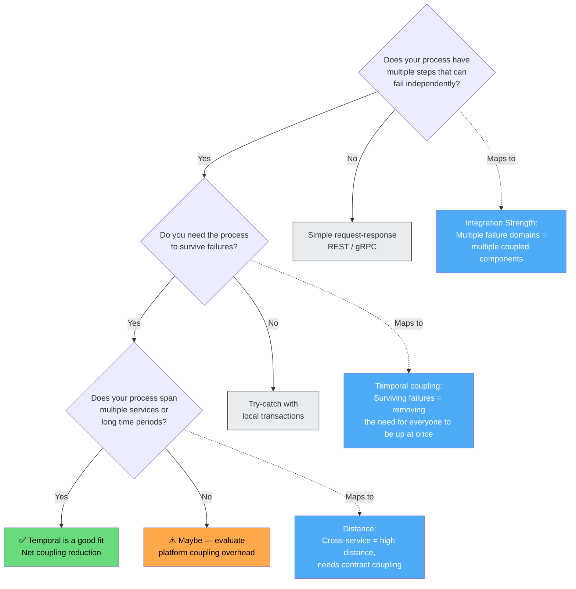
```mermaid
flowchart TD
    Q1{"Does your process have<br/>multiple steps that can<br/>fail independently?"}
    Q1 -->|"Yes"| Q2{"Do you need the process<br/>to survive failures?"}
    Q1 -->|"No"| Alt1["Simple request-response<br/>REST / gRPC"]

    Q2 -->|"Yes"| Q3{"Does your process span<br/>multiple services or<br/>long time periods?"}
    Q2 -->|"No"| Alt2["Try-catch with<br/>local transactions"]

    Q3 -->|"Yes"| Fit["✅ Temporal is a good fit<br/>Net coupling reduction"]
    Q3 -->|"No"| Maybe["⚠️ Maybe — evaluate<br/>platform coupling overhead"]

    Q1 -.->|"Maps to"| IS["Integration Strength:<br/>Multiple failure domains =<br/>multiple coupled components"]
    Q2 -.->|"Maps to"| VOL["Temporal coupling:<br/>Surviving failures = removing<br/>the need for everyone to be up at once"]
    Q3 -.->|"Maps to"| DIST["Distance:<br/>Cross-service = high distance,<br/>needs contract coupling"]

    style Fit fill:#69db7c,color:#000
    style Alt1 fill:#e9ecef,stroke:#333
    style Alt2 fill:#e9ecef,stroke:#333
    style Maybe fill:#ffa94d,color:#000
    style IS fill:#4dabf7,color:#fff
    style VOL fill:#4dabf7,color:#fff
    style DIST fill:#4dabf7,color:#fff
```

### When Temporal Reduces Net Coupling

Based on the [Temporal use cases](https://docs.temporal.io/evaluate/use-cases-design-patterns), these scenarios benefit most:

| Use Case                                                         | Without Temporal (Coupling)                                              | With Temporal (Coupling)                                                        | Net Effect          |
| ---------------------------------------------------------------- | ------------------------------------------------------------------------ | ------------------------------------------------------------------------------- | ------------------- |
| **Business transactions** (payment processing, order management) | 🔴 Intrusive — services share state, retry logic, compensation code      | 🔵 Contract — Workflow orchestrates via Activity contracts                      | ✅ Strong reduction |
| **Long-running processes** (mortgage underwriting, onboarding)   | 🔴 Intrusive — custom state machines, timer services, timeout handling   | 🔵 Contract — Workflow sleeps and wakes durably; Signals for human input        | ✅ Strong reduction |
| **Saga/distributed transactions**                                | 🟠 Functional — compensation logic mirrors forward logic across services | 🔵 Contract — compensation co-located in Workflow with automatic retries        | ✅ Strong reduction |
| **Human-in-the-loop** (approvals, reviews)                       | 🟠 Functional — custom wait/notify, polling, timeout infrastructure      | 🔵 Contract — Signals + `condition()` for waiting, Timers for deadlines         | ✅ Strong reduction |
| **AI agents** (tool orchestration, long-running inference)       | 🟠 Functional — state management for conversations, tool retry, memory   | 🔵 Contract — durable state for agent memory; Activity contracts for tool calls | ✅ Strong reduction |

### When Temporal Increases Net Coupling

In these cases the platform coupling costs more than the coupling it removes:

| Anti-Pattern                     | Why Temporal Increases Coupling                                                                                                                           | Better Alternative            |
| -------------------------------- | --------------------------------------------------------------------------------------------------------------------------------------------------------- | ----------------------------- |
| **Simple request-response APIs** | No failure recovery needed. Adding Temporal introduces SDK coupling, Worker deployment, and Temporal Service dependency for zero benefit.                 | REST / gRPC server            |
| **Real-time stream processing**  | Per-event durability adds latency to every step; a stream processor amortizes it across a batch.                                                          | Flink, Kafka Streams, Kinesis |
| **Database triggers**            | Logic is tightly coupled to the database by design. Extracting it into Temporal adds distance without reducing integration strength.                      | Database-native features      |
| **Pure compute workloads**       | No I/O, no state management, no service calls. Temporal's value proposition doesn't apply.                                                                | Lambda, Spark, Ray            |

---

## Temporal and the Three Dimensions: A Summary

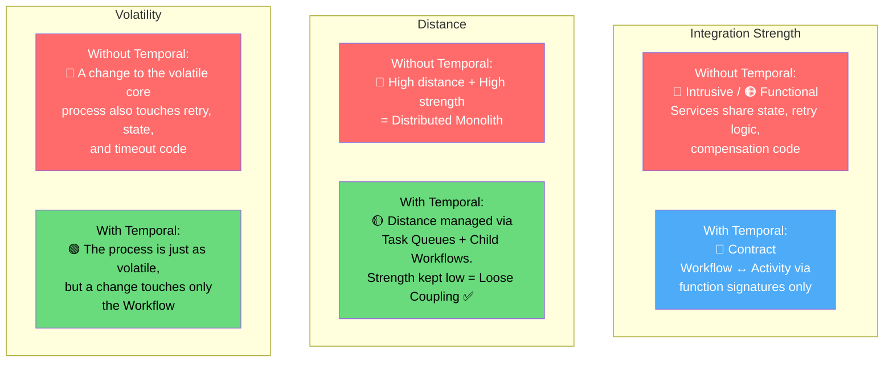
```mermaid
flowchart TB
    subgraph strength ["Integration Strength"]
        S1["Without Temporal:<br/>🔴 Intrusive / 🟠 Functional<br/>Services share state, retry logic,<br/>compensation code"]
        S2["With Temporal:<br/>🔵 Contract<br/>Workflow ↔ Activity via<br/>function signatures only"]
    end

    subgraph distance ["Distance"]
        D1["Without Temporal:<br/>🔴 High distance + High strength<br/>= Distributed Monolith"]
        D2["With Temporal:<br/>🟡 Distance managed via<br/>Task Queues + Child Workflows.<br/>Strength kept low = Loose Coupling ✅"]
    end

    subgraph volatility ["Volatility"]
        V1["Without Temporal:<br/>🔴 A change to the volatile core<br/>process also touches retry, state,<br/>and timeout code"]
        V2["With Temporal:<br/>🟢 The process is just as volatile,<br/>but a change touches only<br/>the Workflow"]
    end

    style S1 fill:#ff6b6b,color:#fff
    style S2 fill:#4dabf7,color:#fff
    style D1 fill:#ff6b6b,color:#fff
    style D2 fill:#69db7c,color:#000
    style V1 fill:#ff6b6b,color:#fff
    style V2 fill:#69db7c,color:#000
```

By taking over the infrastructure concerns, Temporal lets you keep integration strength at Contract even when distance is high. That is the loose-coupling cell of the [balance matrix](README.md#balance-the-key-insight):

```
Low Strength + High Distance = Loose Coupling ✅
```

The price is platform coupling, which is Contract coupling to a low-volatility SDK. For multi-step processes that span services and must survive failures, adopting durable execution reduces net coupling.

---

## References

### Temporal Documentation

- [Understanding Temporal](https://docs.temporal.io/evaluate/understanding-temporal) — Core concepts: Durable Execution, Workflows, Activities, Workers
- [Use Cases & Design Patterns](https://docs.temporal.io/evaluate/use-cases-design-patterns) — Production use cases and architectural patterns (Saga, State Machine)
- [Workflow Versioning](https://docs.temporal.io/develop/typescript/versioning) — Changing Workflow code without breaking replay
- [Continue-As-New](https://docs.temporal.io/develop/typescript/continue-as-new) — Staying under Event History limits
- [Activities](https://docs.temporal.io/activities) — Retry semantics and the idempotency recommendation
- [Workflow Message Passing](https://docs.temporal.io/encyclopedia/workflow-message-passing) — Signals, Queries, and Updates
- [Detecting Activity Failures](https://docs.temporal.io/encyclopedia/detecting-activity-failures) — Timeouts and heartbeats
- [Event History](https://docs.temporal.io/encyclopedia/event-history) — How durable execution persists state

### Related Pages in This Guide

- [The Three C's of Distributed Transactions](three-cs-distributed-transactions.md) — Communication, Consistency, Coordination — the Eight Saga Species and where Temporal sits
- [Coupling in Practice — Scenario 4: Temporal Coupling](coupling-in-practice.md#scenario-4-temporal-coupling-in-synchronous-calls) — The synchronous coupling problem that durable execution addresses
- [Brownfield Strategies](brownfield-strategies.md) — Migration patterns for existing systems; Child Workflow granularity maps to component sizing
- [FRP & Coupling](functional-reactive-coupling.md) — Hexagonal architecture in event-driven systems; back-pressure and temporal coupling
- [Coupling Dimensions](coupling-dimensions.md) — The three dimensions (Strength, Distance, Volatility) applied throughout this guide
- [README — Balance](README.md#balance-the-key-insight) — The coupling balance matrix that governs all tradeoff analysis

---

[← Back to Main Guide](README.md) | [← Three C's of Distributed Transactions](three-cs-distributed-transactions.md) | [Next: References →](coupling-references.md)
