# Durable Execution & Orchestration: Coupling Through the Temporal Lens

[← Back to Main Guide](README.md) | [← Coupling in Practice](coupling-in-practice.md) | [← Brownfield Strategies](brownfield-strategies.md)

> _"Temporal simplifies state management and developers don't have to write tons of_
> _extra code to handle every possible thing that could go wrong."_
> — [Temporal Documentation](https://docs.temporal.io/evaluate/understanding-temporal)

Durable execution platforms like [Temporal](https://docs.temporal.io/evaluate/understanding-temporal) fundamentally reshape how coupling manifests in distributed systems. By absorbing failure handling, state persistence, and retry logic into the platform, they eliminate entire categories of accidental coupling — but they also introduce new coupling dimensions that must be understood and balanced.

This guide analyzes durable execution and orchestration **through the lens of the three coupling dimensions** (Integration Strength, Distance, Volatility), shows how Temporal's primitives create coupling boundaries, and examines the tradeoffs teams must negotiate when adopting workflow orchestration.

---

## Table of Contents

- [Overview: The Coupling Problem Temporal Solves](#overview-the-coupling-problem-temporal-solves)
- [Temporal Building Blocks as Coupling Boundaries](#temporal-building-blocks-as-coupling-boundaries)
  - [Workflows: The Orchestration Boundary](#workflows-the-orchestration-boundary)
  - [Activities: The Side-Effect Boundary](#activities-the-side-effect-boundary)
  - [Signals, Queries, and Updates: The Message Boundary](#signals-queries-and-updates-the-message-boundary)
  - [Child Workflows and Distance](#child-workflows-and-distance)
- [Coupling Analysis: Hand-Rolled vs. Durable Orchestration](#coupling-analysis-hand-rolled-vs-durable-orchestration)
- [The Saga Pattern: Before and After Temporal](#the-saga-pattern-before-and-after-temporal)
- [Coupling Tradeoffs Temporal Introduces](#coupling-tradeoffs-temporal-introduces)
  - [Platform Coupling](#platform-coupling)
  - [Deterministic Constraints](#deterministic-constraints)
  - [Worker Architecture and Deployment Coupling](#worker-architecture-and-deployment-coupling)
- [Use Case Decision Framework Through a Coupling Lens](#use-case-decision-framework-through-a-coupling-lens)
  - [When Temporal Reduces Net Coupling](#when-temporal-reduces-net-coupling)
  - [When Temporal Increases Net Coupling](#when-temporal-increases-net-coupling)
- [Temporal and the Three Dimensions: A Summary](#temporal-and-the-three-dimensions-a-summary)
- [References](#references)

---

## Overview: The Coupling Problem Temporal Solves

In [Scenario 4 of Coupling in Practice](coupling-in-practice.md#scenario-4-temporal-coupling-in-synchronous-calls), we saw how synchronous service-to-service calls create **temporal coupling** — both services must be available at the same time. The hand-rolled solution was a saga orchestrator with an event bus. It works, but it forces developers to manage:

1. **State persistence** — tracking where the process is and what has completed
2. **Retry logic** — deciding when, how often, and with what backoff to retry
3. **Compensation** — rolling back completed steps when a later step fails
4. **Timeout management** — detecting hung operations and acting on them
5. **Idempotency** — ensuring retried operations don't cause duplicate effects
6. **Visibility** — understanding what's happening in a running process

Each of these concerns creates its own coupling surface. State persistence couples you to a database schema. Retry logic duplicates across services. Compensation logic must mirror the forward logic. Timeout values are scattered across configuration files.


**Temporal absorbs concerns 1–6 into the platform.** The Temporal Service maintains a durable [Event History](https://docs.temporal.io/encyclopedia/event-history) — a complete log of every step in a Workflow Execution. If a Worker crashes, it replays from the Event History and resumes from the point of failure. Retries, timeouts, and heartbeats are configuration, not code.

### ELI5: Durable Execution

> 💾 **Think of a video game with autosave.**
>
> - **Without durable execution**: You're playing a game with no save feature. If the power goes out, you start from the beginning. So you write down your progress on a notepad (state persistence), memorize which levels you've cleared (idempotency), and keep a list of items to return if you need to undo something (compensation). You spend more time managing your notes than playing the game.
> - **With durable execution**: The game autosaves after every meaningful action. Power goes out? You resume exactly where you left off. You focus on playing the game (business logic), not managing save files.

---

## Temporal Building Blocks as Coupling Boundaries

Temporal's primitives map cleanly to coupling boundaries. Each primitive controls _what knowledge is shared_ and _at what distance_.


### Workflows: The Orchestration Boundary

A [Temporal Workflow](https://docs.temporal.io/evaluate/understanding-temporal#workflow) is your business logic defined in code — a deterministic function that orchestrates the sequence of steps in a process. The Workflow is the **coupling boundary** between your orchestration logic and the outside world.

| Coupling Property        | How Workflows Manage It                                                                                                                                    |
| ------------------------ | ---------------------------------------------------------------------------------------------------------------------------------------------------------- |
| **Integration Strength** | 🔵 Contract — Workflows communicate with the outside world only through Activities, Signals, Queries, and Updates. Each is a defined contract.             |
| **Encapsulation**        | Workflow state is private. External code cannot read or mutate it directly — only through defined message handlers.                                        |
| **Determinism**          | Workflows must be deterministic (no direct I/O, no random, no system clock). This constraint _enforces_ separation between orchestration and side effects. |

#### TypeScript — Workflow as a coupling boundary

```typescript
// ✅ The Workflow is pure orchestration — it knows WHAT to do, not HOW
import {
  proxyActivities,
  defineSignal,
  setHandler,
  condition,
} from "@temporalio/workflow";
import type { OrderActivities } from "./activities";

const {
  validatePayment,
  reserveInventory,
  createShipment,
  refundPayment,
  releaseInventory,
} = proxyActivities<OrderActivities>({
  startToCloseTimeout: "30s",
  retry: { maximumAttempts: 3 },
});

// Contract: the Signal shape is the only shared knowledge
export const cancelOrderSignal = defineSignal<[string]>("cancelOrder");

export async function orderWorkflow(order: OrderRequest): Promise<OrderResult> {
  let cancelled = false;
  setHandler(cancelOrderSignal, () => {
    cancelled = true;
  });

  // Step 1: Payment
  const paymentId = await validatePayment(order.customerId, order.total);

  if (cancelled) {
    await refundPayment(paymentId);
    return { status: "cancelled" };
  }

  // Step 2: Inventory
  const reservationId = await reserveInventory(order.productId, order.quantity);

  if (cancelled) {
    await releaseInventory(reservationId);
    await refundPayment(paymentId);
    return { status: "cancelled" };
  }

  // Step 3: Shipment
  const shipmentId = await createShipment(order.address, reservationId);

  return { status: "confirmed", paymentId, reservationId, shipmentId };
}
```

**What's notable from a coupling perspective:**

- The Workflow knows _what_ to do (validate payment → reserve inventory → create shipment) but not _how_ those things happen.
- Activities are accessed through `proxyActivities` — a contract-based proxy. The Workflow never imports the Activity _implementations_, only their _type signatures_.
- Compensation (refund, release) is co-located with the business logic, not scattered across event handlers.
- The Signal handler shows contract coupling: external callers know only the signal name and shape, not the Workflow's internal state.

### Activities: The Side-Effect Boundary

[Activities](https://docs.temporal.io/evaluate/understanding-temporal#activities) are the units of work that interact with the outside world — API calls, database writes, file operations. They are the **I/O boundary** that separates deterministic orchestration from non-deterministic side effects.


This boundary serves the same purpose as the **Ports & Adapters** (hexagonal architecture) pattern — the Workflow is the application core, Activities are the adapters. See [aws-lambda-stream's hexagonal analysis](functional-reactive-coupling.md#hexagonal-architecture-at-nano-micro-and-macro-levels) for how this same principle manifests in event-driven serverless architectures.

#### TypeScript — Activities as side-effect contracts

```typescript
// activities.ts — the implementation details live here
// The Workflow only sees the TYPE of this interface, never the implementation

import { Stripe } from "stripe";
import { Pool } from "pg";

export interface OrderActivities {
  validatePayment(customerId: string, amount: number): Promise<string>;
  reserveInventory(productId: string, qty: number): Promise<string>;
  createShipment(address: Address, reservationId: string): Promise<string>;
  refundPayment(paymentId: string): Promise<void>;
  releaseInventory(reservationId: string): Promise<void>;
}

export function createOrderActivities(
  stripe: Stripe,
  db: Pool,
  shippingApi: ShippingClient,
): OrderActivities {
  return {
    async validatePayment(customerId, amount) {
      // 🔴 Intrusive knowledge of Stripe's API lives HERE, not in the Workflow
      const intent = await stripe.paymentIntents.create({
        amount: Math.round(amount * 100),
        currency: "usd",
        customer: customerId,
      });
      return intent.id;
    },

    async reserveInventory(productId, qty) {
      // 🔴 Database schema knowledge lives HERE
      const result = await db.query(
        `UPDATE inventory SET reserved = reserved + $1
         WHERE product_id = $2 AND available >= $1
         RETURNING reservation_id`,
        [qty, productId],
      );
      if (result.rowCount === 0) throw new Error("Insufficient inventory");
      return result.rows[0].reservation_id;
    },

    async createShipment(address, reservationId) {
      return shippingApi.create({ address, reservationId });
    },

    async refundPayment(paymentId) {
      await stripe.refunds.create({ payment_intent: paymentId });
    },

    async releaseInventory(reservationId) {
      await db.query(
        `UPDATE inventory SET reserved = reserved - qty
         FROM reservations WHERE reservation_id = $1`,
        [reservationId],
      );
    },
  };
}
```

**Coupling analysis of the Activity boundary:**

| Component             | Integration Strength                  | Distance                                             | Volatility                       |
| --------------------- | ------------------------------------- | ---------------------------------------------------- | -------------------------------- |
| Workflow → Activity   | 🔵 Contract (function signature only) | 🟡 Medium (same Worker process or different Workers) | 🟢 Low (interface is stable)     |
| Activity → Stripe API | 🔴 Intrusive (Stripe SDK internals)   | 🔴 High (external service)                           | 🟡 Medium (Stripe API versioned) |
| Activity → Database   | 🔴 Intrusive (SQL schema)             | 🟡 Medium (network)                                  | 🟡 Medium                        |

The Activity boundary ensures that intrusive coupling to external systems (Stripe, databases, APIs) is **contained within the Activity implementation** and never leaks into the Workflow. This is precisely the balance described in the [coupling dimensions guide](coupling-dimensions.md): high integration strength paired with low distance (within the Activity), keeping complexity contained.

### Signals, Queries, and Updates: The Message Boundary

Temporal Workflows support three types of [messages](https://docs.temporal.io/encyclopedia/workflow-message-passing) — each with different coupling characteristics:


| Message Type | Coupling Strength                                                   | Temporal Coupling                                  | Best For                                          |
| ------------ | ------------------------------------------------------------------- | -------------------------------------------------- | ------------------------------------------------- |
| **Query**    | 🔵 Contract — caller knows only the query name and return type      | None — queries don't block the Workflow            | Read-only status checks, progress reporting       |
| **Signal**   | 🔵 Contract — caller knows only the signal name and payload shape   | None — fire and forget, caller doesn't wait        | External events, approval webhooks, cancellations |
| **Update**   | 🟢 Model — caller waits for a result, creating synchronous coupling | Present — caller blocks until the Update completes | Operations that need validation or a response     |

**The coupling insight:** Signals are to Updates what text messages are to phone calls (see the [ELI5 in Coupling in Practice](coupling-in-practice.md#eli5-3)). Prefer Signals for write operations where the caller doesn't need an immediate response — they eliminate temporal coupling between the sender and the Workflow.

### Child Workflows and Distance

[Child Workflows](https://docs.temporal.io/develop/go/child-workflows) manage the **distance** dimension. When a Workflow orchestrates a sub-process, a Child Workflow creates a clean boundary:


| Aspect                 | Same Workflow                                              | Child Workflow                                                           |
| ---------------------- | ---------------------------------------------------------- | ------------------------------------------------------------------------ |
| **Distance**           | 🟢 Low — same execution context                            | 🟡 Medium — separate execution, separate Event History                   |
| **Failure isolation**  | No isolation — one failure affects entire Workflow         | Isolated — parent can handle child failure independently                 |
| **Lifecycle coupling** | Coupled — everything deploys and scales together           | Decoupled — child can run on different Workers, different Task Queues    |
| **When to use**        | Steps that are tightly cohesive and always change together | Sub-processes owned by different teams, or that need independent scaling |

This maps directly to the [granularity disintegrators and integrators](brownfield-strategies.md#sizing-your-components) from the Brownfield Strategies guide. Use Child Workflows when you see disintegrators (different volatility, different scaling needs, different ownership). Keep steps in a single Workflow when integrators dominate (shared transactions, tight data relationships, same rate of change).

---

## Coupling Analysis: Hand-Rolled vs. Durable Orchestration

Let's compare the same order processing workflow implemented three ways: synchronous chain, hand-rolled saga, and Temporal Workflow.


| Dimension                 | Synchronous Chain                                                                                      | Hand-Rolled Saga                                                                             | Temporal Workflow                                                                                  |
| ------------------------- | ------------------------------------------------------------------------------------------------------ | -------------------------------------------------------------------------------------------- | -------------------------------------------------------------------------------------------------- |
| **Integration Strength**  | 🔴 Intrusive — services know each other's HTTP APIs, error formats, and domain models                  | 🟠 Functional — orchestrator embeds retry/compensation logic; event bus shares event schemas | 🔵 Contract — Workflow knows only Activity function signatures; platform handles retries and state |
| **Distance**              | 🔴 High — services are separately deployed, yet tightly coupled at runtime                             | 🟡 Medium — event bus introduces async distance, but state DB is shared                      | 🟡 Medium — Activities may be remote, but coupling is to contracts, not implementations            |
| **Volatility**            | 🔴 High — any change to the chain (new step, changed API) requires coordinated changes across services | 🟡 Medium — new steps require new handlers + orchestrator changes + state schema migration   | 🟢 Low — new steps are new Activity calls in the Workflow; platform manages state                  |
| **Temporal Coupling**     | 🔴 All services must be running simultaneously                                                         | 🟢 None — async events decouple availability                                                 | 🟢 None — Activities are retried until Workers are available                                       |
| **Accidental Complexity** | 🔴 Manual rollback, no state tracking, no retry logic                                                  | 🟠 Custom state machine, custom retry, custom dead letter handling                           | 🟢 Platform provides state, retries, timeouts, visibility                                          |
| **Verdict**               | ❌ Tight coupling across all dimensions                                                                | ⚠️ Better coupling, but high accidental complexity                                           | ✅ Contract coupling with platform-managed complexity                                              |

### ELI5: Three Approaches

> 🍕 **Ordering pizza.**
>
> - **Synchronous chain**: You call the pizza shop, they put you on hold while they call the cheese supplier, who puts them on hold while they call the dairy farm. If the dairy farmer is on lunch break, nobody gets pizza. 🔴
> - **Hand-rolled saga**: You text the pizza shop. They text the cheese supplier. Everyone communicates by text (async), but you built the texting app yourself, and you're also responsible for keeping track of who's been texted and what to do if someone doesn't reply. 🟡
> - **Temporal Workflow**: You write down the steps ("order cheese, make dough, bake pizza, deliver") and hand them to a reliable assistant (Temporal). The assistant tracks progress, retries if a step fails, and tells you when it's done. You focus on the recipe, not the logistics. 🟢

---

## The Saga Pattern: Before and After Temporal

The [Saga pattern](coupling-references.md#glossary) — a sequence of local transactions with compensating actions on failure — is one of the most important patterns for managing distributed transactions. But implementing sagas from scratch introduces significant coupling overhead.

### TypeScript — Before: Hand-rolled saga with scattered compensation

```typescript
// ❌ Hand-rolled saga — compensation logic is scattered and error-prone
class OrderSagaOrchestrator {
  private state: SagaState;

  constructor(
    private stateDb: Pool, // Coupled to state DB schema
    private eventBus: EventBus, // Coupled to event bus implementation
    private retryConfig: RetryConfig, // Custom retry configuration
    private deadLetterQueue: DeadLetterQ, // Custom DLQ for unprocessable events
  ) {}

  async execute(order: OrderRequest): Promise<void> {
    const sagaId = crypto.randomUUID();

    // ❌ Manual state persistence — coupled to DB schema
    await this.stateDb.query(
      `INSERT INTO saga_state (id, step, status, data, created_at)
       VALUES ($1, 'payment', 'pending', $2, NOW())`,
      [sagaId, JSON.stringify(order)],
    );

    try {
      // ❌ Manual retry logic — duplicated across all steps
      const paymentId = await this.withRetry(
        () => this.chargePayment(order),
        this.retryConfig.payment,
      );

      // ❌ Must manually track completed steps for compensation
      await this.stateDb.query(
        `UPDATE saga_state SET step = 'inventory', status = 'in_progress',
         completed_steps = completed_steps || $1
         WHERE id = $2`,
        [JSON.stringify({ payment: paymentId }), sagaId],
      );

      const reservationId = await this.withRetry(
        () => this.reserveInventory(order),
        this.retryConfig.inventory,
      );

      await this.stateDb.query(
        `UPDATE saga_state SET step = 'shipping', status = 'in_progress',
         completed_steps = completed_steps || $1
         WHERE id = $2`,
        [JSON.stringify({ inventory: reservationId }), sagaId],
      );

      await this.withRetry(
        () => this.createShipment(order, reservationId),
        this.retryConfig.shipping,
      );

      await this.stateDb.query(
        `UPDATE saga_state SET status = 'completed' WHERE id = $1`,
        [sagaId],
      );
    } catch (error) {
      // ❌ Compensation logic must mirror forward logic in reverse
      // ❌ What if compensation ALSO fails? Need compensation for compensation...
      await this.compensate(sagaId);
    }
  }

  // ❌ Custom retry implementation — this is infrastructure, not business logic
  private async withRetry<T>(
    fn: () => Promise<T>,
    config: { maxAttempts: number; backoff: number },
  ): Promise<T> {
    let lastError: Error;
    for (let i = 0; i < config.maxAttempts; i++) {
      try {
        return await fn();
      } catch (e) {
        lastError = e as Error;
        await new Promise((r) =>
          setTimeout(r, config.backoff * Math.pow(2, i)),
        );
      }
    }
    throw lastError!;
  }

  // ❌ Compensation must be manually maintained in sync with forward path
  private async compensate(sagaId: string): Promise<void> {
    const state = await this.stateDb.query(
      `SELECT completed_steps FROM saga_state WHERE id = $1`,
      [sagaId],
    );
    const steps = state.rows[0].completed_steps;

    // ❌ Reverse-order compensation — fragile and must mirror forward path
    if (steps.inventory) {
      await this.releaseInventory(steps.inventory).catch((e) => {
        // ❌ If compensation fails, send to dead letter queue
        this.deadLetterQueue.push({
          type: "release_inventory",
          data: steps.inventory,
          error: e,
        });
      });
    }
    if (steps.payment) {
      await this.refundPayment(steps.payment).catch((e) => {
        this.deadLetterQueue.push({
          type: "refund_payment",
          data: steps.payment,
          error: e,
        });
      });
    }
  }
}
```

**Coupling audit of the hand-rolled saga:**

| Accidental Coupling      | What It Costs                                                                              |
| ------------------------ | ------------------------------------------------------------------------------------------ |
| State DB schema          | Every new saga step = schema migration                                                     |
| Custom retry logic       | Duplicated across services, tested independently                                           |
| Event bus implementation | Locked into specific messaging infrastructure                                              |
| Dead letter queue        | Custom error handling that must be monitored                                               |
| Compensation mirroring   | Forward and reverse paths must stay in sync — if you add a step, you must add compensation |

### TypeScript — After: Temporal Workflow with built-in saga support

```typescript
// ✅ Temporal Workflow — compensation is co-located, retries are configuration
import { proxyActivities, ApplicationFailure } from "@temporalio/workflow";
import type { OrderActivities } from "./activities";

const activities = proxyActivities<OrderActivities>({
  startToCloseTimeout: "30s",
  retry: {
    maximumAttempts: 3,
    initialInterval: "1s",
    backoffCoefficient: 2,
  },
});

export async function orderWorkflow(order: OrderRequest): Promise<OrderResult> {
  // Compensation stack — clean, co-located, readable
  const compensations: Array<() => Promise<void>> = [];

  try {
    // Step 1: Payment
    const paymentId = await activities.validatePayment(
      order.customerId,
      order.total,
    );
    compensations.push(() => activities.refundPayment(paymentId));

    // Step 2: Inventory
    const reservationId = await activities.reserveInventory(
      order.productId,
      order.quantity,
    );
    compensations.push(() => activities.releaseInventory(reservationId));

    // Step 3: Shipment
    const shipmentId = await activities.createShipment(
      order.address,
      reservationId,
    );

    return { status: "confirmed", paymentId, reservationId, shipmentId };
  } catch (err) {
    // Compensate in reverse order — simple, testable, visible
    for (const compensate of compensations.reverse()) {
      await compensate(); // Temporal retries each compensation Activity too
    }
    throw ApplicationFailure.nonRetryable(
      `Order failed: ${err instanceof Error ? err.message : "unknown"}`,
    );
  }
}
```

**What disappeared:**

| Eliminated Coupling                 | Why                                                               |
| ----------------------------------- | ----------------------------------------------------------------- |
| State DB schema and queries         | Temporal's Event History replaces your state store                |
| Custom retry logic                  | `retry` policy in `proxyActivities` config                        |
| Event bus and handlers              | Direct Activity calls — Temporal handles the dispatch             |
| Dead letter queue                   | Failed Workflows are visible in the Temporal UI with full history |
| Separate compensation orchestration | Compensation stack lives in the same function as the forward path |

**What remains (essential coupling):**

| Remaining Coupling           | Why It's Necessary                                                       |
| ---------------------------- | ------------------------------------------------------------------------ |
| Activity function signatures | This is **contract coupling** — the minimum shared knowledge             |
| Temporal SDK                 | Platform coupling (analyzed in [Coupling Tradeoffs](#platform-coupling)) |
| Business logic sequence      | This is the _actual domain logic_ — irreducible                          |

---

## Coupling Tradeoffs Temporal Introduces

Temporal doesn't eliminate coupling — it _trades_ accidental coupling for deliberate, well-bounded platform coupling. Understanding these tradeoffs is essential for making an informed architectural decision.


### Platform Coupling

Adopting Temporal means coupling your orchestration layer to the Temporal SDK and Service. Through the coupling dimensions:

| Dimension                | Assessment | Rationale                                                                                                                                                                           |
| ------------------------ | ---------- | ----------------------------------------------------------------------------------------------------------------------------------------------------------------------------------- |
| **Integration Strength** | 🟢 Model   | Your Workflows use the SDK's types (`proxyActivities`, `defineSignal`, etc.), but the SDK doesn't reach into your domain. You share the Temporal _model_, not its _implementation_. |
| **Distance**             | 🟡 Medium  | The Temporal Service is a separate infrastructure component (self-hosted or Cloud), but Workers run in your infrastructure with your code.                                          |
| **Volatility**           | 🟢 Low     | Temporal's core API is stable and versioned. The Workflow/Activity/Signal primitives have been stable since Temporal's inception. Breaking changes are rare and well-communicated.  |

**Verdict:** Platform coupling is **model-level coupling at medium distance with low volatility** — a favorable position on the [coupling balance matrix](README.md#balance-the-key-insight). This is comparable to coupling to a database driver or HTTP framework.

#### When platform coupling becomes a concern

Platform coupling _does_ become dangerous when:

- **Temporal concepts leak into your domain model** — if your domain entities have `WorkflowId` fields or your APIs expose Temporal-specific types, you've moved from model coupling to functional coupling with the platform.
- **You build infrastructure abstractions on top of Temporal** — wrapping Temporal in a generic "workflow engine" interface adds a layer without reducing coupling. You're now coupled to both your abstraction _and_ Temporal.

**Mitigation:** Keep Temporal primitives at the orchestration layer. Your domain model, Activities, and external API contracts should be Temporal-unaware. This follows the same principle as keeping ORM types out of your API responses.

### Deterministic Constraints

Temporal Workflows must be [deterministic](https://docs.temporal.io/develop/) — they cannot call external services directly, generate random numbers, or read the system clock. This is because the Temporal Service replays Workflow code from the Event History to recover state.


**The coupling insight:** Deterministic constraints are a _forcing function_ for good coupling. They make it **impossible** to create the intrusive coupling patterns shown in [Coupling Dimensions — Level 1: Intrusive Coupling](coupling-dimensions.md#level-1-intrusive-coupling-🔴-highest-risk). You _cannot_ reach into another service's database from a Workflow. You _must_ go through an Activity (a contract boundary).

This is analogous to how pure functional programming forces side effects to the edges of the program — the constraint is restrictive, but it produces better architecture. The tradeoff is that developers must learn to think in terms of "what goes in the Workflow vs. what goes in an Activity," which has a learning curve.

### Worker Architecture and Deployment Coupling

Temporal [Workers](https://docs.temporal.io/evaluate/understanding-temporal#workers) are the processes that execute your Workflows and Activities. The Worker architecture introduces a coupling dimension that doesn't exist in simple request-response services:


| Design Decision                                  | Coupling Impact                                                 | Guidance                                                                                        |
| ------------------------------------------------ | --------------------------------------------------------------- | ----------------------------------------------------------------------------------------------- |
| **All Workflows and Activities in one Worker**   | 🔴 High lifecycle coupling — everything deploys together        | Acceptable for small teams or early-stage projects. Simple to operate.                          |
| **Workflows and Activities in separate Workers** | 🟡 Medium — Workflows and Activities scale independently        | Good default. Activities that call external APIs can scale separately from orchestration logic. |
| **Task Queue per team/domain**                   | 🟢 Low — teams deploy independently, different scaling profiles | Best for organization-scale adoption. Maps to bounded contexts.                                 |

This mirrors the [service-based architecture vs. microservices](brownfield-strategies.md#phase-3-choose-a-target-architecture-style) decision from the Brownfield Strategies guide. Start coarse, split when you see disintegrators.

---

## Use Case Decision Framework Through a Coupling Lens

The [Temporal Decision Framework](https://kawofong.github.io/temporal-platform-hub/decision-framework) provides three questions for evaluating whether Temporal fits a use case. We can map these directly to coupling dimensions:

```mermaid
flowchart TD
    Q1{"Does your process have<br/>multiple steps that can<br/>fail independently?"}
    Q1 -->|"Yes"| Q2{"Do you need the process<br/>to survive failures?"}
    Q1 -->|"No"| Alt1["Simple request-response<br/>REST / gRPC"]

    Q2 -->|"Yes"| Q3{"Does your process span<br/>multiple services or<br/>long time periods?"}
    Q2 -->|"No"| Alt2["Try-catch with<br/>local transactions"]

    Q3 -->|"Yes"| Fit["✅ Temporal is a good fit<br/>Net coupling reduction"]
    Q3 -->|"No"| Maybe["⚠️ Maybe — evaluate<br/>platform coupling overhead"]

    Q1 -.->|"Maps to"| IS["Integration Strength:<br/>Multiple failure domains =<br/>multiple coupled components"]
    Q2 -.->|"Maps to"| VOL["Volatility:<br/>Failure recovery = handling<br/>runtime volatility"]
    Q3 -.->|"Maps to"| DIST["Distance:<br/>Cross-service = high distance,<br/>needs contract coupling"]

    style Fit fill:#69db7c,color:#000
    style Alt1 fill:#e9ecef,stroke:#333
    style Alt2 fill:#e9ecef,stroke:#333
    style Maybe fill:#ffa94d,color:#000
    style IS fill:#4dabf7,color:#fff
    style VOL fill:#4dabf7,color:#fff
    style DIST fill:#4dabf7,color:#fff
```



### When Temporal Reduces Net Coupling

Based on the [Temporal use cases](https://docs.temporal.io/evaluate/use-cases-design-patterns) and [decision framework](https://kawofong.github.io/temporal-platform-hub/decision-framework), these scenarios benefit most:

| Use Case                                                         | Without Temporal (Coupling)                                              | With Temporal (Coupling)                                                        | Net Effect          |
| ---------------------------------------------------------------- | ------------------------------------------------------------------------ | ------------------------------------------------------------------------------- | ------------------- |
| **Business transactions** (payment processing, order management) | 🔴 Intrusive — services share state, retry logic, compensation code      | 🔵 Contract — Workflow orchestrates via Activity contracts                      | ✅ Strong reduction |
| **Long-running processes** (mortgage underwriting, onboarding)   | 🔴 Intrusive — custom state machines, timer services, timeout handling   | 🔵 Contract — Workflow sleeps and wakes durably; Signals for human input        | ✅ Strong reduction |
| **Saga/distributed transactions**                                | 🟠 Functional — compensation logic mirrors forward logic across services | 🔵 Contract — compensation co-located in Workflow with automatic retries        | ✅ Strong reduction |
| **Human-in-the-loop** (approvals, reviews)                       | 🟠 Functional — custom wait/notify, polling, timeout infrastructure      | 🔵 Contract — Signals + `condition()` for waiting, Timers for deadlines         | ✅ Strong reduction |
| **AI agents** (tool orchestration, long-running inference)       | 🟠 Functional — state management for conversations, tool retry, memory   | 🔵 Contract — durable state for agent memory; Activity contracts for tool calls | ✅ Strong reduction |

### When Temporal Increases Net Coupling

The [decision framework's anti-patterns](https://kawofong.github.io/temporal-platform-hub/decision-framework#bad-use-cases-for-temporal) align with cases where the platform coupling overhead exceeds the coupling it removes:

| Anti-Pattern                     | Why Temporal Increases Coupling                                                                                                                           | Better Alternative            |
| -------------------------------- | --------------------------------------------------------------------------------------------------------------------------------------------------------- | ----------------------------- |
| **Simple request-response APIs** | No failure recovery needed. Adding Temporal introduces SDK coupling, Worker deployment, and Temporal Service dependency for zero benefit.                 | REST / gRPC server            |
| **Real-time stream processing**  | Ultra-low latency (<100ms) and high throughput (>1M events/sec) don't match Temporal's execution model. The platform's durability guarantees add latency. | Flink, Kafka Streams, Kinesis |
| **Database triggers**            | Logic is tightly coupled to the database by design. Extracting it into Temporal adds distance without reducing integration strength.                      | Database-native features      |
| **Pure compute workloads**       | No I/O, no state management, no service calls. Temporal's value proposition doesn't apply.                                                                | Lambda, Spark, Ray            |

---

## Temporal and the Three Dimensions: A Summary

```mermaid
flowchart TB
    subgraph strength ["Integration Strength"]
        S1["Without Temporal:<br/>🔴 Intrusive / 🟠 Functional<br/>Services share state, retry logic,<br/>compensation code"]
        S2["With Temporal:<br/>🔵 Contract<br/>Workflow ↔ Activity via<br/>function signatures only"]
    end

    subgraph distance ["Distance"]
        D1["Without Temporal:<br/>🔴 High distance + High strength<br/>= Distributed Monolith"]
        D2["With Temporal:<br/>🟡 Distance managed via<br/>Task Queues + Child Workflows.<br/>Strength kept low = Loose Coupling ✅"]
    end

    subgraph volatility ["Volatility"]
        V1["Without Temporal:<br/>🔴 Every infrastructure concern<br/>(retries, state, timeouts) is a<br/>volatility surface"]
        V2["With Temporal:<br/>🟢 Infrastructure absorbed<br/>by platform. Volatility limited<br/>to business logic changes."]
    end

    style S1 fill:#ff6b6b,color:#fff
    style S2 fill:#4dabf7,color:#fff
    style D1 fill:#ff6b6b,color:#fff
    style D2 fill:#69db7c,color:#000
    style V1 fill:#ff6b6b,color:#fff
    style V2 fill:#69db7c,color:#000
```



The fundamental coupling insight of durable execution is this: **by absorbing infrastructure concerns into the platform, Temporal lets you keep integration strength low even at high distance.** This is exactly the formula for loose coupling from the [balance matrix](README.md#balance-the-key-insight):

```
Low Strength + High Distance = Loose Coupling ✅
```

The tradeoff is platform coupling — but that coupling is at model level with low volatility, which places it firmly in the acceptable zone. For use cases with multi-step processes, failure recovery needs, and cross-service coordination, adopting durable execution is a net coupling reduction that simultaneously reduces accidental complexity.

---

## References

### Temporal Documentation

- [Understanding Temporal](https://docs.temporal.io/evaluate/understanding-temporal) — Core concepts: Durable Execution, Workflows, Activities, Workers
- [Use Cases & Design Patterns](https://docs.temporal.io/evaluate/use-cases-design-patterns) — Production use cases and architectural patterns (Saga, State Machine)
- [Decision Framework](https://kawofong.github.io/temporal-platform-hub/decision-framework) — When to use (and not use) Temporal
- [Workflow Message Passing](https://docs.temporal.io/encyclopedia/workflow-message-passing) — Signals, Queries, and Updates
- [Detecting Activity Failures](https://docs.temporal.io/encyclopedia/detecting-activity-failures) — Timeouts and heartbeats
- [Event History](https://docs.temporal.io/encyclopedia/event-history) — How durable execution persists state

### Related Pages in This Guide

- [Coupling in Practice — Scenario 4: Temporal Coupling](coupling-in-practice.md#scenario-4-temporal-coupling-in-synchronous-calls) — The synchronous coupling problem that durable execution addresses
- [Brownfield Strategies](brownfield-strategies.md) — Migration patterns for existing systems; Child Workflow granularity maps to component sizing
- [FRP & Coupling](functional-reactive-coupling.md) — Hexagonal architecture in event-driven systems; back-pressure and temporal coupling
- [Coupling Dimensions](coupling-dimensions.md) — The three dimensions (Strength, Distance, Volatility) applied throughout this guide
- [README — Balance](README.md#balance-the-key-insight) — The coupling balance matrix that governs all tradeoff analysis

---

[← Back to Main Guide](README.md) | [← Coupling in Practice](coupling-in-practice.md) | [← Brownfield Strategies](brownfield-strategies.md)
