# Functional Reactive Programming & Coupling

[← Back to Main Guide](README.md) | [← Coupling in Practice](coupling-in-practice.md) | [Next: Brownfield Strategies →](brownfield-strategies.md)

> _"By updating the tools we use on Arrays, and applying them to values distributed_
> _in time instead of space, we can discard plumbing and focus on the important things."_
> — Caolan McMahon, Highland.js

Functional Reactive Programming (FRP) and its adjacent paradigms — reactive streams, the actor model, and statecharts — offer powerful primitives for managing coupling. This guide examines how **Observables**, **Actors**, and **Streams** interact with the three coupling dimensions and where they help (or hurt) modularity.

---

## Table of Contents

- [Overview: FRP and Coupling](#overview-frp-and-coupling)
- [Reactive Streams and Observables](#reactive-streams-and-observables)
  - [The Observable as a Coupling Boundary](#the-observable-as-a-coupling-boundary)
  - [Integration Strength in Reactive Pipelines](#integration-strength-in-reactive-pipelines)
  - [Akka.NET: Actor Streams, CEP, and Clustering](#c-akkanet--actor-streams-with-clustering-and-cep)
  - [Back-Pressure and Temporal Coupling](#back-pressure-and-temporal-coupling)
- [The Actor Model](#the-actor-model)
  - [Actors as Encapsulation Boundaries](#actors-as-encapsulation-boundaries)
  - [XState: Statecharts as Coupling Contracts](#xstate-statecharts-as-coupling-contracts)
  - [Actor Hierarchies and Distance](#actor-hierarchies-and-distance)
- [Streams as a Unifying Abstraction](#streams-as-a-unifying-abstraction)
  - [Highland: Synchronous Meets Asynchronous](#highland-synchronous-meets-asynchronous)
  - [Composable Pipelines and Cohesion](#composable-pipelines-and-cohesion)
  - [aws-lambda-stream: Hexagonal Architecture for Serverless Event Systems](#aws-lambda-stream-hexagonal-architecture-for-serverless-event-systems)
    - [The UnitOfWork Pipeline Model](#the-unitofwork-pipeline-model)
    - [Flavors: Reusable Pipeline Templates](#flavors-reusable-pipeline-templates)
    - [Hexagonal Architecture at Nano, Micro, and Macro Levels](#hexagonal-architecture-at-nano-micro-and-macro-levels)
    - [Fault Handling and the Stream Circuit Breaker](#fault-handling-and-the-stream-circuit-breaker)
    - [Coupling Analysis: aws-lambda-stream](#coupling-analysis-aws-lambda-stream)
- [Coupling Analysis: Imperative vs. Reactive Patterns](#coupling-analysis-imperative-vs-reactive-patterns)
- [When FRP Increases Coupling (The Traps)](#when-frp-increases-coupling-the-traps)
- [Decision Guide: Should You Go Reactive?](#decision-guide-should-you-go-reactive)
- [References](#references)

---

## Overview: FRP and Coupling


### ELI5: What Does FRP Have to Do with Coupling?

> 📻 **Think of a radio station.**
>
> - **Imperative coupling** is like a phone call: the caller must know the receiver's number, they must both be available at the same time, and the caller waits on the line for a response. If the receiver changes their number, the caller is stuck.
> - **Reactive coupling** is like a radio broadcast: the station broadcasts on a frequency (a _contract_). Listeners tune in when they want. The station doesn't know who's listening. Listeners don't know how the station produces the signal. New listeners can show up without changing the station. That's _loose coupling_.
>
> FRP gives us the tools to build radio stations instead of phone networks.

### The Three Dimensions Through a Reactive Lens

| Dimension                | Imperative Default                                                    | Reactive Improvement                                               | How                                                    |
| ------------------------ | --------------------------------------------------------------------- | ------------------------------------------------------------------ | ------------------------------------------------------ |
| **Integration Strength** | 🟠 Functional/Model — callers know method signatures and domain types | 🔵 Contract — subscribers know only the event shape                | Observable/event contracts replace direct method calls |
| **Distance**             | 🟢 Low — method calls within a process                                | 🟡 Flexible — same operator chains work locally or across services | Streams abstract over sync/async and location          |
| **Volatility**           | 🔴 Changes in producers cascade to all callers                        | 🟢 Contract acts as buffer — producer internals can change freely  | Only the emitted event shape matters                   |

---

## Reactive Streams and Observables

### The Observable as a Coupling Boundary

An **Observable** (from [ReactiveX](https://reactivex.io/intro.html)) is the reactive counterpart to an Iterable. Where an Iterable lets consumers _pull_ values, an Observable lets producers _push_ values. This inversion has profound coupling implications:

```mermaid
flowchart LR
    subgraph pull ["Pull (Iterable)"]
        direction LR
        C1[Consumer] -->|"calls next()"| P1[Producer]
        P1 -->|"returns value"| C1
    end

    subgraph push ["Push (Observable)"]
        direction LR
        P2[Producer] -->|"emits value"| O[Observable<br/>Contract]
        O -->|"onNext(value)"| C2[Subscriber A]
        O -->|"onNext(value)"| C3[Subscriber B]
    end

    pull ---|"Consumer knows<br/>producer's API"| Tight["🔴 Higher Strength"]
    push ---|"Subscribers know<br/>only the event type"| Loose["🟢 Lower Strength"]
```



The Observable provides three signals — and _only_ three:

| Signal           | Purpose           | Coupling Implication                                       |
| ---------------- | ----------------- | ---------------------------------------------------------- |
| `onNext(value)`  | Emit a value      | The **only** shared knowledge is the value type            |
| `onError(error)` | Signal failure    | Standardized error propagation — no custom error protocols |
| `onComplete()`   | Signal completion | Producers control their own lifecycle                      |

This maps directly to **contract coupling** — subscribers need no knowledge of _how_ values are produced, only _what shape_ they take.

### ELI5: Observables

> 📰 **Newspaper subscription.**
>
> You don't visit the printing press to read today's news. You subscribe, and the paper lands on your doorstep. You don't care if they switch from offset printing to digital. You don't care if they hire new journalists. You only care about the _format_ of the newspaper (the _contract_). If they suddenly start printing in a language you can't read (a _breaking contract change_), that's when you have a problem.

### Integration Strength in Reactive Pipelines

Reactive operators compose into pipelines that keep coupling low by processing data through _contracts_ rather than _shared logic_.

#### TypeScript (RxJS) — Before: Imperative with functional coupling

```typescript
// ❌ OrderProcessor directly calls PricingService and InventoryService
// Both caller and callee must know each other's interfaces and domain models

class OrderProcessor {
  constructor(
    private pricing: PricingService,
    private inventory: InventoryService,
    private notifications: NotificationService,
  ) {}

  async processOrder(order: Order): Promise<ProcessedOrder> {
    // Functional coupling — we know PricingService's business rule API
    const price = await this.pricing.calculateDynamicPrice(
      order.productId,
      order.quantity,
      order.customerSegment,
    );

    // Model coupling — we know InventoryService's domain model
    const stock = await this.inventory.getStock(order.productId);
    if (stock.available < order.quantity) {
      throw new Error("Insufficient stock");
    }

    // Must know NotificationService's implementation
    await this.notifications.sendOrderConfirmation(order.customerId, price);

    return { ...order, finalPrice: price, status: "confirmed" };
  }
}
```

**Coupling Analysis:**
| Dimension | Value | Why |
|---|---|---|
| Integration Strength | 🟠 Functional | Knows business rules of pricing, inventory, and notifications |
| Distance | 🟢 Low | All within one process |
| Volatility | 🔴 High | Pricing rules change weekly |
| **Verdict** | ⚠️ | Tight functional coupling to volatile pricing logic |

#### TypeScript (RxJS) — After: Reactive pipeline with contract coupling

```typescript
import { Subject, from, mergeMap, map, tap, catchError, EMPTY } from "rxjs";

// ✅ Events define the contract — the ONLY shared knowledge
interface OrderSubmitted {
  type: "OrderSubmitted";
  orderId: string;
  productId: string;
  quantity: number;
  customerId: string;
}

interface OrderPriced {
  type: "OrderPriced";
  orderId: string;
  finalPrice: number;
}

interface OrderConfirmed {
  type: "OrderConfirmed";
  orderId: string;
  finalPrice: number;
  confirmedAt: string;
}

// ✅ Event bus — producers and consumers share only event types
const orderEvents$ = new Subject<OrderSubmitted>();

// ✅ Pricing pipeline — subscribes to OrderSubmitted, emits OrderPriced
// Internal pricing logic is INVISIBLE to subscribers
const pricedOrders$ = orderEvents$.pipe(
  mergeMap((event) =>
    from(fetchPrice(event.productId, event.quantity)).pipe(
      map((price) => ({
        type: "OrderPriced" as const,
        orderId: event.orderId,
        finalPrice: price,
      })),
      catchError((err) => {
        console.error(`Pricing failed for ${event.orderId}:`, err);
        return EMPTY; // don't break the pipeline
      }),
    ),
  ),
);

// ✅ Confirmation pipeline — subscribes to OrderPriced, emits OrderConfirmed
const confirmedOrders$ = pricedOrders$.pipe(
  mergeMap((event) =>
    from(reserveStock(event.orderId)).pipe(
      map(() => ({
        type: "OrderConfirmed" as const,
        orderId: event.orderId,
        finalPrice: event.finalPrice,
        confirmedAt: new Date().toISOString(),
      })),
    ),
  ),
);

// ✅ Notification side-effect — subscribes to OrderConfirmed
// Knows nothing about pricing or inventory internals
confirmedOrders$
  .pipe(tap((event) => sendConfirmationEmail(event.orderId, event.finalPrice)))
  .subscribe();
```

**Coupling Analysis:**
| Dimension | Value | Why |
|---|---|---|
| Integration Strength | 🔵 Contract | Each pipeline stage knows only the event types |
| Distance | 🟢 Low | Same process, but easily distributable |
| Volatility | 🟢 Buffered | Pricing internals can change without touching the pipeline |
| **Verdict** | ✅ | Contract coupling with clear data flow |

#### C# (System.Reactive) — Observable pipeline

```csharp
using System.Reactive.Linq;
using System.Reactive.Subjects;

// ✅ Contract events
public record OrderSubmitted(string OrderId, string ProductId, int Quantity, string CustomerId);
public record OrderPriced(string OrderId, decimal FinalPrice);
public record OrderConfirmed(string OrderId, decimal FinalPrice, DateTime ConfirmedAt);

public class OrderPipeline
{
    private readonly Subject<OrderSubmitted> _orderStream = new();

    public IObservable<OrderConfirmed> ConfirmedOrders { get; }

    public OrderPipeline(IPricingService pricing, IInventoryService inventory)
    {
        // ✅ Each stage knows only the contract — not the implementation
        var pricedOrders = _orderStream
            .SelectMany(async order =>
            {
                var price = await pricing.GetPrice(order.ProductId, order.Quantity);
                return new OrderPriced(order.OrderId, price);
            });

        ConfirmedOrders = pricedOrders
            .SelectMany(async priced =>
            {
                await inventory.Reserve(priced.OrderId);
                return new OrderConfirmed(
                    OrderId: priced.OrderId,       // ✅ Named arguments weaken
                    FinalPrice: priced.FinalPrice,  //    connascence of position
                    ConfirmedAt: DateTime.UtcNow);  //    → connascence of name
            });
    }

    public void Submit(OrderSubmitted order) => _orderStream.OnNext(order);
}
```

#### C# (Akka.NET) — Actor Streams with Clustering and CEP

[Akka.NET](https://getakka.net/) goes beyond simple Observables: it layers **Reactive Streams** (the `Source` → `Flow` → `Sink` pipeline) on top of a full **actor system** with clustering, remoting, persistence, and complex event processing (CEP). Where `System.Reactive` gives you in-process stream composition, Akka.NET gives you **location-transparent streams that span machines** — while preserving the same coupling properties.

```mermaid
flowchart TD
    subgraph akka ["Akka.NET Stack"]
        direction TB
        Streams["Akka.Streams<br/>Source → Flow → Sink<br/>Reactive Streams spec"]
        Actors["Akka.Actors<br/>Stateful, message-driven<br/>Location transparency"]
        Cluster["Akka.Cluster<br/>Membership, sharding<br/>Distributed state"]
        Remote["Akka.Remote<br/>StreamRefs over the wire<br/>Back-pressure across nodes"]

        Streams -->|"materialized by"| Actors
        Actors -->|"organized into"| Cluster
        Cluster -->|"communicates via"| Remote
    end

    style Streams fill:#4dabf7,color:#fff
    style Actors fill:#69db7c,color:#333
    style Cluster fill:#ffa94d,color:#333
    style Remote fill:#ffd43b,color:#333
```



##### How Akka.NET Affects the Three Coupling Dimensions

| Dimension                | System.Reactive (in-process)               | Akka.NET Streams + Clustering                                                                   | Why                                                             |
| ------------------------ | ------------------------------------------ | ----------------------------------------------------------------------------------------------- | --------------------------------------------------------------- |
| **Integration Strength** | 🔵 Contract — `IObservable<T>` event types | 🔵 Contract — `Source<T>`, `Flow<TIn, TOut>`, message types                                     | Both share only event/message shapes                            |
| **Distance**             | 🟢 Low — single process only               | 🟢→🔴 Flexible — same pipeline runs locally or across cluster nodes via StreamRefs              | Akka.Remote + Akka.Cluster make distance transparent            |
| **Volatility**           | 🟢 Buffered — producer internals hidden    | 🟢 Buffered + resilient — actor supervision, persistence, and cluster sharding survive failures | Actor restart strategies shield consumers from producer crashes |

##### Reactive Tweets: Stateful Stream Processing (CEP)

The [Reactive Tweets](https://getakka.net/articles/streams/reactivetweets.html) example demonstrates Akka.Streams' graph-based approach to complex event processing — splitting a live data stream into multiple processing branches using `Broadcast`, then routing each branch through independent transformations.

```csharp
using Akka.Actor;
using Akka.Streams;
using Akka.Streams.Dsl;

// ✅ Contract types — only these are shared between pipeline stages
public interface ITweet
{
    string Text { get; }
    IUser CreatedBy { get; }
    IReadOnlyList<IHashtagEntity> Hashtags { get; }
    bool IsRetweet { get; }
}

public interface IUser { string ScreenName { get; } }
public interface IHashtagEntity { string Text { get; } }

// ✅ Build the actor system — materializer runs streams on top of actors
using var system = ActorSystem.Create("reactive-tweets");
using var materializer = system.Materializer();

// Source — contract coupling only (ITweet shape)
Source<ITweet, NotUsed> tweetSource = CreateTweetSource();

// ✅ Fan-out: Broadcast splits the stream into independent branches
// Each branch knows only its own contract (IUser or IHashtagEntity)
Sink<IUser, Task> writeAuthors = Sink.ForEach<IUser>(
    user => Console.WriteLine($"Author: {user.ScreenName}"));

Sink<IHashtagEntity, Task> writeHashtags = Sink.ForEach<IHashtagEntity>(
    tag => Console.WriteLine($"Hashtag: #{tag.Text}"));

var graph = RunnableGraph.FromGraph(GraphDsl.Create(builder =>
{
    var broadcast = builder.Add(new Broadcast<ITweet>(2));

    builder.From(tweetSource).To(broadcast.In);

    // Branch 1: extract authors — knows nothing about hashtags
    builder.From(broadcast.Out(0))
        .Via(Flow.Create<ITweet>().Select(tweet => tweet.CreatedBy))
        .To(writeAuthors);

    // Branch 2: extract hashtags — knows nothing about authors
    builder.From(broadcast.Out(1))
        .Via(Flow.Create<ITweet>().SelectMany(tweet => tweet.Hashtags))
        .To(writeHashtags);

    return ClosedShape.Instance;
}));

graph.Run(materializer);
```

**Coupling analysis of the fan-out graph:**

| Property                             | Coupling Impact                                                                                               |
| ------------------------------------ | ------------------------------------------------------------------------------------------------------------- |
| `Broadcast<ITweet>` junction         | **Contract coupling** — branches share the input type, nothing else                                           |
| Each branch (`Select`, `SelectMany`) | **High cohesion** — one transformation concern per branch                                                     |
| `GraphDSL` composition               | **Explicit wiring** — the data flow graph is the coupling contract, visible and verifiable                    |
| `Sink` consumers                     | **Independent** — adding a third branch (e.g., sentiment analysis) requires zero changes to existing branches |

##### Back-Pressure in Akka.NET Streams

Akka.Streams implements the [Reactive Streams](https://www.reactive-streams.org/) specification, which means back-pressure is **mandatory, not optional**. Every `Source`, `Flow`, and `Sink` participates in demand signaling.

```csharp
// ✅ Explicit back-pressure with configurable overflow strategy
tweetSource
    .Buffer(10, OverflowStrategy.DropHead)  // Keep only 10 most recent if consumer is slow
    .Select(SlowSentimentAnalysis)          // CPU-intensive transform with built-in back-pressure
    .RunWith(Sink.Ignore<SentimentResult>(), materializer);

// ✅ Expose as IObservable<T> to bridge with System.Reactive consumers
IObservable<int> observable = Source.From(new[] { 1, 2, 3 })
    .RunWith(Sink.AsObservable<int>(), materializer);

// ✅ Expose as Reactive Streams Publisher for cross-library interop
var publisher = Source.FromPublisher(tweetStream)
    .Via(authors)
    .RunWith(Sink.AsPublisher<Author>(fanout: true), materializer);

publisher.Subscribe(storageSubscriber);  // subscriber 1
publisher.Subscribe(alertSubscriber);    // subscriber 2 — no code changes to publisher
```

##### Clustering and Remoting: Same Contract, Any Distance

Akka.NET's true differentiator is that actors — and their streams — can be distributed across nodes with **no change to the coupling contract**. Messages between actors use the same types whether the actor is in-process or on a remote machine.

```csharp
// ✅ Shared message contract — lives in a common assembly
public record ProcessOrder(string OrderId, string ProductId, int Quantity);
public record OrderProcessed(string OrderId, decimal Total);

// ✅ Actor that processes orders — its location is TRANSPARENT
public class OrderActor : ReceiveActor
{
    public OrderActor()
    {
        Receive<ProcessOrder>(cmd =>
        {
            var total = CalculateTotal(cmd.ProductId, cmd.Quantity);
            Sender.Tell(new OrderProcessed(cmd.OrderId, total));
        });
    }
}

// ✅ Cluster-aware subscriber — reacts to cluster membership events
// Knows only IMemberEvent contract, not the internal state of the cluster
public class ClusterListener : UntypedActor
{
    private readonly Cluster _cluster = Cluster.Get(Context.System);

    protected override void PreStart()
    {
        _cluster.Subscribe(Self, ClusterEvent.InitialStateAsEvents,
            typeof(ClusterEvent.IMemberEvent),
            typeof(ClusterEvent.UnreachableMember));
    }

    protected override void PostStop() => _cluster.Unsubscribe(Self);

    protected override void OnReceive(object message)
    {
        switch (message)
        {
            case ClusterEvent.MemberUp up:
                Log.Info("Node joined: {0}", up.Member);
                break;
            case ClusterEvent.UnreachableMember unreachable:
                Log.Info("Node unreachable: {0}", unreachable.Member);
                break;
            case ClusterEvent.MemberRemoved removed:
                Log.Info("Node removed: {0}", removed.Member);
                break;
        }
    }
}

// ✅ Remote actor selection — same message contract, different machine
// The ONLY thing that changes is the address, not the message types
Context.ActorSelection("akka.tcp://OrderSystem@192.168.1.50:9000/user/orders")
    .Tell(new ProcessOrder(
        OrderId: "ORD-42",       // ✅ Named arguments weaken
        ProductId: "WIDGET-7",   //    connascence of position
        Quantity: 3              //    → connascence of name
    ));
```

**Why clustering doesn't increase integration strength:**

| Concern              | Without Akka.NET                                                          | With Akka.NET                                                              |
| -------------------- | ------------------------------------------------------------------------- | -------------------------------------------------------------------------- |
| Remote communication | Custom HTTP clients, gRPC stubs, serialization boilerplate — each adds Ce | Actor messages + Akka.Remote — same message types, location is config      |
| Service discovery    | DNS, service registries, health checks — separate infrastructure coupling | Cluster membership is built in — actors listen to `IMemberEvent` contracts |
| Failure handling     | Circuit breakers, retry logic in every caller                             | Actor supervision hierarchies — parent actors define restart strategies    |
| State distribution   | Distributed caches, eventual consistency libraries                        | Cluster Sharding — actors own their state, communicate via messages        |


##### When to Choose Akka.NET Over System.Reactive

| Concern                | System.Reactive                                      | Akka.NET                                                                |
| ---------------------- | ---------------------------------------------------- | ----------------------------------------------------------------------- |
| **Scope**              | In-process stream composition                        | Distributed systems with clustering, persistence, and remoting          |
| **State management**   | Stateless operators (state requires external stores) | Stateful actors with built-in persistence (event sourcing)              |
| **Fan-out topologies** | `Subject` multicasting, `Publish().RefCount()`       | `GraphDSL` with `Broadcast`, `Merge`, `Zip` — complex DAGs              |
| **Failure isolation**  | `Catch`, `Retry` operators on individual streams     | Actor supervision hierarchies — "let it crash" philosophy               |
| **Distance**           | Single process                                       | Transparent remoting, cluster sharding, StreamRefs across nodes         |
| **Learning curve**     | Low — LINQ-like operators                            | Higher — actor model + streams + clustering concepts                    |
| **Best for**           | UI event composition, in-process data pipelines      | Distributed workflows, CEP, IoT ingestion, multi-node stateful services |

#### Java (RxJava) — Observable pipeline

```java
import io.reactivex.rxjava3.core.Observable;
import io.reactivex.rxjava3.subjects.PublishSubject;

// ✅ Contract events — the ONLY shared knowledge
public record OrderSubmitted(String orderId, String productId, int quantity) {}
public record OrderPriced(String orderId, BigDecimal finalPrice) {}
public record OrderConfirmed(String orderId, BigDecimal finalPrice, Instant confirmedAt) {}

public class OrderPipeline {
    private final PublishSubject<OrderSubmitted> orderStream = PublishSubject.create();

    public OrderPipeline(PricingPort pricing, InventoryPort inventory) {
        // ✅ Pipeline stages communicate via event contracts
        Observable<OrderPriced> pricedOrders = orderStream
            .flatMap(order -> Observable.fromCallable(() ->
                new OrderPriced(order.orderId(), pricing.calculate(order.productId(), order.quantity()))
            ));

        Observable<OrderConfirmed> confirmedOrders = pricedOrders
            .flatMap(priced -> Observable.fromCallable(() -> {
                inventory.reserve(priced.orderId());
                return new OrderConfirmed(priced.orderId(), priced.finalPrice(), Instant.now());
                // ⚠️ Connascence of position — Java records require positional construction.
                //    A builder or factory method would weaken to connascence of name.
            }));

        // ✅ Side-effects subscribe independently — no coupling to upstream logic
        confirmedOrders.subscribe(
            confirmed -> notificationService.sendConfirmation(confirmed),
            error -> log.error("Pipeline error", error)
        );
    }

    public void submit(OrderSubmitted order) { orderStream.onNext(order); }
}
```

### Back-Pressure and Temporal Coupling

**Temporal coupling** occurs when components must be available _at the same time_ to function. Synchronous HTTP calls are temporally coupled — if the server is down, the client fails. Reactive streams offer built-in strategies to manage this.

```mermaid
flowchart TD
    subgraph sync ["Synchronous — Temporally Coupled"]
        A[Service A] -->|"HTTP call<br/>blocks until response"| B[Service B]
        B -->|"If down..."| F["❌ Service A fails"]
    end

    subgraph reactive ["Reactive — Temporal Decoupling"]
        C[Producer] -->|"emits events"| S[Stream / Buffer]
        S -->|"delivers when ready"| D[Consumer]
        S -->|"back-pressure signal"| C
        D -->|"If slow..."| BP["✅ Back-pressure:<br/>producer slows down"]
    end

    style F fill:#ff6b6b,color:#fff
    style BP fill:#69db7c,color:#333
```



#### Back-Pressure Strategies

| Strategy   | How It Works                                | When to Use                                     | Library Support                       |
| ---------- | ------------------------------------------- | ----------------------------------------------- | ------------------------------------- |
| **Buffer** | Queue events until consumer catches up      | Consumer is bursty but eventually fast enough   | RxJS `bufferTime`, Highland buffering |
| **Drop**   | Discard events the consumer can't handle    | Real-time signals where latest matters          | RxJS `throttle`, Highland `latest`    |
| **Error**  | Signal overflow as an error                 | Bounded systems where data loss is unacceptable | Reactor `onBackpressureError`         |
| **Latest** | Keep only the most recent unprocessed value | UI updates, sensor readings                     | RxJS `audit`, Highland `latest`       |

#### TypeScript — Back-pressure with RxJS

```typescript
import { fromEvent, throttleTime, debounceTime, bufferCount, map } from "rxjs";

// ✅ UI search box — debounce prevents overwhelming the API
const searchInput = document.getElementById("search") as HTMLInputElement;

const search$ = fromEvent(searchInput, "input").pipe(
  debounceTime(300), // Wait 300ms after last keystroke
  map((e) => (e.target as HTMLInputElement).value),
  distinctUntilChanged(), // Only emit if value actually changed
);

search$.subscribe((query) => performSearch(query));

// ✅ Sensor data — throttle to prevent flooding downstream analytics
const sensorReadings$ = connectToSensor().pipe(
  throttleTime(1000), // At most one reading per second
  bufferCount(10), // Batch into groups of 10
  map((batch) => ({ average: avg(batch), timestamp: Date.now() })),
);

sensorReadings$.subscribe((aggregated) => sendToAnalytics(aggregated));
```

---

## The Actor Model

### Actors as Encapsulation Boundaries

The [Actor Model](https://stately.ai/docs/actor-model) is a mathematical model of concurrent computation where **actors** are the fundamental unit. Each actor:

1. Has **private, encapsulated state** — no shared state whatsoever
2. Communicates **only through asynchronous messages** (events)
3. Processes **one message at a time** (mailbox/queue)
4. Can **create (spawn) new actors**

This maps directly onto the coupling dimensions:


| Coupling Dimension       | Actor Model Effect                                                                                 |
| ------------------------ | -------------------------------------------------------------------------------------------------- |
| **Integration Strength** | 🔵 Contract — actors share only message shapes, never internal state                               |
| **Distance**             | 🟡 Location-transparent — same machine or different, the message protocol is identical             |
| **Volatility**           | 🟢 Buffered — actor internals (state shape, transition logic) can change without affecting senders |

### ELI5: The Actor Model

> 📮 **Think of a post office.**
>
> Each person (actor) has their own house (private state) and a mailbox (message queue). To communicate, you write a letter (event), address it, and drop it in the outgoing mail. You don't walk into their house to rearrange their furniture. You don't care if they redecorate (change internal state). You only care that they understand the letter format (contract).
>
> If you need help, you can ask someone to hire a new worker (spawn an actor). The new worker gets their own house and mailbox.

### XState: Statecharts as Coupling Contracts

[XState](https://stately.ai/docs/xstate) implements the actor model using statecharts. A statechart explicitly defines which messages an actor accepts in each state — making the **coupling contract visual and verifiable**.

#### TypeScript (XState) — Order processing actor

```typescript
import { setup, assign, fromPromise, sendTo } from "xstate";

// ✅ Events define the actor's CONTRACT — the only shared knowledge
type OrderEvent =
  | { type: "SUBMIT"; productId: string; quantity: number; customerId: string }
  | { type: "PRICE_RECEIVED"; price: number }
  | { type: "STOCK_CONFIRMED" }
  | { type: "STOCK_FAILED"; reason: string }
  | { type: "PAYMENT_SUCCESS"; transactionId: string }
  | { type: "PAYMENT_FAILED"; reason: string };

// ✅ The statechart IS the coupling contract — it declares exactly
// which events are accepted in which states
const orderMachine = setup({
  types: {
    context: {} as {
      productId: string;
      quantity: number;
      customerId: string;
      price: number;
      transactionId: string;
      error: string;
    },
    events: {} as OrderEvent,
  },
  actors: {
    fetchPrice: fromPromise(
      async ({ input }: { input: { productId: string; quantity: number } }) => {
        const res = await fetch(
          `/api/pricing?product=${input.productId}&qty=${input.quantity}`,
        );
        return res.json() as Promise<{ price: number }>;
      },
    ),
    checkInventory: fromPromise(
      async ({ input }: { input: { productId: string; quantity: number } }) => {
        const res = await fetch(`/api/inventory/check`, {
          method: "POST",
          body: JSON.stringify(input),
        });
        return res.json();
      },
    ),
  },
}).createMachine({
  id: "order",
  initial: "idle",
  context: {
    productId: "",
    quantity: 0,
    customerId: "",
    price: 0,
    transactionId: "",
    error: "",
  },
  states: {
    idle: {
      on: {
        SUBMIT: {
          target: "pricing",
          actions: assign({
            productId: ({ event }) => event.productId,
            quantity: ({ event }) => event.quantity,
            customerId: ({ event }) => event.customerId,
          }),
        },
      },
    },
    pricing: {
      invoke: {
        src: "fetchPrice",
        input: ({ context }) => ({
          productId: context.productId,
          quantity: context.quantity,
        }),
        onDone: {
          target: "checkingStock",
          actions: assign({ price: ({ event }) => event.output.price }),
        },
        onError: {
          target: "failed",
          actions: assign({ error: "Pricing unavailable" }),
        },
      },
    },
    checkingStock: {
      invoke: {
        src: "checkInventory",
        input: ({ context }) => ({
          productId: context.productId,
          quantity: context.quantity,
        }),
        onDone: { target: "awaitingPayment" },
        onError: {
          target: "failed",
          actions: assign({ error: "Out of stock" }),
        },
      },
    },
    awaitingPayment: {
      on: {
        PAYMENT_SUCCESS: {
          target: "confirmed",
          actions: assign({
            transactionId: ({ event }) => event.transactionId,
          }),
        },
        PAYMENT_FAILED: {
          target: "failed",
          actions: assign({ error: ({ event }) => event.reason }),
        },
      },
    },
    confirmed: { type: "final" },
    failed: { type: "final" },
  },
});
```


**Why this matters for coupling:**

| Property                 | Coupling Impact                                                                                                |
| ------------------------ | -------------------------------------------------------------------------------------------------------------- |
| Explicit states          | You can see _exactly_ which events are accepted and when — the contract is the statechart itself               |
| Invoked actors           | External services (pricing, inventory) are invoked through a contract (`fromPromise`), not direct method calls |
| Internal context         | Private to this actor — other actors cannot read or write `price`, `transactionId`, etc.                       |
| Event-driven transitions | No caller needs to know the internal state machine shape — they just send events                               |

### Actor Hierarchies and Distance

Actors naturally form hierarchies. Parent actors spawn child actors, and intra-hierarchy communication uses the same message protocol regardless of whether actors are co-located or distributed.


**Distance analysis:** The same event types (`OrderPlaced`, `PaymentConfirmed`, `StockReserved`) work whether actors run:

- In the same process (low distance, low change cost)
- In separate containers (high distance, same contract)
- Across systems via Akka Cluster, Erlang distribution, or Stately Sky (highest distance, still same contract)

This is the actor model's killer feature for coupling: **integration strength stays at contract level regardless of distance**.

---

## Streams as a Unifying Abstraction

### Highland: Synchronous Meets Asynchronous

[Highland.js](https://caolan.github.io/highland/) takes a different approach from RxJS: rather than building new primitives, it extends familiar Array operations to work seamlessly with asynchronous data. This matters for coupling because it removes the **paradigm boundary** between synchronous and asynchronous code.

```mermaid
flowchart LR
    subgraph imperative ["Imperative Approach"]
        Sync["Arrays<br/>map, filter, reduce"]
        Async["Callbacks / Promises<br/>different API entirely"]
        Sync -.-|"Different paradigms<br/>= code rewrite"| Async
    end

    subgraph highland ["Highland Approach"]
        Both["Highland Streams<br/>map, filter, reduce<br/>for BOTH sync and async"]
    end

    imperative -->|"Coupling to<br/>data timing"| TC["🔴 Temporal Coupling<br/>to implementation"]
    highland -->|"Decoupled from<br/>data timing"| LC["🟢 Same code,<br/>sync or async"]

    style TC fill:#ff6b6b,color:#fff
    style LC fill:#69db7c,color:#333
```



#### TypeScript / JavaScript (Highland) — Swap sync for async without changing consumer code

```javascript
const _ = require("highland");

// ✅ Processing pipeline — doesn't care if source is sync or async
const processOrders = (orderStream) =>
  orderStream
    .filter((order) => order.status === "pending") // ⚠️ connascence of meaning: magic string
    .map((order) => ({
      ...order,
      total: order.items.reduce((sum, item) => sum + item.price * item.qty, 0),
    }))
    .filter((order) => order.total > 0);

// ✅ Works with an Array (synchronous, unit testing)
const testOrders = processOrders(
  _([
    { id: "1", status: "pending", items: [{ price: 10, qty: 2 }] },
    { id: "2", status: "shipped", items: [{ price: 5, qty: 1 }] },
    { id: "3", status: "pending", items: [{ price: 20, qty: 1 }] },
  ]),
);

testOrders.toArray((results) => console.log(results));
// => [{ id: '1', total: 20, ... }, { id: '3', total: 20, ... }]

// ✅ Same pipeline works with a database cursor (asynchronous, production)
const dbStream = _(db.collection("orders").find().stream());
processOrders(dbStream)
  .batch(100)
  .map((batch) => saveToWarehouse(batch))
  .parallel(4)
  .done(() => console.log("Processing complete"));
```

**Coupling implication:** The `processOrders` pipeline has **zero coupling to how data arrives**. Swapping from REST API to database stream to file reader requires no changes to the processing logic. This is contract coupling at its purest — the contract is the _shape of each item in the stream_.

### Composable Pipelines and Cohesion

Highland's `pipeline` and `through` transform patterns enable high cohesion: related processing steps are grouped together, while remaining independently testable.

```javascript
const _ = require("highland");

// ✅ Each transform is a cohesive, testable unit
const validateOrder = (s) =>
  s.filter((order) => {
    return order.customerId && order.items.length > 0;
  });

const enrichWithPricing = (s) =>
  s.map((order) => ({
    ...order,
    total: order.items.reduce((sum, i) => sum + i.price * i.qty, 0),
    tax: order.items.reduce((sum, i) => sum + i.price * i.qty, 0) * 0.08,
  }));

const applyBusinessRules = (s) => s.filter((order) => order.total <= 10000);

// ✅ Compose into a pipeline — cohesive units, contract coupling between them
const processOrderPipeline = _.pipeline(
  validateOrder,
  enrichWithPricing,
  applyBusinessRules,
);

// Use it
_(orderSource)
  .through(processOrderPipeline)
  .each((order) => {
    console.log(`Order ${order.id}: $${order.total} + $${order.tax} tax`);
  });
```

**Coupling analysis of composable pipelines:**

| Property                | Coupling Characteristic                                                  |
| ----------------------- | ------------------------------------------------------------------------ |
| Each transform function | **High cohesion** — one job, one concern                                 |
| Between transforms      | **Contract coupling** — only the item shape flows between stages         |
| `pipeline` composition  | **Low strength** — transforms don't know about each other                |
| Distance                | **Minimal** — all transforms in the same package, but easily extractable |

### aws-lambda-stream: Hexagonal Architecture for Serverless Event Systems

Highland's composable pipeline model is the theoretical foundation. [aws-lambda-stream](https://github.com/jgilbert01/aws-lambda-stream) is where that foundation meets production-scale serverless event-driven architecture. Built _on top of_ Highland.js, it creates stream processors for AWS Lambda functions that implement **event sourcing**, **CQRS**, and **Complex Event Processing (CEP)** — all while keeping coupling at the contract level.

> _"Look on every exit as being an entrance somewhere else."_
> — Tom Stoppard, _Rosencrantz and Guildenstern Are Dead_ (quoted in the aws-lambda-stream architecture)

**ELI5 analogy:** If Highland.js is a conveyor-belt toolkit (motors, rollers, sensors), then aws-lambda-stream is a _factory floor plan_ that tells you how to wire those conveyor belts into a working fulfillment center — with standardized bins (UnitOfWork), labeled chutes (connectors), quality control stations (fault handling), and a floor supervisor who knows how to reroute around jams (back-pressure).

```mermaid
flowchart LR
    subgraph highlandCore ["Highland.js (Foundation)"]
        direction TB
        H1["Lazy streams"]
        H2["fork / observe"]
        H3["parallel(N)"]
        H4["batch / group"]
    end

    subgraph als ["aws-lambda-stream (Framework)"]
        direction TB
        U["UnitOfWork<br/>immutable scoped context"]
        P["Pipelines<br/>curried stream transforms"]
        F["Flavors<br/>reusable templates"]
        C["Connectors<br/>EventBridge, Kinesis,<br/>DynamoDB, S3, SNS, SQS"]
        FH["Fault handling<br/>stream circuit breaker"]
    end

    subgraph hex ["Hexagonal Architecture"]
        direction TB
        Nano["Nano — Function level<br/>handler / model / connector"]
        Micro["Micro — Service level<br/>trigger / listener / rest"]
        Macro["Macro — Subsystem level<br/>core services + ESG adapters"]
    end

    highlandCore --> als
    als --> hex

    style highlandCore fill:#e8f5e9,stroke:#4caf50
    style als fill:#e3f2fd,stroke:#2196f3
    style hex fill:#fff3e0,stroke:#ff9800
```



#### The UnitOfWork Pipeline Model

The core abstraction is the **UnitOfWork (uow)** — an immutable, scoped variables object that flows through every pipeline stage. Think of it as a "context envelope" that carries an event plus any enrichment data accumulated along the way, without any stage needing to know about the others.

```typescript
// aws-lambda-stream event structure (the contract)
interface Event {
  id: string; // unique event ID
  type: string; // domain event type, e.g., 'thing-created'
  timestamp: number; // epoch milliseconds
  partitionKey: string; // routing key for ordering
  tags: Record<string, string | number>;
  thing: object; // canonical entity shape
  raw?: object; // original wire format (hidden from pipelines)
}

// UnitOfWork — immutable context flowing through stages
interface UnitOfWork {
  record: any; // raw source record (Kinesis, DynamoDB, etc.)
  event: Event; // parsed domain event
  pipeline?: string; // which pipeline claimed this uow
  // ...additional properties adorned by pipeline stages
}
```

**Coupling insight:** Every pipeline stage receives and returns a `UnitOfWork`. No stage knows _which_ stage came before or after. This is the Highland `pipeline` pattern elevated to an architectural principle — pure **contract coupling** through the UnitOfWork shape.

```typescript
import { fromKinesis, toPromise, update } from "aws-lambda-stream";
import _ from "highland";

// ✅ A trigger function: DynamoDB Streams → domain events → EventBridge
const PIPELINES = {
  // Each pipeline is a curried function: (options) => (stream) => stream
  cdc: (options) => (s) =>
    s
      .filter((uow) => uow.event.type === "thing-created")
      .map((uow) => ({
        ...uow,
        event: {
          ...uow.event,
          type: "thing-submitted",
          thing: transformToPublicShape(uow.event.thing),
        },
      }))
      .through(publishToEventBridge(options)),

  audit: (options) => (s) =>
    s
      .filter((uow) => uow.event.type.match(/thing-(created|updated|deleted)/))
      .through(putObjectToS3(options)),
};

// Handler — the nano-level adapter
export const handler = async (event) =>
  toPromise(
    fromKinesis(event)
      .through(deserialize)
      .through(assemblePipelines(PIPELINES, options)),
  );
```

**What's happening here:** A single Lambda function processes a Kinesis stream. The incoming records are deserialized into UnitOfWork objects, then **forked** into independent pipelines (CDC publishing, audit logging). Each pipeline is a self-contained Highland stream transform. They share _no state_ — only the UnitOfWork contract.

#### Flavors: Reusable Pipeline Templates

The library provides **flavors** — pre-built pipeline templates for common event-driven patterns. Each flavor is a higher-order function that accepts a **rules** object to configure its behavior, producing a complete pipeline. This is the factory method pattern applied to stream processing.

```typescript
import { materialize, cdc, correlate, evaluate } from "aws-lambda-stream";

// ✅ Flavors turn rules into pipelines — no custom stream code needed
const RULES = [
  {
    id: "materialize-orders",
    flavor: materialize, // listens for events → writes to DynamoDB
    eventType: "order-submitted",
    toUpdateRequest: (uow) => ({
      // map event → DynamoDB update params
      Key: { pk: uow.event.thing.orderId },
      ExpressionAttributeValues: {
        ":status": uow.event.thing.status,
        ":total": uow.event.thing.total,
      },
      UpdateExpression: "SET #status = :status, #total = :total",
    }),
  },
  {
    id: "cdc-order-approved",
    flavor: cdc, // DynamoDB Streams → domain events
    eventType: /order-.*/, // regex matching
    toEvent: (uow) => ({
      type: `order-${uow.event.thing.status}`,
      thing: pickPublicFields(uow.event.thing),
    }),
  },
  {
    id: "correlate-payment",
    flavor: correlate, // join events across time windows
    eventType: ["order-submitted", "payment-received"],
    correlationKey: (uow) => uow.event.thing.orderId,
    timeout: 300000, // 5-minute correlation window
  },
  {
    id: "evaluate-fraud",
    flavor: evaluate, // CEP: evaluate complex conditions
    eventType: "order-submitted",
    expression: (uow) => uow.event.thing.total > 10000,
    emit: "fraud-review-required",
  },
];
```

**Coupling analysis of the flavor pattern:**

| Property         | Coupling Characteristic                                                       |
| ---------------- | ----------------------------------------------------------------------------- |
| Flavor function  | **Contract coupling** — consumer provides rules, flavor provides behavior     |
| Rules object     | **Declarative contract** — no imperative code needed for standard patterns    |
| Custom pipelines | **Functional coupling** — only used when flavor abstractions don't fit        |
| Between rules    | **Zero coupling** — each rule is independent; add/remove without side effects |

**Why this matters for volatility:** In a core subdomain where business rules change frequently, you can add, modify, or remove rules _without touching pipeline infrastructure_. The flavor absorbs the complexity; the rule captures the intent. This is the coupling balance formula at work: **low integration strength** (declarative rules) compensates for the **high volatility** of rapidly evolving business logic.

#### Hexagonal Architecture at Nano, Micro, and Macro Levels

The associated [blog series](https://medium.com/@jgilbert001) and book (_Software Architecture Patterns for Serverless Systems_ by John Gilbert) describe a multi-level hexagonal architecture that maps directly to coupling dimensions:

```mermaid
flowchart TB
    subgraph nano ["🔬 Nano — Function Level"]
        direction LR
        Handler["Handler<br/>(driving adapter)"]
        Model["Model<br/>(domain logic)"]
        Connector["Connector<br/>(driven adapter)"]
        Handler -->|"inbound port"| Model
        Model -->|"outbound port"| Connector
    end

    subgraph micro ["🔬🔬 Micro — Service Level"]
        direction LR
        Listener["Listener fn<br/>(inbound adapter)<br/>consumes upstream events"]
        Entities["DynamoDB Table<br/>(model / entities)"]
        REST["REST fn<br/>(sync adapter)<br/>queries + commands"]
        Trigger["Trigger fn<br/>(outbound adapter)<br/>publishes domain events"]
        Listener -->|"materializes"| Entities
        REST -->|"reads/writes"| Entities
        Entities -->|"CDC stream"| Trigger
    end

    subgraph macro ["🔬🔬🔬 Macro — Subsystem Level"]
        direction LR
        Ingress["ESG Ingress<br/>(anti-corruption)"]
        Core["BFF + CTL Services<br/>(core model)"]
        Egress["ESG Egress<br/>(anti-corruption)"]
        Ingress -->|"domain events"| Core
        Core -->|"domain events"| Egress
    end

    nano -->|"Functions are<br/>the adapters"| micro
    micro -->|"Services compose<br/>the subsystem"| macro

    style nano fill:#e8f5e9,stroke:#4caf50
    style micro fill:#e3f2fd,stroke:#2196f3
    style macro fill:#fff3e0,stroke:#ff9800
```



**Nano level (function):** Each Lambda function follows handler → model → connector. The handler (aws-lambda-stream or lambda-api) is a driving adapter. Connectors (DynamoDB, S3 wrappers) are driven adapters. Swapping from Kinesis to SQS? Change only the handler. Swapping from DynamoDB to PostgreSQL? Change only the connector. The model — your domain logic — never changes.

**Micro level (service):** Functions within a service compose a **Trilateral API**: listener (async inbound), rest (sync), trigger (async outbound). The CPCQ Flow (Command ← Publish ← Consume ← Query) chains services together via domain events, creating arbitrarily complex systems from decoupled units.

**Macro level (subsystem):** Services group into subsystems, each in its own AWS account. External Service Gateway (ESG) services form an **anti-corruption layer** that isolates the core from third-party systems, legacy APIs, and other subsystems' internal models.

| Architecture Level    | Information Hidden                                                        | Coupling Dimension Managed                              | aws-lambda-stream Role                        |
| --------------------- | ------------------------------------------------------------------------- | ------------------------------------------------------- | --------------------------------------------- |
| **Nano** (function)   | Runtime (Lambda vs. Fargate), data sources (Kinesis vs. SQS), data stores | **Integration Strength** → Contract via ports/adapters  | Handler and connector abstractions            |
| **Micro** (service)   | Entity schema, query optimization, materialized view structure            | **Distance** → Service boundary via Trilateral API      | Pipeline-based listener and trigger functions |
| **Macro** (subsystem) | External system APIs, legacy protocols, other subsystems' internals       | **Volatility** → Anti-corruption layer isolating change | ESG services wrapping domain events           |

**The CPCQ Flow and contract coupling:**

```mermaid
flowchart LR
    subgraph svcA ["Service A (BFF)"]
        A_REST["REST fn<br/>Command"]
        A_DB["DynamoDB"]
        A_Trigger["Trigger fn<br/>Publish"]
        A_REST -->|"write"| A_DB
        A_DB -->|"CDC"| A_Trigger
    end

    subgraph bus ["Event Hub"]
        EB["EventBridge<br/>→ Kinesis"]
    end

    subgraph svcB ["Service B (BFF)"]
        B_Listener["Listener fn<br/>Consume"]
        B_DB["DynamoDB"]
        B_REST["REST fn<br/>Query"]
        B_Listener -->|"materialize"| B_DB
        B_DB -->|"read"| B_REST
    end

    A_Trigger -->|"domain event<br/>(contract)"| EB
    EB -->|"domain event<br/>(contract)"| B_Listener

    style svcA fill:#e3f2fd,stroke:#2196f3
    style svcB fill:#e8f5e9,stroke:#4caf50
    style bus fill:#fff9c4,stroke:#fbc02d
```



Each arrow crossing a service boundary carries only a **domain event** — a typed, versioned contract. Service A doesn't know Service B exists. Service B doesn't know _how_ the event was produced. The only shared knowledge is the event schema. This is textbook **contract coupling** at distance, and aws-lambda-stream's pipeline model makes it the _natural_ way to build.

#### Fault Handling and the Stream Circuit Breaker

Traditional circuit breakers (e.g., Polly, Hystrix) wrap individual calls. aws-lambda-stream introduces a **stream-scoped** circuit breaker that operates at the UnitOfWork level:

```typescript
import { faults, flushFaults } from "aws-lambda-stream";

const PIPELINES = {
  processOrders: (options) => (s) =>
    s
      .filter((uow) => uow.event.type === "order-submitted")
      .map((uow) => enrichWithPricing(uow))
      .through(update(options)) // DynamoDB write
      .through(publishToEventBridge(options)) // publish domain event
      .errors(faults), // ← adorns uow, doesn't throw

  handleFaults: (options) => (s) => s.through(flushFaults(options)), // ← publishes faults to DLQ/EventBridge
};
```

**How it works:**

1. When a pipeline stage errors, `faults` catches the error and **adorns** the UnitOfWork with fault metadata instead of terminating the stream.
2. The faulted UnitOfWork flows to `flushFaults`, which publishes it to a Dead Letter Queue or EventBridge for downstream handling.
3. **Non-faulted events continue processing** — one bad record doesn't poison the entire batch.

**Coupling benefit:** Error handling is **decoupled from business logic**. Pipeline authors don't write try/catch blocks. The fault-handling pipeline doesn't know which pipeline produced the error. They communicate through the UnitOfWork — the same contract coupling that governs everything else.

#### Coupling Analysis: aws-lambda-stream

| Dimension                | Rating              | Analysis                                                                                                                                           |
| ------------------------ | ------------------- | -------------------------------------------------------------------------------------------------------------------------------------------------- |
| **Integration Strength** | 🟢 Contract         | Everything flows through UnitOfWork and Event contracts. Pipelines, flavors, and connectors interact only via typed shapes.                        |
| **Distance**             | 🟡 Medium → 🔴 High | Within a function: near zero. Across services via EventBridge/Kinesis: high distance, but managed by contract coupling.                            |
| **Volatility**           | 🟢 Low impact       | Flavor rules are declarative — business logic changes don't cascade. New patterns add rules; old patterns are removed without side effects.        |
| **Temporal Coupling**    | 🟢 Low              | Kinesis and EventBridge provide durable, ordered delivery. Highland's lazy pull model + `rateLimit` handle back-pressure naturally.                |
| **Testability**          | 🟢 High             | Pipelines are pure Highland transforms testable with synchronous arrays. Models are plain classes testable without AWS. Connectors mock trivially. |

**Comparison: Highland raw vs. aws-lambda-stream**

| Aspect                    | Highland.js (raw)            | aws-lambda-stream                                                            |
| ------------------------- | ---------------------------- | ---------------------------------------------------------------------------- |
| **Abstraction level**     | Stream primitives            | Serverless event architecture                                                |
| **Pipeline composition**  | Manual fork/merge/observe    | Declarative `PIPELINES` object + `assemblePipelines`                         |
| **Error handling**        | Manual `.errors()` callbacks | Stream Circuit Breaker pattern (`faults`/`flushFaults`)                      |
| **AWS integration**       | Write your own adapters      | Built-in connectors (EventBridge, Kinesis, DynamoDB, S3, SNS, SQS)           |
| **Reuse patterns**        | Build from scratch           | Flavors (`materialize`, `cdc`, `correlate`, `evaluate`, `expire`, `collect`) |
| **Coupling profile**      | Contract (item shape)        | Contract (UnitOfWork + Event + domain events across services)                |
| **Architecture guidance** | None (library)               | Hexagonal at nano/micro/macro levels (framework + philosophy)                |
| **Scale**                 | Single process               | Multi-account, multi-region autonomous subsystems                            |

**When to use aws-lambda-stream vs. raw Highland:**

| Scenario                                                         | Recommendation                                                                                                |
| ---------------------------------------------------------------- | ------------------------------------------------------------------------------------------------------------- |
| Processing data streams in a single Node.js process              | Highland.js — simpler, no AWS dependency                                                                      |
| Building serverless event-driven microservices on AWS            | aws-lambda-stream — built for this exact purpose                                                              |
| Core subdomain with complex event flows (CEP, correlation, saga) | aws-lambda-stream flavors — `correlate`, `evaluate` handle the hard parts                                     |
| Supporting subdomain with simple ETL pipelines                   | Highland.js — don't pay for abstractions you won't use                                                        |
| Enterprise-scale with 50+ services across multiple accounts      | aws-lambda-stream + hexagonal architecture — the anti-corruption layer and CPCQ flow manage coupling at scale |

---

## Coupling Analysis: Imperative vs. Reactive Patterns

### Side-by-Side Comparison

```mermaid
flowchart LR
    subgraph imp ["Imperative"]
        direction TB
        IC[Controller] -->|"calls"| IS[Service]
        IS -->|"calls"| IR[Repository]
        IS -->|"calls"| IE[External API]
    end

    subgraph react ["Reactive"]
        direction TB
        RE[Event Source] -->|"emits"| RP[Pipeline Stage 1]
        RP -->|"emits"| RS[Pipeline Stage 2]
        RS -->|"emits"| RT[Side Effect]
    end

    imp -->|"Each arrow is<br/>functional/model coupling"| ImpScore["Strength: 🟠 Functional"]
    react -->|"Each arrow is<br/>contract coupling"| ReactScore["Strength: 🔵 Contract"]

    style ImpScore fill:#ffa94d,color:#fff
    style ReactScore fill:#4dabf7,color:#fff
```



| Pattern                        | Integration Strength                           | Distance         | Temporal Coupling                | Testability               |
| ------------------------------ | ---------------------------------------------- | ---------------- | -------------------------------- | ------------------------- |
| **Direct method call**         | 🟠 Functional — caller knows method signatures | 🟢 Low           | 🔴 High — both must be available | Requires mocking          |
| **Observable pipeline**        | 🔵 Contract — only event shape shared          | 🟢 Low           | 🟡 Medium — buffering helps      | Test with marble diagrams |
| **Actor messages (XState)**    | 🔵 Contract — only event types                 | 🟢 Low → 🟡 High | 🟢 Low — mailbox buffers         | Test with `@xstate/test`  |
| **Highland stream**            | 🔵 Contract — only item shape                  | 🟢 Low           | 🟢 Low — lazy + back-pressure    | Test with sync arrays     |
| **Shared database**            | 🔴 Intrusive — schema is shared                | 🔴 High          | 🔴 High — schema migration locks | Requires test database    |
| **Sync HTTP between services** | 🟢 Model/Contract                              | 🔴 High          | 🔴 High — both must be up        | Requires service stubs    |

### Full Scenario: Notification System

#### Before: Imperative with model coupling

```typescript
// ❌ NotificationService knows about User, Order, and Email internals

class NotificationService {
  constructor(
    private userRepo: UserRepository,
    private orderRepo: OrderRepository,
    private emailClient: SmtpClient,
  ) {}

  async notifyOrderShipped(orderId: string): Promise<void> {
    // Model coupling — knows User schema
    const order = await this.orderRepo.findById(orderId);
    const user = await this.userRepo.findById(order.customerId);

    // Functional coupling — knows email composition rules
    const subject =
      user.preferredLanguage === "es"
        ? `Pedido ${order.id} enviado`
        : `Order ${order.id} shipped`;

    // Intrusive coupling — knows SMTP details
    await this.emailClient.send({
      from: "noreply@shop.com",
      to: user.email,
      subject,
      html: renderShippingTemplate(order, user),
    });
  }
}
```

**Coupling:** Ce = 5 (UserRepository, OrderRepository, SmtpClient, User model, Order model). This single class is coupled to three different bounded contexts.

#### After: Reactive with contract coupling

```typescript
import { Subject, mergeMap, map, tap, retry } from "rxjs";

// ✅ Contract events — the ONLY shared types
interface OrderShippedEvent {
  type: "OrderShipped";
  orderId: string;
  customerId: string;
  trackingNumber: string;
  shippedAt: string;
}

interface NotificationRequest {
  type: "NotificationRequest";
  recipientId: string;
  templateId: string;
  variables: Record<string, string>;
}

// ✅ Notification service subscribes to events — knows nothing about orders or users
const orderShipped$ = new Subject<OrderShippedEvent>();

const notifications$ = orderShipped$.pipe(
  map((event) => ({
    type: "NotificationRequest" as const,
    recipientId: event.customerId,
    templateId: "order-shipped",
    variables: {
      orderId: event.orderId,
      trackingNumber: event.trackingNumber,
    },
  })),
  mergeMap((notification) =>
    from(sendNotification(notification)).pipe(retry({ count: 3, delay: 1000 })),
  ),
);

// ✅ Ce = 1 (only the event types). No knowledge of User, Order internals, or SMTP.
notifications$.subscribe();
```

**Coupling:** Ce = 1. The notification pipeline knows only event shapes. User lookup, template rendering, and delivery mechanism are all encapsulated in `sendNotification` — a function the pipeline knows only by its _contract_ (takes `NotificationRequest`, returns `Promise<void>`).

---

## When FRP Increases Coupling (The Traps)

FRP is not a silver bullet. Used carelessly, it can _increase_ coupling and complexity.

### Trap 1: Observable Spaghetti

```typescript
// ❌ "Observable spaghetti" — dozens of streams with unclear data flow
// This is the reactive equivalent of a big ball of mud

const userClicks$ = fromEvent(btn, "click");
const apiResponse$ = userClicks$.pipe(switchMap(() => fetchData()));
const filtered$ = apiResponse$.pipe(filter((x) => x.active));
const mapped$ = filtered$.pipe(map((x) => x.name));
const combined$ = combineLatest([mapped$, anotherStream$, yetAnother$]);
const result$ = combined$.pipe(
  withLatestFrom(someGlobalState$),
  switchMap(([combined, state]) =>
    merge(
      state.mode === "fast" ? combined$.pipe(throttleTime(100)) : combined$,
      errorStream$.pipe(catchError(() => fallback$)),
    ),
  ),
);
// 🤯 Who can follow this? What depends on what?
```

**Why it's bad:** The _observable graph_ itself becomes a form of **intrusive coupling** — every stream implicitly depends on the subscription timing and emission order of other streams. This is coupling hidden in data flow rather than in method signatures.

**Fix:** Use named, purpose-driven pipelines with clear input/output contracts (like the Highland `pipeline` pattern).

### Trap 2: Implicit Ordering Dependencies

```typescript
// ❌ This looks decoupled, but the correctness depends on event ORDER
priceUpdated$.subscribe((price) => cache.set("latest-price", price));
orderSubmitted$.subscribe((order) => {
  const price = cache.get("latest-price"); // ⚠️ Race condition!
  processOrder(order, price);
});
```

This is **temporal coupling** hiding in a reactive costume. Components appear decoupled but are secretly dependent on execution order.

**Fix:** Make data dependencies explicit using operators like `withLatestFrom`, `combineLatest`, or by passing data through the event payload.

### Trap 3: Over-Abstraction for Simple Problems

```typescript
// ❌ A simple synchronous calculation doesn't need Observables
const price$ = of(basePrice).pipe(
  map((p) => p * quantity),
  map((total) => total * (1 + taxRate)),
  map((total) => Math.round(total * 100) / 100),
);
price$.subscribe((finalPrice) => setPrice(finalPrice));

// ✅ Just write the function
const finalPrice = Math.round(basePrice * quantity * (1 + taxRate) * 100) / 100;
```

**Why it's bad:** Reactive overhead adds integration strength (dependency on RxJS types, subscription management) without reducing any coupling. You've traded a zero-coupling function call for contract coupling to the Observable API.

### Coupling Traps Summary

| Trap                     | What It Looks Like                  | Coupling Problem                                | Fix                                                   |
| ------------------------ | ----------------------------------- | ----------------------------------------------- | ----------------------------------------------------- |
| **Observable Spaghetti** | Dozens of interconnected streams    | Intrusive coupling via implicit data flow       | Named pipelines with clear contracts                  |
| **Implicit Ordering**    | Race conditions between subscribers | Hidden temporal coupling                        | Explicit data flow (`withLatestFrom`, event payloads) |
| **Over-Abstraction**     | Observables wrapping pure functions | Unnecessary coupling to reactive library        | Use plain functions for synchronous logic             |
| **Shared Mutable State** | Subscribers mutating a common cache | Intrusive coupling bypassing the reactive model | Actor model or immutable event payloads               |

---

## Decision Guide: Should You Go Reactive?

```mermaid
flowchart TD
    Start([Should I use FRP patterns?]) --> Q1{Does the component<br/>handle async data sources?}
    Q1 -->|"No — pure computation"| Plain["Use plain functions ✅<br/>FRP adds unnecessary coupling"]
    Q1 -->|"Yes"| Q2{Are there multiple<br/>producers or consumers?}
    Q2 -->|"No — single source, single consumer"| Simple["Async/await is fine ✅<br/>Simpler mental model"]
    Q2 -->|"Yes"| Q3{Do producers and consumers<br/>have different rates?}
    Q3 -->|"No — same pace"| Q5{Is the target platform<br/>AWS Lambda?}
    Q5 -->|"Yes — serverless event-driven"| ALS["Use aws-lambda-stream ✅<br/>Highland + hexagonal architecture"]
    Q5 -->|"No — general purpose"| Streams["Consider Highland streams ✅<br/>Unify sync/async, composable"]
    Q3 -->|"Yes — back-pressure needed"| Q4{Is state management<br/>complex?}
    Q4 -->|"No — just data flow"| Rx["Use ReactiveX ✅<br/>Observables with operators"]
    Q4 -->|"Yes — complex state transitions"| Actor["Use Actor Model / XState ✅<br/>Explicit states + message passing"]
```



### Matching FRP Patterns to Coupling Goals

| Goal                                                   | Best Pattern                         | Why                                                                                  |
| ------------------------------------------------------ | ------------------------------------ | ------------------------------------------------------------------------------------ |
| Reduce integration strength between services           | **Event streams (RxJS/RxJava)**      | Events are contract coupling by nature                                               |
| Manage complex state without shared mutable data       | **Actor Model (XState)**             | Actors encapsulate state, communicate via messages                                   |
| Make sync/async boundaries invisible                   | **Highland streams**                 | Same pipeline processes both; eliminates paradigm coupling                           |
| Handle back-pressure across boundaries                 | **Reactive Streams (RxJS, Reactor)** | Built-in back-pressure operators regulate flow                                       |
| Reduce temporal coupling                               | **Any async-first approach**         | Buffering and mailboxes decouple producer/consumer timing                            |
| Visualize and verify coupling contracts                | **XState statecharts**               | States and transitions _are_ the contract — they can be inspected and tested         |
| Build serverless event-driven systems at scale on AWS  | **aws-lambda-stream**                | Highland pipelines + hexagonal architecture = contract coupling at every level       |
| Implement event sourcing/CQRS with minimal boilerplate | **aws-lambda-stream flavors**        | Declarative rules replace imperative pipeline code; coupling stays at contract level |

### Volatility Considerations

| Subdomain                             | Reactive Pattern Recommendation                                                                                                                                                                                                 |
| ------------------------------------- | ------------------------------------------------------------------------------------------------------------------------------------------------------------------------------------------------------------------------------- |
| 🔴 **Core** (high volatility)         | Actors (XState) for complex workflows; Observable pipelines for data flow. aws-lambda-stream flavors (`correlate`, `evaluate`) for serverless CEP. The contract-only coupling shields consumers from frequent internal changes. |
| 🟡 **Supporting** (medium volatility) | Highland-style composable pipelines. aws-lambda-stream `materialize`/`cdc` flavors for standard event-sourcing patterns. Clean separation but without the overhead of full actor systems.                                       |
| 🟢 **Generic** (low volatility)       | Plain functions and simple async/await usually suffice. Adding FRP patterns here risks over-abstraction without coupling benefits.                                                                                              |

---

## References

### Libraries & Documentation

| Resource                                                                             | Focus                                                                                                                         |
| ------------------------------------------------------------------------------------ | ----------------------------------------------------------------------------------------------------------------------------- |
| [ReactiveX Introduction](https://reactivex.io/intro.html)                            | Observable model, operators, and the push vs. pull paradigm                                                                   |
| [RxJS](https://rxjs.dev/)                                                            | Reactive Extensions for JavaScript/TypeScript                                                                                 |
| [RxJava](https://github.com/ReactiveX/RxJava)                                        | Reactive Extensions for Java                                                                                                  |
| [System.Reactive (.NET)](https://github.com/dotnet/reactive)                         | Reactive Extensions for C#                                                                                                    |
| [XState](https://stately.ai/docs/xstate)                                             | Statecharts and the actor model for JavaScript/TypeScript                                                                     |
| [XState Actor Model Docs](https://stately.ai/docs/actor-model)                       | How XState implements the actor model                                                                                         |
| [XState Examples](https://github.com/statelyai/xstate/tree/main/examples)            | Real-world XState patterns: workflows, games, CRUD                                                                            |
| [Highland.js](https://caolan.github.io/highland/)                                    | High-level stream library unifying sync and async data                                                                        |
| [aws-lambda-stream](https://github.com/jgilbert01/aws-lambda-stream)                 | Highland.js-based stream processors for AWS Lambda — event sourcing, CQRS, CEP with pipelines, flavors, and declarative rules |
| [Akka.NET](https://getakka.net/)                                                     | Actor system with Reactive Streams, clustering, remoting, and persistence for .NET                                            |
| [Akka.NET Reactive Tweets](https://getakka.net/articles/streams/reactivetweets.html) | Walkthrough of stream fan-out, back-pressure, and materialized values                                                         |
| [Akka.NET Stream Refs](https://getakka.net/articles/streams/streamrefs.html)         | Reactive Streams over the network — SourceRef and SinkRef for cross-node pipelines                                            |
| [Project Reactor](https://projectreactor.io/)                                        | Reactive Streams for the JVM (Spring WebFlux)                                                                                 |

### Books & Articles

| Resource                                                                                                                                                                     | Relevance to Coupling                                                                                    |
| ---------------------------------------------------------------------------------------------------------------------------------------------------------------------------- | -------------------------------------------------------------------------------------------------------- |
| [Reactive Design Patterns](https://www.reactivedesignpatterns.com/)                                                                                                          | Patterns for building resilient, responsive systems that minimize temporal coupling                      |
| [Redux is Half of a Pattern](https://dev.to/davidkpiano/redux-is-half-of-a-pattern-2-2-4jo3)                                                                                 | David Khourshid on why frontends are distributed systems — motivates the actor model                     |
| [Conal Elliott — Essence and Origins of FRP](https://github.com/conal/essence-and-origins-of-frp)                                                                            | Academic distinction: true FRP (continuous time) vs. reactive streams (discrete events)                  |
| [Akka Documentation](https://doc.akka.io/docs/akka/current/typed/guide/introduction.html)                                                                                    | Actor model at scale on the JVM — production-hardened message passing                                    |
| [Akka.NET Clustering](https://getakka.net/articles/clustering/cluster-overview.html)                                                                                         | Location-transparent actors across nodes — same message contracts at any distance                        |
| [Software Architecture Patterns for Serverless Systems](https://www.amazon.com/Software-Architecture-Patterns-Serverless-Systems-ebook-dp-B091Q83S9P/dp/B091Q83S9P)          | John Gilbert — hexagonal architecture at nano/micro/macro levels for serverless event-driven systems     |
| [Serverless: Applying Hexagonal Architecture at Multiple Levels](https://medium.com/@jgilbert001/serverless-applying-hexagonal-architecture-at-multiple-levels-c8fe7b197850) | Blog post detailing CPCQ flow, anti-corruption layers, and information hiding at each architecture level |
| [Creating Stream Processors with AWS Lambda Functions](https://medium.com/@jgilbert001/creating-stream-processors-with-aws-lambda-functions-ba1c5da233a3)                    | Practical guide to building Highland-based stream processors in Lambda                                   |

### Related Coupling Concepts

| Concept                    | Where in This Guide                                 | Coupling Guide Reference                                                                           |
| -------------------------- | --------------------------------------------------- | -------------------------------------------------------------------------------------------------- |
| Contract coupling          | Observable events, actor messages                   | [Dimensions → Integration Strength](coupling-dimensions.md#level-4-contract-coupling--lowest-risk) |
| Temporal coupling          | Back-pressure, mailboxes                            | [References → Related Topics](coupling-references.md)                                              |
| Event-driven architecture  | RxJS/RxJava pipelines, XState                       | [Coupling in Practice → After](coupling-in-practice.md)                                            |
| Distributed monolith risks | Observable spaghetti, shared state                  | [Coupling in Practice → Scenario 1](coupling-in-practice.md#scenario-1-the-distributed-monolith)   |
| Anti-corruption layer      | aws-lambda-stream ESG services, Akka.NET clustering | [Brownfield Strategies](brownfield-strategies.md)                                                  |
| Hexagonal architecture     | aws-lambda-stream nano/micro/macro levels           | [Coupling Dimensions → Integration Strength](coupling-dimensions.md)                               |

---

[← Back to Main Guide](README.md) | [← Coupling in Practice](coupling-in-practice.md) | [Next: Brownfield Strategies →](brownfield-strategies.md)
