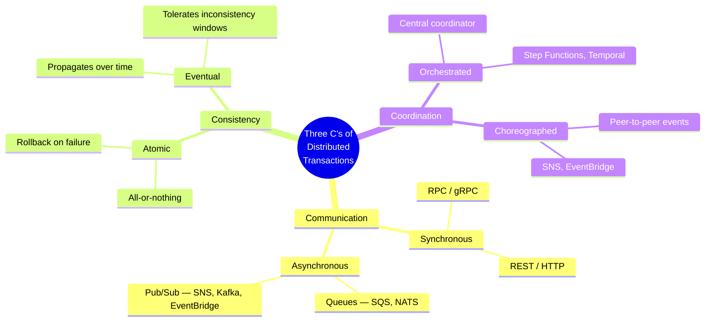
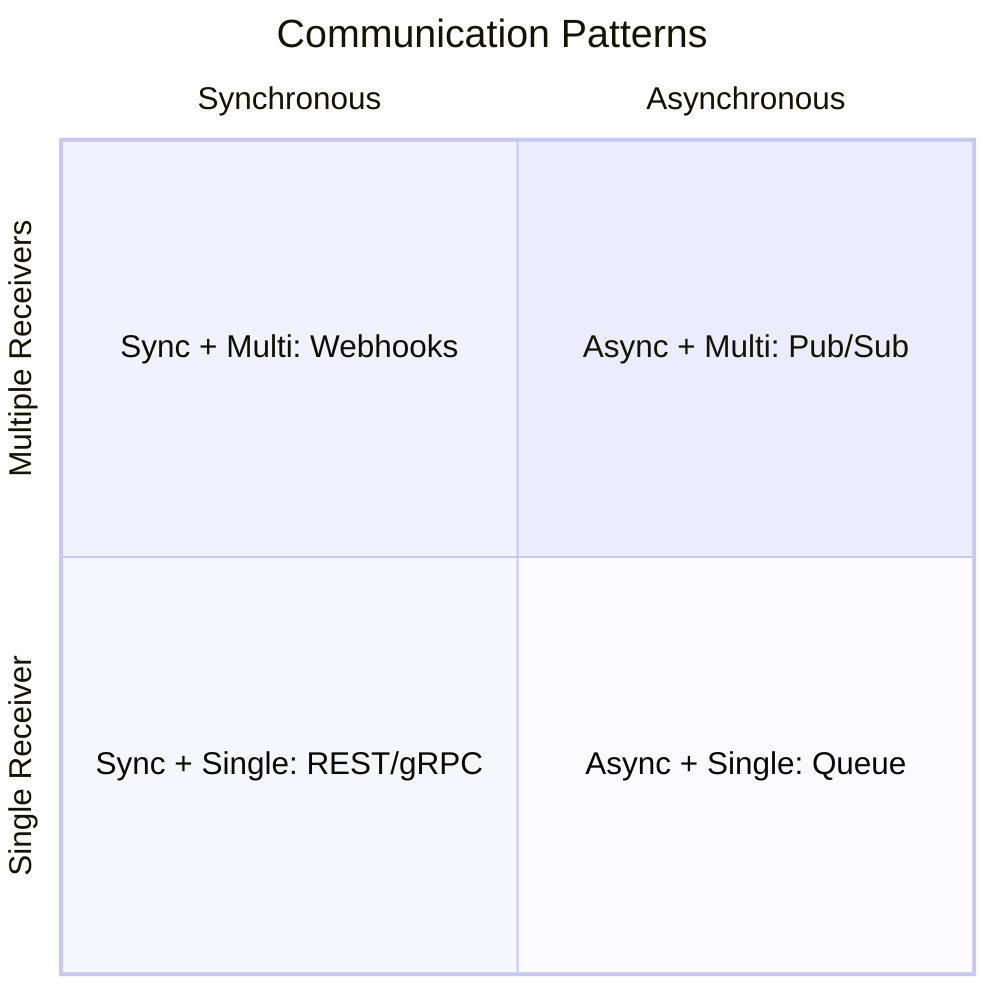
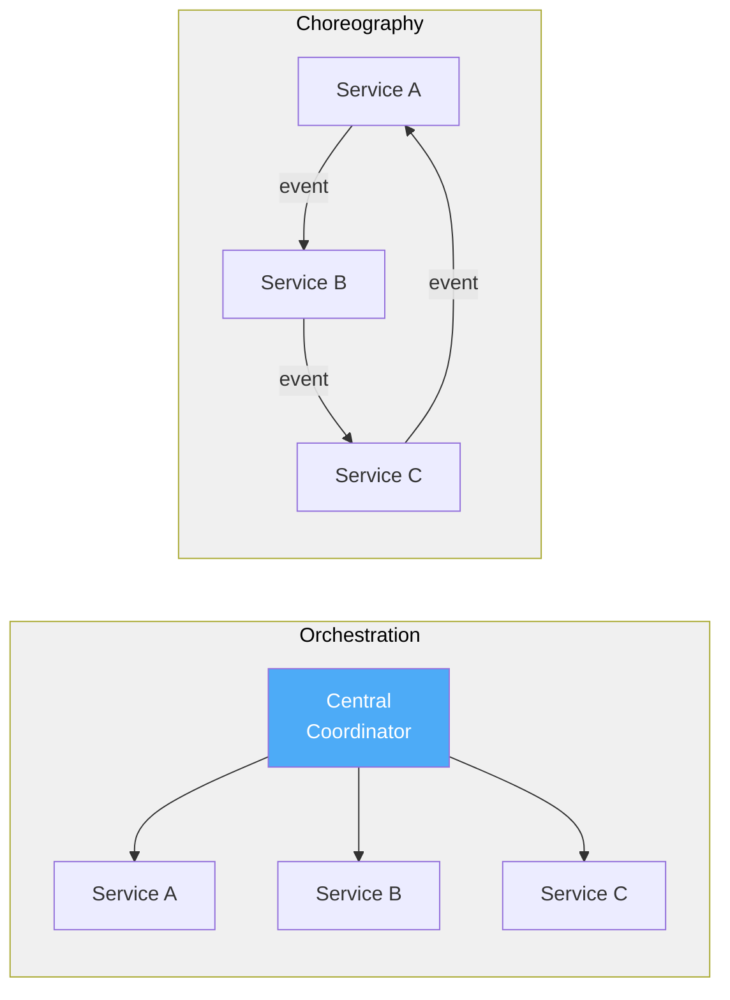

# The Three C's of Distributed Transactions

[← Back to Main Guide](README.md) | [← Brownfield Strategies](brownfield-strategies.md) | [Next: Durable Execution & Orchestration →](durable-execution-orchestration.md)

> _"...an overview of the eight possible transactional sagas and their pros and cons."_
> — Mark Richards, [Lesson 221: Introduction to Transactional Sagas](https://developertoarchitect.com/lessons/lesson221.html)

The Saga pattern is usually described as one thing: a sequence of local transactions with compensating actions. In [_Software Architecture: The Hard Parts_](brownfield-strategies.md#further-reading), Ford, Richards, Sadalage, and Dehghani split it along three independent axes. This guide calls them the **Three C's**:

1. **Communication**: Synchronous vs. Asynchronous
2. **Consistency**: Atomic vs. Eventual
3. **Coordination**: Orchestrated vs. Choreographed

Each C is a binary choice, so there are $2^3 = 8$ saga topologies, each with its own coupling profile. Knowing which one you are building tells you which tradeoffs a platform like Temporal makes for you.

---

## Table of Contents

- [Communication: Synchronous vs. Asynchronous](#communication-synchronous-vs-asynchronous)
- [Consistency: Atomic vs. Eventual](#consistency-atomic-vs-eventual)
- [Coordination: Orchestrated vs. Choreographed](#coordination-orchestrated-vs-choreographed)
- [The Eight Saga Species](#the-eight-saga-species)
- [ELI5: Saga Species](#eli5-saga-species)
- [Practical Recommendations](#practical-recommendations)
- [Where Temporal Sits in the Three C's](durable-execution-orchestration.md#where-temporal-sits-in-the-three-cs) (in the durable execution guide)

---

```mermaid
mindmap
  root((Three C's of<br/>Distributed<br/>Transactions))
    Communication
      Synchronous
        REST / HTTP
        RPC / gRPC
      Asynchronous
        Queues — SQS, NATS
        Pub/Sub — SNS, Kafka, EventBridge
    Consistency
      Atomic
        All-or-nothing
        Rollback on failure
      Eventual
        Propagates over time
        Tolerates inconsistency windows
    Coordination
      Orchestrated
        Central coordinator
        Step Functions, Temporal
      Choreographed
        Peer-to-peer events
        SNS, EventBridge
```

## Communication: Synchronous vs. Asynchronous

**Communication** determines whether the sender waits for a response before proceeding. A synchronous call is [temporal coupling](coupling-dimensions.md#runtime-temporal-and-lifecycle-coupling): both sides must be available at the same moment. See [Coupling in Practice, Scenario 4](coupling-in-practice.md#scenario-4-temporal-coupling-in-synchronous-calls) and [FRP & Coupling: Back-Pressure and Temporal Coupling](functional-reactive-coupling.md#back-pressure-and-temporal-coupling).

| | **Synchronous** | **Asynchronous** |
|---|---|---|
| **Behavior** | Sender blocks until receiver responds | Sender continues immediately; receiver processes later |
| **Example** | HTTP REST call, gRPC | Message queue (SQS), event stream (Kafka, Kinesis) |
| **Temporal coupling** | 🔴 Present — both must be available simultaneously | 🟢 Absent — sender and receiver are decoupled in time |
| **Debugging** | Easier — request/response flow is linear and traceable | Harder — must rely on distributed tracing to follow events |
| **Performance** | Latency compounds across chain depth | Higher throughput — parallelism and buffering are natural |

The **number of receivers** matters as much as sync vs. async. Together they form a quadrant:

```mermaid
quadrantChart
    title Communication Patterns
    x-axis Synchronous --> Asynchronous
    y-axis Single Receiver --> Multiple Receivers
    quadrant-1 "Async + Multi: Pub/Sub"
    quadrant-2 "Sync + Multi: Webhooks"
    quadrant-3 "Sync + Single: REST/gRPC"
    quadrant-4 "Async + Single: Queue"
```

| Quadrant | Pattern | Technology Examples | Coupling Impact |
|---|---|---|---|
| **Sync, Single Receiver** | Request-response | REST (HTTP), RPC (gRPC) | 🔴 Highest — caller knows target, both must be live |
| **Sync, Multiple Receivers** | Broadcast with ack | Webhooks (HTTP) | 🟠 High — caller must know all receivers |
| **Async, Single Receiver** | Point-to-point queue | SQS, NATS (point-to-point) | 🟢 Low — sender publishes, one consumer processes |
| **Async, Multiple Receivers** | Pub/Sub / fan-out | SNS, Kafka, EventBridge, Kinesis | 🟢 Lowest — sender doesn't know who listens |

Moving from the bottom-left (sync, single) to the top-right (async, multi) of this quadrant removes temporal coupling and reduces what the sender knows about its receivers: with pub/sub, the publisher does not know who listens. It does not by itself lower integration strength. That is set by what the message carries. An event that serializes a domain entity is still Model coupling; a DTO-shaped event is Contract. See [Runtime, Temporal, and Lifecycle Coupling](coupling-dimensions.md#runtime-temporal-and-lifecycle-coupling).

## Consistency: Atomic vs. Eventual

**Consistency** determines what guarantees the system provides about the state visible to readers during and after a transaction.

| | **Atomic** | **Eventual** |
|---|---|---|
| **Guarantee** | All steps succeed or all are rolled back — the system is _never_ in a partial state | Updates propagate over time — there _may_ be a window where different components see different states |
| **Compensation** | Required — every forward step needs a compensating action | Optional — the system tolerates intermediate inconsistency |
| **Complexity** | Higher — must implement and maintain rollback logic | Lower — fire and forget, with eventual convergence |
| **Data structures** | May require distributed caches or locking to prevent inconsistent reads | Simpler — local projections updated via events (see [Column Schema Replication](brownfield-strategies.md#data-decomposition-the-hardest-part)) |

Atomic consistency creates **functional coupling** between the forward path and the compensation path. Each compensation re-implements the inverse of a forward step, so any change to one must be mirrored in the other. This is the "compensation mirroring" problem in the [hand-rolled saga example](durable-execution-orchestration.md#typescript--before-hand-rolled-saga-with-scattered-compensation). Eventual consistency removes that coupling surface and instead requires every reader to tolerate stale data.

## Coordination: Orchestrated vs. Choreographed

**Coordination** determines _who controls the flow_ of a multi-step process. This is the dimension with the most direct impact on coupling topology.

```mermaid
flowchart LR
    subgraph orch ["Orchestration"]
        direction TB
        O[Central<br/>Coordinator] --> S1[Service A]
        O --> S2[Service B]
        O --> S3[Service C]
    end

    subgraph choreo ["Choreography"]
        direction TB
        C1[Service A] -->|"event"| C2[Service B]
        C2 -->|"event"| C3[Service C]
        C3 -->|"event"| C1
    end

    style O fill:#4dabf7,color:#fff
    style orch fill:#f0f0f0,color:#000
    style choreo fill:#f0f0f0,color:#000
```

| | **Orchestrated** | **Choreographed** |
|---|---|---|
| **Control flow** | Central coordinator knows the sequence and manages each step | No central control — each service reacts to events from others |
| **Coupling topology** | Hub-and-spoke — coordinator depends on all participants (high Ce) | Mesh — services are coupled only to event contracts |
| **Integration strength** | 🔵 Contract — coordinator knows participant contracts and the sequence, not their internals | 🔵 Contract — services know only event shapes, not who produces them |
| **Failure handling** | Centralized — coordinator manages compensation and retries | Distributed — each service handles its own errors |
| **Observability** | Easier — one place to see the full process state | Harder — must reconstruct flow from distributed traces |
| **Extensibility** | Change requires modifying the coordinator | New participants subscribe to existing events without changing producers |
| **Technology examples** | AWS Step Functions, Temporal, saga orchestrators | SNS + Lambda, EventBridge rules, Kafka consumers |

Both topologies are Contract coupling. What differs is where the dependencies concentrate. An orchestrator depends on every participant, so its [efferent coupling (Ce)](coupling-metrics-and-refactoring.md) is high and its instability is close to 1. That is the right shape: the orchestrator is the one component that _should_ change when the process changes, and it is the one place to watch the whole transaction. Choreography spreads the dependencies across services. Adding a participant means subscribing to an existing event, but reconstructing the whole transaction takes distributed tracing.

## The Eight Saga Species

Combining the three binary choices produces eight distinct saga topologies. Ford et al. gave each a memorable name that hints at its implementation difficulty:

| Saga Species | Communication | Consistency | Coordination | Coupling Profile |
|---|---|---|---|---|
| **Epic** (SAO) | Sync | Atomic | Orchestrated | 🔴 Highest coupling — single thread calling services sequentially with full rollback. Simple to build and debug, but every service must be live. |
| **Phone Tag** (SAC) | Sync | Atomic | Choreographed | 🔴 High — sync calls without a coordinator. First service takes extra responsibility for rollback. Explodes in complexity with more steps. |
| **Fairy Tale** (SEO) | Sync | Eventual | Orchestrated | 🟡 Medium — coordinator manages the flow synchronously, but tolerates inconsistent reads. Common when you _wanted_ Epic but can't guarantee read consistency. |
| **Time Travel** (SEC) | Sync | Eventual | Choreographed | 🟡 Medium — sync calls between peers with no rollback. Situational — simple two-party interactions that tolerate lag. |
| **Fantasy** (AAO) | Async | Atomic | Orchestrated | 🟢 Low-Medium — async communication via queues with a central coordinator managing rollback. |
| **Horror** (AAC) | Async | Atomic | Choreographed | 🔴 Highest complexity — atomic rollback via events with no coordinator. Avoid unless forced. |
| **Parallel** (AEO) | Async | Eventual | Orchestrated | 🟢 Lowest practical coupling — async communication, no rollback, central coordinator for visibility. |
| **Anthology** (AEC) | Async | Eventual | Choreographed | 🟢 Lowest coupling — fully event-driven, no coordinator, no rollback. Maximum decoupling, but hardest to observe and debug. Pure "event-driven architecture." |

## ELI5: Saga Species

> 📚 **Think of it like group assignments in school.**
>
> - **Epic** (SAO): The teacher (coordinator) calls on each student one at a time (sync). If anyone fails, the whole project resets (atomic). The teacher watches everything (orchestrated). Simple, but if a student is absent, the class stops.
> - **Anthology** (AEC): Students post their work on a shared bulletin board (async events). Nobody coordinates; each student picks up where others left off (choreographed). There's no do-over if someone makes a mistake (eventual). Maximum independence, but the teacher has no idea what's happening.
> - **Horror** (AAC): Students post work on a bulletin board (async), but if _any_ student fails, they _all_ must undo their work (atomic) by posting _more_ events (choreographed). Nobody's in charge of the undo. Chaos.

## Practical Recommendations

Based on the coupling analysis above (the book's own ratings of each species are not reproduced here):

| Recommendation | Species | Why |
|---|---|---|
| **Start here** | **Epic** (SAO), **Parallel** (AEO), **Anthology** (AEC) | Each is internally consistent: Epic is simplest to build and debug; Parallel gives you async and observability without rollback complexity; Anthology is fully event-driven with the least coupling. |
| **Common in practice** | **Fairy Tale** (SEO) | You _meant_ to build an Epic, but read consistency across services is expensive. Acknowledge you're building a Fairy Tale and don't fight it. |
| **Use with caution** | **Fantasy** (AAO), **Phone Tag** (SAC), **Time Travel** (SEC) | Situational — Fantasy works when compensations are simple; Phone Tag and Time Travel suit simple two-party transactions. |
| **Avoid** | **Horror** (AAC) | Atomic rollback via choreographed events needs compensation logic so entangled that the coupling savings from choreography are lost. |

---

[← Back to Main Guide](README.md) | [← Brownfield Strategies](brownfield-strategies.md) | [Next: Durable Execution & Orchestration →](durable-execution-orchestration.md)
