# The Three C's of Distributed Transactions

[← Back to Main Guide](README.md) | [← Brownfield Strategies](brownfield-strategies.md) | [Next: Durable Execution & Orchestration →](durable-execution-orchestration.md)

> _"There isn't one kind of saga. There are **eight**, and they differ along three_
> _independent dimensions."_
> — Ford, Richards, Sadalage, and Dehghani

The Saga pattern is often described as a single concept — "a sequence of local transactions with compensating actions" — but in practice, there isn't one kind of saga. There are **eight**, and they differ along three independent dimensions that Ford, Richards, Sadalage, and Dehghani call the **Three C's** in [_Software Architecture: The Hard Parts_](brownfield-strategies.md#further-reading):

1. **Communication** — Synchronous vs. Asynchronous
2. **Consistency** — Atomic vs. Eventual
3. **Coordination** — Orchestrated vs. Choreographed

Each C represents a binary choice. Combine them and you get $2^3 = 8$ distinct saga topologies, each with different coupling characteristics. Understanding this framework is essential for choosing the right transaction pattern — and for recognizing which tradeoffs a platform like Temporal bakes in for you.

---

## Table of Contents

- [Communication: Synchronous vs. Asynchronous](#communication-synchronous-vs-asynchronous)
- [Consistency: Atomic vs. Eventual](#consistency-atomic-vs-eventual)
- [Coordination: Orchestrated vs. Choreographed](#coordination-orchestrated-vs-choreographed)
- [The Eight Saga Species](#the-eight-saga-species)
- [ELI5: Saga Species](#eli5-saga-species)
- [Practical Recommendations](#practical-recommendations)
- [Where Temporal Sits in the Three C's](#where-temporal-sits-in-the-three-cs)

---

```mermaid
mindmap
  root((Three C's of<br/>Distributed<br/>Transactions))
    Communication
      Synchronous
        REST / HTTP
        RPC / gRPC
      Asynchronous
        Queues — SQS, NATS
        Pub/Sub — SNS, Kafka, EventBridge
    Consistency
      Atomic
        All-or-nothing
        Rollback on failure
      Eventual
        Propagates over time
        Tolerates inconsistency windows
    Coordination
      Orchestrated
        Central coordinator
        Step Functions, Temporal
      Choreographed
        Peer-to-peer events
        SNS, EventBridge
```

## Communication: Synchronous vs. Asynchronous

**Communication** determines whether the sender waits for a response before proceeding. This maps directly to the **temporal coupling** dimension discussed in [Coupling in Practice — Scenario 4](coupling-in-practice.md#scenario-4-temporal-coupling-in-synchronous-calls) and [FRP & Coupling — Back-Pressure and Temporal Coupling](functional-reactive-coupling.md#back-pressure-and-temporal-coupling).

| | **Synchronous** | **Asynchronous** |
|---|---|---|
| **Behavior** | Sender blocks until receiver responds | Sender continues immediately; receiver processes later |
| **Example** | HTTP REST call, gRPC | Message queue (SQS), event stream (Kafka, Kinesis) |
| **Temporal coupling** | 🔴 Present — both must be available simultaneously | 🟢 Absent — sender and receiver are decoupled in time |
| **Debugging** | Easier — request/response flow is linear and traceable | Harder — must rely on distributed tracing to follow events |
| **Performance** | Latency compounds across chain depth | Higher throughput — parallelism and buffering are natural |

But communication isn't just sync vs. async — the **number of receivers** matters too. This creates a quadrant:

| Quadrant | Pattern | Technology Examples | Coupling Impact |
|---|---|---|---|
| **Sync, Single Receiver** | Request-response | REST (HTTP), RPC (gRPC) | 🔴 Highest — caller knows target, both must be live |
| **Sync, Multiple Receivers** | Broadcast with ack | Webhooks (HTTP) | 🟠 High — caller must know all receivers |
| **Async, Single Receiver** | Point-to-point queue | SQS, NATS (point-to-point) | 🟢 Low — sender publishes, one consumer processes |
| **Async, Multiple Receivers** | Pub/Sub / fan-out | SNS, Kafka, EventBridge, Kinesis | 🟢 Lowest — sender doesn't know who listens |

**Coupling insight:** Moving from the top-left (sync, single) to the bottom-right (async, multi) of this quadrant progressively _reduces integration strength_ and _eliminates temporal coupling_. This matches the balance principle from [the coupling dimensions](coupling-dimensions.md): when distance is high (separate services), keep integration strength low (contract coupling via events rather than direct API calls).

## Consistency: Atomic vs. Eventual

**Consistency** determines what guarantees the system provides about the state visible to readers during and after a transaction.

| | **Atomic** | **Eventual** |
|---|---|---|
| **Guarantee** | All steps succeed or all are rolled back — the system is _never_ in a partial state | Updates propagate over time — there _may_ be a window where different components see different states |
| **Compensation** | Required — every forward step needs a compensating action | Optional — the system tolerates intermediate inconsistency |
| **Complexity** | Higher — must implement and maintain rollback logic | Lower — fire and forget, with eventual convergence |
| **Data structures** | May require distributed caches or locking to prevent inconsistent reads | Simpler — local projections updated via events (see [Column Schema Replication](brownfield-strategies.md#data-decomposition-the-hardest-part)) |

**Coupling insight:** Atomic consistency creates **functional coupling** between the forward path and the compensation path — they _must_ stay in sync, and any change to one must be mirrored in the other. This is the "compensation mirroring" problem analyzed in the [hand-rolled saga example](durable-execution-orchestration.md#typescript--before-hand-rolled-saga-with-scattered-compensation). Eventual consistency eliminates this coupling surface entirely, but introduces the need for systems that tolerate stale reads — a tradeoff governed by [volatility](coupling-dimensions.md#3-volatility).

## Coordination: Orchestrated vs. Choreographed

**Coordination** determines _who controls the flow_ of a multi-step process. This is the dimension with the most direct impact on coupling topology.

| | **Orchestrated** | **Choreographed** |
|---|---|---|
| **Control flow** | Central coordinator knows the sequence and manages each step | No central control — each service reacts to events from others |
| **Coupling topology** | Hub-and-spoke — coordinator is coupled to all participants (high Ca) | Mesh — services are coupled only to event contracts |
| **Integration strength** | 🟡 Model — coordinator knows the sequence and participant contracts | 🔵 Contract — services know only event shapes, not who produces them |
| **Failure handling** | Centralized — coordinator manages compensation and retries | Distributed — each service handles its own errors |
| **Observability** | Easier — one place to see the full process state | Harder — must reconstruct flow from distributed traces |
| **Extensibility** | Change requires modifying the coordinator | New participants subscribe to existing events without changing producers |
| **Technology examples** | AWS Step Functions, Temporal, saga orchestrators | SNS + Lambda, EventBridge rules, Kafka consumers |

**Coupling insight:** Orchestration concentrates coupling in the coordinator (high afferent coupling — many services depend on it, or it depends on many services). This is the "throat to choke" — great for monitoring, but a change bottleneck. Choreography distributes coupling evenly across services — more extensible, but harder to reason about the whole transaction. This maps to the [Ce/Ca metrics](coupling-metrics-and-refactoring.md): an orchestrator has high Ce (it depends on all participants), making it unstable — which is correct, because the orchestrator _should_ change when the process changes.

## The Eight Saga Species

Combining the three binary choices produces eight distinct saga topologies. Ford et al. gave each a memorable name that hints at its implementation difficulty:

| Saga Species | Communication | Consistency | Coordination | Coupling Profile |
|---|---|---|---|---|
| **Epic** (SAO) | Sync | Atomic | Orchestrated | 🔴 Highest coupling — single thread calling services sequentially with full rollback. Simple to build and debug, but every service must be live. |
| **Phone Tag** (SAC) | Sync | Atomic | Choreographed | 🔴 High — sync calls without a coordinator. First service takes extra responsibility for rollback. Explodes in complexity with more steps. |
| **Fairy Tale** (SEO) | Sync | Eventual | Orchestrated | 🟡 Medium — coordinator manages the flow synchronously, but tolerates inconsistent reads. Common when you _wanted_ Epic but can't guarantee read consistency. |
| **Time Travel** (SEC) | Sync | Eventual | Choreographed | 🟡 Medium — sync calls between peers with no rollback. Situational — simple two-party interactions that tolerate lag. |
| **Fantasy** (AAO) | Async | Atomic | Orchestrated | 🟢 Low-Medium — async communication via queues with a central coordinator managing rollback. The "classic saga" as most tutorials describe it. |
| **Horror** (AAC) | Async | Atomic | Choreographed | 🔴 Highest complexity — implementing atomic rollback via events with no coordinator. Called "Horror" for good reason — avoid unless forced. |
| **Parallel** (AEO) | Async | Eventual | Orchestrated | 🟢 Lowest practical coupling — async communication, no rollback, central coordinator for visibility. Best of both worlds for most use cases. |
| **Anthology** (AEC) | Async | Eventual | Choreographed | 🟢 Lowest coupling — fully event-driven, no coordinator, no rollback. Maximum decoupling, but hardest to observe and debug. Pure "event-driven architecture." |

## ELI5: Saga Species

> 📚 **Think of it like group assignments in school.**
>
> - **Epic** (SAO): The teacher (coordinator) calls on each student one at a time (sync). If anyone fails, the whole project resets (atomic). The teacher watches everything (orchestrated). Simple, but if a student is absent, the class stops.
> - **Anthology** (AEC): Students post their work on a shared bulletin board (async events). Nobody coordinates — each student picks up where others left off (choreographed). There's no do-over if someone makes a mistake (eventual). Maximum independence, but the teacher has no idea what's happening.
> - **Horror** (AAC): Students post work on a bulletin board (async), but if _any_ student fails, they _all_ must undo their work (atomic) by posting _more_ events (choreographed). Nobody's in charge of the undo. Chaos.

## Practical Recommendations

Based on the tradeoffs described by Ford et al. and the coupling analysis above:

| Recommendation | Species | Why |
|---|---|---|
| **Start here** | **Epic** (SAO), **Parallel** (AEO), **Anthology** (AEC) | Each imposes a clean paradigm: Epic is simplest to build and debug; Parallel gives you async + observability without rollback complexity; Anthology is pure event-driven with maximum decoupling. |
| **Common in practice** | **Fairy Tale** (SEO) | You _meant_ to build an Epic, but read consistency across services is expensive. Acknowledge you're building a Fairy Tale and don't fight it. |
| **Use with caution** | **Fantasy** (AAO), **Phone Tag** (SAC), **Time Travel** (SEC) | Situational — Fantasy works when compensations are simple; Phone Tag and Time Travel suit simple two-party transactions. |
| **Avoid** | **Horror** (AAC) | Implementing atomic rollback via choreographed events requires such entangled compensation logic that the coupling savings from choreography are negated. "You should have chosen something else." |

---

[← Back to Main Guide](README.md) | [← Brownfield Strategies](brownfield-strategies.md) | [Next: Durable Execution & Orchestration →](durable-execution-orchestration.md)
